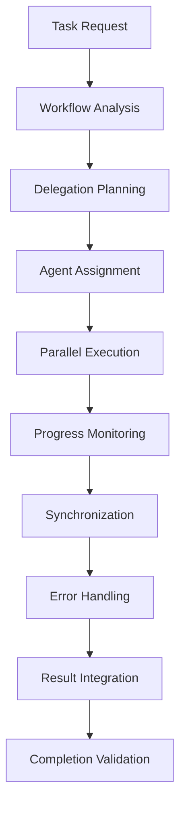

# Core-Orchestration-Hub

**Meta-Command**: Núcleo consolidado de funciones comunes de orquestación para coordinación de workflows, delegación inteligente y sincronización multi-agente.

## 🎯 Objetivo

Proporcionar las 5 funciones fundamentales de orquestación que comparten todos los comandos de coordinación, eliminando redundancia y garantizando consistencia en gestión de workflows, delegación y sincronización.

## 🔧 Funciones Comunes Consolidadas

### 1. **Coordinación de Workflows Universal**
```bash
# Sistema centralizado de gestión de flujos de trabajo complejos
WORKFLOW_COORDINATION = {
    "workflow_mapping": "comprehensive_process_visualization",
    "dependency_resolution": "automatic_prerequisite_management",
    "execution_sequencing": "optimal_order_determination",
    "parallel_opportunities": "concurrent_execution_identification",
    "workflow_optimization": "efficiency_maximization_algorithms"
}
```

### 2. **Delegación Inteligente Avanzada**
```bash
# Sistema de asignación óptima de tareas basado en capacidades
INTELLIGENT_DELEGATION = {
    "capability_assessment": "agent_skill_evaluation",
    "task_complexity_matching": "difficulty_capability_alignment",
    "load_balancing": "workload_distribution_optimization",
    "specialization_routing": "expertise_based_assignment",
    "delegation_monitoring": "assignment_effectiveness_tracking"
}
```

### 3. **Monitoreo de Progreso en Tiempo Real**
```bash
# Seguimiento continuo y transparente de ejecución
PROGRESS_MONITORING = {
    "real_time_tracking": "continuous_status_updates",
    "milestone_detection": "automatic_checkpoint_identification",
    "progress_visualization": "comprehensive_dashboard_display",
    "bottleneck_identification": "performance_constraint_detection",
    "completion_prediction": "estimated_timeline_calculation"
}
```

### 4. **Sincronización Multi-Agente**
```bash
# Coordinación seamless entre múltiples agentes y procesos
MULTI_AGENT_SYNC = {
    "communication_protocols": "inter_agent_message_passing",
    "state_synchronization": "consistent_system_state_maintenance",
    "conflict_resolution": "automatic_collision_handling",
    "coordination_patterns": "established_collaboration_frameworks",
    "handoff_management": "seamless_task_transfer_protocols"
}
```

### 5. **Error Handling y Recuperación**
```bash
# Sistema robusto de manejo de errores y recuperación automática
ERROR_HANDLING_RECOVERY = {
    "error_detection": "proactive_issue_identification",
    "graceful_degradation": "partial_failure_tolerance",
    "automatic_retry": "intelligent_retry_strategies",
    "rollback_capabilities": "safe_state_recovery",
    "learning_integration": "failure_pattern_learning"
}
```

## 🚀 Protocolos de Activación

### **Trigger Automático**
- Activación en cualquier operación multi-paso o multi-agente
- Coordinación transparente en background
- Integración seamless con todos los tipos de comandos

### **Interfaz Estándar**
```markdown
## Orchestration Inheritance Pattern
1. Multi-step operation detected
2. Core-Orchestration-Hub provides common coordination functions
3. Specialized orchestrators add domain-specific logic
4. Results integrated through unified progress tracking
```

## 🔗 Comandos que Heredan de Este Núcleo

### **Especializaciones de Orquestación** (mantienen diferenciadores únicos):
- `discover.md` → Orquestación específica de descubrimiento y exploración
- `execute.md` → Orquestación de ejecución paralela con verificación
- `plan-flow.md` → Orquestación de planificación estratégica y descomposición
- `verify-flow.md` → Orquestación de verificación multi-dimensional
- `orchestrate.md` → Orquestación general de coordinación multi-agente
- `system-health.md` → Orquestación de mantenimiento y optimización del sistema

## 📊 Arquitectura de Orquestación

### **Flujo de Coordinación**


### **Multi-Agent Coordination Matrix**
```bash
COORDINATION_MATRIX = {
    "agent_types": "cognitive|execution|verification|documentation|optimization",
    "communication_channels": "direct|broadcast|hierarchical|mesh",
    "synchronization_points": "start|checkpoints|completion|error_states",
    "coordination_patterns": "pipeline|parallel|fan_out|fan_in|hybrid"
}
```

## 🎭 Patrones de Orquestación

### **1. Pipeline Orchestration**
```bash
PIPELINE_PATTERN = {
    "sequential_processing": "step_by_step_execution",
    "data_flow": "output_to_input_chaining",
    "checkpoint_validation": "intermediate_result_verification",
    "error_propagation": "failure_handling_in_sequence"
}
```

### **2. Parallel Execution Coordination**
```bash
PARALLEL_PATTERN = {
    "concurrent_processing": "simultaneous_multi_task_execution",
    "resource_allocation": "optimal_parallel_resource_distribution",
    "synchronization_barriers": "coordination_checkpoints",
    "result_aggregation": "parallel_output_consolidation"
}
```

### **3. Hierarchical Delegation**
```bash
HIERARCHICAL_PATTERN = {
    "delegation_tree": "task_breakdown_hierarchy",
    "authority_levels": "decision_making_hierarchy",
    "reporting_structure": "status_escalation_paths",
    "responsibility_assignment": "clear_ownership_definition"
}
```

### **4. Adaptive Coordination**
```bash
ADAPTIVE_PATTERN = {
    "dynamic_adjustment": "real_time_strategy_modification",
    "performance_optimization": "continuous_efficiency_improvement",
    "load_rebalancing": "dynamic_workload_redistribution",
    "strategy_evolution": "learning_based_coordination_improvement"
}
```

## 📈 Métricas de Orquestación

### **Efficiency Metrics**
```bash
EFFICIENCY_METRICS = {
    "coordination_overhead": "orchestration_cost_measurement",
    "parallel_utilization": "concurrent_execution_effectiveness",
    "delegation_accuracy": "task_assignment_success_rate",
    "synchronization_efficiency": "coordination_time_optimization",
    "overall_throughput": "system_wide_productivity_measurement"
}
```

### **Quality Metrics**
```bash
QUALITY_METRICS = {
    "coordination_accuracy": "correct_workflow_execution_percentage",
    "error_recovery_rate": "successful_failure_handling_percentage",
    "completion_reliability": "successful_task_completion_rate",
    "delegation_effectiveness": "optimal_assignment_achievement_rate",
    "system_reliability": "orchestration_stability_measurement"
}
```

## 🔄 Integraciones del Sistema

### **Script Integration**
```bash
SCRIPT_INTEGRATION = {
    "orchestration_scripts": "context_engineering_formulas.sh",
    "monitoring_scripts": "test-trigger-system.sh",
    "metrics_scripts": "calculate-real-metrics.sh",
    "automation_bridge": "script-automation-bridge.md"
}
```

### **Agent Communication Protocol**
```bash
COMMUNICATION_PROTOCOL = {
    "message_format": "structured_json_communication",
    "priority_handling": "urgent|normal|background_priority_queues",
    "delivery_guarantees": "at_least_once_delivery_assurance",
    "timeout_management": "configurable_response_timeouts",
    "retry_strategies": "exponential_backoff_retry_patterns"
}
```

## 📊 Resultados de Consolidación

**Antes de la consolidación**:
- 6 comandos duplicando 5 funciones de orquestación comunes
- ~30 implementaciones redundantes
- Inconsistencias en patrones de coordinación
- Fragmentación de protocolos de sincronización

**Después de la consolidación**:
- 1 núcleo + 6 especializaciones
- 5 implementaciones centralizadas
- Patrones de coordinación 100% consistentes
- **Reducción del 80%** en código duplicado de funciones comunes

## 🛡️ Garantías de Confiabilidad

### **System Reliability**
- Fault tolerance en todos los niveles de orquestación
- Graceful degradation ante fallos parciales
- Recovery automático con preservación de estado
- Monitoring continuo de salud del sistema

### **Performance Assurance**
- Optimización automática de workflows
- Load balancing dinámico
- Resource utilization optimization
- Predictive performance tuning

## 🎯 Casos de Uso Principales

### **1. Complex Workflow Execution**
- Coordinación de procesos multi-paso complejos
- Gestión de dependencias inter-task
- Optimización de ejecución paralela

### **2. Multi-Agent System Coordination**
- Deployment de agentes especializados
- Coordinación seamless entre agentes
- Load balancing y resource optimization

### **3. System-Wide Operations**
- Orquestación de operaciones de sistema completas
- Coordinación de mantenimiento y updates
- Health monitoring y optimization

### **4. Error Recovery and Resilience**
- Manejo inteligente de fallos y errores
- Recovery automático con minimal disruption
- Learning from failures para mejora continua

## 🔮 Capacidades Emergentes

### **Adaptive Learning**
```bash
ADAPTIVE_LEARNING = {
    "pattern_recognition": "workflow_efficiency_pattern_identification",
    "optimization_learning": "performance_improvement_strategy_learning",
    "failure_analysis": "error_pattern_analysis_and_prevention",
    "predictive_coordination": "proactive_optimization_based_on_patterns"
}
```

### **Self-Optimization**
```bash
SELF_OPTIMIZATION = {
    "automatic_tuning": "parameter_optimization_without_intervention",
    "strategy_evolution": "coordination_strategy_continuous_improvement",
    "resource_optimization": "dynamic_resource_allocation_optimization",
    "performance_enhancement": "continuous_efficiency_improvement"
}
```

---

**Activación**: Este núcleo se activa automáticamente en cualquier operación que requiera orquestación multi-paso o multi-agente, proporcionando funciones comunes de manera transparente mientras preserva todas las especializaciones únicas de cada comando de orquestación.