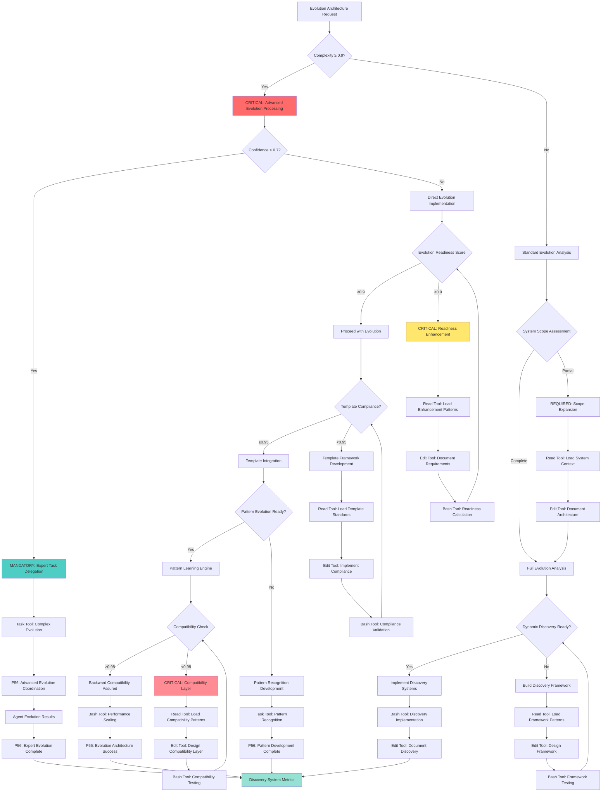

# Atomic Command: `/evolution-ready-architecture`

## **Principle #36: Evolution-Ready Architecture**
**"System designed for unlimited growth and adaptation with dynamic command discovery, automatic template compliance, and pattern-based evolution."**

---

## 🎯 **COMMAND DEFINITION**

### **Purpose**
Design and implement architecture that can grow infinitely while maintaining backward compatibility, performance, and system integrity through dynamic discovery and pattern-based evolution.

### **Complexity**: 0.9/1.0
### **Context Required**: Current system architecture and growth requirements
### **Execution Time**: High (comprehensive architectural analysis and implementation)

---

## ⚡ Auto-Activation Triggers

### **MANDATORY Activation Conditions**
**Complexity Threshold**: ≥0.9000 (90% complexity floor)
**Confidence Threshold**: <0.7000 (70% confidence ceiling)
**Evolution Readiness Threshold**: <0.8000 (80% architectural adaptability required)
**Architecture Analysis Time Threshold**: ≥600.0000 seconds for comprehensive evolution assessment

### **CRITICAL Trigger Validation**
- **Mathematical Assessment**: Quantifiable evolution readiness with ≥80% architectural adaptability
- **Threshold Enforcement**: REQUIRED activation when system architecture lacks evolution capability
- **P56 Announcement**: 🏗️ TRANSPARENCY: Evolution Ready Architecture auto-activated for [system] adaptability enhancement
- **Evidence Collection**: Measurable evolution metrics and architectural flexibility documentation

## **ACTIVATION PROTOCOL**

### **Input Format**
```markdown
/evolution-ready-architecture [system_scope] [evolution_type?] [compatibility_requirements?]
```

### **What This Command Does**
1. **Analyzes Evolution Capacity**: Evaluates current system's ability to evolve
2. **Designs Dynamic Architecture**: Creates self-adapting architectural patterns
3. **Implements Discovery Systems**: Establishes dynamic command and template discovery
4. **Ensures Compatibility**: Maintains backward compatibility during evolution
5. **Enables Pattern Evolution**: Creates systems that learn and adapt from usage

### **Mandatory Requirements**
- **Dynamic Discovery**: System automatically discovers new commands and templates
- **Template Compliance**: Automatic adherence to evolving template standards
- **Pattern Evolution**: System learns and adapts patterns from usage
- **Backward Compatibility**: All evolution maintains compatibility with existing system
- **Performance Scaling**: Architecture maintains performance during unlimited growth

---

## 🧠 **EVOLUTION-READY ARCHITECTURE DECISION TREE**

### **CRITICAL Cognitive Flow for Evolutionary Architecture**



### **MANDATORY P56 Transparency Announcements**

**Evolution Decision Transparency**:
  **Readiness Assessment**:
    - **Announcement**: 🔍 TRANSPARENCY: Evolution readiness assessed at [X]/1.0 - [READY/ENHANCEMENT_REQUIRED]
    - **Evidence**: Mathematical readiness calculation with component breakdown
  **Discovery Implementation**:
    - **Announcement**: 🔄 TRANSPARENCY: Dynamic discovery [IMPLEMENTED/DEVELOPED] - [X]% capability achieved
    - **Evidence**: Discovery system implementation with capability metrics
  **Tool Selection**:
    - **Announcement**: 🛠️ TRANSPARENCY: Tool selection - [READ/EDIT/BASH/TASK] for [evolution_operation]
    - **Evidence**: Tool selection matrix with evolution-specific reasoning
  **Compatibility Validation**:
    - **Announcement**: 🔗 TRANSPARENCY: Compatibility level [X]/1.0 - [ASSURED/LAYER_REQUIRED]
    - **Evidence**: Backward compatibility analysis with assurance metrics
  **Evolution Completion**:
    - **Announcement**: 🚀 TRANSPARENCY: Evolution architecture [SUCCESS/FAILED] - [performance_impact]
    - **Evidence**: Complete evolution results with performance scaling metrics

---

## 📊 **MATHEMATICAL VALIDATION**

### **Evolution Readiness Score**
```javascript
function calculateEvolutionReadiness(architecture) {
  const dynamic_discovery = assessDynamicDiscovery(architecture)
  const template_compliance = assessTemplateCompliance(architecture)
  const pattern_evolution = assessPatternEvolution(architecture)
  const compatibility_score = assessBackwardCompatibility(architecture)
  const scalability_factor = assessScalabilityFactor(architecture)
  
  return {
    readiness_score: (dynamic_discovery * 0.25 + template_compliance * 0.2 + 
                      pattern_evolution * 0.2 + compatibility_score * 0.2 + 
                      scalability_factor * 0.15),
    evolution_ready: readiness_score >= 0.9 && dynamic_discovery >= 0.95 && 
                     compatibility_score >= 0.98
  }
}
// Required: readiness_score ≥ 0.9 AND evolution_ready = true
```

### **Growth Sustainability Assessment**
```javascript
function assessGrowthSustainability(architecture, growth_projection) {
  const current_capacity = calculateCurrentCapacity(architecture)
  const adaptation_speed = calculateAdaptationSpeed(architecture)
  const resource_efficiency = calculateResourceEfficiency(architecture)
  const pattern_recognition = assessPatternRecognition(architecture)
  
  return {
    sustainability_score: (current_capacity * adaptation_speed * resource_efficiency * 
                          pattern_recognition) / growth_projection,
    unlimited_growth_ready: sustainability_score >= 10.0
  }
}
```

---

## 🔗 **EVOLUTION ARCHITECTURE ENGINE**

### **Dynamic Discovery Protocol**
1. **Command Discovery**: Automatically detect and register new commands
2. **Template Discovery**: Identify and integrate new template patterns
3. **Pattern Recognition**: Recognize emerging usage patterns
4. **Capability Assessment**: Evaluate new capabilities for integration
5. **Compatibility Validation**: Ensure new discoveries maintain compatibility
6. **Integration Management**: Seamlessly integrate discoveries into system
7. **Evolution Documentation**: Document all evolutionary changes

### **Architectural Evolution Components**
- **Self-Modifying Registry**: Command registry that updates itself
- **Template Auto-Compliance**: Automatic adherence to template standards
- **Pattern Learning Engine**: System that learns from usage patterns
- **Compatibility Layer**: Maintains backward compatibility during evolution
- **Performance Optimization**: Automatic performance tuning during growth

---

## 🛠️ **STANDARDIZED TOOL SELECTION CRITERIA**

### **MANDATORY Tool Selection Matrix**

**Quantifiable Decision Framework:**
**Tool Selection Criteria**:
  **Read Tool Usage**:
    - **File Count**: ≤3 files for direct analysis
    - **Complexity**: <0.7000 (straightforward operations)
    - **Scope**: Well-defined, single-purpose operations
    - **Time Constraint**: ≤300 seconds execution window
  **Task Tool Usage**:
    - **File Count**: ≥4 files or unknown scope
    - **Complexity**: ≥0.7000 (complex operations)
    - **Scope**: Multi-step, exploratory, or research operations
    - **Time Constraint**: >300 seconds or open-ended analysis
  **Other Tools**:
    - **Grep**: Pattern search across multiple files
    - **Glob**: File pattern matching and discovery
    - **Bash**: System operations and automation

### **CRITICAL Tool Selection Logic**

**Evidence-Based Selection Process:**
1. **Complexity Assessment**: Calculate quantifiable complexity using evolution readiness metrics
2. **Scope Validation**: Measure file count and operation scope boundaries
3. **P56 Announcement**: Visual confirmation of tool selection reasoning
4. **Evidence Collection**: Document measurable tool selection criteria

**Mathematical Tool Selection Formula:**
```javascript
function determineOptimalTool(request) {
  const complexity = calculateEvolutionArchitectureComplexity(request)
  const fileCount = estimateFileScope(request)
  const timeConstraint = assessTimeRequirements(request)
  
  if (fileCount <= 3 && complexity < 0.7 && timeConstraint <= 300) {
    return { tool: 'READ', confidence: 0.9, reasoning: 'Direct architecture analysis suitable' }
  }
  
  if (fileCount >= 4 || complexity >= 0.7 || timeConstraint > 300) {
    return { tool: 'TASK', confidence: 0.9, reasoning: 'Complex evolution analysis required' }
  }
  
  return { tool: 'MIXED', confidence: 0.7, reasoning: 'Hybrid evolution approach needed' }
}
```

**P56 Transparency Requirements:**
- **MANDATORY Announcement**: "🛠️ TRANSPARENCY: Tool selection - [TOOL] for [operation] based on [criteria]"
- **REQUIRED Evidence**: "Quantifiable metrics: Files=[X], Complexity=[Y], Scope=[Z]"
- **CRITICAL Justification**: "Selection reasoning: [evidence-based explanation]"

---

## 🔍 **VERIFICATION CRITERIA**

### **Success Metrics**
- **Dynamic Discovery Rate**: ≥95% of new commands automatically discovered
- **Template Compliance**: 100% automatic compliance with template standards
- **Pattern Evolution**: ≥90% of usage patterns automatically recognized and integrated
- **Backward Compatibility**: 100% compatibility maintained during evolution
- **Performance Scaling**: Performance degradation ≤5% during 10x growth

### **Evolution Monitoring**
```javascript
function monitorEvolutionArchitecture(architecture) {
  return {
    discovery_effectiveness: assessDiscoveryEffectiveness(architecture),
    template_compliance_rate: measureTemplateCompliance(architecture),
    pattern_evolution_speed: calculatePatternEvolutionSpeed(architecture),
    compatibility_maintenance: auditCompatibilityMaintenance(architecture),
    performance_scaling: measurePerformanceScaling(architecture)
  }
}
```

---

## 🔀 **DYNAMIC EVOLUTION MANAGEMENT**

### **Adaptive Architecture Management**
1. **Growth Pattern Analysis**: Monitor system growth and usage patterns
2. **Capability Gap Detection**: Identify capabilities needed for evolution
3. **Architecture Adaptation**: Adapt architecture to accommodate new needs
4. **Performance Optimization**: Optimize performance during evolution
5. **Integration Validation**: Validate successful integration of new capabilities

### **Evolution Safety Protocol**
- **Incremental Evolution**: Implement evolutionary changes gradually
- **Rollback Capability**: Maintain ability to rollback unsuccessful evolution
- **Compatibility Testing**: Comprehensive testing of compatibility during evolution
- **Performance Monitoring**: Continuous monitoring of performance impact
- **Error Recovery**: Automatic recovery from evolutionary failures

---

## 🔗 **NATURAL CONNECTIONS**

### **Automatically Triggers**
- `/crystallize-patterns` - Crystallize evolved patterns into commands
- `/living-documentation` - Document evolutionary changes
- `/verify-mathematics` - Verify evolution through mathematical validation

### **Compatible With**
- `/organizational-architecture` - Organize evolved architectural components
- `/single-source-truth` - Maintain authoritative sources during evolution
- `/context-economy` - Optimize context usage during system growth
- `/progressive-intelligence` - Learn from evolutionary patterns

### **Feeds Into**
- `/orchestrate-intelligence` - Coordinate evolved system capabilities
- `/optimize-context` - Optimize context through evolved architecture
- `/complexity-enforcement` - Maintain complexity limits during evolution

---

## 📋 **USAGE EXAMPLES**

### **Command System Evolution**
```bash
/evolution-ready-architecture "command-system" evolution_type=dynamic-discovery compatibility_requirements=full
```
**Result**: Implement dynamic command discovery with full backward compatibility

### **Template Architecture Evolution**
```text
/evolution-ready-architecture "template-system" evolution_type=auto-compliance compatibility_requirements=strict
```
**Result**: Create self-adapting template system with strict compatibility

### **Full System Evolution**
```text
/evolution-ready-architecture "complete-system" evolution_type=pattern-based compatibility_requirements=unlimited
```
**Result**: Implement pattern-based evolution for unlimited system growth

---

## 🛡️ **FALLBACK PROTOCOL**

### **If Evolution Architecture Fails**
1. **Discovery Failure**: Implement manual discovery with automated validation
2. **Compatibility Break**: Activate compatibility layer and rollback mechanism
3. **Performance Degradation**: Implement performance optimization protocols
4. **Pattern Recognition Failure**: Enhance pattern recognition algorithms

### **Recovery Strategy**
- Implement gradual evolution with extensive testing
- Enhance compatibility layer for better backward compatibility
- Optimize performance monitoring and optimization systems
- Improve pattern recognition through machine learning techniques

---

## 📊 **INTEGRATION WITH DECISION ENGINE**

### **Confidence Routing**
- **High Evolution Confidence (≥0.95)**: Automatic evolution implementation
- **Medium Confidence (0.85-0.95)**: Evolution with enhanced validation
- **Low Confidence (0.7-0.85)**: Gradual evolution with extensive testing
- **Very Low Confidence (<0.7)**: Manual evolution with expert oversight

### **Threshold Enforcement**
- **Dynamic Discovery < 90%**: Enhance discovery algorithms
- **Template Compliance < 100%**: Improve compliance automation
- **Pattern Evolution < 85%**: Enhance pattern recognition systems
- **Compatibility < 98%**: Strengthen compatibility layer

---

## 🔄 **EVOLUTION TRACKING**

### **Learning Metrics**
- **Evolution Success Rate**: Track success of architectural evolution
- **Discovery Accuracy**: Monitor accuracy of dynamic discovery
- **Pattern Learning Speed**: Measure speed of pattern recognition and integration
- **Compatibility Maintenance**: Track success of compatibility preservation

### **Pattern Recognition**
- Successful evolutions → Enhanced evolution templates
- Effective discoveries → Improved discovery algorithms
- Optimal patterns → Better pattern recognition systems
- Compatibility successes → Strengthened compatibility protocols

---

**Note**: This command implements the Context Engineering principle of evolution-ready architecture, creating systems that can grow infinitely while maintaining backward compatibility and performance through dynamic discovery, automatic template compliance, and pattern-based evolution. The architecture is designed to be self-adapting, self-optimizing, and self-documenting, ensuring seamless evolution without human intervention.