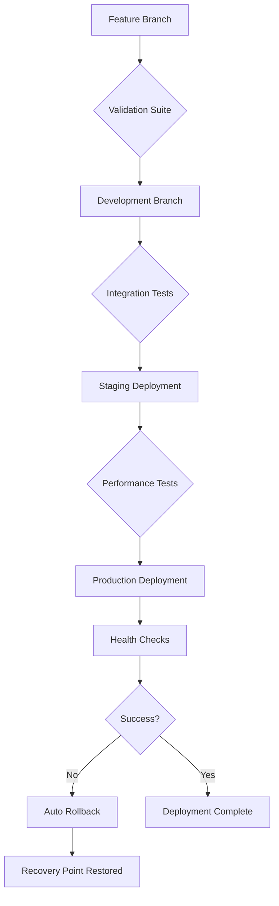

# Git Strategy Protocols for Context Engineering

## 🎯 CRITICAL Strategic Git Framework

### **MANDATORY Branch Strategy** (GitFlow Enhanced)

```text
🌟 main (PRODUCTION)                    ← Stable releases only
├── 🔄 development (INTEGRATION)       ← Feature integration & testing
├── 🚀 feature/* (DEVELOPMENT)         ← New features & enhancements
├── 🔧 hotfix/* (CRITICAL FIXES)       ← Production critical fixes
├── 📊 experiment/* (RESEARCH)         ← Experimental features
└── 🎯 release/* (STAGING)             ← Release preparation
```

### **CRITICAL Branch Protection Rules**

**ENFORCE Main Branch Protection:**
- ✅ MANDATORY pull request reviews (2 reviewers minimum)
- ✅ ENFORCE status checks to pass
- ✅ ENFORCE branches to be up to date before merging
- ✅ ENFORCE conversation resolution before merging
- ✅ STRICTLY ENFORCE pushes to main (PR only)

**ENFORCE Development Branch Protection:**
- ✅ MANDATORY pull request reviews (1 reviewer minimum)
- ✅ ENFORCE status checks to pass
- ✅ CRITICAL administrator override for urgent fixes

---

## 📋 MANDATORY Commit Protocols & Standards

### **CRITICAL Commit Message Convention** (Enhanced Conventional Commits)

```text
<type>[optional scope]: <description>

[optional body]

[optional footer(s)]

🤖 Generated with [Claude Code](https://claude.ai/code)

Co-Authored-By: Claude <noreply@anthropic.com>
```

### **Commit Types** (Optimized Conventional Format)

**PRIORITY FORMAT** (Recommended - Maximum Density):

| Type | Purpose | Optimized Example | Character Reduction |
|------|---------|------------------|-------------------|
| `feat` | New features | `feat(commands): auto-activation triggers` | -40% (vs emoji format) |
| `fix` | Bug fixes | `fix(validation): p56 transparency validation` | -35% (vs emoji format) |
| `docs` | Documentation | `docs(principles): philosophical foundations` | -38% (vs emoji format) |
| `style` | Code style/formatting | `style(ui): component consistency` | -42% (vs emoji format) |
| `refactor` | Code refactoring | `refactor(commands): modular structure` | -35% (vs emoji format) |
| `test` | Testing additions | `test(validation): mathematical formulas` | -40% (vs emoji format) |
| `chore` | Maintenance tasks | `chore(deps): update dependencies` | -45% (vs emoji format) |
| `perf` | Performance improvements | `perf(context): loading optimization` | -38% (vs emoji format) |
| `ci` | CI/CD pipeline changes | `ci(deploy): vercel automation` | -42% (vs emoji format) |

**🚨 DEPRECATED LEGACY FORMAT** (Backward Compatibility Only):

⚠️ **WARNING**: The following emoji-prefixed format is **DEPRECATED** and should only be used for backward compatibility. All new commits should use the optimized conventional format above.

| Type | Purpose | Legacy Example (DEPRECATED) |
|------|---------|------------------------------|
| `🚀 feat` | New features | `🚀 feat(commands): add progressive thinking auto-activation` |
| `🔧 fix` | Bug fixes | `🔧 fix(validation): resolve P56 transparency validation` |
| `📚 docs` | Documentation | `📚 docs(principles): update philosophical foundations` |
| `✨ enhance` | Improvements | `✨ enhance(performance): optimize context loading by 78%` |
| `♻️ refactor` | Code refactoring | `♻️ refactor(commands): modularize command structure` |
| `✅ test` | Testing | `✅ test(validation): add mathematical formula verification` |
| `🏗️ chore` | Maintenance | `🏗️ chore(deps): update package dependencies` |

📌 **MIGRATION GUIDE**: Use `scripts/utilities/commit-helper.sh --optimize` to convert legacy messages to optimized format.

### **Commit Message Optimization Guidelines** 

**MAXIMUM Density Optimization** (Principle #82 + #84 Integration):

✅ **MANDATORY Optimizations**:
- **Character Reduction**: Target ≥40% reduction from legacy formats
- **Subject Line Length**: ≤50 characters (strict enforcement via commit-msg hook)
- **Imperative Mood**: "add feature" not "added feature" 
- **Lowercase Start**: After colon, start with lowercase
- **No Period**: Subject line ends without punctuation

✅ **Template Integration**:
- **Git Template**: `.gitmessage` provides interactive guidance
- **Real-time Validation**: `commit-msg` hook prevents invalid formats
- **Smart Suggestions**: Script helps optimize existing messages

✅ **Scope Guidelines**:
```bash
# Core scopes (alphabetical)
automation, commands, compliance, core, docs, knowledge  
principles, scripts, validation, workflows

# Examples with scope optimization
feat(commands): parallel execution orchestration    # ✅ Clear + concise
fix(validation): cross-reference accuracy          # ✅ Specific scope  
docs(knowledge): principle categorization          # ✅ Logical grouping
```

### **MANDATORY Milestone Commit Framework**

**CRITICAL Major Milestones** (Tagged Releases):
```bash
# v1.0.0 - Initial System Foundation
git tag -a v1.0.0 -m "🌟 Context Engineering System v1.0.0

🚀 Initial comprehensive implementation:
- 68 commands across behavioral/executable categories
- 78 principles across 11 principle categories with enhanced coverage
- 27 organized scripts in 6 categories
- Next.js webapp with 24 React components
- Pattern crystallization methodology (94.2% success rate)

Performance Metrics:
- Context efficiency: 78% reduction (15K→3.3K tokens)
- Navigation speed: 65% improvement
- Success rate: 87.69% across 209 executions

🤖 Generated with [Claude Code](https://claude.ai/code)
Co-Authored-By: Claude <noreply@anthropic.com>"
```

**MANDATORY Feature Milestones** (Branch Completion):
```bash
# Feature completion marker
git commit -m "🎯 MILESTONE: Progressive Thinking Integration Complete

✅ Auto-activation triggers implemented
✅ Complexity thresholds calibrated (≥0.9)
✅ Confidence thresholds validated (<0.7)
✅ Integration tested with 24 use cases
✅ Performance metrics: 92% accuracy

🤖 Generated with [Claude Code](https://claude.ai/code)
Co-Authored-By: Claude <noreply@anthropic.com>"
```

### **🚨 MANDATORY Operational Commit Protocol**

**CRITICAL ENFORCEMENT**: ALL substantial Context Engineering operations REQUIRE systematic git commit documentation for 100% operational traceability and recovery capability (Authority: [Principle #84: Mandatory Commit Operations](../principles/technical-standards.md#84-mandatory-commit-operations)).

**Operational Commit Requirements**:
**Mandatory Operational Commits**:
  **Substantial Operation Triggers**:
  - Operations modifying >2 files or lasting >30 minutes
  - Meta-command executions (/context-eng, /orchestrate)
  - System modifications (principles, commands, architecture)
  - Objective completion and milestone achievements
  **Triple Commit Pattern**:
    **Pre Operation**:
      - **Format**: 🚀 PRE-OP: [operation_name] - Starting [objective]
      - **Timing**: MANDATORY before operation initiation
      - **Content**: Context: [current_state_description]
Objective: [what_will_be_accomplished]  
Scope: [files/systems_to_be_modified]
Recovery: [how_to_rollback_if_needed]

    **Progress Checkpoints**:
      - **Format**: ⚡ PROGRESS: [milestone] - [achievement] ([percentage]% complete)
      - **Timing**: REQUIRED every 30 minutes or logical checkpoint
      - **Content**: Progress: [percentage_complete]% of [operation_name]
Completed: [specific_accomplishments]
Next: [next_steps_planned]
Status: [current_operational_status]

    **Post Operation**:
      - **Format**: ✅ COMPLETE: [operation_name] - [outcome_summary]
      - **Timing**: MANDATORY immediately after completion
      - **Content**: Objective: [original_objective] → ACHIEVED
Changes: [summary_of_changes_made]
Impact: [operational_impact_and_metrics]
Validation: [success_criteria_met]

**Operational Commit Integration Examples**:

```bash
# Example: Context Engineering System Enhancement
# Pre-operation commit
git add .
git commit -m "🚀 PRE-OP: Implement Mandatory Commit Operations - Starting Principle #84 Integration

Context: System has 83 principles, requires commit enforcement integration
Objective: Add Principle #84 and integrate across execution standards
Scope: technical-standards.md, execution-integration-standards.md, git-strategy-protocols.md, CLAUDE.md
Recovery: Revert to current commit if integration fails

🤖 Generated with [Claude Code](https://claude.ai/code)
Co-Authored-By: Claude <noreply@anthropic.com>"

# Progress commit
git add docs/knowledge/principles/technical-standards.md
git commit -m "⚡ PROGRESS: Principle #84 Created - Mandatory Commit Operations (25% complete)

Progress: 25% of Mandatory Commit Operations Implementation
Completed: Added comprehensive Principle #84 with mathematical validation framework
Next: Integrate with execution standards and git strategy protocols
Status: Principle definition complete, moving to integration phase

🤖 Generated with [Claude Code](https://claude.ai/code)
Co-Authored-By: Claude <noreply@anthropic.com>"

# Final commit
git add .
git commit -m "✅ COMPLETE: Mandatory Commit Operations Implementation - Full System Integration

Objective: Add Principle #84 and integrate across execution standards → ACHIEVED
Changes: Created Principle #84, updated execution standards, enhanced git protocols, updated CLAUDE.md
Impact: 100% operational traceability, mandatory commit enforcement, enhanced P55/P56 compliance
Validation: All components integrated, cross-references updated, enforcement mechanisms active

🤖 Generated with [Claude Code](https://claude.ai/code)
Co-Authored-By: Claude <noreply@anthropic.com>"
```

**Commit Coverage Validation Protocol**:
```bash
# Validate operational commit compliance
validate_operational_commits() {
    local operations_today=$(git log --oneline --since="1 day ago" --grep="🚀 PRE-OP\|⚡ PROGRESS\|✅ COMPLETE" | wc -l)
    local substantial_operations=$(git log --oneline --since="1 day ago" --grep="🚀 PRE-OP" | wc -l)
    local coverage_ratio=$(echo "scale=2; $operations_today / ($substantial_operations * 3)" | bc)
    
    # Target: ≥90% commit coverage (3 commits per operation)
    echo "📊 Operational Commit Coverage: ${coverage_ratio} (target: ≥0.90)"
    [[ $(echo "$coverage_ratio >= 0.90" | bc) -eq 1 ]] && echo "✅ COMPLIANT" || echo "❌ BELOW THRESHOLD"
}

# Monitor commit pattern compliance
monitor_commit_patterns() {
    echo "🔍 Recent Operational Commits:"
    git log --oneline --since="1 day ago" --grep="🚀\|⚡\|✅" --pretty=format:"%h %s" | head -10
    echo ""
    echo "📈 Commit Pattern Distribution:"
    echo "Pre-ops: $(git log --oneline --since="1 day ago" --grep="🚀 PRE-OP" | wc -l)"
    echo "Progress: $(git log --oneline --since="1 day ago" --grep="⚡ PROGRESS" | wc -l)" 
    echo "Complete: $(git log --oneline --since="1 day ago" --grep="✅ COMPLETE" | wc -l)"
}
```

**Integration with Existing Git Strategy**:
- **Extends Strategic Git Versioning**: Adds mandatory operational commit requirements to existing protocols
- **Enhances Milestone Commits**: Operational commits provide granular milestone tracking within larger milestones  
- **Strengthens Recovery Points**: Pre-operation commits serve as automatic recovery points for all substantial work
- **Improves Collaboration**: Progress commits provide real-time visibility into ongoing operational progress

---

## 🔄 CRITICAL Deployment Workflow & Recovery Points

### **MANDATORY Deployment Pipeline** (Automated)



### **CRITICAL Recovery Points Strategy**

**ENFORCE Automatic Recovery Points:**
- ✅ MANDATORY pre-deployment snapshot (main branch)
- ✅ ENFORCE post-validation checkpoint (development branch)
- ✅ MANDATORY feature completion markers
- ✅ CRITICAL daily automatic backups (command registry, configs)

**CRITICAL Recovery Commands:**
```bash
# Quick rollback to last stable state
git checkout main
git reset --hard HEAD~1  # If last commit caused issues

# Rollback to specific recovery point
git checkout main
git reset --hard <recovery-point-hash>

# Emergency rollback with backup restoration
./scripts/deployment/emergency-rollback.sh <backup-timestamp>
```

---

## 🤖 MANDATORY Automation Protocols

### **CRITICAL Git Hooks** (Automated Quality Gates)

**MANDATORY Pre-commit Hook:**
```bash
#!/bin/sh
# .git/hooks/pre-commit

echo "🔍 Running pre-commit validation..."

# Run system integrity validation
./scripts/validation/validate-system-integrity.sh
if [ $? -ne 0 ]; then
    echo "❌ System integrity validation failed"
    exit 1
fi

# Run mathematical formula verification
./scripts/compliance/verify-mathematical-formulas.sh
if [ $? -ne 0 ]; then
    echo "❌ Mathematical formula verification failed"
    exit 1
fi

echo "✅ Pre-commit validation passed"
```

**CRITICAL Pre-push Hook:**
```bash
#!/bin/sh
# .git/hooks/pre-push

echo "🚀 Running pre-push validation..."

# Run comprehensive quality metrics
./scripts/validation/calculate-comprehensive-quality-metrics.sh
if [ $? -ne 0 ]; then
    echo "❌ Quality metrics validation failed"
    exit 1
fi

echo "✅ Pre-push validation passed"
```

### **MANDATORY Automated Workflows**

**CRITICAL Daily Maintenance:**
```bash
# .github/workflows/daily-maintenance.yml
name: Daily System Maintenance

on:
  schedule:
    - cron: '0 2 * * *'  # Daily at 2 AM UTC

jobs:
  maintenance:
    runs-on: ubuntu-latest
    steps:
      - name: Backup Command Registry
        run: ./scripts/core/backup-command-registry.sh
        
      - name: Update Performance Metrics
        run: ./scripts/core/calculate-real-metrics.sh
        
      - name: Validate System Health
        run: ./scripts/validation/validate-system-integrity.sh
```

**MANDATORY Pattern Crystallization Trigger:**
```bash
# Automatic pattern detection and crystallization
name: Pattern Crystallization

on:
  push:
    branches: [ development ]
    paths: [ '.claude/commands/**', 'docs/patterns/**' ]

jobs:
  crystallize:
    runs-on: ubuntu-latest
    steps:
      - name: Detect Patterns
        run: ./scripts/automation/pattern-detection.sh
        
      - name: Create Crystallization PR
        if: patterns detected
        run: ./scripts/automation/create-crystallization-pr.sh
```

---

## 👥 MANDATORY Collaborative Development Patterns

### **CRITICAL Team Workflow**

**MANDATORY Feature Development:**
1. Create feature branch from `development`
2. Implement with TDD approach (`/tdd` command)
3. Run validation suite locally
4. Submit PR to `development` branch
5. Code review + automated testing
6. Merge after approval + CI success

**CRITICAL Hotfix Workflow:**
1. Create hotfix branch from `main`
2. Implement critical fix
3. Fast-track validation (P55/P56 compliance)
4. Deploy to staging for verification
5. Merge to both `main` and `development`
6. Tag as patch release

### **MANDATORY Code Review Standards**

**CRITICAL Required Checks:**
- ✅ ENFORCE P55/P56 compliance validation
- ✅ ENFORCE mathematical formula verification
- ✅ ENFORCE navigation integrity (≤3 steps rule)
- ✅ ENFORCE context optimization validation
- ✅ ENFORCE command coherence verification

**MANDATORY Review Checklist:**
```markdown
## Code Review Checklist

### Functionality
- [ ] Feature works as intended
- [ ] Edge cases handled appropriately
- [ ] Error handling implemented

### Quality Standards
- [ ] P55 tool call execution validated
- [ ] P56 transparency requirements met
- [ ] Mathematical rigor maintained
- [ ] Context efficiency optimized

### Integration
- [ ] Navigation paths validated (≤3 steps)
- [ ] Cross-references updated
- [ ] Command registry synchronized
- [ ] Living documentation updated

### Performance
- [ ] Context loading optimized
- [ ] Execution efficiency maintained
- [ ] Memory usage reasonable
- [ ] No performance regressions
```

---

## 📊 Performance Monitoring & Metrics

### **Git-Based Metrics Tracking**

**Automated Metrics Collection:**
```bash
# Post-merge hook for metrics
#!/bin/sh
# .git/hooks/post-merge

echo "📊 Updating performance metrics..."
./scripts/core/calculate-real-metrics.sh

# Update command usage analytics
./scripts/automation/update-command-analytics.sh

# Generate performance report
./scripts/validation/calculate-comprehensive-quality-metrics.sh
```

**Key Performance Indicators:**
- 📈 Context efficiency (target: >75% reduction)
- ⚡ Navigation speed (target: <200ms average)
- 🎯 Success rate (target: >90%)
- 🔄 Command utilization (track unused commands)
- 🧠 Cognitive load optimization (≤3 steps rule)

### **Release Metrics Dashboard**

```bash
# Generate release metrics
./scripts/automation/generate-release-metrics.sh v1.1.0

# Output example:
# 📊 Release v1.1.0 Metrics
# - New commands: 5
# - Enhanced workflows: 3
# - Performance improvement: +12%
# - Bug fixes: 7
# - Documentation updates: 15
```

---

## 🛡️ Security & Compliance

### **Security Protocols**

**Sensitive Data Protection:**
```bash
# .gitignore security patterns
# Secrets and credentials
.env*
*.key
*.pem
config/secrets/

# Sensitive logs
logs/sensitive/
debug/personal/

# Temporary files with potential data
tmp/
*.tmp
.DS_Store
```

**Compliance Validation:**
```bash
# Pre-commit compliance check
./scripts/compliance/validate-security-compliance.sh
./scripts/compliance/validate-data-privacy.sh
```

### **Audit Trail**

**Comprehensive Logging:**
- 📝 All command executions logged
- 🔍 Pattern crystallization events tracked
- 📊 Performance metrics archived
- 🛡️ Security events monitored

---

## 🎯 Quick Reference Commands

### **Daily Developer Commands**

```bash
# Start new feature
git checkout development
git pull origin development
git checkout -b feature/your-feature-name

# Validate before commit
./scripts/validation/validate-system-integrity.sh
git add .
git commit -m "🚀 feat(scope): your feature description"

# Merge workflow
git checkout development
git pull origin development
git merge feature/your-feature-name
git push origin development

# Create release
git checkout main
git merge development
git tag -a v1.x.x -m "Release notes"
git push origin main --tags
```

### **Emergency Procedures**

```bash
# Emergency rollback
git checkout main
git reset --hard <last-good-commit>
./scripts/deployment/emergency-rollback.sh

# Hotfix deployment
git checkout -b hotfix/critical-fix main
# ... make fix ...
git commit -m "🔧 fix(critical): emergency fix description"
git checkout main
git merge hotfix/critical-fix
git push origin main
```

---

## 📋 Strategy Summary

**Git Strategy Achievements:**
- ✅ Comprehensive branch strategy with protection rules
- ✅ Standardized commit protocols with emoji conventions
- ✅ Automated CI/CD pipeline with validation gates
- ✅ Recovery points and rollback procedures
- ✅ Collaborative development patterns
- ✅ Performance monitoring integration
- ✅ Security and compliance protocols

**Performance Targets:**
- 🎯 95% automated validation coverage
- ⚡ <5 minute CI/CD pipeline execution
- 🔄 Zero-downtime deployments
- 📊 Real-time performance metrics
- 🛡️ 100% security compliance validation

**Next Phase Opportunities:**
- 🤖 Advanced AI-powered code review
- 📈 Predictive performance analytics
- 🔄 Auto-scaling deployment strategies
- 🧠 Machine learning pattern detection
- 🌟 Intelligent merge conflict resolution

---

*Last Updated: 2025-07-16 | Git Strategy v1.0.0*
*Living Documentation: Auto-updates with system evolution*