# Atomic Command: `/invisible-excellence`

## **Principle #41: Invisible Excellence**
**"Architecture feels like magic while remaining debuggable."**

---

## 🎯 **COMMAND DEFINITION**

### **Purpose**
Create systems that provide magical user experiences through sophisticated architecture while maintaining complete debuggability, transparency, and reliability through mathematical verification.

### **Complexity**: 0.8/1.0
### **Context Required**: System architecture, user experience goals, debugging requirements
### **Execution Time**: Medium-High (architecture requires careful balance)

---

## ⚡ Auto-Activation Triggers

### **MANDATORY Activation Conditions**
**Complexity Threshold**: ≥0.9000 (90% complexity floor)
**Confidence Threshold**: <0.7000 (70% confidence ceiling)
**User Experience Quality Threshold**: <0.8000 (80% magical experience quality required)
**Excellence Implementation Time Threshold**: ≥480.0000 seconds for architectural excellence

### **CRITICAL Trigger Validation**
- **Mathematical Assessment**: Quantifiable user experience quality with ≥80% magical interaction seamlessness
- **Threshold Enforcement**: REQUIRED activation when system lacks invisible excellence architecture
- **P56 Announcement**: ✨ TRANSPARENCY: Invisible Excellence auto-activated for [component] magical experience
- **Evidence Collection**: Measurable user experience metrics and debuggability validation documentation

## **ACTIVATION PROTOCOL**

### **Input Format**
```markdown
/invisible-excellence [system_component] [experience_goal?] [debug_requirements?]
```

### **What This Command Does**
1. **Analyzes Experience Goals**: Understand desired magical user experience
2. **Designs Pattern Architecture**: Create predictable, composable patterns
3. **Implements Orchestration Layer**: Build flexible coordination systems
4. **Establishes Verification Framework**: Ensure reliability through continuous validation
5. **Creates Debug Interface**: Maintain complete system transparency and debuggability

### **Mandatory Requirements**
- **Magic User Experience**: Seamless, intuitive interaction that feels effortless
- **Debuggable Implementation**: Complete transparency and traceability
- **Pattern-Based Architecture**: Predictable, reusable design patterns
- **Composable Components**: Modular, orchestratable system elements
- **Verification Integration**: Continuous reliability validation

---

## 📊 **INVISIBLE EXCELLENCE FRAMEWORK**

### **Magic Experience Calculator**
```javascript
function calculateMagicExperience(system) {
  const seamlessness = measureSeamlessness(system.user_interface)
  const responsiveness = measureResponseTime(system.performance)
  const predictability = measurePatternConsistency(system.patterns)
  const reliability = measureSystemReliability(system.verification)
  
  return {
    magic_score: weightedAverage([seamlessness * 0.3, responsiveness * 0.25, predictability * 0.25, reliability * 0.2]),
    user_delight: calculateUserDelight(seamlessness, responsiveness),
    system_transparency: calculateDebugTransparency(system.debug_interface),
    architecture_quality: calculateArchitectureQuality(system.patterns, system.composition)
  }
}
```

### **Debuggability Assessment**
```javascript
function assessDebuggability(system) {
  const trace_completeness = measureTraceCompleteness(system.logging)
  const state_visibility = measureStateVisibility(system.state_management)
  const error_clarity = measureErrorClarity(system.error_handling)
  const documentation_quality = measureDocumentationQuality(system.docs)
  
  return {
    debug_score: weightedAverage([trace_completeness * 0.3, state_visibility * 0.25, error_clarity * 0.25, documentation_quality * 0.2]),
    troubleshooting_speed: calculateTroubleshootingSpeed(system),
    issue_resolution_clarity: calculateResolutionClarity(system),
    developer_experience: calculateDeveloperExperience(system)
  }
}
```

---

## 🧠 **INVISIBLE EXCELLENCE DECISION TREE**

### **CRITICAL Cognitive Flow for Invisible Excellence Balance**

```mermaid
graph TD
    A[Invisible Excellence Request] --> B{Complexity ≥ 0.9?}
    B -->|Yes| C[CRITICAL: Advanced Excellence Processing]
    B -->|No| D[Standard Excellence Analysis]
    
    C --> E{Confidence < 0.7?}
    E -->|Yes| F[MANDATORY: Expert Task Delegation]
    E -->|No| G[Direct Excellence Implementation]
    
    D --> H{Experience Goal Clarity}
    H -->|Clear| I[Proceed with Balance Design]
    H -->|Unclear| J[REQUIRED: Goal Clarification]
    
    F --> K[Task Tool: Complex Excellence]
    K --> L[P56: Advanced Excellence Coordination]
    
    G --> M{Magic Score Assessment}
    M -->|≥8.5| N[Magic Experience Achieved]
    M -->|<8.5| O[CRITICAL: Magic Enhancement]
    
    I --> P{Debug Requirements}
    P -->|≥9.0| Q[Debug Excellence Achieved]
    P -->|<9.0| R[REQUIRED: Debug Enhancement]
    
    J --> S[Read Tool: Load Experience Patterns]
    S --> T[Edit Tool: Document Goals]
    T --> I
    
    N --> U{Debug Score Check}
    U -->|≥9.0| V[Perfect Balance Achieved]
    U -->|<9.0| W[Balance Optimization Required]
    
    O --> X[Read Tool: Load Magic Patterns]
    X --> Y[Edit Tool: Enhance Experience]
    Y --> Z[Bash Tool: Magic Validation]
    Z --> M
    
    Q --> AA{Magic Score Check}
    AA -->|≥8.5| V
    AA -->|<8.5| BB[Balance Optimization Required]
    
    R --> CC[Read Tool: Load Debug Patterns]
    CC --> DD[Edit Tool: Enhance Debug]
    DD --> EE[Bash Tool: Debug Validation]
    EE --> P
    
    V --> FF[Bash Tool: Pattern Consistency]
    FF --> GG{Consistency ≥95%?}
    GG -->|Yes| HH[Excellence Framework Complete]
    GG -->|No| II[REQUIRED: Pattern Refinement]
    
    W --> JJ[Read Tool: Load Balance Patterns]
    JJ --> KK[Edit Tool: Optimize Balance]
    KK --> LL[Bash Tool: Balance Testing]
    
    BB --> JJ
    
    LL --> MM{Balance Improved?}
    MM -->|Yes| V
    MM -->|No| NN[CRITICAL: Architecture Redesign]
    
    HH --> OO[Task Tool: Verification Integration]
    OO --> PP[P56: Excellence Success]
    
    II --> QQ[Read Tool: Load Refinement Patterns]
    QQ --> RR[Edit Tool: Refine Patterns]
    RR --> SS[Bash Tool: Pattern Validation]
    SS --> GG
    
    NN --> TT[Task Tool: Architecture Redesign]
    TT --> UU[P56: Redesign Complete]
    
    L --> VV[Agent Excellence Results]
    VV --> WW[P56: Expert Excellence Complete]
    
    PP --> XX[Invisible Excellence Metrics]
    UU --> XX
    WW --> XX
    
    style C fill:#ff6b6b
    style F fill:#4ecdc4
    style O fill:#ffe66d
    style NN fill:#ff8b94
    style XX fill:#95e1d3
```



### **MANDATORY P56 Transparency Announcements**

**Invisible Excellence Transparency**:
  **Balance Assessment**:
    - **Announcement**: 🔍 TRANSPARENCY: Excellence balance - Magic [X]/10, Debug [Y]/10 - [BALANCED/OPTIMIZATION_REQUIRED]
    - **Evidence**: Mathematical balance calculation with component scores
  **Experience Optimization**:
    - **Announcement**: ✨ TRANSPARENCY: Magic experience [ENHANCED/ACHIEVED] - [X] user delight metrics
    - **Evidence**: User experience enhancement with seamlessness measurements
  **Tool Selection**:
    - **Announcement**: 🛠️ TRANSPARENCY: Tool selection - [READ/EDIT/BASH/TASK] for [excellence_operation]
    - **Evidence**: Tool selection matrix with excellence-specific reasoning
  **Debug Enhancement**:
    - **Announcement**: 🔍 TRANSPARENCY: Debug capability [ENHANCED/ACHIEVED] - [X] transparency metrics
    - **Evidence**: Debugging enhancement with traceability improvements
  **Pattern Consistency**:
    - **Announcement**: 📊 TRANSPARENCY: Pattern consistency [X]% - [ACHIEVED/REFINEMENT_REQUIRED]
    - **Evidence**: Pattern consistency analysis with architectural quality metrics

---

## 🔗 **INVISIBLE EXCELLENCE ENGINE**

### **Balance Implementation Protocol**
1. **Predictability through Patterns**: Establish consistent, reusable design patterns
2. **Power through Composition**: Build complex capabilities from simple, composable components
3. **Flexibility through Orchestration**: Create dynamic coordination systems
4. **Reliability through Verification**: Implement continuous validation and monitoring

### **Magic Experience Dimensions**
- **Seamless Interaction**: Zero-friction user experience with invisible complexity
- **Intelligent Defaults**: Smart system behaviors that anticipate user needs
- **Graceful Degradation**: Elegant handling of edge cases and failures
- **Contextual Awareness**: System adapts to user context and preferences
- **Effortless Achievement**: Users accomplish goals with minimal effort

### **Debuggability Dimensions**
- **Complete Traceability**: Full visibility into system state and execution flow
- **Clear Error Messages**: Precise, actionable error information
- **State Inspection**: Real-time visibility into system state and data flow
- **Performance Monitoring**: Comprehensive metrics and performance insights
- **Documentation Integration**: Living documentation tied to actual implementation

---

## 🛠️ **STANDARDIZED TOOL SELECTION CRITERIA**

### **MANDATORY Tool Selection Matrix**

**Quantifiable Decision Framework:**
**Tool Selection Criteria**:
  **Read Tool Usage**:
    - **File Count**: ≤3 files for direct analysis
    - **Complexity**: <0.7000 (straightforward operations)
    - **Scope**: Well-defined, single-purpose operations
    - **Time Constraint**: ≤300 seconds execution window
  **Task Tool Usage**:
    - **File Count**: ≥4 files or unknown scope
    - **Complexity**: ≥0.7000 (complex operations)
    - **Scope**: Multi-step, exploratory, or research operations
    - **Time Constraint**: >300 seconds or open-ended analysis
  **Other Tools**:
    - **Grep**: Pattern search across multiple files
    - **Glob**: File pattern matching and discovery
    - **Bash**: System operations and automation

### **CRITICAL Tool Selection Logic**

**Evidence-Based Selection Process:**
1. **Complexity Assessment**: Calculate quantifiable complexity using invisible excellence balance metrics
2. **Scope Validation**: Measure file count and operation scope boundaries
3. **P56 Announcement**: Visual confirmation of tool selection reasoning
4. **Evidence Collection**: Document measurable tool selection criteria

**Mathematical Tool Selection Formula:**
```javascript
function determineOptimalTool(request) {
  const complexity = calculateInvisibleExcellenceComplexity(request)
  const fileCount = estimateFileScope(request)
  const timeConstraint = assessTimeRequirements(request)
  
  if (fileCount <= 3 && complexity < 0.7 && timeConstraint <= 300) {
    return { tool: 'READ', confidence: 0.9, reasoning: 'Direct excellence analysis suitable' }
  }
  
  if (fileCount >= 4 || complexity >= 0.7 || timeConstraint > 300) {
    return { tool: 'TASK', confidence: 0.9, reasoning: 'Complex excellence balance required' }
  }
  
  return { tool: 'MIXED', confidence: 0.7, reasoning: 'Hybrid excellence approach needed' }
}
```

**P56 Transparency Requirements:**
- **MANDATORY Announcement**: "🛠️ TRANSPARENCY: Tool selection - [TOOL] for [operation] based on [criteria]"
- **REQUIRED Evidence**: "Quantifiable metrics: Files=[X], Complexity=[Y], Scope=[Z]"
- **CRITICAL Justification**: "Selection reasoning: [evidence-based explanation]"

---

## 🔍 **VERIFICATION CRITERIA**

### **Success Metrics**
- **Magic Score**: ≥8.5/10 for user experience seamlessness
- **Debug Score**: ≥9.0/10 for system transparency and debuggability
- **Pattern Consistency**: ≥95% adherence to established patterns
- **Composition Modularity**: ≥90% reusability across components
- **Orchestration Flexibility**: ≥85% configuration adaptability
- **Verification Coverage**: 100% reliability validation

### **Balance Validation Monitoring**
```javascript
function monitorInvisibleExcellence(system) {
  return {
    magic_metrics: {
      user_satisfaction: measureUserSatisfaction(system),
      task_completion_rate: measureTaskCompletion(system),
      error_recovery_rate: measureErrorRecovery(system),
      learning_curve: measureLearningCurve(system)
    },
    debug_metrics: {
      issue_resolution_time: measureResolutionTime(system),
      bug_detection_rate: measureBugDetection(system),
      trace_completeness: measureTraceCompleteness(system),
      developer_productivity: measureDeveloperProductivity(system)
    },
    architecture_metrics: {
      pattern_consistency: measurePatternConsistency(system),
      composition_effectiveness: measureCompositionEffectiveness(system),
      orchestration_flexibility: measureOrchestrationFlexibility(system),
      verification_reliability: measureVerificationReliability(system)
    }
  }
}
```

---

## 🔀 **DYNAMIC BALANCE ADJUSTMENT**

### **Adaptive Excellence Management**
1. **Experience Optimization**: Continuously refine user experience based on usage patterns
2. **Debug Enhancement**: Improve debugging capabilities based on developer feedback
3. **Pattern Evolution**: Evolve patterns based on usage and effectiveness
4. **Composition Refinement**: Optimize component composition for better modularity
5. **Orchestration Tuning**: Adjust orchestration for optimal flexibility

### **Magic-Debug Balance**
- **Experience Priority**: Maintain magic feel while ensuring debuggability
- **Transparency Without Complexity**: Provide debug info without overwhelming users
- **Graceful Complexity**: Hide complexity from users, expose to developers
- **Intelligent Abstraction**: Abstract complexity while maintaining access
- **Contextual Debugging**: Provide relevant debug info based on context

---

## 🔗 **NATURAL CONNECTIONS**

### **Automatically Triggers**
- `/verify-mathematics` - Verify system reliability mathematically
- `/recognize-patterns` - Identify and crystallize successful patterns
- `/verification-loops` - Continuous validation of invisible excellence

### **Compatible With**
- `/progressive-intelligence` - Enhance system intelligence while maintaining debuggability
- `/context-economy` - Optimize context while preserving magic experience
- `/multi-agent-orchestration` - Coordinate multiple agents seamlessly
- `/living-documentation` - Document patterns and architectures

### **Feeds Into**
- `/crystallize-patterns` - Crystallize successful invisible excellence patterns
- `/organizational-architecture` - Apply invisible excellence to system organization
- `/conversation-lifecycle` - Maintain invisible excellence across conversation lifecycle

---

## 📋 **USAGE EXAMPLES**

### **UI Component Architecture**
```text
/invisible-excellence "user interface components" experience_goal="seamless interaction" debug_requirements="complete state visibility"
```
**Result**: UI components that feel magical to use while providing complete debugging capabilities

### **API Design**
```text
/invisible-excellence "REST API endpoints" experience_goal="intelligent defaults" debug_requirements="request tracing"
```
**Result**: APIs that provide smart defaults and seamless integration with full request traceability

### **System Integration**
```text
/invisible-excellence "microservices architecture" experience_goal="transparent complexity" debug_requirements="distributed tracing"
```
**Result**: Microservices that hide complexity from users while providing comprehensive debugging

---

## 🛡️ **FALLBACK PROTOCOL**

### **If Invisible Excellence Balance Fails**
1. **Magic Compromised**: Enhance user experience patterns and intelligent defaults
2. **Debuggability Lacking**: Improve tracing, logging, and state visibility
3. **Pattern Inconsistency**: Refactor to establish consistent design patterns
4. **Composition Issues**: Redesign for better modularity and reusability
5. **Orchestration Problems**: Improve coordination and flexibility mechanisms

### **Recovery Strategy**
- Prioritize debuggability when magic and debugging conflict
- Use progressive enhancement for magic experience
- Implement contextual debugging that doesn't interfere with user experience
- Apply design patterns that naturally support both magic and debugging
- Create debugging interfaces that are powerful but hidden from end users

---

## 📊 **INTEGRATION WITH DECISION ENGINE**

### **Confidence Routing**
- **High Confidence (≥0.9)**: Implement full invisible excellence with both magic and debugging
- **Medium Confidence (0.7-0.9)**: Focus on debuggability first, then enhance magic experience
- **Low Confidence (0.5-0.7)**: Prioritize clear, simple patterns with basic debugging
- **Very Low Confidence (<0.5)**: Focus on basic functionality with complete transparency

### **Threshold Enforcement**
- **Magic Score < 8.0**: Enhance user experience and pattern consistency
- **Debug Score < 8.5**: Improve system transparency and debugging capabilities
- **Pattern Consistency < 90%**: Refactor to establish consistent patterns
- **Composition Modularity < 85%**: Redesign for better component reusability

---

## 🔄 **EVOLUTION TRACKING**

### **Learning Metrics**
- **Magic Effectiveness**: Track user satisfaction and task completion rates
- **Debug Efficiency**: Measure issue resolution time and developer productivity
- **Pattern Success**: Monitor pattern reusability and consistency
- **Balance Optimization**: Track optimal balance between magic and debugging

### **Pattern Recognition**
- Successful balance patterns → Enhanced architecture templates
- Common magic/debug conflicts → Improved resolution strategies
- Effective pattern combinations → Better composition frameworks
- Optimal orchestration strategies → Refined coordination patterns

---

**Note**: This command implements the Context Engineering principle of invisible excellence, creating systems that provide magical user experiences while maintaining complete debuggability through balanced architecture that emphasizes predictability, power, flexibility, and reliability.