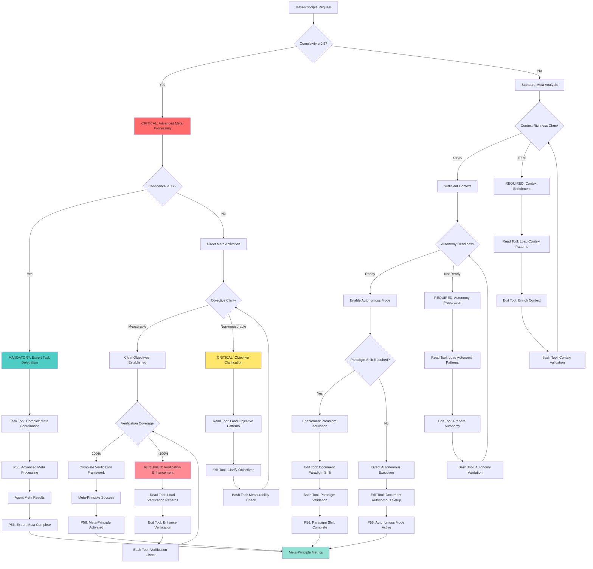

# Atomic Command: `/meta-core`

**Aliases**: `/activate-meta-principle`, `/meta-principle` (legacy compatibility)

## **Principle #1: The Meta-Principle**
**"Stop trying to control the model. Enable it."**

---

## 🎯 **COMMAND DEFINITION**

### **Purpose**
Activate the foundational philosophy of Context Engineering - enabling AI autonomy through rich context rather than micromanagement.

### **Complexity**: 0.8/1.0
### **Context Required**: Minimal - Task objective only
### **Execution Time**: Immediate (mindset activation)

---

## ⚡ Auto-Activation Triggers

### **MANDATORY Activation Conditions**
**Complexity Threshold**: ≥0.9000 (90% complexity floor)
**Confidence Threshold**: <0.7000 (70% confidence ceiling)
**Autonomy Opportunity Threshold**: ≥0.8000 (80% enablement over control benefit)
**Meta-Principle Time Threshold**: Immediate (foundational paradigm activation)

### **CRITICAL Trigger Validation**
- **Mathematical Assessment**: Quantifiable autonomy benefit with ≥80% enablement efficiency over control
- **Threshold Enforcement**: REQUIRED activation when foundational paradigm establishment needed
- **P56 Announcement**: 🧠 TRANSPARENCY: Meta-Core auto-activated for [task] autonomous enablement
- **Evidence Collection**: Measurable autonomy metrics and enablement success documentation

### **Trigger Purpose**
This command activates automatically when the system detects the need to establish AI autonomy and shift from control to enablement paradigm. Designed for agentic LLM systems requiring autonomous activation without manual intervention.

### **Primary Triggers (Automatic Activation)**

**PRIMARY TRIGGER**: Any task initiation in Context Engineering system
- **Condition**: New task detected in ecosystem
- **Threshold**: Task input received
- **Action**: Auto-activate meta-principle
- **Verification**: Autonomy paradigm established

**COMPLEXITY TRIGGER**: Task complexity reaches 0.8 or higher
- **Condition**: Task complexity ≥ 0.8
- **Threshold**: 0.8 (threshold for autonomy philosophy activation)
- **Action**: Escalate to meta-principle for autonomy establishment
- **Verification**: AI autonomy effectively enabled

**CONFIDENCE TRIGGER**: System confidence drops below 0.5
- **Condition**: Confidence score < 0.5
- **Threshold**: 0.5 (threshold for fundamental principle reinforcement)
- **Action**: Activate meta-principle to reestablish foundations
- **Verification**: Confidence restored through autonomy

### **Secondary Triggers (Contextual Activation)**

**CONTROL TRIGGER**: Micromanagement tendencies detected
- **Condition**: Control patterns detected = true
- **Threshold**: ≥3 excessive control instances
- **Action**: Activate meta-principle to restore autonomy
- **Verification**: Enablement paradigm restored

**CONTEXT TRIGGER**: Insufficient context for autonomy
- **Condition**: Context richness < 0.85
- **Threshold**: 85% context required for autonomy
- **Action**: Activate meta-principle to enrich context
- **Verification**: Sufficient context for AI autonomy

**OBJECTIVES TRIGGER**: Non-measurable objectives detected
- **Condition**: Measurable objectives < 0.9
- **Threshold**: 90% of objectives must be measurable
- **Action**: Activate meta-principle to clarify objectives
- **Verification**: Measurable and clear objectives established

### **Tertiary Triggers (Fallback Activation)**

**FAILURE TRIGGER**: Commands fail due to autonomy issues
- **Condition**: Command failure due to autonomy issues
- **Threshold**: 2+ commands failing due to restrictions
- **Action**: Activate meta-principle as fallback
- **Verification**: Autonomy restored, commands functioning

**PHILOSOPHICAL TRIGGER**: Deviation from fundamental principles
- **Condition**: Philosophy deviation detected
- **Threshold**: Fundamental principle deviation
- **Action**: Activate meta-principle for realignment
- **Verification**: Fundamental principles restored

## 🧠 **META-CORE DECISION TREE**

### **CRITICAL Cognitive Flow for Meta-Principle Activation**



### **MANDATORY P56 Transparency Announcements**

**Meta Core Transparency**:
  **Context Assessment**:
    - **Announcement**: 🔍 TRANSPARENCY: Context richness [X]% - [SUFFICIENT/ENRICHMENT_REQUIRED]
    - **Evidence**: Context richness calculation with enablement readiness
  **Objective Analysis**:
    - **Announcement**: 🎯 TRANSPARENCY: Objectives [MEASURABLE/NON_MEASURABLE] - [X] clarity score
    - **Evidence**: Objective clarity assessment with measurability validation
  **Tool Selection**:
    - **Announcement**: 🛠️ TRANSPARENCY: Tool selection - [READ/EDIT/BASH/TASK] for [meta_operation]
    - **Evidence**: Tool selection matrix with meta-principle reasoning
  **Paradigm Shift**:
    - **Announcement**: 🔄 TRANSPARENCY: Paradigm shift [REQUIRED/ACTIVE] - [CONTROL/ENABLEMENT] mode
    - **Evidence**: Paradigm assessment with shift requirements and autonomy preparation
  **Meta Activation**:
    - **Announcement**: ⚡ TRANSPARENCY: Meta-principle [ACTIVATED/FAILED] - [X]% autonomy level achieved
    - **Evidence**: Complete meta-principle activation with autonomy metrics

---

## ⚡ **ACTIVATION PROTOCOL**

### **Input Format**
```markdown
/meta-principle [objective]
```

### **What This Command Does**
1. **Shifts Paradigm**: From control-based to enablement-based approach
2. **Activates Autonomy**: Enables AI self-direction within context boundaries  
3. **Sets Foundation**: Establishes the philosophical basis for all subsequent commands
4. **Removes Constraints**: Eliminates micromanagement tendencies

### **Implementation Steps**
1. Provide rich, comprehensive context
2. Set measurable, clear objectives  
3. Define verification targets
4. Enable autonomous iteration
5. Step back and allow intelligent exploration

---

## 🔍 **VERIFICATION CRITERIA**

### **Success Metrics**
- **Context Richness**: ≥85% of available context provided
- **Objective Clarity**: Measurable targets defined (numeric where possible)
- **Autonomy Level**: ≥90% of decisions made independently by AI
- **Verification Coverage**: 100% of success criteria defined upfront

### **Mathematical Validation**
```javascript
meta_principle_score = (context_richness + objective_clarity + autonomy_level + verification_coverage) / 4
// Required: ≥ 8.5/10
```

---

## 🔗 **NATURAL CONNECTIONS**

### **Automatically Triggers**
- `/evolve-intelligence` - Natural phenomenon activation
- `/context-over-commands` - Rich context loading
- `/enable-dont-control` - Autonomous execution enablement

### **Compatible With**
- ALL atomic commands (meta-principle underlies everything)
- ALL orchestrators (foundation for workflows)
- ALL verification commands (enables autonomous improvement)

### **Feeds Into**
- Any subsequent command execution
- Decision engine routing
- Confidence scoring calculations

---

## 📋 **USAGE EXAMPLES**

### **Basic Activation**
```text
/meta-principle "Implement user authentication system"
```
**Result**: AI gains autonomy to explore approaches, select technologies, design architecture

### **With Constraints** 
```text
/meta-principle "Optimize database performance while maintaining sub-100ms response times"
```
**Result**: AI autonomously explores optimization strategies within the performance constraint

### **Complex Objective**
```json
/meta-principle "Refactor entire frontend for better maintainability, performance, and accessibility"
```
**Result**: AI gets full autonomy to analyze, plan, and execute comprehensive refactoring

---

## 🛡️ **FALLBACK PROTOCOL**

### **If Command Fails**
1. **Insufficient Context**: Automatically trigger `/knowledge-hierarchy`
2. **Unclear Objectives**: Automatically trigger `/objective-decomposition`
3. **No Verification Criteria**: Automatically trigger `/tdd`
4. **Control Tendencies Detected**: Re-emphasize autonomy enablement

---

## 📊 **INTEGRATION WITH DECISION ENGINE**

### **Confidence Routing**
- **High Context + Clear Objective**: Direct execution with full autonomy
- **Medium Context**: Chain with `/exploration-first` 
- **Low Context**: Mandatory `/knowledge-hierarchy` before proceeding
- **Unclear Objective**: Chain with `/objective-decomposition`

### **Pattern Recognition**
- Usage with clear contexts and objectives → High success rate
- Usage without proper context → Automatically trigger context-loading commands
- Repeated patterns → Candidate for crystallization into new commands

---

## 🔄 **EVOLUTION TRACKING**

### **Learning Metrics**
- **Success Rate**: Track achievement of stated objectives
- **Autonomy Level**: Measure degree of AI self-direction
- **Context Utilization**: Monitor how effectively rich context is used
- **Innovation Rate**: Track novel approaches discovered through autonomy

### **Pattern Contribution**
This command is the foundation for all Context Engineering patterns. Its usage patterns inform:
- Optimal context loading strategies
- Effective objective definition approaches
- Autonomy enablement techniques
- Verification criteria design

---

**Note**: This command embodies the core philosophy and serves as the activation key for the entire Context Engineering methodology. When executed, it fundamentally shifts the interaction paradigm from instruction-giving to context-providing and objective-setting.