# Atomic Command: `/optimize-cognitive-organization`

## **Principle #43: Organización Cognitiva Óptima Implementation**
**"La información debe organizarse para maximizar la comprensión y minimizar la fricción cognitiva."**

---

## 🎯 **COMMAND DEFINITION**

### **Purpose**
Implement optimal cognitive organization that structures information to maximize understanding and minimize cognitive friction through logical flow, thematic grouping, clear navigation, sequential numbering, and friction reduction strategies.

### **Complexity**: 0.8/1.0
### **Context Required**: Information structure, organization objective, and cognitive complexity assessment
### **Execution Time**: 3-8 minutes (depending on organization scope)

---

## MANDATORY Cognitive Organization Decision Framework

**CRITICAL**: Cognitive organization optimization requires systematic decision-making with quantifiable metrics and auto-activation triggers.

```mermaid
graph TD
    A[Cognitive Organization Request] --> B{Current Cognitive Friction?}
    B -->|>50%| C[CRITICAL: Emergency Cognitive Optimization]
    B -->|30-50%| D[MANDATORY: Targeted Cognitive Enhancement]
    B -->|<30%| E[REQUIRED: Cognitive Refinement]
    
    C --> F{Complexity ≥ 0.9?}
    F -->|Yes| G[MANDATORY: Task Tool Deployment]
    F -->|No| H[Direct Cognitive Restructuring]
    
    D --> I{Organization Scope?}
    I -->|Full Structure| J[Complete Cognitive Audit]
    I -->|Targeted Areas| K[Focused Friction Reduction]
    I -->|Incremental| L[Progressive Optimization]
    
    E --> M[Cognitive Efficiency Monitoring]
    
    G --> N[Cognitive Organization Implementation]
    H --> N
    J --> N
    K --> N
    L --> N
    M --> N
    
    N --> O{Comprehension Efficiency ≥85%?}
    O -->|Yes| P[P56: Cognitive Organization SUCCESS]
    O -->|No| Q[MANDATORY: Escalate Optimization]
    
    P --> R[Cognitive Monitoring]
    Q --> C
```



**Auto-Activation Triggers** (MANDATORY):
- Cognitive friction >50% → CRITICAL cognitive optimization
- Comprehension efficiency <85% → MANDATORY cognitive enhancement
- Information accessibility <100% → REQUIRED structure improvement
- Cognitive load >optimal → CRITICAL intervention

**P56 Transparency Announcements** (REQUIRED):
- Cognitive friction reduction percentage achieved
- Comprehension efficiency improvement metrics
- Information accessibility verification
- Cognitive load optimization results

---

## 🛡️ P55/P56 Compliance Integration

### **P55 Tool Execution Bridging**
**MANDATORY**: Real tool execution vs simulation prohibition
- **Task Agent Deployment**: REQUIRED for complexity ≥0.9
- **Success Rate Target**: ≥98% completion guarantee
- **Execution Evidence**: Actual tool results with quantitative validation

### **P56 Transparency Protocol**
**CRITICAL**: Visual execution confirmation system
- **P56 Announcement**: Optimize Cognitive Organization execution initiated
- **Tool Evidence**: Observable outcomes with specific metrics
- **Completion Verification**: Quantifiable success criteria

## ⚡ **ACTIVATION PROTOCOL**

### **Input Format**
```markdown
/optimize-cognitive-organization [information_scope] [organization_level?] [cognitive_complexity?]
```

### **What This Command Does**
1. **Flujo Lógico**: Organize information in natural work sequence
2. **Agrupación Temática**: Keep related concepts together
3. **Navegación Clara**: Create predictable and easy-to-follow structure
4. **Numeración Secuencial**: Eliminate gaps or interruptions in sequence
5. **Reducción de Fricción**: Minimize mental effort to find information
6. **Cognitive Load Assessment**: Measure and optimize information processing requirements

### **Optimization Targets**
- **≥70% Cognitive Friction Reduction**: From baseline organizational approach
- **100% Information Accessibility**: Complete content findability
- **≥85% Comprehension Efficiency**: Understanding per cognitive unit

---

## 🔧 **COGNITIVE ORGANIZATION PROCESS**

### **Phase 1: Flujo Lógico (Logical Flow)**
```javascript
function implementLogicalFlow(information_content) {
  const logical_structure = {
    natural_sequence: mapWorkflowSequence(information_content),
    decision_points: identifyDecisionMoments(information_content),
    dependency_flow: organizeDependencyChain(information_content),
    conceptual_progression: structureConceptualBuilding(information_content)
  }
  
  return validateLogicalFlow(logical_structure)
}
```

**Logical Flow Principles**:
- Information follows natural work sequence
- Each step builds on previous understanding
- Decision points clearly marked and accessible
- Dependencies resolved before dependent content
- Conceptual progression from simple to complex

### **Phase 2: Agrupación Temática (Thematic Grouping)**
```javascript
function implementThematicGrouping(organized_content) {
  const thematic_organization = {
    concept_clusters: groupRelatedConcepts(organized_content),
    functional_groups: organizeFunctionalElements(organized_content),
    contextual_sections: createContextualSections(organized_content),
    reference_consolidation: consolidateReferences(organized_content)
  }
  
  return validateThematicCoherence(thematic_organization)
}
```

**Thematic Grouping Strategies**:
- Related concepts maintained in proximity
- Functional elements grouped by purpose
- Contextual information consolidated
- Cross-references minimized through strategic grouping
- Conceptual boundaries clearly defined

### **Phase 3: Navegación Clara (Clear Navigation)**
```javascript
function implementClearNavigation(structured_content) {
  const navigation_system = {
    hierarchical_structure: createHierarchicalAccess(structured_content),
    sequential_navigation: implementSequentialFlow(structured_content),
    reference_system: buildReferenceSystem(structured_content),
    accessibility_features: enhanceAccessibility(structured_content)
  }
  
  return validateNavigationEffectiveness(navigation_system)
}
```

**Clear Navigation Elements**:
- Hierarchical structure with predictable depth
- Sequential navigation following logical flow
- Comprehensive reference system
- Accessibility features for different cognitive styles
- Consistent navigation patterns throughout

---

## 📊 **COGNITIVE FRICTION MEASUREMENT**

### **Friction Assessment Framework**
```javascript
function measureCognitiveFriction(organized_information) {
  const friction_metrics = {
    access_time: measureInformationAccessTime(organized_information),
    comprehension_speed: assessComprehensionSpeed(organized_information),
    cognitive_load: calculateCognitiveLoad(organized_information),
    context_switching: measureContextSwitchingFrequency(organized_information)
  }
  
  return calculateFrictionReduction(friction_metrics)
}
```

### **Success Criteria**
- **Cognitive Friction Reduction**: ≥70% reduction from baseline
- **Information Accessibility**: 100% content findability
- **Comprehension Efficiency**: ≥85% understanding per cognitive unit
- **Navigation Effectiveness**: ≤3 steps to reach any information

### **Friction Reduction Validation**
```javascript
function validateFrictionReduction(optimization_result) {
  const validation_checks = {
    friction_reduction: optimization_result.friction_reduction >= 70,
    accessibility_maintained: optimization_result.accessibility === 100,
    comprehension_efficiency: optimization_result.comprehension >= 85,
    navigation_effectiveness: optimization_result.navigation_steps <= 3
  }
  
  return confirmFrictionReduction(validation_checks)
}
```

---

## 🔄 **ORGANIZATION PRINCIPLES IMPLEMENTATION**

### **Principle 1: Claridad > Completitud**
```javascript
function prioritizeClarity(information_content) {
  const clarity_optimization = {
    essential_information: extractEssentialInformation(information_content),
    clarity_enhancement: enhanceInformationClarity(information_content),
    completeness_balance: balanceCompletenessWithClarity(information_content),
    understanding_prioritization: prioritizeUnderstanding(information_content)
  }
  
  return implementClarityFirst(clarity_optimization)
}
```

**Clarity Implementation**:
- Essential information prioritized over exhaustive detail
- Understanding takes precedence over completeness
- Complex concepts broken into digestible components
- Clarity validation through comprehension testing

### **Principle 2: Flujo > Categorización**
```javascript
function prioritizeFlow(organized_content) {
  const flow_optimization = {
    workflow_sequence: followNaturalWorkflow(organized_content),
    category_subordination: subordinateCategoriesToFlow(organized_content),
    transition_smoothness: optimizeTransitions(organized_content),
    flow_continuity: maintainFlowContinuity(organized_content)
  }
  
  return implementFlowPriority(flow_optimization)
}
```

**Flow Implementation**:
- Natural workflow sequence overrides categorical organization
- Categories serve flow, not the reverse
- Smooth transitions between information segments
- Flow continuity maintained throughout structure

### **Principle 3: Accesibilidad > Sofisticación**
```javascript
function prioritizeAccessibility(structured_information) {
  const accessibility_optimization = {
    ease_of_access: maximizeAccessEase(structured_information),
    sophistication_simplification: simplifySophistication(structured_information),
    universal_comprehension: enableUniversalComprehension(structured_information),
    accessibility_validation: validateAccessibility(structured_information)
  }
  
  return implementAccessibilityFirst(accessibility_optimization)
}
```

**Accessibility Implementation**:
- Information access prioritized over technical sophistication
- Universal comprehension over specialized complexity
- Simple, effective access methods
- Accessibility validation with diverse cognitive styles

### **Principle 4: Coherencia > Flexibilidad**
```javascript
function maintainCoherence(accessible_structure) {
  const coherence_system = {
    consistent_structure: maintainConsistentStructure(accessible_structure),
    flexibility_constraints: constrainFlexibilityToCoherence(accessible_structure),
    structural_integrity: preserveStructuralIntegrity(accessible_structure),
    coherence_validation: validateCoherence(accessible_structure)
  }
  
  return implementCoherenceFirst(coherence_system)
}
```

**Coherence Implementation**:
- Consistent structure maintained across all information
- Flexibility constrained to preserve coherence
- Structural integrity prioritized over adaptability
- Coherence validation throughout organization

---

## 🎯 **COGNITIVE OPTIMIZATION STRATEGIES**

### **Information Hierarchy Optimization**
```javascript
function optimizeInformationHierarchy(content_structure) {
  const hierarchy_optimization = {
    cognitive_priority: organizeByCognitivePriority(content_structure),
    access_frequency: optimizeByAccessFrequency(content_structure),
    dependency_order: structureByDependencyOrder(content_structure),
    comprehension_flow: optimizeComprehensionFlow(content_structure)
  }
  
  return implementHierarchyOptimization(hierarchy_optimization)
}
```

**Hierarchy Optimization Elements**:
- Cognitive priority determines information positioning
- Access frequency influences structural accessibility
- Dependency order optimizes learning progression
- Comprehension flow guides structural decisions

### **Cognitive Load Distribution**
```javascript
function distributeCognitiveLoad(organized_hierarchy) {
  const load_distribution = {
    complexity_gradation: implementComplexityGradation(organized_hierarchy),
    cognitive_chunking: applyCognitiveChunking(organized_hierarchy),
    processing_optimization: optimizeProcessingRequirements(organized_hierarchy),
    load_balancing: balanceCognitiveLoad(organized_hierarchy)
  }
  
  return validateLoadDistribution(load_distribution)
}
```

**Load Distribution Strategies**:
- Complexity gradation from simple to complex
- Cognitive chunking for optimal processing
- Processing requirements optimized for human cognition
- Load balancing across information segments

---

## 🔍 **COGNITIVE EFFECTIVENESS TRACKING**

### **Real-Time Cognitive Monitoring**
```javascript
function monitorCognitiveEffectiveness(organized_content, usage_patterns) {
  const monitoring_metrics = {
    comprehension_speed: trackComprehensionSpeed(organized_content, usage_patterns),
    information_retention: measureInformationRetention(organized_content, usage_patterns),
    cognitive_efficiency: calculateCognitiveEfficiency(organized_content, usage_patterns),
    friction_evolution: trackFrictionEvolution(organized_content, usage_patterns)
  }
  
  return updateOrganizationStrategy(monitoring_metrics)
}
```

### **Cognitive Effectiveness Loop**
1. **Measure**: Track comprehension speed and retention
2. **Analyze**: Identify cognitive friction patterns
3. **Optimize**: Implement organizational improvements
4. **Validate**: Confirm cognitive effectiveness gains
5. **Adapt**: Adjust organization based on cognitive patterns

---

## 🔗 **NATURAL CONNECTIONS**

### **Automatically Triggers**
- `/living-documentation` - Update documentation with optimized cognitive organization
- `/recognize-patterns` - Identify cognitive organization patterns
- `/optimize-context` - Optimize context using cognitive principles

### **Compatible With**
- `/mathematical-simplicity` - Align with mathematical simplicity principles
- `/invisible-excellence` - Achieve invisible excellence through cognitive optimization
- `/knowledge-hierarchy` - Optimize knowledge hierarchy for cognitive efficiency

### **Feeds Into**
- `/crystallize-patterns` - Cognitive organization patterns become reusable
- `/planning-documentation` - Cognitively optimized planning documentation
- `/conversation-lifecycle` - Cognitive optimization in conversation management

---

## 📋 **USAGE EXAMPLES**

### **Documentation Cognitive Optimization**
```text
/optimize-cognitive-organization "project documentation" "comprehensive" "high_complexity"
```
**Result**: Documentation organized with logical flow, thematic grouping, clear navigation, and minimized cognitive friction

### **Command System Cognitive Optimization**
```bash
/optimize-cognitive-organization "command structure" "balanced" "medium_complexity"
```
**Result**: Command system structured for optimal cognitive accessibility and flow

### **Learning Material Cognitive Optimization**
```text
/optimize-cognitive-organization "training content" "progressive" "variable_complexity"
```
**Result**: Learning materials organized to minimize cognitive load and maximize comprehension

---

## 🛡️ **COGNITIVE SAFETY PROTOCOLS**

### **Comprehension Preservation Checks**
- All information remains accessible and understandable
- No cognitive capability degradation occurs
- Understanding standards maintained throughout
- Comprehension efficiency achieved with optimized organization

### **Cognitive Safety Validation**
```javascript
function validateCognitiveSafety(optimized_organization, original_content) {
  const safety_checks = {
    information_preservation: validateInformationPreservation(optimized_organization, original_content),
    comprehension_maintenance: validateComprehensionMaintenance(optimized_organization),
    cognitive_accessibility: validateCognitiveAccessibility(optimized_organization),
    understanding_sustainability: validateUnderstandingSustainability(optimized_organization)
  }
  
  return confirmCognitiveSafety(safety_checks)
}
```

### **Cognitive Optimization Rollback**
- **Organization Adjustment**: Modify structure if comprehension drops
- **Complexity Reduction**: Simplify organization if cognitive load increases
- **Structure Restoration**: Restore previous organization if understanding threatened
- **Learning Integration**: Update cognitive patterns based on outcomes

---

## 📊 **INTEGRATION WITH DECISION ENGINE**

### **Cognitive-Aware Routing**
- **High Cognitive Efficiency (>85%)**: Direct information presentation
- **Medium Cognitive Efficiency (70-85%)**: Selective structure enhancement
- **Low Cognitive Efficiency (<70%)**: Full cognitive optimization protocol
- **Cognitive Friction Increase**: Organization strategy revision

### **Cognitive Learning Integration**
- **Successful Patterns**: Crystallize effective cognitive organization strategies
- **Comprehension Gains**: Track and replicate cognitive optimization successes
- **Cognitive Patterns**: Identify optimal information organization sequences
- **Friction Metrics**: Continuous improvement of cognitive effectiveness

---

## 🔄 **EVOLUTION TRACKING**

### **Cognitive Optimization Metrics**
- **Friction Reduction Rate**: Average percentage cognitive friction reduction
- **Comprehension Efficiency**: Percentage improvement in understanding speed
- **Accessibility Score**: Measurement of information accessibility
- **Cognitive Load Optimization**: Percentage reduction in cognitive processing requirements

### **Cognitive Learning Patterns**
- Effective organization combinations → Cognitive optimization templates
- High-comprehension structures → Priority organization candidates
- Low-friction organizations → Cognitive efficiency patterns
- Cognitive bottlenecks → Optimization priority targets

---

## 💡 **COGNITIVE ORGANIZATION COMMUNICATION**

### **Cognitive Optimization Report**
- 🧠 **Cognitive Organization Results**
- ****Friction Reduction****: 75% cognitive friction reduction achieved
- ****Comprehension Efficiency****: 88% improvement in understanding speed
- ****Accessibility****: 100% information accessibility maintained
- ****Cognitive Load****: 65% reduction in processing requirements
- ****Organization Applied****: Logical flow with thematic grouping
****Key Optimizations****:
- Sequential numbering without gaps
- Related concepts grouped together
- Clear navigation structure implemented
- Cognitive load distributed optimally
****Cognitive Principles Applied****:
- Claridad > Completitud (Understanding prioritized)
- Flujo > Categorización (Natural workflow followed)
- Accesibilidad > Sofisticación (Simple access methods)
- Coherencia > Flexibilidad (Consistent structure maintained)
- ****Recommendation****: Cognitive organization validated for similar content

### **Cognitive Optimization Insights**
- Information organization patterns that maximize comprehension
- Cognitive friction points consistently causing processing difficulties
- Organization strategies that preserve understanding while reducing load
- Cognitive adaptations based on content complexity evolution

---

## 🎯 **COGNITIVE ORGANIZATION PRINCIPLES**

### **Comprehension Optimization**
- Structure information to follow natural cognitive processing
- Minimize cognitive friction through intelligent organization
- Optimize for understanding-to-effort ratio
- Implement adaptive cognitive load management

### **Cognitive Benefits**
- Reduced mental effort through optimized information flow
- Faster comprehension through cognitively aligned structure
- Improved information retention through coherent organization
- Enhanced cognitive efficiency through friction reduction

---

**Note**: This command embodies the Context Engineering principle of optimal cognitive organization, achieving maximum understanding with minimum cognitive friction through systematic cognitive optimization strategies and continuous effectiveness measurement based on human cognitive processing patterns.