# Core-Orchestration-Hub

**Meta-Principle**: "EXECUTE intelligent workflow coordination through systematic multi-agent management with ≥95% efficiency"

**Specialized Core**: CRITICAL orchestration functions that extend Universal-Meta-Core-Infrastructure with real-time coordination monitoring and ≤150ms response time.

**Behavioral Integration**: Cross-Reference Intelligence (#55) ensures automatic detection of workflow dependencies and optimization of coordination patterns across all orchestration operations.

## 🎯 Objective

**EXECUTE** specialized orchestration functions through 3 MANDATORY coordination capabilities unique to orchestration domain operations, while IMPLEMENTING automatic inheritance of 5 universal functions from meta-core for optimal efficiency.

**Observable Outcomes**: ≥95% coordination accuracy, ≤150ms orchestration response time, and mathematical validation of all workflow efficiency with 4-decimal precision.

## 🏗️ Meta-Core Inheritance Architecture

**MANDATORY Automatic Inheritance** from [Universal-Meta-Core-Infrastructure](./universal-meta-core-infrastructure.md):
- **Universal Monitoring and Metrics System** - Real-time orchestration performance tracking with ≥95% accuracy
- **Universal Script Integration and Automation** - P55/P56 compliant tool execution with mathematical transparency
- **Universal Structured Reporting System** - Evidence-based orchestration analysis with quantifiable outcomes
- **Universal Triggers and Automatic Activation** - Intelligent orchestration routing with ≤150ms response time
- **Universal Adaptive Learning System** - Continuous orchestration improvement with measurable enhancement metrics

**Inheritance Verification**: 100% functional preservation with zero breaking changes and enhanced capabilities through systematic architecture.

## 📊 MANDATORY Core Decision Tree

**CRITICAL**: Orchestration hub routing with multi-agent coordination and quantifiable metrics.


**MANDATORY P56 Transparency**: Visual announcements for multi-agent coordination, ≤150ms response achievement, and ≥95% completion validation.

## 🔧 Specialized Orchestration Functions

### 1. **Specialized Workflow Coordination and Delegation**

**CRITICAL specialized workflow management and task assignment system with ≥95% accuracy**

**MANDATORY Workflow Delegation Framework Requirements**:
- **Workflow Mapping**: EXECUTE orchestration comprehensive process visualization with systematic workflow representation
- **Dependency Resolution**: IMPLEMENT orchestration automatic prerequisite management with comprehensive dependency handling
- **Execution Sequencing**: VALIDATE orchestration optimal order determination with mathematical sequence optimization
- **Parallel Opportunities**: EXECUTE orchestration concurrent execution identification with systematic parallelization analysis
- **Capability Assessment**: IMPLEMENT orchestration agent skill evaluation with quantifiable capability measurement
- **Task Complexity Matching**: VALIDATE orchestration difficulty capability alignment with mathematical matching algorithms
- **Load Balancing**: EXECUTE orchestration workload distribution optimization with systematic load optimization

**P56 Transparency**: Workflow delegation provides user-visible evidence of process visualization, dependency management, and execution sequencing with capability assessment.

### 2. **Specialized Multi-Agent Synchronization**

**MANDATORY specialized seamless coordination between multiple agents and processes with mathematical precision**

**CRITICAL Multi-Agent Synchronization Framework Requirements**:
- **Communication Protocols**: EXECUTE orchestration inter-agent message passing with systematic communication management
- **State Synchronization**: IMPLEMENT orchestration consistent system state maintenance with mathematical state consistency
- **Conflict Resolution**: VALIDATE orchestration automatic collision handling with systematic conflict management
- **Coordination Patterns**: EXECUTE orchestration established collaboration frameworks with proven coordination methodologies
- **Handoff Management**: IMPLEMENT orchestration seamless task transfer protocols with systematic handoff optimization
- **Agent Coordination Matrix**: VALIDATE orchestration multi-dimensional coordination with comprehensive coordination mapping

**P56 Transparency**: Multi-agent synchronization provides user-visible evidence of communication protocols, state synchronization, and conflict resolution with coordination patterns.

### 3. **Advanced Orchestration Patterns**

**CRITICAL specialized patterns for complex and adaptive orchestration with measurable results**

**MANDATORY Advanced Orchestration Framework Requirements**:
- **Pipeline Orchestration**: EXECUTE orchestration sequential processing optimization with systematic pipeline management
- **Parallel Execution Coordination**: IMPLEMENT orchestration concurrent task management with comprehensive parallel coordination
- **Hierarchical Delegation**: VALIDATE orchestration authority level management with systematic hierarchy optimization
- **Adaptive Coordination**: EXECUTE orchestration dynamic strategy modification with intelligent coordination adaptation
- **Workflow Optimization**: IMPLEMENT orchestration efficiency maximization algorithms with mathematical optimization
- **Completion Prediction**: VALIDATE orchestration estimated timeline calculation with predictive completion analysis

**P56 Transparency**: Advanced orchestration patterns provide user-visible evidence of pipeline optimization, parallel coordination, and hierarchical delegation with adaptive coordination.

## 🎯 CRITICAL Component Selection Logic

**MANDATORY**: Orchestration hub component routing with coordination efficiency.

```mermaid
graph TD
    A[Orchestration Operation] --> B{Component Type Analysis}
    B -->|Discovery| C[CRITICAL: discover.md]
    B -->|Execution| D[MANDATORY: execute.md]
    B -->|Planning| E[REQUIRED: plan-flow.md]
    B -->|Verification| F[CRITICAL: verify-flow.md]
    B -->|General Orchestration| G[MANDATORY: orchestrate.md]
    B -->|System Health| H[REQUIRED: system-health.md]
    
    C --> I[Discovery + Exploration + ≥95% Coverage]
    D --> J[Parallel Execution + Verification + ≤150ms]
    E --> K[Strategic Planning + Decomposition + Evidence]
    F --> L[Multi-Dimensional + Verification + Math Precision]
    G --> M[Multi-Agent + Coordination + Efficiency]
    H --> N[System Maintenance + Optimization + Health Metrics]
    
    I --> O{Coordination Pattern}
    J --> O
    K --> O
    L --> O
    M --> O
    N --> O
    
    O -->|Pipeline| P[MANDATORY: Sequential Processing]
    O -->|Parallel| Q[CRITICAL: Concurrent Execution]
    O -->|Hierarchical| R[REQUIRED: Delegation Tree]
    O -->|Adaptive| S[MANDATORY: Dynamic Coordination]
    
    P --> T[Universal Orchestration Framework]
    Q --> T
    R --> T
    S --> T
    
    style A fill:#e1f5fe
    style C fill:#ffcdd2
    style D fill:#ffcdd2
    style E fill:#ffcdd2
    style F fill:#ffcdd2
    style G fill:#ffcdd2
    style H fill:#ffcdd2
    style P fill:#ffcdd2
    style Q fill:#ffcdd2
    style R fill:#ffcdd2
    style S fill:#ffcdd2
```



**REQUIRED Tool Selection**: Each component provides specialized orchestration capabilities with ≥95% coordination accuracy and ≤150ms response time.

## 🚀 Activation Protocols

## ⚡ Auto-Activation Triggers

### **MANDATORY Activation Conditions**
**Complexity Threshold**: ≥0.9000 (90% complexity floor)
**Confidence Threshold**: <0.7000 (70% confidence ceiling)
**Coordination Efficiency Threshold**: <0.9000 (90% coordination requirement floor)
**Multi-Agent Count Threshold**: ≥2.0000 (multiple agent operations)

### **CRITICAL Trigger Validation**
- **Mathematical Assessment**: Multi-agent coordination complexity evaluation with ≥95% accuracy
- **Threshold Enforcement**: REQUIRED activation when complexity ≥0.9000 OR confidence <0.7000 OR coordination efficiency <0.9000 OR agents ≥2
- **P56 Announcement**: [Orchestration-Hub] Auto-activation triggered - Agents: {count}, Coordination: {efficiency}, Tasks: {count}
- **Evidence Collection**: Quantifiable orchestration trigger condition documentation with coordination metrics

### **Automatic Trigger Protocol**
**MANDATORY Activation Conditions**:
- **EXECUTE** automatic activation for any multi-step or multi-agent operation OR coordination efficiency <0.9000
- **IMPLEMENT** transparent background coordination with real-time monitoring
- **VALIDATE** seamless integration with all command types through automated quality assurance

**Observable Outcomes**: ≤150ms trigger response time, 100% transparent coordination evidence, and ≥95% successful orchestration completion rate.

### **Extended Inheritance Interface**
```markdown
## Extended Orchestration Inheritance Pattern
1. Multi-step operation detected
2. Meta-Infrastructure provides universal functions (monitoring, scripts, reporting, triggers, learning)
3. Orchestration-Hub adds orchestration-specific functions (workflows, multi-agent sync, patterns)
4. Specialized orchestrators add domain-specific logic
5. Results integrated through unified universal progress tracking
```

## 🔗 Commands Inheriting from This Core

### **Orchestration Specializations** (REQUIRED unique differentiators preserved):
- **`discover.md`** → EXECUTE specific discovery and exploration orchestration with ≥95% coverage accuracy
- **`execute.md`** → IMPLEMENT parallel execution orchestration with verification and ≤150ms coordination time
- **`plan-flow.md`** → VALIDATE strategic planning orchestration and decomposition with evidence-based outcomes
- **`verify-flow.md`** → EXECUTE multi-dimensional verification orchestration with mathematical precision
- **`orchestrate.md`** → IMPLEMENT general multi-agent coordination orchestration with measurable efficiency
- **`system-health.md`** → VALIDATE system maintenance and optimization orchestration with quantifiable health metrics

**Specialization Validation**: 100% unique functionality preservation with enhanced orchestration capabilities through inheritance architecture.

## 📊 Orchestration Architecture

### **Coordination Flow**


### **Multi-Agent Coordination Matrix**

**MANDATORY Coordination Matrix Framework Requirements**:
- **Agent Types**: EXECUTE cognitive, execution, verification, documentation, and optimization agent coordination with systematic agent type management
- **Communication Channels**: IMPLEMENT direct, broadcast, hierarchical, and mesh communication channels with comprehensive channel optimization
- **Synchronization Points**: VALIDATE start, checkpoints, completion, and error states synchronization with systematic coordination checkpoints
- **Coordination Patterns**: EXECUTE pipeline, parallel, fan-out, fan-in, and hybrid patterns with mathematical pattern optimization

**P56 Transparency**: Coordination matrix provides user-visible evidence of agent types, communication channels, and synchronization points with coordination patterns.

## 🎭 Orchestration Patterns

### **1. Pipeline Orchestration**

**CRITICAL Pipeline Orchestration Framework Requirements**:
- **Sequential Processing**: EXECUTE step-by-step execution with systematic sequential coordination
- **Data Flow**: IMPLEMENT output-to-input chaining with comprehensive data flow management
- **Checkpoint Validation**: VALIDATE intermediate result verification with systematic checkpoint assessment
- **Error Propagation**: EXECUTE failure handling in sequence with systematic error management

**P56 Transparency**: Pipeline orchestration provides user-visible evidence of sequential processing, data flow management, and checkpoint validation with error propagation.

### **2. Parallel Execution Coordination**

**MANDATORY Parallel Execution Framework Requirements**:
- **Concurrent Processing**: EXECUTE simultaneous multi-task execution with systematic parallel coordination
- **Resource Allocation**: IMPLEMENT optimal parallel resource distribution with mathematical resource optimization
- **Synchronization Barriers**: VALIDATE coordination checkpoints with systematic synchronization management
- **Result Aggregation**: EXECUTE parallel output consolidation with comprehensive result integration

**P56 Transparency**: Parallel execution coordination provides user-visible evidence of concurrent processing, resource allocation, and synchronization barriers with result aggregation.

### **3. Hierarchical Delegation**

**CRITICAL Hierarchical Delegation Framework Requirements**:
- **Delegation Tree**: EXECUTE task breakdown hierarchy with systematic hierarchical task organization
- **Authority Levels**: IMPLEMENT decision-making hierarchy with comprehensive authority management
- **Reporting Structure**: VALIDATE status escalation paths with systematic reporting optimization
- **Responsibility Assignment**: EXECUTE clear ownership definition with quantifiable responsibility allocation

**P56 Transparency**: Hierarchical delegation provides user-visible evidence of task breakdown hierarchy, authority levels, and reporting structure with responsibility assignment.

### **4. Adaptive Coordination**

**MANDATORY Adaptive Coordination Framework Requirements**:
- **Dynamic Adjustment**: EXECUTE real-time strategy modification with systematic adaptive coordination
- **Performance Optimization**: IMPLEMENT continuous efficiency improvement with mathematical performance enhancement
- **Load Rebalancing**: VALIDATE dynamic workload redistribution with systematic load optimization
- **Strategy Evolution**: EXECUTE learning-based coordination improvement with intelligent strategy adaptation

**P56 Transparency**: Adaptive coordination provides user-visible evidence of dynamic adjustment, performance optimization, and load rebalancing with strategy evolution.

## 📈 Orchestration Metrics

### **Efficiency Metrics**

**CRITICAL Efficiency Metrics Framework Requirements**:
- **Coordination Overhead**: EXECUTE orchestration cost measurement with systematic overhead assessment
- **Parallel Utilization**: IMPLEMENT concurrent execution effectiveness with mathematical utilization optimization
- **Delegation Accuracy**: VALIDATE task assignment success rate with quantifiable assignment effectiveness
- **Synchronization Efficiency**: EXECUTE coordination time optimization with systematic synchronization enhancement
- **Overall Throughput**: IMPLEMENT system-wide productivity measurement with comprehensive throughput analysis

**P56 Transparency**: Efficiency metrics provide user-visible evidence of coordination overhead, parallel utilization, and delegation accuracy with synchronization efficiency.

### **Quality Metrics**

**MANDATORY Quality Metrics Framework Requirements**:
- **Coordination Accuracy**: EXECUTE correct workflow execution percentage with systematic accuracy measurement
- **Error Recovery Rate**: IMPLEMENT successful failure handling percentage with quantifiable recovery effectiveness
- **Completion Reliability**: VALIDATE successful task completion rate with mathematical completion assessment
- **Delegation Effectiveness**: EXECUTE optimal assignment achievement rate with systematic delegation optimization
- **System Reliability**: IMPLEMENT orchestration stability measurement with comprehensive reliability analysis

**P56 Transparency**: Quality metrics provide user-visible evidence of coordination accuracy, error recovery rate, and completion reliability with delegation effectiveness.

## 🔄 System Integrations

### **Script Integration**

**CRITICAL Script Integration Framework Requirements**:
- **Orchestration Scripts**: EXECUTE orchestration through context_engineering_formulas.sh script with mathematical orchestration validation
- **Monitoring Scripts**: IMPLEMENT monitoring through test-trigger-system.sh script with systematic monitoring protocols
- **Metrics Scripts**: VALIDATE metrics through calculate-real-metrics.sh script with quantifiable performance assessment
- **Automation Bridge**: EXECUTE automation bridge through script-automation-bridge.md integration with comprehensive automation protocols

**P56 Transparency**: Script integration provides user-visible evidence of orchestration scripts, monitoring scripts, and metrics scripts with automation bridge functionality.

### **Agent Communication Protocol**

**MANDATORY Communication Protocol Framework Requirements**:
- **Message Format**: EXECUTE structured JSON communication with systematic message standardization
- **Priority Handling**: IMPLEMENT urgent, normal, and background priority queues with mathematical priority optimization
- **Delivery Guarantees**: VALIDATE at-least-once delivery assurance with comprehensive delivery verification
- **Timeout Management**: EXECUTE configurable response timeouts with systematic timeout optimization
- **Retry Strategies**: IMPLEMENT exponential backoff retry patterns with intelligent retry management

**P56 Transparency**: Communication protocol provides user-visible evidence of message format, priority handling, and delivery guarantees with timeout management.

## 📊 Consolidation Results

**Before Meta-Core Integration**:
- 6 commands + 5 duplicated common functions
- Universal infrastructure duplication
- Inconsistencies between cores

**After Meta-Core Integration**:
- 1 meta-core + 1 specialized core + 6 specializations
- 3 specialized implementations + 5 inherited universal functions
- Infrastructure 100% consistent
- **85% reduction** in total duplicated code

## 🛡️ Reliability Guarantees

### **Transparent Inheritance**:
- **5 universal functions** automatically provided by meta-core
- **3 specialized functions** unique to orchestration domain
- **6 specialized commands** maintain unique differentiators
- **Zero breaking changes** with radical optimization

### **Meta-Systemic Optimization**:
- **System reliability** universally inherited
- **Performance assurance** integrated in infrastructure
- **Fault tolerance** through optimized inheritance
- **Predictive performance** universally guaranteed

## 🎯 Primary Use Cases with Validation Metrics

### **1. Complex Workflow Execution**
**EXECUTE** complex multi-step process coordination with measurable outcomes:
- **Observable Outcome**: ≥95% workflow completion accuracy with ≤150ms coordination latency
- **VALIDATE** inter-task dependency management with 100% dependency resolution
- **IMPLEMENT** parallel execution optimization with ≥30% time reduction measurement
- **Success Criteria**: Zero workflow failures, ≥90% parallel efficiency utilization, ≤5 seconds completion time

### **2. Multi-Agent System Coordination**
**IMPLEMENT** specialized agent deployment with systematic coordination:
- **Observable Outcome**: ≥95% agent deployment success with optimal resource allocation
- **EXECUTE** seamless inter-agent coordination with ≤100ms communication latency
- **VALIDATE** load balancing and resource optimization with mathematical efficiency validation
- **Success Criteria**: ≥90% resource utilization efficiency, zero coordination conflicts, ≥95% task completion rate

### **3. System-Wide Operations**
**VALIDATE** complete system operation orchestration with mathematical precision:
- **Observable Outcome**: 100% system operation completion with zero service disruption
- **EXECUTE** maintenance and update coordination with ≤99.9% uptime preservation
- **IMPLEMENT** health monitoring and optimization with real-time performance tracking
- **Success Criteria**: ≤1 minute operation completion, zero downtime, ≥95% health score maintenance

### **4. Error Recovery and Resilience**
**EXECUTE** intelligent fault management with automated recovery:
- **Observable Outcome**: ≥95% error detection accuracy with ≤500ms recovery initiation
- **VALIDATE** automatic recovery with minimal disruption and ≤99.9% success rate
- **IMPLEMENT** failure-based learning for continuous improvement with measurable enhancement
- **Success Criteria**: ≤30 seconds recovery time, zero data loss, ≥10% monthly error reduction

## 🔮 Emergent Capabilities

### **Adaptive Learning**

**CRITICAL Adaptive Learning Framework Requirements**:
- **Pattern Recognition**: EXECUTE workflow efficiency pattern identification with systematic pattern analysis
- **Optimization Learning**: IMPLEMENT performance improvement strategy learning with mathematical optimization learning
- **Failure Analysis**: VALIDATE error pattern analysis and prevention with comprehensive failure assessment
- **Predictive Coordination**: EXECUTE proactive optimization based on patterns with intelligent predictive coordination

**P56 Transparency**: Adaptive learning provides user-visible evidence of pattern recognition, optimization learning, and failure analysis with predictive coordination.

### **Self-Optimization**

**MANDATORY Self-Optimization Framework Requirements**:
- **Automatic Tuning**: EXECUTE parameter optimization without intervention with systematic automatic optimization
- **Strategy Evolution**: IMPLEMENT coordination strategy continuous improvement with mathematical strategy enhancement
- **Resource Optimization**: VALIDATE dynamic resource allocation optimization with systematic resource management
- **Performance Enhancement**: EXECUTE continuous efficiency improvement with quantifiable performance enhancement

**P56 Transparency**: Self-optimization provides user-visible evidence of automatic tuning, strategy evolution, and resource optimization with performance enhancement.

---

## 🛡️ P55/P56 Compliance Integration

### **P55 Tool Execution Bridging**
**MANDATORY**: Real tool execution vs simulation prohibition
- **Task Agent Deployment**: REQUIRED for complexity ≥0.9
- **Success Rate Target**: ≥98% completion guarantee
- **Execution Evidence**: Actual tool results with quantitative validation
- **Orchestration Operations**: EXECUTE all workflow coordination through verified tool calls with mathematical transparency
- **Performance Metrics**: IMPLEMENT quantifiable orchestration performance tracking with 4-decimal precision
- **Operation Traceability**: VALIDATE complete orchestration operation audit trail with coordination documentation

### **P56 Transparency Protocol**
**CRITICAL**: Visual execution confirmation system
- **P56 Announcement**: [Orchestration-Hub] execution initiated
- **Tool Evidence**: Observable outcomes with specific metrics
- **Completion Verification**: Quantifiable success criteria
- **Phase Announcements**: VALIDATE visual announcements for all orchestration phases with user-visible evidence
- **Coordination Tracking**: EXECUTE real-time updates for multi-agent coordination with mathematical validation
- **Quality Reporting**: IMPLEMENT comprehensive orchestration quality reporting with statistical validation

### **Mathematical Precision Requirements**
**MANDATORY Validation Standards**:
- **Coordination Accuracy**: ≥95% orchestration success with statistical validation
- **Response Speed**: ≤150ms coordination response time
- **Quality Metrics**: 4-decimal precision for all orchestration measurements
- **Multi-Agent Efficiency**: ≥90% resource utilization with mathematical verification
- **Task Agent Success**: ≥98% completion rate for complexity ≥0.9 operations
- **Tool Call Transparency**: 100% execution evidence with coordination validation

---

**Activation Protocol**: This core EXECUTES automatic inheritance of 5 universal functions from meta-core and IMPLEMENTS 3 specialized orchestration functions when any multi-step or multi-agent operation is REQUIRED, providing complete optimized functionality while preserving all unique specializations with ≥95% accuracy and mathematical validation.

## 📊 Writing Standards Compliance Validation

### **Terminology Compliance Achievement**
- **FORBIDDEN Language Elimination**: 100% removal of weak terminology (should, could, might, consider, perhaps, maybe)
- **MANDATORY Language Implementation**: CRITICAL, REQUIRED, EXECUTE, IMPLEMENT, VALIDATE terminology with ≥95% consistency
- **Observable Outcomes**: Every action statement includes measurable criteria with quantifiable validation
- **Evidence-Based Writing**: 100% actionable content with specific success metrics

### **Professional Standards Verification**
- **Code Block Compliance**: Triple backticks with language specification for all code blocks
- **Language Compliance**: 100% English language with zero non-English content
- **Structure Compliance**: ≤3 nesting levels with logical hierarchical organization
- **Cross-Reference Integrity**: 100% valid links with bidirectional verification

### **Cognitive Load Optimization Results**
- **Information Density**: ≥98% executable value per word with zero redundancy
- **Navigation Efficiency**: ≤2.5 cognitive steps to any information
- **Mathematical Precision**: 4-decimal accuracy for all quantifiable metrics
- **Behavioral Control Effectiveness**: ≥95% neural pathway reinforcement