# Atomic Command: `/progressive-intelligence`

## **Principle #22: Progressive Intelligence Framework**
**"Deepen understanding through staged analysis and intelligence evolution."**

---

## 🎯 **COMMAND DEFINITION**

### **Purpose**
Implement staged intelligence development that progressively deepens understanding through systematic analysis phases, building sophisticated insights over time.

### **Complexity**: 0.9/1.0
### **Context Required**: Current intelligence level and progression requirements
### **Execution Time**: High (depends on intelligence depth required)

---

## ⚡ **ACTIVATION PROTOCOL**

### **Input Format**
```markdown
/progressive-intelligence [domain] [target_depth?] [progression_stages?]
```

### **What This Command Does**
1. **Assesses Current Intelligence**: Evaluates existing understanding level
2. **Defines Progression Stages**: Establishes staged intelligence development
3. **Executes Progressive Analysis**: Implements systematic intelligence deepening
4. **Builds Cumulative Understanding**: Accumulates insights across progression stages
5. **Validates Intelligence Growth**: Confirms intelligence development effectiveness

### **Mandatory Requirements**
- **Staged Progression**: Clear progression through intelligence development stages
- **Cumulative Learning**: Each stage builds on previous intelligence
- **Depth Measurement**: Quantifiable intelligence depth assessment
- **Systematic Analysis**: Structured approach to intelligence development

---

## 🧠 **PROGRESSIVE INTELLIGENCE DECISION TREE**

### **CRITICAL Cognitive Flow for Progressive Intelligence**

```mermaid
graph TD
    A[Progressive Intelligence Request] --> B{Complexity ≥ 0.9?}
    B -->|Yes| C[CRITICAL: Advanced Progressive Processing]
    B -->|No| D[Standard Progressive Analysis]
    
    C --> E{Confidence < 0.7?}
    E -->|Yes| F[MANDATORY: Expert Task Delegation]
    E -->|No| G[Direct Progressive Execution]
    
    D --> H{Intelligence Depth Assessment}
    H -->|Comprehensive| I[4-Stage Full Progression]
    H -->|Deep| J[3-Stage Deep Progression]
    H -->|Strategic| K[2-Stage Strategic Focus]
    
    F --> L[Task Tool: Complex Progressive Intelligence]
    L --> M[P56: Advanced Progressive Coordination]
    
    G --> N{Current Intelligence Level}
    N -->|High| O[Enhancement Progression]
    N -->|Medium| P[Standard Progression]
    N -->|Low| Q[CRITICAL: Foundation Building]
    
    I --> R[Stage 1: Contextual Understanding]
    R --> S[Read Tool: Load Domain Context]
    S --> T[Edit Tool: Document Understanding]
    
    J --> U[Stage 1: Contextual Analysis]
    U --> V[Read Tool: Load Context Patterns]
    V --> W[Edit Tool: Document Analysis]
    
    K --> X[Stage 1: Strategic Context]
    X --> Y[Read Tool: Load Strategic Patterns]
    Y --> Z[Edit Tool: Document Strategy]
    
    O --> AA[Read Tool: Load Enhancement Patterns]
    AA --> BB[Edit Tool: Document Enhancement]
    
    P --> CC[Read Tool: Load Standard Patterns]
    CC --> DD[Edit Tool: Document Standard]
    
    Q --> EE[Read Tool: Load Foundation Patterns]
    EE --> FF[Edit Tool: Build Foundation]
    
    T --> GG{Stage 1 Quality}
    GG -->|≥0.9| HH[Stage 2: Strategic Implications]
    GG -->|<0.9| II[REQUIRED: Stage 1 Enhancement]
    
    W --> JJ{Stage 1 Quality}
    JJ -->|≥0.9| KK[Stage 2: Implementation Focus]
    JJ -->|<0.9| II
    
    Z --> LL{Stage 1 Quality}
    LL -->|≥0.9| MM[Stage 2: Strategic Execution]
    LL -->|<0.9| II
    
    HH --> NN[Read Tool: Load Strategic Patterns]
    NN --> OO[Edit Tool: Document Implications]
    
    KK --> PP[Read Tool: Load Implementation Patterns]
    PP --> QQ[Edit Tool: Document Implementation]
    
    MM --> RR[Read Tool: Load Execution Patterns]
    RR --> SS[Edit Tool: Document Execution]
    
    II --> TT[Read Tool: Load Enhancement Patterns]
    TT --> UU[Edit Tool: Enhance Stage 1]
    UU --> GG
    
    OO --> VV{Stage 2 Quality}
    VV -->|≥0.9| WW[Stage 3: Implementation Planning]
    VV -->|<0.9| XX[REQUIRED: Stage 2 Enhancement]
    
    QQ --> YY{Implementation Quality}
    YY -->|≥0.9| ZZ[Stage 3: Verification Strategy]
    YY -->|<0.9| XX
    
    SS --> AAA{Execution Quality}
    AAA -->|≥0.9| BBB[Final Strategic Output]
    AAA -->|<0.9| XX
    
    WW --> CCC[Read Tool: Load Implementation Plans]
    CCC --> DDD[Edit Tool: Document Implementation]
    
    ZZ --> EEE[Read Tool: Load Verification Patterns]
    EEE --> FFF[Edit Tool: Document Verification]
    
    DDD --> GGG{Stage 3 Quality}
    GGG -->|≥0.9| HHH[Stage 4: Verification Strategy]
    GGG -->|<0.9| III[REQUIRED: Stage 3 Enhancement]
    
    HHH --> JJJ[Read Tool: Load Verification Strategies]
    JJJ --> KKK[Edit Tool: Document Final Strategy]
    
    KKK --> LLL[Bash Tool: Intelligence Validation]
    LLL --> MMM[P56: 4-Stage Intelligence Success]
    
    FFF --> NNN[Bash Tool: 3-Stage Validation]
    NNN --> OOO[P56: 3-Stage Intelligence Success]
    
    BBB --> PPP[Bash Tool: Strategic Validation]
    PPP --> QQQ[P56: Strategic Intelligence Success]
    
    BB --> RRR[Bash Tool: Enhancement Validation]
    RRR --> SSS[P56: Enhancement Success]
    
    DD --> TTT[Bash Tool: Standard Validation]
    TTT --> UUU[P56: Standard Success]
    
    FF --> VVV[Bash Tool: Foundation Validation]
    VVV --> WWW[P56: Foundation Success]
    
    XX --> XXX[Read Tool: Load Stage Enhancement]
    XXX --> YYY[Edit Tool: Enhance Stage]
    YYY --> VV
    
    III --> ZZZ[Read Tool: Load Implementation Enhancement]
    ZZZ --> AAAA[Edit Tool: Enhance Implementation]
    AAAA --> GGG
    
    M --> BBBB[Agent Progressive Results]
    BBBB --> CCCC[P56: Expert Progressive Complete]
    
    MMM --> DDDD[Progressive Intelligence Metrics]
    OOO --> DDDD
    QQQ --> DDDD
    SSS --> DDDD
    UUU --> DDDD
    WWW --> DDDD
    CCCC --> DDDD
    
    style C fill:#ff6b6b
    style F fill:#4ecdc4
    style Q fill:#ffe66d
    style II fill:#ff8b94
    style DDDD fill:#95e1d3
```



## 🛠️ **TOOL SELECTION CRITERIA**

### **MANDATORY Tool Selection Matrix**
**READ Tool Usage**:
- **File Count**: ≤3 files for direct analysis
- **Complexity**: <0.7000 (straightforward operations)
- **Scope**: Well-defined, single-purpose operations

**TASK Tool Usage**:
- **File Count**: ≥4 files or unknown scope
- **Complexity**: ≥0.7000 (complex operations)
- **Scope**: Multi-step, exploratory, or research operations

**Other Tools**:
- **Grep**: Pattern search across multiple files
- **Glob**: File pattern matching and discovery
- **Bash**: System operations and automation

### **CRITICAL Tool Selection Logic**
- **Complexity Assessment**: Quantifiable complexity evaluation
- **Scope Validation**: File count and operation scope measurement
- **P56 Announcement**: Visual confirmation of tool selection reasoning
- **Evidence Collection**: Measurable tool selection criteria documentation

### **MANDATORY P56 Transparency Announcements**

**Progressive Intelligence Transparency**:
  **Depth Assessment**:
    - **Announcement**: 🔍 TRANSPARENCY: Intelligence depth [COMPREHENSIVE/DEEP/STRATEGIC] - [X] stages planned
    - **Evidence**: Intelligence depth analysis with progression strategy
  **Stage Progression**:
    - **Announcement**: 📈 TRANSPARENCY: Stage [X] progress - [CONTEXTUAL/STRATEGIC/IMPLEMENTATION/VERIFICATION] focus
    - **Evidence**: Stage completion status with quality metrics
  **Tool Selection**:
    - **Announcement**: 🛠️ TRANSPARENCY: Tool selection - [READ/EDIT/BASH/TASK] for [progressive_operation]
    - **Evidence**: Tool selection matrix with progressive-specific reasoning
  **Quality Validation**:
    - **Announcement**: ✅ TRANSPARENCY: Stage quality [X]/1.0 - [PASSED/ENHANCEMENT_REQUIRED]
    - **Evidence**: Stage quality assessment with enhancement requirements
  **Intelligence Evolution**:
    - **Announcement**: 🧠 TRANSPARENCY: Intelligence evolution [X]% improvement - [insights_generated]
    - **Evidence**: Quantified intelligence growth with insight quality metrics

---

## 📊 **MATHEMATICAL VALIDATION**

### **Intelligence Progression Score**
```javascript
function calculateIntelligenceProgression(progression) {
  const depth_growth = calculateDepthGrowth(progression)
  const understanding_quality = assessUnderstandingQuality(progression)
  const insight_generation = assessInsightGeneration(progression)
  const knowledge_synthesis = assessKnowledgeSynthesis(progression)
  
  return {
    progression_score: (depth_growth * 0.3 + understanding_quality * 0.3 + 
                       insight_generation * 0.2 + knowledge_synthesis * 0.2),
    intelligence_evolved: progression_score >= 0.85
  }
}
```

### **4-Stage Intelligence Assessment**
```javascript
function assess4StageIntelligence(analysis) {
  const contextual_understanding = assessContextualUnderstanding(analysis.stage1)
  const strategic_implications = assessStrategicImplications(analysis.stage2)
  const implementation_planning = assessImplementationPlanning(analysis.stage3)
  const verification_strategy = assessVerificationStrategy(analysis.stage4)
  
  return {
    stage_completion: {
      contextual: contextual_understanding >= 0.9,
      strategic: strategic_implications >= 0.9,
      implementation: implementation_planning >= 0.9,
      verification: verification_strategy >= 0.9
    },
    overall_intelligence: (contextual_understanding + strategic_implications + 
                          implementation_planning + verification_strategy) / 4
  }
}
```

---

## 🔗 **PROGRESSIVE INTELLIGENCE ENGINE**

### **4-Stage Progression Protocol**
1. **Stage 1: Contextual Understanding**
   - Strategic analysis with comprehensive exploration
   - Deep context evaluation and pattern recognition
   - Foundational knowledge establishment

2. **Stage 2: Strategic Implications**
   - Risk and opportunity assessment
   - Strategic decision point identification
   - Implication analysis and projection

3. **Stage 3: Implementation Planning**
   - Practical execution detail development
   - Resource requirement analysis
   - Execution pathway optimization

4. **Stage 4: Verification Strategy**
   - Success criteria definition
   - Quality measurement framework
   - Validation approach establishment

### **Intelligence Development Process**
- **Baseline Assessment**: Establish current intelligence level
- **Staged Execution**: Progress through intelligence development stages
- **Cumulative Building**: Build understanding cumulatively
- **Quality Validation**: Validate intelligence quality at each stage
- **Depth Measurement**: Measure intelligence depth progression

---

## 🔍 **VERIFICATION CRITERIA**

### **Success Metrics**
- **Depth Progression**: ≥90% improvement in understanding depth
- **Stage Completion**: 100% completion of all four intelligence stages
- **Insight Quality**: ≥85% of insights provide actionable value
- **Knowledge Synthesis**: ≥90% effective synthesis of accumulated knowledge

### **Progressive Intelligence Monitoring**
```javascript
function monitorProgressiveIntelligence(progression) {
  return {
    stage_progress: trackStageProgress(progression),
    depth_evolution: measureDepthEvolution(progression),
    insight_quality: assessInsightQuality(progression),
    synthesis_effectiveness: measureSynthesisEffectiveness(progression),
    intelligence_acceleration: calculateIntelligenceAcceleration(progression)
  }
}
```

---

## 🔀 **DYNAMIC INTELLIGENCE MANAGEMENT**

### **Adaptive Intelligence Development**
1. **Progression Monitoring**: Track intelligence development progress
2. **Depth Optimization**: Optimize intelligence depth based on requirements
3. **Stage Adaptation**: Adapt progression stages to domain needs
4. **Insight Integration**: Integrate insights across progression stages
5. **Intelligence Acceleration**: Accelerate intelligence development when beneficial

### **Intelligence Evolution Protocol**
- **Stage Flexibility**: Adapt stages to specific domain requirements
- **Depth Calibration**: Calibrate intelligence depth to task complexity
- **Insight Synthesis**: Synthesize insights across all progression stages
- **Quality Assurance**: Ensure high-quality intelligence at each stage
- **Acceleration Triggers**: EXECUTE intelligence acceleration when REQUIRED

---

## 🔗 **NATURAL CONNECTIONS**

### **Automatically Triggers**
- `/exploration-first` - Comprehensive exploration for contextual understanding
- `/verification-loops` - Iterative verification of intelligence development
- `/recognize-patterns` - Identify patterns in intelligence progression

### **Compatible With**
- `/orchestrate-intelligence` - Coordinate intelligence development across agents
- `/context-economy` - Optimize context for progressive intelligence
- `/verify-mathematics` - Validate intelligence progression mathematically
- `/living-documentation` - Document intelligence evolution

### **Feeds Into**
- `/decision-engine` - Inform decision-making with developed intelligence
- `/confidence-scoring` - Use intelligence depth for confidence assessment
- `/complexity-enforcement` - Manage complexity through intelligence progression

---

## 📋 **USAGE EXAMPLES**

### **System Analysis Intelligence**
```text
/progressive-intelligence "system-architecture" target_depth=comprehensive progression_stages=4
```
**Result**: Develop comprehensive intelligence about system architecture through 4 stages

### **Problem-Solving Intelligence**
```text
/progressive-intelligence "performance-optimization" target_depth=deep progression_stages=3
```
**Result**: Build deep intelligence about performance optimization through 3 stages

### **Strategic Planning Intelligence**
```text
/progressive-intelligence "product-strategy" target_depth=strategic progression_stages=4
```
**Result**: Develop strategic intelligence about product strategy through full 4-stage progression

---

## 🛡️ **FALLBACK PROTOCOL**

### **If Progressive Intelligence Fails**
1. **Insufficient Depth**: Extend progression stages for deeper analysis
2. **Stage Stagnation**: Implement alternative progression approaches
3. **Insight Quality Issues**: Enhance insight generation mechanisms
4. **Synthesis Complexity**: Simplify synthesis approach

### **Recovery Strategy**
- Implement adaptive progression stages based on domain complexity
- Use alternative intelligence development approaches when needed
- Enhance insight quality through improved analysis methods
- Simplify synthesis while maintaining intelligence quality

---

## 📊 **INTEGRATION WITH DECISION ENGINE**

### **Confidence Routing**
- **High Intelligence Confidence (≥0.9)**: Direct progression execution
- **Medium Confidence (0.7-0.9)**: Progression with validation checkpoints
- **Low Confidence (0.5-0.7)**: Enhanced progression with expert input
- **Very Low Confidence (<0.5)**: Comprehensive intelligence development required

### **Threshold Enforcement**
- **Depth Growth < 80%**: Enhance progression depth
- **Stage Completion < 100%**: Complete all intelligence stages
- **Insight Quality < 80%**: Improve insight generation
- **Synthesis Effectiveness < 85%**: Enhance knowledge synthesis

---

## 🔄 **EVOLUTION TRACKING**

### **Learning Metrics**
- **Intelligence Acceleration**: Track intelligence development speed
- **Depth Achievement**: Measure intelligence depth accomplishments
- **Stage Effectiveness**: Monitor effectiveness of progression stages
- **Insight Value**: Track value of generated insights

### **Pattern Recognition**
- Effective progression patterns → Enhanced intelligence development
- Successful depth achievements → Improved depth calibration
- High-value insights → Better insight generation methods
- Efficient synthesis patterns → Enhanced synthesis protocols

---

**Note**: This command implements the Context Engineering principle of progressive intelligence, enabling systematic intelligence development through staged analysis that builds sophisticated understanding and insights over time.