# Atomic Command: `/tdd`

## **Principle #7: Test-Driven Development (TDD)**
**"Define verification criteria before implementation."**

---

## 🎯 **COMMAND DEFINITION**

### **Purpose**
Implement comprehensive test-driven development methodology where verification criteria are defined before any implementation begins, ensuring clear success metrics and autonomous validation.

### **Complexity**: 0.7/1.0
### **Context Required**: Objective and success criteria requirements
### **Execution Time**: 2-8 minutes (depending on test complexity)

---

## 🔧 P55 Script Execution Protocol

**MANDATORY**: This command automatically executes test-driven development protocol and validation scripts:

```bash
# Quality gate testing and TDD validation
./scripts/tdd/test-quality-gates.sh --comprehensive-verification
./scripts/tdd/test-universal-activation-integration.sh --tdd-protocol

# Verification loop testing and validation
./scripts/tdd/test-verification-loops.sh --test-driven-validation
```

**Execution Protocol**:
1. **Pre-execution**: Validate TDD prerequisites and test framework requirements
2. **Quality Gate Testing**: Execute comprehensive quality gate verification for TDD methodology
3. **Integration Testing**: Run universal activation integration with TDD protocol validation
4. **Verification Loop Testing**: Apply verification loop testing for test-driven validation

**P56 Execution Transparency**:

**I'm going to**:
1. Execute comprehensive TDD protocol with quality gate testing and validation
2. Validate test-driven development methodology using universal activation integration
3. Generate TDD reports with verification loop testing and quality metrics
4. Apply test-driven validation protocols for comprehensive development verification

**Status Updates**:
- 🔄 **Starting**: Test-driven development initiated (3 specialized TDD validation scripts)
- 📊 **Progress**: Running quality gate testing and verification loop validation
- ✅ **Complete**: TDD protocol completed with comprehensive verification validation
- 📈 **Metrics**: Test-driven development validated and quality gates verified

---

## ⚡ **ACTIVATION PROTOCOL**

### **Input Format**
```markdown
/tdd [objective] [verification_types?] [success_threshold?]
```

### **What This Command Does**
1. **Define Success Criteria**: Establish clear, measurable verification criteria before implementation
2. **Create Test Framework**: Design comprehensive testing approach for all aspects
3. **Implement Minimally**: Build minimal solution that meets verification criteria
4. **Verify Continuously**: Validate against criteria throughout development
5. **Refactor Safely**: Improve implementation while maintaining verification success

### **TDD Protocol Steps**
1. Write comprehensive verification criteria first
2. Create automated tests where possible
3. Implement minimal solution to pass verification
4. Run all verification tests
5. Refactor while maintaining test success
6. Document patterns learned through TDD process

---

## 🧠 **TDD DECISION TREE**

### **CRITICAL Cognitive Flow for Test-Driven Development**

```mermaid
graph TD
    A[TDD Request] --> B{Complexity ≥ 0.9?}
    B -->|Yes| C[CRITICAL: Advanced TDD Processing]
    B -->|No| D[Standard TDD Analysis]
    
    C --> E{Confidence < 0.7?}
    E -->|Yes| F[MANDATORY: Expert Task Delegation]
    E -->|No| G[Direct TDD Execution]
    
    D --> H{Objective Clarity}
    H -->|Clear| I[Standard TDD Process]
    H -->|Unclear| J[REQUIRED: Objective Clarification]
    
    F --> K[Task Tool: Complex TDD Coordination]
    K --> L[P56: Advanced TDD Coordination]
    
    G --> M[Phase 1: Criteria Definition]
    M --> N[Read Tool: Load Requirements]
    N --> O[Edit Tool: Document Success Criteria]
    
    I --> P[Phase 1: Standard Criteria]
    P --> Q[Read Tool: Load Standard Patterns]
    Q --> R[Edit Tool: Define Verification]
    
    J --> S[Read Tool: Load Clarification Patterns]
    S --> T[Edit Tool: Clarify Objectives]
    T --> U[Bash Tool: Validate Clarity]
    U --> H
    
    O --> V{Criteria Completeness}
    V -->|100%| W[Phase 2: Test Creation]
    V -->|<100%| X[REQUIRED: Complete Criteria]
    
    R --> Y{Standard Criteria}
    Y -->|Complete| Z[Phase 2: Test Framework]
    Y -->|Incomplete| X
    
    W --> AA[Read Tool: Load Test Patterns]
    AA --> BB[Edit Tool: Create Test Suite]
    
    Z --> CC[Read Tool: Load Framework Patterns]
    CC --> DD[Edit Tool: Build Test Framework]
    
    X --> EE[Read Tool: Load Completion Patterns]
    EE --> FF[Edit Tool: Complete Criteria]
    FF --> GG[Bash Tool: Validate Completeness]
    GG --> V
    
    BB --> HH{Test Coverage}
    HH -->|≥95%| II[Phase 3: Minimal Implementation]
    HH -->|<95%| JJ[REQUIRED: Enhance Coverage]
    
    DD --> KK{Framework Coverage}
    KK -->|≥95%| LL[Phase 3: Implementation]
    KK -->|<95%| JJ
    
    II --> MM[Read Tool: Load Implementation Patterns]
    MM --> NN[Edit Tool: Minimal Solution]
    
    LL --> OO[Read Tool: Load Solution Patterns]
    OO --> PP[Edit Tool: Implementation Plan]
    
    JJ --> QQ[Read Tool: Load Coverage Patterns]
    QQ --> RR[Edit Tool: Enhance Tests]
    RR --> SS[Bash Tool: Coverage Validation]
    SS --> HH
    
    NN --> TT[Bash Tool: Test Execution]
    TT --> UU{All Tests Pass?}
    UU -->|Yes| VV[Phase 4: Verification Validation]
    UU -->|No| WW[REQUIRED: Implementation Fix]
    
    PP --> XX[Bash Tool: Framework Testing]
    XX --> YY{Framework Tests Pass?}
    YY -->|Yes| ZZ[Phase 4: Validation]
    YY -->|No| WW
    
    VV --> AAA[Read Tool: Load Validation Patterns]
    AAA --> BBB[Bash Tool: Verification Accuracy]
    
    ZZ --> CCC[Read Tool: Load Accuracy Patterns]
    CCC --> DDD[Bash Tool: Correlation Analysis]
    
    WW --> EEE[Read Tool: Load Fix Patterns]
    EEE --> FFF[Edit Tool: Fix Implementation]
    FFF --> GGG[Bash Tool: Re-test]
    GGG --> UU
    
    BBB --> HHH{Verification Accuracy}
    HHH -->|≥90%| III[Phase 5: Refactor]
    HHH -->|<90%| JJJ[REQUIRED: Accuracy Enhancement]
    
    DDD --> KKK{Correlation Analysis}
    KKK -->|≥90%| LLL[Phase 5: Quality Improvement]
    KKK -->|<90%| JJJ
    
    III --> MMM[Read Tool: Load Refactor Patterns]
    MMM --> NNN[Edit Tool: Refactor Implementation]
    
    LLL --> OOO[Read Tool: Load Quality Patterns]
    OOO --> PPP[Edit Tool: Quality Improvements]
    
    JJJ --> QQQ[Read Tool: Load Enhancement Patterns]
    QQQ --> RRR[Edit Tool: Enhance Verification]
    RRR --> SSS[Bash Tool: Accuracy Testing]
    SSS --> HHH
    
    NNN --> TTT[Bash Tool: Refactor Validation]
    TTT --> UUU{Tests Still Pass?}
    UUU -->|Yes| VVV[P56: TDD Success]
    UUU -->|No| WWW[CRITICAL: Refactor Issue]
    
    PPP --> XXX[Bash Tool: Quality Validation]
    XXX --> YYY{Quality Maintained?}
    YYY -->|Yes| ZZZ[P56: TDD Quality Success]
    YYY -->|No| WWW
    
    WWW --> AAAA[Read Tool: Load Recovery Patterns]
    AAAA --> BBBB[Edit Tool: Recovery Strategy]
    BBBB --> CCCC[Bash Tool: Recovery Execution]
    CCCC --> UUU
    
    L --> DDDD[Agent TDD Results]
    DDDD --> EEEE[P56: Expert TDD Complete]
    
    VVV --> FFFF[TDD Effectiveness Metrics]
    ZZZ --> FFFF
    EEEE --> FFFF
    
    style C fill:#ff6b6b
    style F fill:#4ecdc4
    style X fill:#ffe66d
    style WWW fill:#ff8b94
    style FFFF fill:#95e1d3
```



## 🛠️ **TOOL SELECTION CRITERIA**

### **MANDATORY Tool Selection Matrix**
**READ Tool Usage**:
- **File Count**: ≤3 files for direct analysis
- **Complexity**: <0.7000 (straightforward operations)
- **Scope**: Well-defined, single-purpose operations

**TASK Tool Usage**:
- **File Count**: ≥4 files or unknown scope
- **Complexity**: ≥0.7000 (complex operations)
- **Scope**: Multi-step, exploratory, or research operations

**Other Tools**:
- **Grep**: Pattern search across multiple files
- **Glob**: File pattern matching and discovery
- **Bash**: System operations and automation

### **CRITICAL Tool Selection Logic**
- **Complexity Assessment**: Quantifiable complexity evaluation
- **Scope Validation**: File count and operation scope measurement
- **P56 Announcement**: Visual confirmation of tool selection reasoning
- **Evidence Collection**: Measurable tool selection criteria documentation

### **MANDATORY P56 Transparency Announcements**

**Tdd Transparency**:
  **Criteria Definition**:
    - **Announcement**: 🔍 TRANSPARENCY: Success criteria [X]% complete - [STANDARD/ENHANCED] TDD approach
    - **Evidence**: Complete criteria definition with verification requirements
  **Test Creation**:
    - **Announcement**: 🧪 TRANSPARENCY: Test coverage [X]% - [UNIT/INTEGRATION/PERFORMANCE] tests created
    - **Evidence**: Test suite creation with coverage metrics
  **Tool Selection**:
    - **Announcement**: 🛠️ TRANSPARENCY: Tool selection - [READ/EDIT/BASH/TASK] for [tdd_operation]
    - **Evidence**: Tool selection matrix with TDD-specific reasoning
  **Implementation Validation**:
    - **Announcement**: ⚙️ TRANSPARENCY: Implementation [SUCCESS/FAILURE] - [X]% tests passing
    - **Evidence**: Implementation validation with test results
  **Verification Accuracy**:
    - **Announcement**: ✅ TRANSPARENCY: Verification accuracy [X]% - [CORRELATION/ENHANCEMENT] required
    - **Evidence**: Verification accuracy assessment with correlation analysis

---

## 🔍 **VERIFICATION CRITERIA**

### **Success Metrics**
- **Criteria Completeness**: 100% of success criteria defined before implementation
- **Test Coverage**: ≥95% of functionality covered by automated verification
- **Verification Accuracy**: ≥90% correlation between tests and actual success
- **Red-Green-Refactor**: Complete TDD cycle followed for all implementation
- **Documentation Quality**: All verification criteria clearly documented

### **Mathematical Validation**
```javascript
tdd_effectiveness = (
  (criteria_completeness * 0.30) +
  (test_coverage * 0.25) +
  (verification_accuracy * 0.25) +
  (cycle_adherence * 0.15) +
  (documentation_quality * 0.05)
)
// Required: ≥ 8.5/10
```

---

## 🔗 **NATURAL CONNECTIONS**

### **Automatically Triggers**
- `/verification-loops` - Continuous validation through iteration
- `/verify-mathematics` - Objective measurement of success
- `/strategic-git` - Version control checkpoints at verification milestones

### **Compatible With**
- `/objective-decomposition` - TDD applied to each sub-objective
- `/exploration-first` - Exploration informs verification criteria design
- `/recognize-patterns` - TDD patterns identified for reuse

### **Feeds Into**
- All implementation commands (TDD provides verification foundation)
- Quality assurance processes (TDD ensures quality by design)
- Continuous integration (TDD enables automated validation)

---

## 📋 **USAGE EXAMPLES**

### **Feature Development**
```text
/tdd "User authentication system" "functional,security,performance" 0.95
```
**Result**: Complete verification criteria for auth system, automated tests, minimal implementation, iterative refinement

### **API Development**
```text
/tdd "REST API for user management" "integration,validation,documentation"
```
**Result**: API test suite, endpoint verification, minimal working API, documented behavior

### **Performance Optimization**
```text
/tdd "Reduce page load time to under 2 seconds" "performance,user_experience" 0.90
```
**Result**: Performance tests, optimization criteria, minimal changes, verified improvements

---

## 🔄 **5-PHASE TDD IMPLEMENTATION**

### **Phase 1: Criteria Definition (30%)**
**Objective**: Define comprehensive verification criteria before any code
- Functional requirements and expected behaviors
- Performance criteria and benchmarks
- Security requirements and validation
- User experience and usability criteria
- Integration and compatibility requirements

**Verification**: 100% of success criteria documented and measurable

### **Phase 2: Test Creation (25%)**
**Objective**: Create automated tests for all verification criteria
- Unit tests for individual functions
- Integration tests for system interactions
- Performance tests for speed and efficiency
- Security tests for vulnerability detection
- User acceptance tests for experience validation

**Verification**: ≥95% of criteria covered by automated tests

### **Phase 3: Minimal Implementation (25%)**
**Objective**: Build smallest possible solution that passes tests
- Focus on meeting verification criteria, not optimization
- Implement core functionality without extra features
- Ensure all tests pass with minimal code
- Document implementation decisions and trade-offs

**Verification**: All tests pass with minimal implementation

### **Phase 4: Verification Validation (15%)**
**Objective**: Validate that tests accurately measure success
- Run tests against implementation
- Verify test accuracy and completeness
- Identify and fix test gaps or inaccuracies
- Ensure tests provide meaningful feedback

**Verification**: ≥90% correlation between test results and actual success

### **Phase 5: Refactor and Improve (5%)**
**Objective**: Improve implementation while maintaining test success
- Optimize performance while keeping tests green
- Improve code quality and maintainability
- Add documentation and comments
- Ensure all tests continue to pass

**Verification**: All tests remain green, implementation quality improved

---

## 🛡️ **FALLBACK PROTOCOL**

### **If TDD Process Fails**
1. **Unclear Requirements**: Use `/objective-decomposition` to clarify success criteria
2. **Complex Testing**: Break into smaller testable units
3. **Test Writing Difficulty**: Start with manual verification criteria, automate incrementally
4. **Implementation Complexity**: Use minimal viable implementation, refactor later

### **Recovery Strategy**
- Document what verification was attempted for future improvement
- Create manual verification checklist when automation fails
- Use simplified success criteria to enable progress
- Build test automation incrementally as understanding improves

---

## 📊 **INTEGRATION WITH DECISION ENGINE**

### **TDD-Based Routing**
- **Clear Requirements**: Standard TDD process with comprehensive testing
- **Unclear Requirements**: Mandatory `/exploration-first` before TDD
- **Complex Implementation**: Extended TDD with incremental verification
- **Legacy Code**: Adapted TDD with characterization tests

### **Verification Pattern Recognition**
- Successful TDD patterns → Templates for similar objectives
- Test automation strategies → Improved testing approaches
- Verification criteria patterns → Better criteria definition
- TDD failure patterns → Process improvements

---

## 🔄 **TDD EVOLUTION**

### **Learning Metrics**
- **Test Effectiveness**: How well tests predict actual success
- **Implementation Speed**: Time from criteria to working solution
- **Quality Outcomes**: Quality of solutions produced through TDD
- **Pattern Recognition**: Identification of reusable TDD patterns

### **TDD Intelligence Growth**
- Learn optimal test types for different objective categories
- Identify verification criteria patterns that lead to successful outcomes
- Build templates for common TDD scenarios
- Develop automated test generation for predictable patterns

---

## 🎯 **VERIFICATION TYPES**

### **Functional Verification**
- Unit tests for individual functions
- Integration tests for component interactions
- End-to-end tests for complete user workflows
- API tests for interface contracts

### **Non-Functional Verification**
- Performance tests for speed and efficiency
- Security tests for vulnerability detection
- Usability tests for user experience
- Compatibility tests for different environments

### **Quality Verification**
- Code quality tests (linting, complexity)
- Documentation tests (completeness, accuracy)
- Maintainability tests (coupling, cohesion)
- Reliability tests (error handling, edge cases)

---

## 🌟 **TDD BENEFITS**

### **Quality Assurance**
- Clear success criteria prevent misunderstandings
- Automated tests catch regressions early
- Minimal implementation reduces complexity
- Continuous verification ensures quality

### **Development Efficiency**
- Clear targets accelerate development
- Early feedback prevents wasted effort
- Refactoring is safe with comprehensive tests
- Pattern recognition improves future TDD speed

---

**Note**: This command implements the foundational principle that verification criteria must be defined before implementation. It ensures that AI has clear, measurable targets and can autonomously validate success.