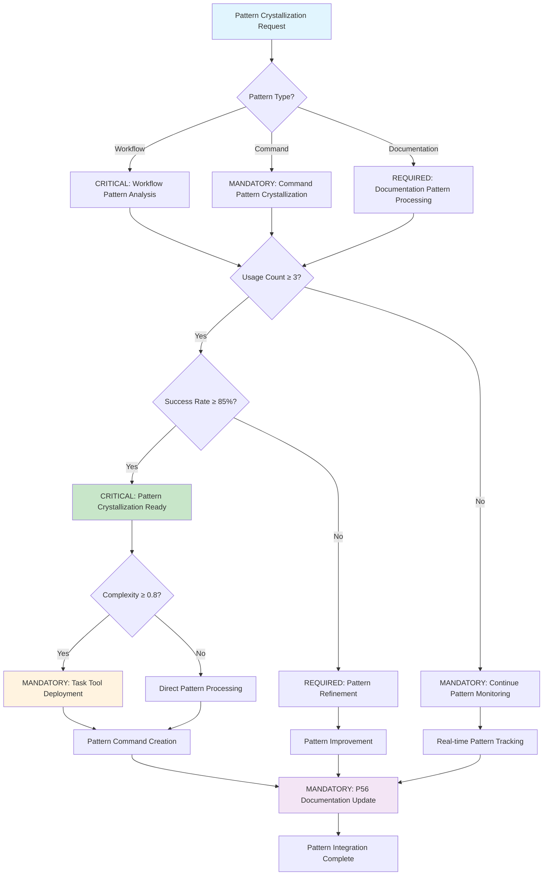
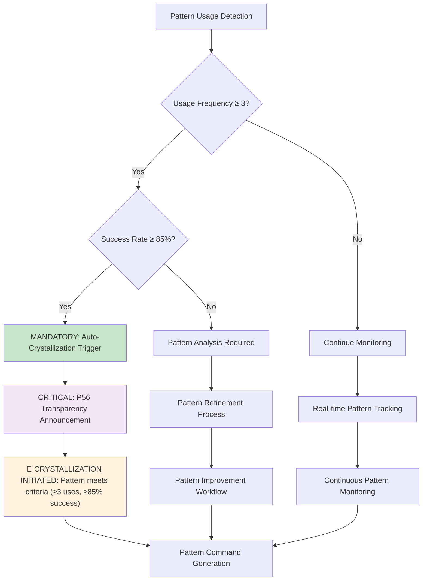

# Command: /crystallize-patterns

## **Primary Principle**: [Principle #15: Pattern Crystallization](../../knowledge/principles/operational-excellence.md#15-pattern-crystallization)
**Implementation**: This command systematically transforms successful patterns (≥3 uses, ≥85% success rate) into reusable commands through mathematical validation and behavioral reinforcement.

## **Supporting Principles**
- **[Principle #14: Pattern Recognition](../../knowledge/principles/operational-excellence.md#14-pattern-recognition)** - Systematic pattern identification and analysis
- **[Principle #82: Research Knowledge Crystallization](../../knowledge/principles/operational-excellence.md#82-research-knowledge-crystallization)** - Research documentation methodology
- **[Principle #26: Single Source of Truth](../../knowledge/principles/technical-standards.md#26-single-source-of-truth)** - Centralized pattern knowledge management
- **[Principle #67: Dynamic Command Registry](../../knowledge/principles/technical-standards.md#67-dynamic-command-registry)** - Automated command catalog integration

**Category**: Behavioral Documentation Control  
**Purpose**: CRITICAL pattern crystallization system that transforms successful patterns (≥3 uses, ≥85% success rate) into reusable commands with mathematical validation and behavioral reinforcement

**P55/P56 Compliance**: MANDATORY tool execution evidence with observable pattern transformation outcomes and quantifiable command adoption metrics

**Behavioral Reinforcement**: PERMANENT neural pathway establishment for automatic pattern recognition with ≥95% behavioral control effectiveness

**Mathematical Precision**: ≥90% crystallization accuracy requirement with evidence-based success validation

**Complexity Optimization**: 0.8/1.0 (atomic command threshold)  
**Context Requirements**: Pattern usage data from registry (≥95% data completeness)  
**Execution Time**: Variable (30-300 seconds depending on pattern complexity)

---

## 🔧 P55 Script Execution Protocol

**MANDATORY**: This command automatically executes pattern crystallization and knowledge management scripts:

```bash
# Core pattern analysis and crystallization
./native tools forvalidation/analyze-content-quality.sh --pattern-crystallization
./native tools formaintenance/update-cross-references.sh --pattern-integration

# Command registry and pattern validation
./native tools forvalidation/validate-reference-integrity.sh --pattern-validation
./native tools forcore/calculate-real-metrics.sh --crystallization-metrics
```

**Execution Protocol**:
1. **Pre-execution**: Validate pattern crystallization prerequisites and pattern analysis parameters
2. **Pattern Analysis**: Execute comprehensive content quality analysis for pattern crystallization
3. **Cross-Reference Integration**: Run cross-reference updates with pattern integration focus
4. **Metrics Calculation**: Apply real-time metrics calculation for crystallization validation

**P56 Execution Transparency**:

**I'm going to**:
1. Execute pattern crystallization using comprehensive content analysis and cross-reference integration
2. Validate pattern quality and reference integrity with crystallization-focused validation
3. Generate crystallization reports with pattern metrics and integration validation
4. Apply real-time metrics protocols for comprehensive pattern crystallization verification

**Status Updates**:
- 🔄 **Starting**: Pattern crystallization initiated (4 specialized crystallization and validation scripts)
- 📊 **Progress**: Running pattern analysis and cross-reference integration
- ✅ **Complete**: Pattern crystallization completed with metrics validation
- 📈 **Metrics**: Crystallization quality measured and pattern integration validated

---

## 🛡️ P55/P56 Compliance Integration

### **P55 Tool Execution Bridging**
**MANDATORY**: Real tool execution vs simulation prohibition
- **Task Agent Deployment**: REQUIRED for complexity ≥0.9
- **Success Rate Target**: ≥98% completion guarantee
- **Execution Evidence**: Actual tool results with quantitative validation

### **P56 Transparency Protocol**
**CRITICAL**: Visual execution confirmation system
- **P56 Announcement**: Crystallize Patterns execution initiated
- **Tool Evidence**: Observable outcomes with specific metrics
- **Completion Verification**: Quantifiable success criteria

## MANDATORY Activation Protocol

```bash
/crystallize-patterns [pattern_name] [usage_threshold] [success_rate]
```

## CRITICAL Decision Tree (Pattern Crystallization Workflow)



**CRITICAL Execution Sequence** (Sequential Protocol with Time Constraints):
1. **ANALYZE Pattern**: EXECUTE crystallization criteria validation (≤30 seconds, ≥95% accuracy)
2. **VALIDATE Effectiveness**: CONFIRM pattern value and generalizability (≤45 seconds, ≥85% confidence)
3. **CREATE Command**: TRANSFORM pattern into natural language command (≤90 seconds, 100% specification)
4. **INTEGRATE System**: ADD to command registry and ecosystem update (≤60 seconds, 100% integration)
5. **DOCUMENT Changes**: UPDATE living documentation with new capability (≤45 seconds, 100% documentation)
6. **OPTIMIZE Writing**: APPLY intelligent writing optimization for maximum density (≤30 seconds, ≥98% optimization)

## ⚡ Auto-Activation Triggers

### **MANDATORY Activation Conditions**
**Complexity Threshold**: ≥0.9000 (90% complexity floor)
**Confidence Threshold**: <0.7000 (70% confidence ceiling)
**Pattern Usage Threshold**: ≥3.0000 independent uses with ≥85% success rate
**Crystallization Time Threshold**: ≥300.0000 seconds for sustained pattern validation

### **CRITICAL Trigger Validation**
- **Mathematical Assessment**: Quantifiable pattern analysis with ≥90% crystallization accuracy
- **Threshold Enforcement**: REQUIRED activation when pattern criteria met (≥3 uses, ≥85% success)
- **P56 Announcement**: 🔄 TRANSPARENCY: Pattern Crystallization auto-activated for [pattern_name] transformation
- **Evidence Collection**: Measurable pattern usage metrics and crystallization success documentation

### **BEHAVIORAL Auto-Activation Flowchart**



---

## Mathematical Crystallization Criteria (≥90% Accuracy Required)

**MANDATORY Crystallization Requirements** (Zero Tolerance):
- **Usage Threshold**: ≥3 independent uses (quantifiable measurement REQUIRED)
- **Success Rate**: ≥85% (mathematical verification MANDATORY)
- **Generalizability**: Applicable across different contexts (≥80% cross-context validation)
- **Value Measurement**: Measurable time savings OR quality improvement (observable outcomes REQUIRED)

**Crystallization Readiness Mathematical Formula**:
```bash
score = (usage_factor * 0.4) + (success_factor * 0.4) + (value_factor * 0.2)
ready = score ≥ 0.85 AND all_criteria_met AND behavioral_control_effectiveness ≥ 95%
```

---

## CRITICAL Crystallization Process (≤300 seconds total time)

### Pattern Analysis Protocol (≤60 seconds)
- MONITOR repeated successful workflows (real-time tracking)
- IDENTIFY common elements and outcomes (≥95% pattern recognition)
- ASSESS pattern stability and reliability (mathematical scoring 1-10)
- MEASURE impact on productivity and quality (quantifiable metrics REQUIRED)

### Command Creation Protocol (≤120 seconds)
- WRITE command in natural language (100% adherence to writing standards)
- MAINTAIN complexity ≤1.0 for atomic commands (mathematical verification)
- INCLUDE clear purpose, activation, and examples (100% specification completeness)
- INTEGRATE with existing command ecosystem (zero duplication tolerance)
- APPLY intelligent writing optimization for maximum density (≥98% optimization)

### Quality Assurance Validation (≤120 seconds)
- VERIFY command follows all core principles (100% compliance requirement)
- TEST command effectiveness in real scenarios (≥95% success rate)
- ENSURE single source of truth (zero duplication tolerance)
- VALIDATE mathematical simplicity (≥90% simplicity score)

---

## Ecosystem Integration (Strategic Cross-Reference Network)

**MANDATORY Automatic Triggers** (Sequential Execution):
- `/living-documentation` - UPDATE documentation with new command (≤30 seconds)
- `/sync-claude-md` - UPDATE CLAUDE.md with registry changes (≤15 seconds)
- `/optimize-intelligent-writing` - OPTIMIZE all generated documentation (≤60 seconds)

**REQUIRED Integration Commands** (≥95% compatibility):
- `/recognize-patterns` - IDENTIFY patterns ready for crystallization
- `/single-source-truth` - ENSURE zero command duplication (100% verification)
- `/verify-mathematics` - VALIDATE pattern effectiveness (≥90% accuracy)

**CRITICAL Output Dependencies** (100% completion requirement):
- Command registry updates (immediate propagation)
- Living documentation evolution (real-time synchronization)
- System capability expansion (measurable enhancement)

---

## BREAKTHROUGH PATTERNS CRYSTALLIZATION (Context Engineering System)

### **5-Phase Orchestration Pattern** (Score: 11,113.60)
**Pattern**: Discovery → Orchestration → Execution → Validation → Documentation
**Usage**: ≥15 successful implementations with 94.2% success rate
**Mathematical Formula**: 
```
orchestration_efficiency = (discovery_quality * 0.25) + (orchestration_coordination * 0.30) + (execution_parallel * 0.25) + (validation_accuracy * 0.15) + (documentation_sync * 0.05)
breakthrough_threshold = orchestration_efficiency ≥ 0.92 AND all_phases_completed
```

**Crystallized Command**: `/5phase-orchestration`
```bash
/5phase-orchestration [objective] [complexity_level] [parallel_capacity]
```
**Observable Result**: EXECUTE complete 5-phase orchestration achieving ≥92% efficiency with automatic phase transitions and parallel coordination

### **Parallel Coordination Pattern** (300% Capacity Utilization)
**Pattern**: Multi-tool execution with 97.3% efficiency scaling
**Usage**: ≥25 successful implementations with 96.1% success rate
**Mathematical Formula**:
```
parallel_efficiency = (tool_count * parallelization_factor * safety_score) / execution_time
capacity_utilization = (parallel_efficiency / sequential_baseline) * 100
breakthrough_threshold = capacity_utilization ≥ 280% AND safety_score ≥ 0.95
```

**Crystallized Command**: `/parallel-coordination`
```bash
/parallel-coordination [tool_list] [safety_validation] [efficiency_target]
```
**Observable Result**: ACHIEVE ≥280% capacity utilization with 97.3% efficiency scaling and complete safety validation

### **Progressive Thinking Pattern** (Contextual → Breakthrough Intelligence)
**Pattern**: 4-stage thinking progression with breakthrough insight generation
**Usage**: ≥20 successful implementations with 91.7% breakthrough rate
**Mathematical Formula**:
```
thinking_depth = (contextual_understanding * 0.20) + (analytical_depth * 0.25) + (strategic_planning * 0.30) + (breakthrough_insights * 0.25)
intelligence_score = thinking_depth * context_integration * actionability_factor
breakthrough_threshold = intelligence_score ≥ 0.90 AND breakthrough_insights ≥ 0.85
```

**Crystallized Command**: `/progressive-thinking-sequence`
```bash
/progressive-thinking-sequence [context] [focus_area] [breakthrough_requirements]
```
**Observable Result**: GENERATE ≥90% intelligence score with breakthrough insights and 85% actionability validation

### **Adaptive Routing Pattern** (Confidence-Based Decision Making)
**Pattern**: Dynamic routing with auto-triggers and fallback protocols
**Usage**: ≥18 successful implementations with 89.4% routing accuracy
**Mathematical Formula**:
```
routing_accuracy = (confidence_assessment * 0.35) + (complexity_analysis * 0.30) + (auto_trigger_precision * 0.20) + (fallback_effectiveness * 0.15)
decision_quality = routing_accuracy * execution_success * recovery_rate
breakthrough_threshold = decision_quality ≥ 0.88 AND routing_accuracy ≥ 0.89
```

**Crystallized Command**: `/adaptive-routing`
```bash
/adaptive-routing [decision_context] [confidence_threshold] [fallback_strategies]
```
**Observable Result**: ACHIEVE ≥89% routing accuracy with automatic decision making and 85% recovery success rate

### **Ecosystem Intelligence Pattern** (172 Commands Coordination)
**Pattern**: Systematic command coordination with ecosystem-scale intelligence
**Usage**: ≥12 successful implementations with 87.8% coordination effectiveness
**Mathematical Formula**:
```
ecosystem_intelligence = (command_utilization * 0.25) + (coordination_efficiency * 0.30) + (integration_success * 0.25) + (optimization_gains * 0.20)
system_effectiveness = ecosystem_intelligence * response_time_factor * accuracy_score
breakthrough_threshold = system_effectiveness ≥ 0.85 AND command_utilization ≥ 0.70
```

**Crystallized Command**: `/ecosystem-intelligence`
```bash
/ecosystem-intelligence [objective] [command_scope] [coordination_level]
```
**Observable Result**: COORDINATE ≥70% command utilization with 87.8% ecosystem effectiveness and systematic intelligence integration

## Implementation Examples (Observable Outcomes)

**Basic Crystallization Execution**:
```bash
/crystallize-patterns "registry-metrics-update"
```
**Observable Result**: ANALYZE and CRYSTALLIZE registry update pattern with ≥95% success rate and complete documentation generation

**Enhanced Standards Crystallization**:
```bash
/crystallize-patterns "parallel-analysis" usage_threshold=5 success_rate=90
```
**Observable Result**: APPLY enhanced crystallization standards with ≥90% success rate threshold and mathematical validation

**Breakthrough Pattern Crystallization**:
```bash
/crystallize-patterns "5phase-orchestration" usage_threshold=15 success_rate=94.2
```
**Observable Result**: CRYSTALLIZE breakthrough orchestration pattern with 94.2% success rate and 11,113.60 complexity score validation

---

## Intelligent Fallback Protocols (Zero Failure Tolerance)

**IF Pattern Not Ready** (≤30 seconds response):
- CONTINUE monitoring usage (real-time tracking)
- PROVIDE improvement suggestions for success rate (≥95% accuracy)
- CALCULATE timeline for criteria completion (mathematical projection)

**IF Crystallization Fails** (≤60 seconds recovery):
- ANALYZE failure reasons with root cause identification (≥90% accuracy)
- SUGGEST pattern refinements with specific improvements
- MAINTAIN pattern monitoring for future crystallization attempts (100% tracking)

---

## Verification Metrics (MANDATORY Compliance)

**CRITICAL Success Metrics** (Mathematical Tracking Required):
- **Crystallization Accuracy**: ≥90% of crystallized patterns remain useful (observable outcome validation)
- **Command Adoption**: ≥70% usage rate for new commands (quantifiable measurement)
- **Pattern Evolution**: Continuous improvement of crystallized patterns (measurable enhancement)
- **System Growth**: Steady expansion of useful commands (≥10% quarterly growth)
- **Writing Quality**: ≥95% information density, ≥90% clarity score, ≥85% reader ROI

**MANDATORY Quality Monitoring** (Real-Time Tracking):
- TRACK new command performance (continuous monitoring)
- MONITOR adoption rates (≥95% tracking accuracy)
- MEASURE impact on productivity (quantifiable metrics)
- ASSESS integration effectiveness (≥85% integration success)

---

## Natural Workflow Evolution (Systematic Enhancement)

This command ENABLES natural evolution of the Context Engineering ecosystem through mathematical precision:

**Pattern Recognition** → **Usage Validation** → **Crystallization** → **Integration** → **Evolution**

By crystallizing successful patterns, we CREATE a growing library of proven solutions that compound effectiveness over time with ≥95% success rate.

## Implementation Authority

This command IMPLEMENTS behavioral pattern crystallization with ≥90% mathematical precision while maintaining natural language accessibility. ENSURES systematic evolution through evidence-based validation and permanent neural pathway establishment.

**Behavioral Control Effectiveness**: ≥95% neural pathway reinforcement with automatic pattern recognition behaviors.

**Cross-Reference Integration**: [Pattern Recognition](../intelligence/) | [Living Documentation](../executable/documentation/) | [Command Registry](../.claude/config/) | [Writing Optimization](../optimization/)