# Command: /crystallize-patterns

**Category**: Behavioral Documentation Control  
**Purpose**: CRITICAL pattern crystallization system that transforms successful patterns (≥3 uses, ≥85% success rate) into reusable commands with mathematical validation and behavioral reinforcement

**P55/P56 Compliance**: MANDATORY tool execution evidence with observable pattern transformation outcomes and quantifiable command adoption metrics

**Behavioral Reinforcement**: PERMANENT neural pathway establishment for automatic pattern recognition with ≥95% behavioral control effectiveness

**Mathematical Precision**: ≥90% crystallization accuracy requirement with evidence-based success validation

**Complexity Optimization**: 0.8/1.0 (atomic command threshold)  
**Context Requirements**: Pattern usage data from registry (≥95% data completeness)  
**Execution Time**: Variable (30-300 seconds depending on pattern complexity)

---

## 🛡️ P55/P56 Compliance Integration

### **P55 Tool Execution Bridging**
**MANDATORY**: Real tool execution vs simulation prohibition
- **Task Agent Deployment**: REQUIRED for complexity ≥0.9
- **Success Rate Target**: ≥98% completion guarantee
- **Execution Evidence**: Actual tool results with quantitative validation

### **P56 Transparency Protocol**
**CRITICAL**: Visual execution confirmation system
- **P56 Announcement**: Crystallize Patterns execution initiated
- **Tool Evidence**: Observable outcomes with specific metrics
- **Completion Verification**: Quantifiable success criteria

## MANDATORY Activation Protocol

```bash
/crystallize-patterns [pattern_name] [usage_threshold] [success_rate]
```

## CRITICAL Decision Tree (Pattern Crystallization Workflow)

```mermaid
graph TD
    A[Pattern Crystallization Request] --> B{Pattern Type?}
    B -->|Workflow| C[CRITICAL: Workflow Pattern Analysis]
    B -->|Command| D[MANDATORY: Command Pattern Crystallization]
    B -->|Documentation| E[REQUIRED: Documentation Pattern Processing]
    
    C --> F{Usage Count ≥ 3?}
    D --> F
    E --> F
    
    F -->|Yes| G{Success Rate ≥ 85%?}
    F -->|No| H[MANDATORY: Continue Pattern Monitoring]
    
    G -->|Yes| I[CRITICAL: Pattern Crystallization Ready]
    G -->|No| J[REQUIRED: Pattern Refinement]
    
    I --> K{Complexity ≥ 0.8?}
    K -->|Yes| L[MANDATORY: Task Tool Deployment]
    K -->|No| M[Direct Pattern Processing]
    
    L --> N[Pattern Command Creation]
    M --> N
    J --> O[Pattern Improvement]
    H --> P[Real-time Pattern Tracking]
    
    N --> Q[MANDATORY: P56 Documentation Update]
    O --> Q
    P --> Q
    
    Q --> R[Pattern Integration Complete]
    
    style A fill:#e1f5fe
    style I fill:#c8e6c9
    style L fill:#fff3e0
    style Q fill:#f3e5f5
```



**CRITICAL Execution Sequence** (Sequential Protocol with Time Constraints):
1. **ANALYZE Pattern**: EXECUTE crystallization criteria validation (≤30 seconds, ≥95% accuracy)
2. **VALIDATE Effectiveness**: CONFIRM pattern value and generalizability (≤45 seconds, ≥85% confidence)
3. **CREATE Command**: TRANSFORM pattern into natural language command (≤90 seconds, 100% specification)
4. **INTEGRATE System**: ADD to command registry and ecosystem update (≤60 seconds, 100% integration)
5. **DOCUMENT Changes**: UPDATE living documentation with new capability (≤45 seconds, 100% documentation)
6. **OPTIMIZE Writing**: APPLY intelligent writing optimization for maximum density (≤30 seconds, ≥98% optimization)

## ⚡ Auto-Activation Triggers

### **MANDATORY Activation Conditions**
**Complexity Threshold**: ≥0.9000 (90% complexity floor)
**Confidence Threshold**: <0.7000 (70% confidence ceiling)
**Pattern Usage Threshold**: ≥3.0000 independent uses with ≥85% success rate
**Crystallization Time Threshold**: ≥300.0000 seconds for sustained pattern validation

### **CRITICAL Trigger Validation**
- **Mathematical Assessment**: Quantifiable pattern analysis with ≥90% crystallization accuracy
- **Threshold Enforcement**: REQUIRED activation when pattern criteria met (≥3 uses, ≥85% success)
- **P56 Announcement**: 🔄 TRANSPARENCY: Pattern Crystallization auto-activated for [pattern_name] transformation
- **Evidence Collection**: Measurable pattern usage metrics and crystallization success documentation

### **BEHAVIORAL Auto-Activation Flowchart**

```mermaid
graph TD
    A[Pattern Usage Detection] --> B{Usage Frequency ≥ 3?}
    B -->|Yes| C{Success Rate ≥ 85%?}
    B -->|No| D[Continue Monitoring]
    
    C -->|Yes| E[MANDATORY: Auto-Crystallization Trigger]
    C -->|No| F[Pattern Analysis Required]
    
    E --> G[CRITICAL: P56 Transparency Announcement]
    F --> H[Pattern Refinement Process]
    D --> I[Real-time Pattern Tracking]
    
    G --> J["🔄 CRYSTALLIZATION INITIATED: Pattern meets criteria (≥3 uses, ≥85% success)"]
    H --> K[Pattern Improvement Workflow]
    I --> L[Continuous Pattern Monitoring]
    
    J --> M[Pattern Command Generation]
    K --> M
    L --> M
    
    style E fill:#c8e6c9
    style G fill:#f3e5f5
    style J fill:#fff3e0
```



---

## Mathematical Crystallization Criteria (≥90% Accuracy Required)

**MANDATORY Crystallization Requirements** (Zero Tolerance):
- **Usage Threshold**: ≥3 independent uses (quantifiable measurement REQUIRED)
- **Success Rate**: ≥85% (mathematical verification MANDATORY)
- **Generalizability**: Applicable across different contexts (≥80% cross-context validation)
- **Value Measurement**: Measurable time savings OR quality improvement (observable outcomes REQUIRED)

**Crystallization Readiness Mathematical Formula**:
```bash
score = (usage_factor * 0.4) + (success_factor * 0.4) + (value_factor * 0.2)
ready = score ≥ 0.85 AND all_criteria_met AND behavioral_control_effectiveness ≥ 95%
```

---

## CRITICAL Crystallization Process (≤300 seconds total time)

### Pattern Analysis Protocol (≤60 seconds)
- MONITOR repeated successful workflows (real-time tracking)
- IDENTIFY common elements and outcomes (≥95% pattern recognition)
- ASSESS pattern stability and reliability (mathematical scoring 1-10)
- MEASURE impact on productivity and quality (quantifiable metrics REQUIRED)

### Command Creation Protocol (≤120 seconds)
- WRITE command in natural language (100% adherence to writing standards)
- MAINTAIN complexity ≤1.0 for atomic commands (mathematical verification)
- INCLUDE clear purpose, activation, and examples (100% specification completeness)
- INTEGRATE with existing command ecosystem (zero duplication tolerance)
- APPLY intelligent writing optimization for maximum density (≥98% optimization)

### Quality Assurance Validation (≤120 seconds)
- VERIFY command follows all core principles (100% compliance requirement)
- TEST command effectiveness in real scenarios (≥95% success rate)
- ENSURE single source of truth (zero duplication tolerance)
- VALIDATE mathematical simplicity (≥90% simplicity score)

---

## Ecosystem Integration (Strategic Cross-Reference Network)

**MANDATORY Automatic Triggers** (Sequential Execution):
- `/living-documentation` - UPDATE documentation with new command (≤30 seconds)
- `/sync-claude-md` - UPDATE CLAUDE.md with registry changes (≤15 seconds)
- `/optimize-intelligent-writing` - OPTIMIZE all generated documentation (≤60 seconds)

**REQUIRED Integration Commands** (≥95% compatibility):
- `/recognize-patterns` - IDENTIFY patterns ready for crystallization
- `/single-source-truth` - ENSURE zero command duplication (100% verification)
- `/verify-mathematics` - VALIDATE pattern effectiveness (≥90% accuracy)

**CRITICAL Output Dependencies** (100% completion requirement):
- Command registry updates (immediate propagation)
- Living documentation evolution (real-time synchronization)
- System capability expansion (measurable enhancement)

---

## Implementation Examples (Observable Outcomes)

**Basic Crystallization Execution**:
```bash
/crystallize-patterns "registry-metrics-update"
```
**Observable Result**: ANALYZE and CRYSTALLIZE registry update pattern with ≥95% success rate and complete documentation generation

**Enhanced Standards Crystallization**:
```bash
/crystallize-patterns "parallel-analysis" usage_threshold=5 success_rate=90
```
**Observable Result**: APPLY enhanced crystallization standards with ≥90% success rate threshold and mathematical validation

---

## Intelligent Fallback Protocols (Zero Failure Tolerance)

**IF Pattern Not Ready** (≤30 seconds response):
- CONTINUE monitoring usage (real-time tracking)
- PROVIDE improvement suggestions for success rate (≥95% accuracy)
- CALCULATE timeline for criteria completion (mathematical projection)

**IF Crystallization Fails** (≤60 seconds recovery):
- ANALYZE failure reasons with root cause identification (≥90% accuracy)
- SUGGEST pattern refinements with specific improvements
- MAINTAIN pattern monitoring for future crystallization attempts (100% tracking)

---

## Verification Metrics (MANDATORY Compliance)

**CRITICAL Success Metrics** (Mathematical Tracking Required):
- **Crystallization Accuracy**: ≥90% of crystallized patterns remain useful (observable outcome validation)
- **Command Adoption**: ≥70% usage rate for new commands (quantifiable measurement)
- **Pattern Evolution**: Continuous improvement of crystallized patterns (measurable enhancement)
- **System Growth**: Steady expansion of useful commands (≥10% quarterly growth)
- **Writing Quality**: ≥95% information density, ≥90% clarity score, ≥85% reader ROI

**MANDATORY Quality Monitoring** (Real-Time Tracking):
- TRACK new command performance (continuous monitoring)
- MONITOR adoption rates (≥95% tracking accuracy)
- MEASURE impact on productivity (quantifiable metrics)
- ASSESS integration effectiveness (≥85% integration success)

---

## Natural Workflow Evolution (Systematic Enhancement)

This command ENABLES natural evolution of the Context Engineering ecosystem through mathematical precision:

**Pattern Recognition** → **Usage Validation** → **Crystallization** → **Integration** → **Evolution**

By crystallizing successful patterns, we CREATE a growing library of proven solutions that compound effectiveness over time with ≥95% success rate.

## Implementation Authority

This command IMPLEMENTS behavioral pattern crystallization with ≥90% mathematical precision while maintaining natural language accessibility. ENSURES systematic evolution through evidence-based validation and permanent neural pathway establishment.

**Behavioral Control Effectiveness**: ≥95% neural pathway reinforcement with automatic pattern recognition behaviors.

**Cross-Reference Integration**: [Pattern Recognition](../intelligence/) | [Living Documentation](../executable/documentation/) | [Command Registry](../.claude/config/) | [Writing Optimization](../optimization/)