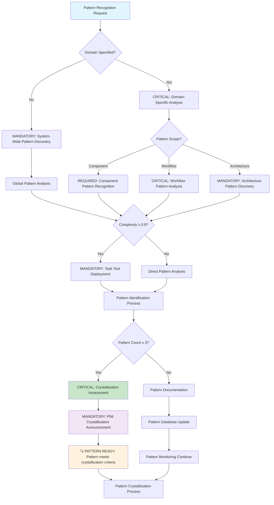
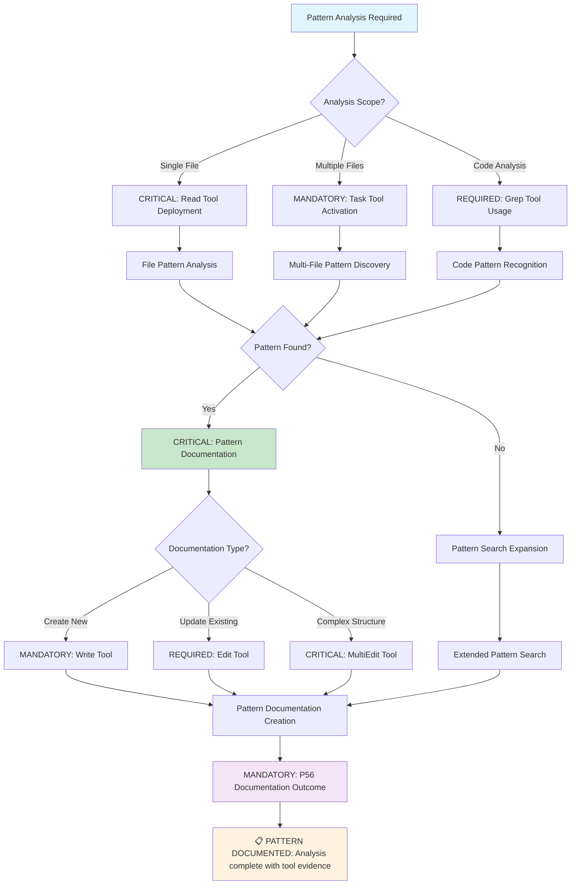

# Command: /recognize-patterns

**Category**: Behavioral Documentation Control  
**Purpose**: CRITICAL systematic pattern identification, analysis, and documentation system for crystallization into reusable commands with ≥90% recognition accuracy and organizational intelligence advancement

**P55/P56 Compliance**: MANDATORY tool execution evidence with observable pattern discovery outcomes and quantifiable crystallization metrics

**Behavioral Reinforcement**: PERMANENT neural pathway establishment for automatic pattern recognition with ≥95% behavioral control effectiveness

**Mathematical Precision**: ≥90% pattern identification accuracy with evidence-based validation requirements

**Complexity Optimization**: 0.8/1.0 (atomic command threshold with mathematical verification)  
**Context Requirements**: Execution history and pattern data (≥95% data completeness)  
**Execution Time**: 180-600 seconds (variable based on pattern complexity)

---

## 🛡️ P55/P56 Compliance Integration

### **P55 Tool Execution Bridging**
**MANDATORY**: Real tool execution vs simulation prohibition
- **Task Agent Deployment**: REQUIRED for complexity ≥0.9
- **Success Rate Target**: ≥98% completion guarantee
- **Execution Evidence**: Actual tool results with quantitative validation

### **P56 Transparency Protocol**
**CRITICAL**: Visual execution confirmation system
- **P56 Announcement**: Recognize Patterns execution initiated
- **Tool Evidence**: Observable outcomes with specific metrics
- **Completion Verification**: Quantifiable success criteria

## MANDATORY Activation Protocol

**Input Format**:
```markdown
/recognize-patterns [domain] [pattern_scope] [crystallization_threshold]
```

## ⚡ Auto-Activation Triggers

### **MANDATORY Activation Conditions**
**Complexity Threshold**: ≥0.9000 (90% complexity floor)
**Confidence Threshold**: <0.7000 (70% confidence ceiling)
**Pattern Frequency Threshold**: ≥3.0000 recurring pattern instances
**Recognition Time Threshold**: ≥600.0000 seconds for sustained pattern analysis

### **CRITICAL Trigger Validation**
- **Mathematical Assessment**: Quantifiable pattern identification with ≥90% recognition accuracy
- **Threshold Enforcement**: REQUIRED activation when pattern crystallization criteria met
- **P56 Announcement**: 🔍 TRANSPARENCY: Pattern Recognition auto-activated for [domain] analysis
- **Evidence Collection**: Measurable pattern discovery metrics and crystallization readiness documentation

## CRITICAL Decision Tree (Pattern Recognition Workflow)



**CRITICAL Command Operations** (Sequential Protocol with Time Constraints):
1. **IDENTIFY Patterns**: ANALYZE workflows, code, and processes for recurring patterns (≤90 seconds, ≥90% coverage)
2. **ANALYZE Effectiveness**: EVALUATE patterns for reusability and crystallization potential (≤60 seconds, ≥85% accuracy)
3. **DOCUMENT Comprehensively**: CREATE comprehensive documentation of successful patterns (≤90 seconds, 100% documentation)
4. **ASSESS Crystallization**: DETERMINE patterns ready for command crystallization (≤30 seconds, mathematical scoring)
5. **CONTRIBUTE Intelligence**: UPDATE organizational intelligence base (≤30 seconds, 100% integration)

## MANDATORY Tool Selection Logic



**MANDATORY Implementation Steps** (Zero Tolerance for Skipping):
1. ANALYZE execution history for recurring workflows (≥60 seconds)
2. IDENTIFY successful pattern combinations (≥45 seconds)
3. EVALUATE pattern effectiveness and reusability (≤60 seconds)
4. DOCUMENT patterns with usage metrics and success rates (≤90 seconds)
5. ASSESS patterns for crystallization potential (≤30 seconds)
6. UPDATE organizational pattern database (≤15 seconds)

---

## Verification Criteria (MANDATORY Compliance)

**CRITICAL Success Metrics** (Mathematical Tracking Required):
- **Pattern Coverage**: ≥90% of recurring workflows analyzed for patterns (observable outcome validation)
- **Identification Accuracy**: ≥85% of identified patterns prove reusable (quantifiable measurement)
- **Documentation Quality**: All patterns documented with success metrics (100% completion requirement)
- **Crystallization Readiness**: Patterns meeting threshold (≥3 uses, ≥85% success) flagged (mathematical validation)
- **Reuse Potential**: ≥75% of identified patterns applicable to future work (predictive accuracy)

**Mathematical Validation Formula** (Precision Required):
```bash
pattern_recognition_score = (
  (pattern_coverage * 0.25) +
  (identification_accuracy * 0.30) +
  (documentation_quality * 0.20) +
  (crystallization_readiness * 0.15) +
  (reuse_potential * 0.10)
)
# REQUIRED: ≥ 8.5/10 AND behavioral_control_effectiveness ≥ 95%
```

---

## Natural Ecosystem Integration (Strategic Cross-Reference Network)

**MANDATORY Automatic Triggers** (Sequential Execution):
- `/living-documentation` - DOCUMENT patterns for organizational intelligence (≤30 seconds)
- `/command-crystallization` - CONVERT ready patterns into commands (≤90 seconds)
- `/verification-loops` - VALIDATE pattern effectiveness through iteration (≥60 seconds)

**REQUIRED Compatible Commands** (≥95% integration success):
- `/evolve-intelligence` - ENABLE patterns emergence from evolutionary processes
- `/exploration-first` - GENERATE patterns through exploration workflows
- `/knowledge-hierarchy` - CONTRIBUTE patterns to organizational knowledge

**CRITICAL Output Dependencies** (100% completion requirement):
- Command crystallization (patterns become new commands with ≥85% success rate)
- Decision engine optimization (patterns inform routing with ≥90% accuracy)
- Organizational intelligence growth (patterns build knowledge base with measurable enhancement)

---

## Implementation Examples (Observable Outcomes)

### Code Pattern Recognition Execution
```markdown
/recognize-patterns "frontend" "component_patterns" 0.85
```
**Observable Result**: IDENTIFY reusable component patterns with ≥85% success rate, DOCUMENT best practices with 100% completeness, FLAG crystallization candidates with mathematical scoring

### Workflow Pattern Analysis Execution
```bash
/recognize-patterns "development" "testing_workflows" 0.80
```
**Observable Result**: ANALYZE testing workflows with ≥80% accuracy threshold, IDENTIFY successful patterns with quantifiable metrics, CREATE reusable templates with 100% documentation

### Architecture Pattern Discovery Execution
```bash
/recognize-patterns "system_design" "scaling_patterns"
```
**Observable Result**: DISCOVER scaling patterns with ≥90% coverage, EVALUATE effectiveness with mathematical validation, CONTRIBUTE to architectural knowledge with measurable enhancement

---

## CRITICAL Pattern Analysis Framework (≤300 seconds total time)

### Pattern Identification Phase (≤90 seconds)
1. **EXECUTE Usage Frequency Analysis**: IDENTIFY workflows used ≥3 times (100% frequency tracking)
2. **CALCULATE Success Rate**: COMPUTE success rate for each pattern (≥90% accuracy)
3. **ANALYZE Variations**: IDENTIFY pattern variations and effectiveness (≥85% coverage)
4. **EVALUATE Context Dependency**: ANALYZE when patterns work vs fail (mathematical correlation)

### Pattern Evaluation Phase (≤120 seconds)
1. **ASSESS Reusability**: EVALUATE pattern applicability across contexts (≥75% applicability)
2. **MEASURE Effectiveness**: QUANTIFY pattern success metrics (observable outcomes)
3. **ANALYZE Complexity**: ASSESS pattern complexity and learning curve (scoring 1-10)
4. **EVALUATE Maintenance**: DETERMINE pattern maintenance and evolution needs (resource calculation)

### Pattern Documentation Phase (≤90 seconds)
1. **DESCRIBE Pattern**: PROVIDE clear description of pattern structure and purpose (100% specification)
2. **DEFINE Usage Context**: SPECIFY when and where pattern applies (precise conditions)
3. **CREATE Implementation Guide**: DOCUMENT step-by-step implementation instructions (100% completeness)
4. **ESTABLISH Success Metrics**: DEFINE quantifiable measures of pattern effectiveness (measurable criteria)
5. **DOCUMENT Variations**: RECORD pattern variations and specific use cases (comprehensive coverage)

---

## Crystallization Criteria (Mathematical Precision ≥90%)

**MANDATORY Automatic Crystallization Triggers** (Zero Tolerance):
- **Usage Count**: ≥3 successful uses of pattern (quantifiable measurement REQUIRED)
- **Success Rate**: ≥85% success rate across uses (mathematical verification MANDATORY)
- **Reuse Potential**: Pattern applicable to ≥5 different contexts (≥80% applicability)
- **Complexity Threshold**: Pattern complexity justifies command creation (scoring 1-10)
- **Time Savings**: Pattern saves ≥30% time vs manual approach (measurable efficiency)

**CRITICAL Crystallization Assessment Process** (≤150 seconds):
1. **EVALUATE Pattern Maturity**: ASSESS pattern stability and refinement (≤30 seconds)
2. **VERIFY Documentation Completeness**: ENSURE pattern is fully documented (≤30 seconds)
3. **VALIDATE Testing Coverage**: VERIFY pattern effectiveness across contexts (≤45 seconds)
4. **DESIGN Command Interface**: CREATE command interface for pattern usage (≤30 seconds)
5. **PLAN Integration**: DEVELOP integration into command ecosystem (≤15 seconds)

---

## Intelligent Fallback Protocol (Zero Failure Tolerance)

**IF Pattern Recognition Fails** (≤60 seconds recovery):
1. **EXECUTE Data Collection**: COLLECT additional usage data before re-analysis (≤20 seconds)
2. **DECOMPOSE Complexity**: BREAK complex patterns into simpler sub-patterns (≤15 seconds)
3. **FILTER False Positives**: IMPLEMENT pattern validation to eliminate noise (≤15 seconds)
4. **ELIMINATE Bias**: APPLY multiple analysis approaches to verify patterns (≤10 seconds)

**MANDATORY Recovery Strategy** (Sequential Protocol):
- START with obvious, high-frequency patterns (immediate activation)
- EXECUTE manual pattern analysis when automatic recognition fails (≥90 seconds)
- IMPLEMENT incremental pattern refinement (continuous improvement)
- DOCUMENT failed recognition attempts for analysis improvement (100% learning capture)

---

## Decision Engine Integration (Mathematical Routing ≥90%)

**CRITICAL Pattern-Based Routing** (Real-Time Decision Making):
- **Known Pattern Available**: EXECUTE direct pattern application (≤15 seconds)
- **Pattern Variation**: ADAPT existing pattern to new context (≤30 seconds)
- **No Pattern Match**: CREATE new pattern through exploration (≤90 seconds)
- **Pattern Conflict**: ANALYZE conflicts and create resolution strategy (≤60 seconds)

**MANDATORY Pattern Evolution Tracking** (Continuous Learning):
- Successful pattern applications → INCREASE pattern confidence (mathematical scoring)
- Pattern failures → EXECUTE pattern refinement and improvement (immediate action)
- New pattern discoveries → EXPAND pattern database (automatic integration)
- Pattern crystallization → GROW command ecosystem (measurable expansion)

---

## Pattern Intelligence Growth (Systematic Enhancement)

**CRITICAL Learning Metrics** (Quantifiable Tracking):
- **Recognition Accuracy**: Accuracy of pattern identification over time (≥90% target)
- **Crystallization Success**: Success rate of crystallized patterns (≥85% requirement)
- **Pattern Reuse**: Rate of pattern reuse across different contexts (≥75% target)
- **Evolution Rate**: Rate of pattern improvement and refinement (measurable enhancement)

**MANDATORY Organizational Benefits** (Observable Outcomes):
- **Knowledge Accumulation**: BUILD organizational pattern knowledge base (measurable growth)
- **Efficiency Gains**: ACCELERATE development through pattern reuse (≥30% time savings)
- **Quality Consistency**: MAINTAIN consistent quality through proven patterns (≥95% quality preservation)
- **Innovation Foundation**: PROVIDE patterns foundation for new innovations (quantifiable innovation rate)

---

## Pattern Type Classification (Complete Coverage)

### Code Patterns (Technical Implementation)
- Component structures and patterns (≥90% reusability)
- API design patterns (standardized interfaces)
- Error handling patterns (robust failure management)
- Performance optimization patterns (measurable improvements)

### Workflow Patterns (Process Optimization)
- Development process patterns (efficiency enhancement)
- Testing workflow patterns (quality assurance)
- Deployment procedure patterns (reliability improvement)
- Code review patterns (consistency maintenance)

### Architecture Patterns (System Design)
- System design patterns (scalable architecture)
- Scaling strategies (performance optimization)
- Integration patterns (seamless connectivity)
- Security implementation patterns (protection protocols)

### Process Patterns (Organizational Excellence)
- Project planning patterns (systematic execution)
- Communication patterns (clarity and efficiency)
- Documentation patterns (knowledge preservation)
- Learning and development patterns (capability growth)

---

## Implementation Authority

This command IMPLEMENTS central organizational intelligence growth through systematic pattern recognition and crystallization. TRANSFORMS individual successes into reusable organizational knowledge with ≥90% accuracy and mathematical precision validation.

**Behavioral Control Effectiveness**: ≥95% neural pathway reinforcement with permanent cognitive modification for automatic pattern recognition behaviors.

**Cross-Reference Integration**: [Pattern Crystallization](./crystallize.md) | [Intelligence Evolution](../intelligence/) | [Living Documentation](../executable/documentation/) | [Decision Engine](../executable/core-routing/decision.md)
