# Command: /planning-documentation

**Category**: Behavioral Documentation Control  
**Purpose**: CRITICAL comprehensive documentation system for all planning branches, decision points, and execution paths with complete traceability and strategic rollback capabilities (≥95% traceability accuracy)

**P55/P56 Compliance**: MANDATORY tool execution evidence with observable planning documentation outcomes and quantifiable rollback success metrics

**Behavioral Reinforcement**: PERMANENT neural pathway establishment for automatic planning documentation with ≥95% behavioral control effectiveness

**Mathematical Precision**: ≥95% decision traceability with evidence-based rollback validation requirements

**Complexity Optimization**: 0.9/1.0 (near-maximum atomic command complexity with mathematical verification)  
**Context Requirements**: Planning decisions, execution paths, and outcomes (≥95% data completeness)  
**Execution Time**: Continuous integration (real-time throughout planning and execution)

---

## 🛡️ P55/P56 Compliance Integration

### **P55 Tool Execution Bridging**
**MANDATORY**: Real tool execution vs simulation prohibition
- **Task Agent Deployment**: REQUIRED for complexity ≥0.9
- **Success Rate Target**: ≥98% completion guarantee
- **Execution Evidence**: Actual tool results with quantitative validation

### **P56 Transparency Protocol**
**CRITICAL**: Visual execution confirmation system
- **P56 Announcement**: Planning Documentation execution initiated
- **Tool Evidence**: Observable outcomes with specific metrics
- **Completion Verification**: Quantifiable success criteria

## MANDATORY Activation Protocol

**Input Format**:
```bash
/planning-documentation [action] [branch_name] [commit_message]
```

## ⚡ Auto-Activation Triggers

### **MANDATORY Activation Conditions**
**Complexity Threshold**: ≥0.9000 (90% complexity floor)
**Confidence Threshold**: <0.7000 (70% confidence ceiling)
**Planning Depth Threshold**: ≥3.0000 decision branching levels
**Documentation Time Threshold**: Continuous (real-time throughout planning cycles)

### **CRITICAL Trigger Validation**
- **Mathematical Assessment**: Quantifiable planning traceability with ≥95% decision documentation accuracy
- **Threshold Enforcement**: REQUIRED activation when planning complexity exceeds threshold
- **P56 Announcement**: 📋 TRANSPARENCY: Planning Documentation auto-activated for [planning_phase] traceability
- **Evidence Collection**: Measurable decision point metrics and rollback capability validation

## CRITICAL Decision Tree (Planning Documentation Workflow)

```mermaid
graph TD
    A[Planning Documentation Request] --> B{Action Type?}
    B -->|init| C[CRITICAL: Planning Tree Initialization]
    B -->|branch| D[MANDATORY: Planning Branch Creation]
    B -->|decision| E[REQUIRED: Decision Point Documentation]
    B -->|commit| F[CRITICAL: Strategic Commit Creation]
    B -->|visualize| G[MANDATORY: Planning Tree Visualization]
    B -->|rollback| H[REQUIRED: Decision Point Rollback]
    
    C --> I[Planning Tree Structure Setup]
    D --> J[New Planning Branch]
    E --> K{Decision Complexity ≥ 0.8?}
    F --> L[Strategic Git Commit]
    G --> M[Visual Tree Generation]
    H --> N[Rollback Execution]
    
    K -->|Yes| O[MANDATORY: Task Tool Deployment]
    K -->|No| P[Direct Decision Documentation]
    
    I --> Q[CRITICAL: P56 Planning Announcement]
    J --> Q
    L --> Q
    M --> Q
    N --> Q
    O --> Q
    P --> Q
    
    Q --> R{Documentation Type?}
    R -->|Decision Tree| S[MANDATORY: Write Tool]
    R -->|Update Existing| T[REQUIRED: Edit Tool]
    R -->|Complex Planning| U[CRITICAL: MultiEdit Tool]
    
    S --> V[Planning Documentation Creation]
    T --> V
    U --> V
    
    V --> W[MANDATORY: P56 Documentation Outcome]
    W --> X["🌳 PLANNING DOCUMENTED: Decision tree with rollback capability"]
    
    style A fill:#e1f5fe
    style Q fill:#f3e5f5
    style W fill:#c8e6c9
    style X fill:#fff3e0
```



**CRITICAL Actions** (Sequential Protocol with Time Constraints):
- `init` - INITIALIZE planning tree for new objective (≤30 seconds)
- `branch` - CREATE new planning branch for exploration (≤15 seconds)
- `decision` - DOCUMENT decision point with rationale (≤60 seconds)
- `commit` - CREATE git commit at strategic checkpoint (≤30 seconds)
- `visualize` - GENERATE visual representation of planning tree (≤45 seconds)
- `rollback` - RETURN to previous decision point (≤20 seconds)

## MANDATORY Auto-Activation Triggers

```mermaid
graph TD
    A[Planning Activity Detection] --> B{Decision Depth ≥ 3?}
    B -->|Yes| C[MANDATORY: Documentation Trigger]
    B -->|No| D[Continue Planning Monitoring]
    
    C --> E{Planning Complexity ≥ 0.8?}
    D --> F[Real-time Planning Tracking]
    
    E -->|Yes| G[CRITICAL: Auto-Documentation Activation]
    E -->|No| H[Standard Planning Documentation]
    
    G --> I[MANDATORY: P56 Planning Announcement]
    H --> J[Planning Tree Update]
    F --> K[Planning Pattern Recognition]
    
    I --> L["🌳 PLANNING CHECKPOINT: Decision depth requires documentation"]
    J --> M[Planning Database Update]
    K --> N[Planning Intelligence Growth]
    
    L --> O[Automatic Planning Documentation]
    M --> O
    N --> O
    
    O --> P[CRITICAL: Strategic Commit Creation]
    P --> Q[Planning Tree Visualization]
    
    style C fill:#c8e6c9
    style G fill:#fff3e0
    style I fill:#f3e5f5
    style L fill:#ffecb3
```



**MANDATORY Command Operations** (100% Execution Requirement):
1. **CAPTURE Planning Tree**: DOCUMENT all explored planning branches (100% coverage)
2. **RECORD Decisions**: PRESERVE decision rationale at each branch point (≥95% completeness)
3. **CREATE Checkpoints**: EXECUTE strategic git commits for rollback capability (100% reliability)
4. **VISUALIZE Paths**: DISPLAY planning and execution flow (real-time visualization)
5. **ENABLE Time Travel**: IMPLEMENT return to any previous decision point (≥95% success rate)

---

## 🌳 **PLANNING TREE STRUCTURE**

### **Tree Components**
```javascript
class PlanningNode {
  constructor(id, description, parent = null) {
    this.id = id
    this.description = description
    this.parent = parent
    this.children = []
    this.decision_rationale = null
    this.execution_result = null
    this.confidence_score = null
    this.timestamp = new Date()
    this.git_commit = null
    this.status = 'exploring' // exploring, chosen, rejected, executed
  }
}

class PlanningTree {
  constructor(objective) {
    this.objective = objective
    this.root = new PlanningNode('root', objective)
    this.current_node = this.root
    this.decision_history = []
    this.execution_paths = []
  }
}
```

### **Decision Point Documentation**
```javascript
function documentDecisionPoint(node, decision) {
  return {
    node_id: node.id,
    timestamp: new Date(),
    decision: decision.choice,
    rationale: decision.reasoning,
    alternatives_considered: decision.alternatives,
    confidence: decision.confidence_score,
    risk_assessment: decision.risks,
    expected_outcome: decision.expected_result,
    success_criteria: decision.success_metrics,
    rollback_plan: decision.fallback_strategy
  }
}
```

---

## 📝 **DOCUMENTATION FORMATS**

### **Planning Tree Visualization**
```yaml
Objective: Implement Authentication System
│
├─[✓] Research authentication methods (confidence: 0.92)
│  ├─[✓] OAuth2 exploration (chosen)
│  │  ├─[✓] Provider evaluation
│  │  └─[✓] Implementation planning
│  ├─[✗] JWT-only approach (rejected: limited SSO)
│  └─[○] SAML investigation (not explored)
│
├─[▶] Implementation approach (current)
│  ├─[▶] Parallel development strategy
│  │  ├─[ ] Frontend auth flow
│  │  ├─[ ] Backend OAuth2 integration
│  │  └─[ ] Database schema design
│  └─[ ] Sequential approach (alternative)
│
└─[ ] Testing strategy (pending)
   ├─[ ] Unit test approach
   ├─[ ] Integration test design
   └─[ ] E2E test planning

Legend: [✓] Executed [✗] Rejected [▶] Current [○] Not explored [ ] Pending
```

### **Decision Documentation Format**
```markdown
## Decision Point: Authentication Method Selection

**ID**: decision_auth_001
**Date**: 2024-01-15 10:30:00
**Branch**: /research/authentication-methods

### Decision Made
Selected OAuth2 as primary authentication method

### Rationale
1. **SSO Support**: Enables single sign-on with major providers
2. **Industry Standard**: Well-documented and widely supported
3. **Security**: Proven security model with regular updates
4. **User Experience**: Familiar flow for end users

### Alternatives Considered
1. **JWT-only**: Rejected due to lack of SSO support
2. **SAML**: Deferred - overly complex for current requirements
3. **Custom Auth**: Rejected - security risks and maintenance burden

### Confidence Score: 0.89/1.0

### Risk Mitigation
- Fallback to JWT for service-to-service auth
- Implement rate limiting on OAuth endpoints
- Regular security audits of implementation

### Success Criteria
- [ ] OAuth2 flow implemented for 3+ providers
- [ ] Token refresh mechanism working
- [ ] Secure token storage implemented
- [ ] Logout flow properly revokes tokens

### Rollback Plan
Git commit: `abc123` - Prior to OAuth2 implementation decision
Alternative: Implement JWT-only with migration path to OAuth2
```

---

## 🔄 **GIT INTEGRATION PROTOCOL**

### **Strategic Commit Points**
```javascript
function createStrategicCommit(planning_node, execution_state) {
  const commit_message = generateCommitMessage(planning_node)
  const commit_body = generateCommitBody(planning_node, execution_state)
  
  return {
    message: commit_message,
    body: commit_body,
    tags: [`planning_${planning_node.id}`, `decision_point`],
    branch: `planning/${planning_node.branch_name}`,
    metadata: {
      planning_tree_state: serializePlanningTree(),
      decision_context: planning_node.decision_rationale,
      rollback_instructions: generateRollbackInstructions()
    }
  }
}

function generateCommitMessage(node) {
  return `[Planning] ${node.description} - ${node.status}`
}
```

### **Rollback Capability**
```javascript
function enableRollback(target_node) {
  return {
    git_commands: [
      `git checkout ${target_node.git_commit}`,
      `git branch planning-rollback-${target_node.id}`
    ],
    context_restoration: restorePlanningContext(target_node),
    decision_tree_state: revertToNodeState(target_node),
    documentation_update: updatePlanningDocs(target_node, 'rollback')
  }
}
```

---

## Verification Criteria (MANDATORY Compliance)

**CRITICAL Success Metrics** (Mathematical Tracking Required):
- **Decision Traceability**: 100% of decisions documented with rationale (zero tolerance for undocumented decisions)
- **Rollback Success Rate**: ≥95% successful rollbacks when needed (quantifiable measurement)
- **Planning Visibility**: Complete tree visualization available (100% coverage requirement)
- **Commit Coverage**: Strategic commits at all major decision points (mandatory checkpoint compliance)

**MANDATORY Documentation Quality Validation**:
```bash
function validatePlanningDocumentation(planning_tree) {
  const metrics = {
    decision_coverage: assessDecisionDocumentation(planning_tree),     # ≥95% requirement
    rationale_quality: assessRationaleCompleteness(planning_tree),     # ≥90% completeness
    alternative_documentation: assessAlternativeConsideration(planning_tree), # ≥85% coverage
    rollback_readiness: assessRollbackCapability(planning_tree)       # ≥95% reliability
  }
  
  return {
    overall_quality: calculateOverallQuality(metrics),              # ≥90% required
    gaps: identifyDocumentationGaps(metrics),                       # zero tolerance
    improvement_suggestions: generateImprovements(metrics)          # actionable outcomes
  }
}
```

---

## Natural Ecosystem Integration (Strategic Cross-Reference Network)

**MANDATORY Automatic Triggers** (Sequential Execution):
- `/strategic-git` - EXECUTE commit creation at decision points (≤30 seconds)
- `/living-documentation` - UPDATE planning documentation (real-time synchronization)
- `/recognize-patterns` - IDENTIFY successful planning patterns (≥90% accuracy)
- `/verification-loops` - VALIDATE planning decisions (≥95% verification success)

**REQUIRED Compatible Commands** (≥95% integration success):
- `/objective-decomposition` - DOCUMENT breakdown structure (hierarchical planning)
- `/parallel-over-sequential` - DOCUMENT parallel exploration branches (concurrent planning)
- `/confidence-scoring` - RECORD confidence at each decision (mathematical precision)
- `/git-worktrees-parallel` - MANAGE multiple planning branches (parallel development)

**CRITICAL Output Dependencies** (100% completion requirement):
- Future planning improvements (measurable enhancement)
- Pattern crystallization for planning (≥85% crystallization success)
- Organizational learning system (knowledge accumulation)
- Decision quality metrics (quantifiable assessment)

---

## 📋 **USAGE EXAMPLES**

### **Initialize Planning Tree**
```text
/planning-documentation init "Migrate monolith to microservices"
```
**Result**: Creates new planning tree, initializes documentation structure

### **Create Planning Branch**
```text
/planning-documentation branch "Explore event-driven architecture"
```
**Result**: New branch in planning tree, ready for exploration documentation

### **Document Decision Point**
```text
/planning-documentation decision "Selected Kubernetes for orchestration"
```
**Result**: Comprehensive decision documentation with rationale and alternatives

### **Create Strategic Commit**
```text
/planning-documentation commit "Architecture decision finalized"
```
**Result**: Git commit with full planning context and rollback capability

### **Visualize Planning Tree**
```text
/planning-documentation visualize
```
**Result**: Visual representation of entire planning tree with execution status

### **Rollback to Previous Decision**
```text
/planning-documentation rollback "decision_arch_002"
```
**Result**: 
```json
🔄 **Rollback Initiated**

Returning to: "Pre-Kubernetes decision point"
Git commit: abc123def
Date: 2024-01-14 15:30:00

**State Restored**:
- Code reverted to commit abc123def
- Planning context restored
- Alternative paths available for exploration

**Next Options**:
1. Explore Docker Swarm approach
2. Investigate Nomad as alternative
3. Reconsider Kubernetes with different configuration

Planning tree updated to reflect rollback.
```

---

## Intelligent Fallback Protocol (Zero Failure Tolerance)

**IF Documentation Fails** (≤60 seconds recovery):
1. **EXECUTE Minimal Documentation**: CAPTURE at least decision and timestamp (≤10 seconds)
2. **PROVIDE Manual Recovery**: SUPPLY manual documentation template (immediate access)
3. **ENABLE Retroactive Documentation**: ALLOW backdating of decisions (audit trail preservation)
4. **ACTIVATE Emergency Rollback**: EXECUTE simple git-based rollback (≤30 seconds)

**MANDATORY Documentation Recovery** (Systematic Restoration):
```bash
function recoverPlanningDocumentation(corrupted_tree) {
  return {
    git_history_reconstruction: reconstructFromGitHistory(),    # ≥90% accuracy
    decision_log_parsing: parseDecisionLogs(),                  # comprehensive parsing
    manual_input_request: promptForMissingDecisions(),         # user interaction
    partial_tree_recovery: rebuildPartialTree()               # ≥85% recovery rate
  }
}
```

---

## Decision Engine Integration (Mathematical Routing ≥90%)

**CRITICAL Planning-Aware Routing** (Real-Time Decision Control):
```bash
function routeWithPlanningAwareness(command, planning_state) {
  const current_branch = planning_state.current_node
  const exploration_depth = planning_state.getExplorationDepth()
  
  if (exploration_depth > 3 && !current_branch.decision_documented) {
    return {
      action: 'require_decision_documentation',           # MANDATORY documentation
      message: 'EXECUTE decision documentation before proceeding',
      timeout: 120,                                      # 2-minute compliance
      enforcement: 'blocking'                            # zero tolerance
    }
  }
  
  return continueRouting(command)
}
```

**MANDATORY Automatic Planning Documentation** (Zero Tolerance):
- TRIGGER at natural decision points (immediate activation)
- ENFORCE documentation before major branches (blocking requirement)
- CREATE commits at strategic checkpoints (≤30 seconds)
- MAINTAIN planning tree consistency (100% integrity preservation)

---

## Evolution Tracking (Systematic Enhancement)

**CRITICAL Learning Metrics** (Quantifiable Tracking):
- **Decision Quality**: TRACK success rate of documented decisions (≥85% target)
- **Planning Patterns**: IDENTIFY successful planning approaches (≥90% pattern recognition)
- **Rollback Frequency**: MONITOR rollback frequency needs (minimize to <10%)
- **Tree Complexity**: ANALYZE optimal planning depth (mathematical optimization)

**MANDATORY Pattern Recognition** (Automatic Learning):
- Successful planning patterns → GENERATE planning templates (≥85% reusability)
- Common decision types → CREATE decision documentation templates (standardization)
- Effective tree structures → PROVIDE structural recommendations (optimization)
- Rollback patterns → IMPLEMENT improved checkpoint strategies (prevention)

---

## 🌲 **ADVANCED VISUALIZATION**

### **Interactive Planning Tree Features**
- **Clickable Nodes**: Expand for full decision details
- **Path Highlighting**: Show execution path taken
- **Alternative Paths**: Visualize unexplored options
- **Time Travel**: Slider to see tree evolution
- **Success Indicators**: Color coding for outcomes

### **Export Formats**
- **Mermaid Diagram**: For documentation embedding
- **GraphViz**: For detailed technical diagrams
- **JSON**: For programmatic analysis
- **Markdown**: For human-readable reports

---

## Implementation Authority

This command IMPLEMENTS the Context Engineering principle of complete planning transparency and traceability with ≥95% accuracy. ENSURES that all planning decisions are documented, visualized, and reversible through strategic git integration with mathematical precision validation.

**Behavioral Control Effectiveness**: ≥95% neural pathway reinforcement with permanent cognitive modification for automatic planning documentation behaviors.

**Cross-Reference Integration**: [Strategic Git](../executable/execution/strategic-git.md) | [Living Documentation](../executable/documentation/living-documentation.md) | [Decision Engine](../executable/core-routing/decision.md) | [Pattern Recognition](./patterns.md)