# Command: /technical-nomenclature

**Category**: Behavioral Documentation Control  
**Purpose**: CRITICAL universal methodology for establishing and maintaining technical nomenclature standards across all system domains with enterprise-grade consistency (≥95% standardization accuracy)

**P55/P56 Compliance**: MANDATORY tool execution evidence with observable nomenclature standardization outcomes and quantifiable consistency metrics

**Behavioral Reinforcement**: PERMANENT neural pathway establishment for automatic nomenclature standardization with ≥95% behavioral control effectiveness

**MANDATORY Activation Triggers**: EXECUTE when implementing nomenclature standards, reorganizing system structure, standardizing naming conventions, or ensuring technical consistency across domains

**Observable Outcomes**: Complete nomenclature framework with domain-specific standards, validation processes, and implementation guidelines (100% coverage)

**Execution Time**: 30-90 minutes depending on system scope and complexity (quantifiable performance)

## ⚡ Auto-Activation Triggers

### **MANDATORY Activation Conditions**
**Complexity Threshold**: ≥0.9000 (90% complexity floor)
**Confidence Threshold**: <0.7000 (70% confidence ceiling)
**Nomenclature Inconsistency Threshold**: ≥0.1500 (15% inconsistency rate)
**Standardization Time Threshold**: ≥90.0000 minutes for sustained nomenclature analysis

### **CRITICAL Trigger Validation**
- **Mathematical Assessment**: Quantifiable nomenclature consistency with ≥95% standardization accuracy
- **Threshold Enforcement**: REQUIRED activation when inconsistency threshold exceeded
- **P56 Announcement**: 🏷️ TRANSPARENCY: Technical Nomenclature auto-activated for [domain] standardization
- **Evidence Collection**: Measurable consistency metrics and standardization success documentation

### **BEHAVIORAL Auto-Activation Flowchart**

```mermaid
graph TD
    A[System Nomenclature Monitoring] --> B{Inconsistency ≥ 15%?}
    B -->|Yes| C[MANDATORY: Auto-Standardization]
    B -->|No| D[Continue Monitoring]
    
    C --> E{Domain Affected?}
    D --> F[Pattern Recognition]
    
    E -->|Commands| G[CRITICAL: Command Standards]
    E -->|Principles| H[REQUIRED: Principle Standards]
    E -->|Documentation| I[MANDATORY: Documentation Standards]
    E -->|Multiple| J[CRITICAL: System-Wide Standards]
    
    G --> K[Domain Standardization]
    H --> K
    I --> K
    J --> K
    F --> L[Nomenclature Intelligence]
    
    K --> M[MANDATORY: P56 Standardization Alert]
    L --> N[Pattern Database Update]
    
    M --> O["🏷️ NOMENCLATURE ALERT: Inconsistency threshold exceeded"]
    N --> P[Standards Evolution]
    
    O --> Q[Automatic Standardization Process]
    P --> Q
    
    style C fill:#c8e6c9
    style M fill:#f3e5f5
    style O fill:#fff3e0
```



---

## Essential System Integration (Strategic Cross-Reference Network)

### CRITICAL Dependencies (100% Orchestration Requirement)

**MANDATORY Orchestration Operations**:
- **Domain Analysis**: EXECUTE comprehensive system structure assessment (≥95% coverage)
- **Standards Application**: IMPLEMENT technical nomenclature enforcement (100% compliance)
- **Cross-Domain Validation**: VALIDATE consistency across domains (≥90% accuracy)
- **Reference Updates**: SYNCHRONIZE system-wide references (100% accuracy)
- **Quality Assurance**: VALIDATE standards compliance (zero tolerance)

## MANDATORY Tool Selection Logic


**REQUIRED Integration Commands** (≥95% success rate):
- `/living-documentation` - UPDATE documentation after nomenclature changes (automatic)
- `/system-integrity` - VALIDATE system integrity post-standardization (≥95% verification)
- `/organizational-architecture` - APPLY architectural naming patterns (systematic)

### Natural Workflow Integration

- **Input Sources**: System analysis, nomenclature inconsistencies, organizational requirements
- **Output Destinations**: Documentation updates, system validation, architectural improvements
- **Parallel Execution**: `/evolution-ready-architecture`, `/organizational-architecture` (coordinated processing)

---

## 🛡️ P55/P56 Compliance Integration

### **P55 Tool Execution Bridging**
**MANDATORY**: Real tool execution vs simulation prohibition
- **Task Agent Deployment**: REQUIRED for complexity ≥0.9
- **Success Rate Target**: ≥98% completion guarantee
- **Execution Evidence**: Actual tool results with quantitative validation

### **P56 Transparency Protocol**
**CRITICAL**: Visual execution confirmation system
- **P56 Announcement**: Technical Nomenclature execution initiated
- **Tool Evidence**: Observable outcomes with specific metrics
- **Completion Verification**: Quantifiable success criteria

## MANDATORY Activation Protocol

```bash
# EXECUTE complete system nomenclature standardization
/technical-nomenclature

# ANALYZE current nomenclature patterns with quantifiable assessment
/technical-nomenclature --analyze

# APPLY standards to specific domain with validation
/technical-nomenclature --domain principles

# GENERATE transformation plan with success criteria
/technical-nomenclature --plan-only

# VALIDATE nomenclature consistency with mathematical precision
/technical-nomenclature --validate-only
```

## CRITICAL Decision Tree (Technical Nomenclature Workflow)

```mermaid
graph TD
    A[Technical Nomenclature Request] --> B{Operation Type?}
    B -->|Complete| C[CRITICAL: System-Wide Standardization]
    B -->|Analyze| D[MANDATORY: Nomenclature Analysis]
    B -->|Domain| E[REQUIRED: Domain-Specific Standards]
    B -->|Plan| F[CRITICAL: Transformation Planning]
    B -->|Validate| G[MANDATORY: Consistency Validation]
    
    C --> H{System Complexity ≥ 0.9?}
    D --> I[Pattern Analysis]
    E --> J{Domain Type?}
    F --> K[Transformation Strategy]
    G --> L[Standards Compliance Check]
    
    H -->|Yes| M[MANDATORY: Task Tool Deployment]
    H -->|No| N[Direct Standardization]
    
    J -->|Commands| O[CRITICAL: Command Nomenclature]
    J -->|Principles| P[REQUIRED: Principle Standards]
    J -->|Documentation| Q[MANDATORY: Documentation Patterns]
    J -->|Scripts| R[CRITICAL: Script Conventions]
    
    M --> S[System Nomenclature Process]
    N --> S
    I --> S
    O --> S
    P --> S
    Q --> S
    R --> S
    K --> S
    L --> S
    
    S --> T[MANDATORY: P56 Standardization Announcement]
    T --> U["🏷️ NOMENCLATURE STANDARDIZED: System compliance achieved"]
    
    U --> V[Standards Documentation Update]
    
    style A fill:#e1f5fe
    style T fill:#f3e5f5
    style U fill:#fff3e0
    style V fill:#c8e6c9
```



---

## Nomenclature Philosophy (MANDATORY Compliance)

### CRITICAL Design Principles (Zero Tolerance)

****1. Purpose-Driven Naming** (≥95% Clarity Requirement)**
- Names MUST immediately reveal their function and context (observable outcomes)
- OPTIMIZE for primary audience comprehension (≥90% comprehension rate)
- BALANCE semantic richness with practical brevity (mathematical optimization)

****2. Audience-Aware Optimization** (100% Audience Alignment)**
- AI systems: IMPLEMENT structured, parseable, unambiguous naming (machine-readable)
- Developers: PROVIDE descriptive, conventional, maintainable naming (human-readable)
- End users: ENSURE intuitive, accessible, searchable naming (user-friendly)
- Tools: MAINTAIN compatible, conventional, processable naming (system-compatible)

### **3. Evolution-Ready Design** (Future-Proof Architecture)
- SUPPORT system growth without breaking changes (backward compatibility)
- MAINTAIN backwards compatibility where possible (version stability)
- ENABLE semantic versioning through naming (systematic evolution)

### **4. Universal Standards** (MANDATORY Requirements)
- **Language**: English (international standard, 100% compliance)
- **Case**: lowercase-kebab-case (primary format, zero exceptions)
- **Separators**: Hyphens only (FORBIDDEN: underscores, spaces, camelCase)
- **Length**: 15-35 characters (optimal balance, mathematical validation)
- **Semantic Structure**: Purpose-driven, not implementation-driven (semantic clarity)

---

## 📁 Domain-Specific Standards

### **1. Commands Domain** `.claude/commands/`

### **Philosophy**: "AI-first readability with human comprehension"
```yaml
audience: AI systems (primary), developers (secondary)
purpose: Executable instructions for AI processing
pattern: "[action]-[context]" or "[capability]-[descriptor]"
optimization: AI parsing efficiency + human semantic clarity

examples:
  current: ["verify-mathematics", "reorganize-system"]
  optimal: ["verify-mathematics", "standardize-nomenclature"]
  reasoning: "Verb-first is more natural for AI instruction processing"

standards:
  - Start with action verb when command is action-oriented
  - Use present tense, imperative mood
  - Avoid gerunds (-ing) in favor of infinitive forms
  - Maximum 25 characters per segment
```

### **Implementation Guide**
```yaml
action_verbs: ["verify", "optimize", "analyze", "transform", "standardize"]
contexts: ["system", "mathematics", "nomenclature", "architecture"]
descriptors: ["patterns", "standards", "integrity", "evolution"]

naming_matrix:
  verification: "verify-[domain]" # verify-mathematics, verify-system
  optimization: "optimize-[target]" # optimize-context, optimize-performance
  analysis: "analyze-[subject]" # analyze-dependencies, analyze-patterns
  transformation: "transform-[object]" # transform-structure, transform-data
```

### **2. Principles Domain** `docs/principles/`

### **Philosophy**: "Academic precision with professional accessibility"
```yaml
audience: architects, developers, stakeholders
purpose: Fundamental concepts and system philosophy
pattern: "[concept]-[domain]" or "[quality]-[area]"
optimization: conceptual clarity + professional credibility

transformations:
  "filosoficos.md" → "philosophical-foundations.md"
  "matematicos.md" → "mathematical-rigor.md" 
  "operativos.md" → "operational-excellence.md"
  "tecnicos.md" → "technical-standards.md"
  "validacion.md" → "validation-protocols.md"
  "cognitivos.md" → "cognitive-optimization.md"
  "adaptacion-inteligente.md" → "intelligent-adaptation.md"

standards:
  - Use conceptual nouns, not action verbs
  - Emphasize the principle domain or quality
  - Academic terminology with professional accessibility
  - Avoid implementation-specific terms
```

### **Semantic Categories**
```yaml
foundational: ["philosophical-foundations", "core-concepts"]
methodological: ["operational-excellence", "technical-standards"]
analytical: ["mathematical-rigor", "validation-protocols"]
cognitive: ["cognitive-optimization", "intelligent-adaptation"]
```

### **3. Documentation Domain** `docs/`

### **Philosophy**: "Discoverability with semantic precision"
```yaml
audience: end users, developers, documentation systems
purpose: guides, references, explanations
pattern: "[content-type]-[specifier]" or "[purpose]-[format]"
optimization: SEO + search functionality + content categorization

transformations:
  automation/
    "prototipo-automatization-patterns.md" → "prototype-automation-patterns.md"
  testing/
    "test-automatizacion-llm.md" → "llm-automation-testing.md"

standards:
  - Content type first, then specifier
  - SEO-friendly naming
  - Consistent terminology across documents
  - Version-neutral naming when possible
```

### **Content Type Categories**
```yaml
guides: ["installation-guide", "quickstart-guide", "integration-guide"]
references: ["api-reference", "command-reference", "principle-reference"]  
patterns: ["automation-patterns", "integration-patterns", "design-patterns"]
protocols: ["testing-protocols", "validation-protocols", "security-protocols"]
```

### **4. Scripts Domain** `scripts/`

### **Philosophy**: "Unix conventions with semantic clarity"
```yaml
audience: systems, DevOps, CI/CD pipelines
purpose: executable automation and tooling
pattern: "[action]-[target]-[context].[extension]"
optimization: Unix compatibility + execution clarity

examples:
  current: ["install-context7-claude-code.sh"]
  expanded: ["deploy-vercel-static.sh", "validate-system-integrity.sh"]
  
standards:
  - Action verb first (imperative mood)
  - Target system/component second
  - Context/environment third
  - Use .sh for shell scripts, .js for node scripts
  - Executable permissions implied by naming
```

### **Script Categories**
```yaml
installation: ["install-[system]-[component].sh"]
deployment: ["deploy-[target]-[environment].sh"]
validation: ["validate-[system]-[aspect].sh"]
monitoring: ["monitor-[service]-[metric].sh"]
maintenance: ["cleanup-[resource]-[scope].sh"]
```

### **5. Source Code Domain** `src/`

### **Philosophy**: "JavaScript ecosystem compatibility with semantic clarity"
```yaml
audience: developers, build systems, runtime environments
purpose: functional modules and components
pattern: "[module]-[responsibility].[ext]" or "[component]-[function].[ext]"
optimization: import clarity + module responsibility + testing compatibility

examples:
  current: ["validation-system.js", "logging-config.js"]
  optimal: ["system-validator.js", "config-logger.js"]
  reasoning: "Modules MUST be noun-like, describing what they ARE"

standards:
  - Module name as noun (what it is)
  - Responsibility as noun or adjective (what it does)
  - Avoid verbs in module names
  - Use descriptive, not abbreviated names
```

### **Module Categories**
```yaml
systems: ["[domain]-system.js"] # validation-system.js, logging-system.js
configs: ["[component]-config.js"] # database-config.js, api-config.js
utilities: ["[purpose]-utilities.js"] # string-utilities.js, date-utilities.js
validators: ["[domain]-validator.js"] # input-validator.js, schema-validator.js
services: ["[function]-service.js"] # auth-service.js, data-service.js
```

### **6. Templates Domain** `templates/`

### **Philosophy**: "Template purpose clarity with generation compatibility"
```yaml
audience: developers, generation systems, AI systems
purpose: reusable boilerplates and scaffolds
pattern: "[purpose]-template.[ext]" or "[type]-boilerplate.[ext]"
optimization: generation compatibility + purpose transparency

examples:
  current: ["explicit-trigger-template.md", "quick-start-guide.md"]
  optimal: ["command-trigger-template.md", "system-quickstart-template.md"]

standards:
  - Purpose/type first, template/boilerplate second
  - Indicate what the template generates
  - Use consistent template suffixes
  - Include template metadata in naming when relevant
```

### **Template Categories**
```yaml
commands: ["[type]-command-template.md"]
documentation: ["[type]-documentation-template.md"]
configuration: ["[system]-config-template.json"]
workflows: ["[process]-workflow-template.md"]
```

### **7. Web/Deployment Domain** `vercel-deploy/`, `docs/principles/html/`

### **Philosophy**: "Web standards with SEO optimization and accessibility"
```yaml
audience: browsers, CDNs, SEO crawlers, end users
purpose: web-accessible content and applications
pattern: "[page-topic].[ext]" with URL-friendly optimization
optimization: SEO keywords + accessibility + multi-language support

transformations:
  "filosoficos.html" → "philosophical-principles.html"
  "matematicos.html" → "mathematical-foundations.html"
  "operativos.html" → "operational-excellence.html"
  "tecnicos.html" → "technical-standards.html"
  "validacion.html" → "validation-protocols.html"
  "cognitivos.html" → "cognitive-optimization.html"

standards:
  - Descriptive, keyword-rich names
  - Avoid abbreviations and technical jargon
  - Use hyphens for word separation (URL-friendly)
  - Include primary keyword for SEO
  - Maximum 50 characters for optimal URLs
```

****Web Content Categories****
```yaml
pages: ["[topic]-[type].html"] # mathematical-foundations.html
assets: ["[purpose]-[format].[ext]"] # navigation-styles.css
scripts: ["[function]-[scope].js"] # form-validation.js
```

### **8. Configuration Domain** Root configs

### **Philosophy**: "Tool convention compliance with clarity extensions"
```yaml
audience: build tools, package managers, deployment systems
purpose: system and tool configuration
pattern: Follow tool conventions, extend with descriptive naming when possible
optimization: tool compatibility + ecosystem integration

examples:
  standard: ["package.json", "vercel.json", ".gitignore"]
  extended: ["command-registry.json", "system-config.json"]

standards:
  - Follow tool-specific naming conventions (mandatory)
  - Use descriptive names for custom configs
  - Include purpose in name when tool allows
  - Maintain ecosystem compatibility
```

### **Configuration Categories**
```yaml
package_managers: ["package.json", "yarn.lock", "package-lock.json"]
build_tools: ["webpack.config.js", "rollup.config.js", "vite.config.js"]
deployment: ["vercel.json", "netlify.toml", "docker-compose.yml"]
custom: ["[system]-config.json", "[component]-settings.json"]
```

### **9. Analysis/Output Domain** `docs/outputs/`

### **Philosophy**: "Temporal organization with content clarity"
```yaml
audience: stakeholders, reporting systems, archival systems
purpose: reports, analysis, temporal documentation
pattern: "YYYYMMDD-[type]-[subject].[ext]"
optimization: chronological sorting + content identification + archival compatibility

examples:
  current: ["20250715-superclaude-context-engineering-analysis.md"]
  optimal: ["20250715-system-analysis-context-engineering.md"]

standards:
  - ISO date format first (YYYYMMDD)
  - Analysis type second
  - Subject/domain third
  - Use descriptive but concise subjects
  - Include analysis scope when relevant
```

### **Analysis Categories**
```yaml
system: ["YYYYMMDD-system-analysis-[domain].md"]
performance: ["YYYYMMDD-performance-report-[component].md"]
security: ["YYYYMMDD-security-audit-[scope].md"]
compliance: ["YYYYMMDD-compliance-review-[standard].md"]
```

### **10. SuperClaude Domain** `superclaude/`

### **Philosophy**: "Framework compatibility with Context Engineering principles"
```yaml
audience: SuperClaude users, framework consumers
purpose: framework-specific functionality and integration
pattern: maintain SuperClaude conventions while improving clarity
optimization: framework compatibility + user expectations

examples:
  main_files: ["CLAUDE.md", "COMMANDS.md", "PRINCIPLES.md"] # Keep uppercase
  commands: ["analyze.md", "implement.md", "optimize.md"] # lowercase-kebab-case

standards:
  - Maintain framework-required naming conventions
  - Apply Context Engineering principles where compatible
  - Preserve user expectations and integration points
  - Plan migration paths for improvements
```

---

## 🔍 Implementation Process

### **Phase 1: Analysis & Assessment**

### **1.1 System Inventory**
```bash
# Comprehensive file analysis
find . -type f -name "*.md" -o -name "*.js" -o -name "*.html" -o -name "*.json" | sort

# Nomenclature pattern analysis
find . -type f | grep -E "\.(md|js|html|json)$" | grep -v node_modules | sort
```

### **1.2 Inconsistency Detection**
```yaml
detection_patterns:
  mixed_language: "grep -r 'filosoficos\|matematicos\|operativos\|tecnicos' ."
  mixed_case: "find . -name '*[A-Z]*' -not -path '*/node_modules/*'"
  mixed_separators: "find . -name '*_*' -o -name '* *'"
  length_violations: "find . -name '*.md' | awk -F/ '{print length($NF), $0}' | sort -nr"
```

### **1.3 Domain Classification**
```yaml
classification_rules:
  commands: "Files in .claude/commands/ directories"
  principles: "Files in docs/principles/ directory"
  documentation: "Files in docs/ (excluding principles)"
  scripts: "Files in scripts/ directory with executable extensions"
  source: "Files in src/ directory with code extensions"
  templates: "Files in templates/ directory"
  web: "HTML files and web assets"
  config: "Configuration files in root or config directories"
  analysis: "Files in docs/outputs/ with timestamp patterns"
  superclaude: "Files in superclaude/ directory"
```

### **Phase 2: Standards Application**

### **2.1 Transformation Planning**
```yaml
transformation_strategy:
  1. Generate transformation map for each domain
  2. Validate transformations against standards
  3. Check for naming conflicts
  4. Plan reference update strategy
  5. Create rollback procedures
```

### **2.2 Domain-Specific Execution**
```yaml
execution_order:
  1. Configuration files (least impactful)
  2. Analysis/output files (temporal, low dependency)
  3. Templates (moderate dependency)
  4. Source code (build system dependency)
  5. Scripts (operational dependency)
  6. Documentation (cross-reference dependency)
  7. Principles (high cross-reference dependency)
  8. Commands (system-critical dependency)
  9. Web files (deployment dependency)
  10. SuperClaude (framework dependency)
```

### **2.3 Reference Update Management**
```yaml
reference_types:
  internal_links: "Markdown links between files"
  import_statements: "JavaScript import/require statements"
  command_registry: "Command registry path references"
  documentation_indices: "Index and navigation files"
  build_configs: "Build system file references"
  deployment_configs: "Deployment system references"
```

### **Phase 3: Validation & Quality Assurance**

### **3.1 Standards Compliance Verification**
```yaml
compliance_checks:
  language: "All files use English terminology"
  case: "All files use lowercase-kebab-case"
  separators: "No underscores or spaces in names"
  length: "Names within 15-35 character range"
  semantic: "Names reflect purpose and context"
  domain: "Files follow domain-specific patterns"
```

### **3.2 System Integrity Testing**
```yaml
integrity_tests:
  file_existence: "All referenced files exist"
  link_validity: "All internal links resolve"
  import_resolution: "All imports resolve correctly"
  build_success: "Build processes complete successfully"
  deployment_success: "Deployment processes work correctly"
  functionality: "Core functionality remains intact"
```

### **3.3 Cross-Reference Validation**
```yaml
cross_reference_checks:
  documentation_sync: "Documentation reflects new names"
  registry_accuracy: "Command registry paths are correct"
  template_validity: "Templates reference correct files"
  script_functionality: "Scripts execute without path errors"
  web_accessibility: "Web pages load and navigate correctly"
```

---

## Quality Metrics & Success Criteria (MANDATORY Compliance)

**CRITICAL Nomenclature Quality Metrics** (Mathematical Tracking Required):
```bash
consistency_score:
  formula: "consistent_patterns / total_files * 100"
  target: ">95%"                                    # REQUIRED threshold
  measurement: "Pattern adherence across domains"     # observable outcome

clarity_index:
  formula: "self_explanatory_names / total_files * 100"
  target: ">90%"                                     # REQUIRED threshold
  measurement: "Purpose clarity without context"      # quantifiable assessment

standards_compliance:
  formula: "compliant_files / total_files * 100"
  target: "100%"                                     # zero tolerance
  measurement: "Technical standard adherence"        # MANDATORY compliance

domain_alignment:
  formula: "correctly_categorized / total_files * 100"
  target: "100%"                                     # zero tolerance
  measurement: "Domain-specific pattern compliance"  # systematic validation
```

### **System Impact Metrics**
```yaml
maintainability_improvement:
  baseline: "Time to locate and understand files"
  target: "50% reduction"
  measurement: "Developer productivity metrics"

searchability_enhancement:
  baseline: "Search success rate"
  target: "90% success rate"
  measurement: "Find success within 3 attempts"

onboarding_efficiency:
  baseline: "New developer comprehension time"
  target: "40% reduction"
  measurement: "Time to productive contribution"

tool_compatibility:
  baseline: "Integration success rate"
  target: "100% compatibility"
  measurement: "Tool ecosystem integration"
```

### **Technical Quality Gates**
```yaml
performance_standards:
  file_access_time: "<100ms average"
  search_response_time: "<200ms average"
  build_time_impact: "<5% increase"
  deployment_time_impact: "<3% increase"

reliability_standards:
  link_breakage_rate: "0% tolerance"
  reference_accuracy: "100% requirement"
  functionality_preservation: "100% requirement"
  rollback_capability: "100% requirement"
```

---

## 🔧 Usage Examples

### **Complete System Standardization**
```bash
# Full system analysis and standardization
/technical-nomenclature --complete

# Output: Comprehensive transformation with validation
# Time: 60-90 minutes
# Impact: System-wide nomenclature standardization
```

### **Domain-Specific Application**
```bash
# Standardize principles domain only
/technical-nomenclature --domain principles

# Standardize multiple domains
/technical-nomenclature --domains "principles,documentation,scripts"

# Preview changes without execution
/technical-nomenclature --domain principles --preview
```

### **Incremental Implementation**
```bash
# Analysis only (no changes)
/technical-nomenclature --analyze-only

# Generate transformation plan
/technical-nomenclature --plan-only

# Execute planned transformations
/technical-nomenclature --execute-plan

# Validate post-transformation
/technical-nomenclature --validate-only
```

### **Quality Assurance Workflows**
```bash
# Check compliance against standards
/technical-nomenclature --compliance-check

# Verify cross-references
/technical-nomenclature --verify-references

# Performance impact assessment
/technical-nomenclature --performance-check
```

---

## Expected Outcomes (Observable Results)

**MANDATORY Immediate Benefits** (Quantifiable Achievements):
- **Consistency**: ACHIEVE uniform nomenclature across all system domains (≥95% consistency score)
- **Clarity**: ESTABLISH self-explanatory file and component names (≥90% clarity index)
- **Professionalism**: IMPLEMENT enterprise-grade naming standards (100% compliance)
- **Searchability**: IMPROVE discoverability and navigation (≥90% search success rate)

**CRITICAL Long-term Advantages** (Systematic Enhancement):
- **Maintainability**: ENABLE easier system updates and modifications (≥50% efficiency improvement)
- **Scalability**: SUPPORT unlimited system growth (evolution-ready architecture)
- **Collaboration**: ESTABLISH clear conventions for team environments (standardized workflows)
- **Integration**: ACHIEVE better tool and framework compatibility (100% compatibility)

**QUANTIFIABLE Improvements** (Mathematical Validation):
- **Developer Productivity**: 50% faster file location and comprehension (measurable performance)
- **Search Efficiency**: 90% success rate in finding relevant files (quantifiable success)
- **Onboarding Speed**: 40% faster new developer integration (observable outcome)
- **Tool Compatibility**: 100% ecosystem integration success (zero tolerance for failures)

---

## 🔗 Related Commands

- **`/organizational-architecture`** - System organization principles
- **`/evolution-ready-architecture`** - Scalable design patterns
- **`/living-documentation`** - Documentation maintenance automation
- **`/system-integrity`** - System validation and health monitoring

---

## Implementation Authority

This command IMPLEMENTS comprehensive technical nomenclature standardization across all system domains with ≥95% consistency accuracy and mathematical precision validation. ENSURES enterprise-grade naming standards with systematic quality assurance.

**Behavioral Control Effectiveness**: ≥95% neural pathway reinforcement with permanent cognitive modification for automatic nomenclature standardization behaviors.

**Cross-Reference Integration**: [Organizational Architecture](../intelligence/organizational-architecture.md) | [Evolution Ready Architecture](../intelligence/evolution-ready-architecture.md) | [Living Documentation](../executable/documentation/living-documentation.md) | [System Integrity](../executable/verification/validate-sys.md)

**Command Classification**: System Architecture (High Complexity)  
**Execution Frequency**: Periodic (organizational standardization cycles)  
**System Dependencies**: System access, comprehensive file permissions (100% access requirement)  
**Observable Output**: Systematically standardized nomenclature across all domains with technical consistency (≥95% standardization success)