# Command: /technical-nomenclature

**Category**: Behavioral Documentation Control  
**Purpose**: CRITICAL universal methodology for establishing and maintaining technical nomenclature standards across all system domains with enterprise-grade consistency (≥95% standardization accuracy)

**P55/P56 Compliance**: MANDATORY tool execution evidence with observable nomenclature standardization outcomes and quantifiable consistency metrics

**Behavioral Reinforcement**: PERMANENT neural pathway establishment for automatic nomenclature standardization with ≥95% behavioral control effectiveness

**MANDATORY Activation Triggers**: EXECUTE when implementing nomenclature standards, reorganizing system structure, standardizing naming conventions, or ensuring technical consistency across domains

**Observable Outcomes**: Complete nomenclature framework with domain-specific standards, validation processes, and implementation guidelines (100% coverage)

**Execution Time**: 30-90 minutes depending on system scope and complexity (quantifiable performance)

## ⚡ Auto-Activation Triggers

### **MANDATORY Activation Conditions**
**Complexity Threshold**: ≥0.9000 (90% complexity floor)
**Confidence Threshold**: <0.7000 (70% confidence ceiling)
**Nomenclature Inconsistency Threshold**: ≥0.1500 (15% inconsistency rate)
**Standardization Time Threshold**: ≥90.0000 minutes for sustained nomenclature analysis

### **CRITICAL Trigger Validation**
- **Mathematical Assessment**: Quantifiable nomenclature consistency with ≥95% standardization accuracy
- **Threshold Enforcement**: REQUIRED activation when inconsistency threshold exceeded
- **P56 Announcement**: 🏷️ TRANSPARENCY: Technical Nomenclature auto-activated for [domain] standardization
- **Evidence Collection**: Measurable consistency metrics and standardization success documentation

### **BEHAVIORAL Auto-Activation Flowchart**

```mermaid
graph TD
    A[System Nomenclature Monitoring] --> B{Inconsistency ≥ 15%?}
    B -->|Yes| C[MANDATORY: Auto-Standardization]
    B -->|No| D[Continue Monitoring]
    
    C --> E{Domain Affected?}
    D --> F[Pattern Recognition]
    
    E -->|Commands| G[CRITICAL: Command Standards]
    E -->|Principles| H[REQUIRED: Principle Standards]
    E -->|Documentation| I[MANDATORY: Documentation Standards]
    E -->|Multiple| J[CRITICAL: System-Wide Standards]
    
    G --> K[Domain Standardization]
    H --> K
    I --> K
    J --> K
    F --> L[Nomenclature Intelligence]
    
    K --> M[MANDATORY: P56 Standardization Alert]
    L --> N[Pattern Database Update]
    
    M --> O["🏷️ NOMENCLATURE ALERT: Inconsistency threshold exceeded"]
    N --> P[Standards Evolution]
    
    O --> Q[Automatic Standardization Process]
    P --> Q
    
    style C fill:#c8e6c9
    style M fill:#f3e5f5
    style O fill:#fff3e0
```



---

## Essential System Integration (Strategic Cross-Reference Network)

### CRITICAL Dependencies (100% Orchestration Requirement)

**MANDATORY Orchestration Operations**:
- **Domain Analysis**: EXECUTE comprehensive system structure assessment (≥95% coverage)
- **Standards Application**: IMPLEMENT technical nomenclature enforcement (100% compliance)
- **Cross-Domain Validation**: VALIDATE consistency across domains (≥90% accuracy)
- **Reference Updates**: SYNCHRONIZE system-wide references (100% accuracy)
- **Quality Assurance**: VALIDATE standards compliance (zero tolerance)

## MANDATORY Tool Selection Logic


**REQUIRED Integration Commands** (≥95% success rate):
- `/living-documentation` - UPDATE documentation after nomenclature changes (automatic)
- `/system-integrity` - VALIDATE system integrity post-standardization (≥95% verification)
- `/organizational-architecture` - APPLY architectural naming patterns (systematic)

### Natural Workflow Integration

- **Input Sources**: System analysis, nomenclature inconsistencies, organizational requirements
- **Output Destinations**: Documentation updates, system validation, architectural improvements
- **Parallel Execution**: `/evolution-ready-architecture`, `/organizational-architecture` (coordinated processing)

---

## 🛡️ P55/P56 Compliance Integration

### **P55 Tool Execution Bridging**
**MANDATORY**: Real tool execution vs simulation prohibition
- **Task Agent Deployment**: REQUIRED for complexity ≥0.9
- **Success Rate Target**: ≥98% completion guarantee
- **Execution Evidence**: Actual tool results with quantitative validation

### **P56 Transparency Protocol**
**CRITICAL**: Visual execution confirmation system
- **P56 Announcement**: Technical Nomenclature execution initiated
- **Tool Evidence**: Observable outcomes with specific metrics
- **Completion Verification**: Quantifiable success criteria

## MANDATORY Activation Protocol

```markdown
# EXECUTE complete system nomenclature standardization
/technical-nomenclature

# ANALYZE current nomenclature patterns with quantifiable assessment
/technical-nomenclature --analyze

# APPLY standards to specific domain with validation
/technical-nomenclature --domain principles

# GENERATE transformation plan with success criteria
/technical-nomenclature --plan-only

# VALIDATE nomenclature consistency with mathematical precision
/technical-nomenclature --validate-only
```

## CRITICAL Decision Tree (Technical Nomenclature Workflow)

```mermaid
graph TD
    A[Technical Nomenclature Request] --> B{Operation Type?}
    B -->|Complete| C[CRITICAL: System-Wide Standardization]
    B -->|Analyze| D[MANDATORY: Nomenclature Analysis]
    B -->|Domain| E[REQUIRED: Domain-Specific Standards]
    B -->|Plan| F[CRITICAL: Transformation Planning]
    B -->|Validate| G[MANDATORY: Consistency Validation]
    
    C --> H{System Complexity ≥ 0.9?}
    D --> I[Pattern Analysis]
    E --> J{Domain Type?}
    F --> K[Transformation Strategy]
    G --> L[Standards Compliance Check]
    
    H -->|Yes| M[MANDATORY: Task Tool Deployment]
    H -->|No| N[Direct Standardization]
    
    J -->|Commands| O[CRITICAL: Command Nomenclature]
    J -->|Principles| P[REQUIRED: Principle Standards]
    J -->|Documentation| Q[MANDATORY: Documentation Patterns]
    J -->|Scripts| R[CRITICAL: Script Conventions]
    
    M --> S[System Nomenclature Process]
    N --> S
    I --> S
    O --> S
    P --> S
    Q --> S
    R --> S
    K --> S
    L --> S
    
    S --> T[MANDATORY: P56 Standardization Announcement]
    T --> U["🏷️ NOMENCLATURE STANDARDIZED: System compliance achieved"]
    
    U --> V[Standards Documentation Update]
    
    style A fill:#e1f5fe
    style T fill:#f3e5f5
    style U fill:#fff3e0
    style V fill:#c8e6c9
```



---

## Nomenclature Philosophy (MANDATORY Compliance)

### CRITICAL Design Principles (Zero Tolerance)

****1. Purpose-Driven Naming** (≥95% Clarity Requirement)**
- Names MUST immediately reveal their function and context (observable outcomes)
- OPTIMIZE for primary audience comprehension (≥90% comprehension rate)
- BALANCE semantic richness with practical brevity (mathematical optimization)

****2. Audience-Aware Optimization** (100% Audience Alignment)**
- AI systems: IMPLEMENT structured, parseable, unambiguous naming (machine-readable)
- Developers: PROVIDE descriptive, conventional, maintainable naming (human-readable)
- End users: ENSURE intuitive, accessible, searchable naming (user-friendly)
- Tools: MAINTAIN compatible, conventional, processable naming (system-compatible)

### **3. Evolution-Ready Design** (Future-Proof Architecture)
- SUPPORT system growth without breaking changes (backward compatibility)
- MAINTAIN backwards compatibility where possible (version stability)
- ENABLE semantic versioning through naming (systematic evolution)

### **4. Universal Standards** (MANDATORY Requirements)
- **Language**: English (international standard, 100% compliance)
- **Case**: lowercase-kebab-case (primary format, zero exceptions)
- **Separators**: Hyphens only (FORBIDDEN: underscores, spaces, camelCase)
- **Length**: 15-35 characters (optimal balance, mathematical validation)
- **Semantic Structure**: Purpose-driven, not implementation-driven (semantic clarity)

---

## 📁 Domain-Specific Standards

### **1. Commands Domain** `.claude/commands/`

### **Philosophy**: "AI-first readability with human comprehension"
**CRITICAL Standards Framework**:
- **Audience**: AI systems (primary), developers (secondary)
- **Purpose**: Executable instructions for AI processing
- **Pattern**: `[action]-[context]` or `[capability]-[descriptor]`
- **Optimization**: AI parsing efficiency + human semantic clarity

**Implementation Examples**:
- **Current**: `verify-mathematics`, `reorganize-system`
- **Optimal**: `verify-mathematics`, `standardize-nomenclature`
- **Reasoning**: Verb-first is more natural for AI instruction processing

**MANDATORY Standards**:
- **REQUIRED**: Start with action verb when command is action-oriented
- **CRITICAL**: Use present tense, imperative mood
- **FORBIDDEN**: Gerunds (-ing) in favor of infinitive forms
- **ENFORCED**: Maximum 25 characters per segment

### **Implementation Guide**
**CRITICAL Component Categories**:
- **Action Verbs**: `verify`, `optimize`, `analyze`, `transform`, `standardize`
- **Contexts**: `system`, `mathematics`, `nomenclature`, `architecture`
- **Descriptors**: `patterns`, `standards`, `integrity`, `evolution`

**MANDATORY Naming Matrix**:
- **Verification**: `verify-[domain]` (e.g., `verify-mathematics`, `verify-system`)
- **Optimization**: `optimize-[target]` (e.g., `optimize-context`, `optimize-performance`)
- **Analysis**: `analyze-[subject]` (e.g., `analyze-dependencies`, `analyze-patterns`)
- **Transformation**: `transform-[object]` (e.g., `transform-structure`, `transform-data`)

### **2. Principles Domain** `docs/principles/`

### **Philosophy**: "Academic precision with professional accessibility"
**CRITICAL Standards Framework**:
- **Audience**: architects, developers, stakeholders
- **Purpose**: Fundamental concepts and system philosophy
- **Pattern**: `[concept]-[domain]` or `[quality]-[area]`
- **Optimization**: conceptual clarity + professional credibility

**MANDATORY Transformations**:
- `filosoficos.md` → `philosophical-foundations.md`
- `matematicos.md` → `mathematical-rigor.md`
- `operativos.md` → `operational-excellence.md`
- `tecnicos.md` → `technical-standards.md`
- `validacion.md` → `validation-protocols.md`
- `cognitivos.md` → `cognitive-optimization.md`
- `adaptacion-inteligente.md` → `intelligent-adaptation.md`

**REQUIRED Standards**:
- **MANDATORY**: Use conceptual nouns, not action verbs
- **CRITICAL**: Emphasize the principle domain or quality
- **REQUIRED**: Academic terminology with professional accessibility
- **FORBIDDEN**: Implementation-specific terms

### **Semantic Categories**
**CRITICAL Semantic Categories**:
- **Foundational**: `philosophical-foundations`, `core-concepts`
- **Methodological**: `operational-excellence`, `technical-standards`
- **Analytical**: `mathematical-rigor`, `validation-protocols`
- **Cognitive**: `cognitive-optimization`, `intelligent-adaptation`

### **3. Documentation Domain** `docs/`

### **Philosophy**: "Discoverability with semantic precision"
**CRITICAL Standards Framework**:
- **Audience**: end users, developers, documentation systems
- **Purpose**: guides, references, explanations
- **Pattern**: `[content-type]-[specifier]` or `[purpose]-[format]`
- **Optimization**: SEO + search functionality + content categorization

**MANDATORY Transformations**:
- **Automation Directory**: `prototipo-automatization-patterns.md` → `prototype-automation-patterns.md`
- **Testing Directory**: `test-automatizacion-llm.md` → `llm-automation-testing.md`

**REQUIRED Standards**:
- **MANDATORY**: Content type first, then specifier
- **REQUIRED**: SEO-friendly naming
- **CRITICAL**: Consistent terminology across documents
- **PREFERRED**: Version-neutral naming when possible

### **Content Type Categories**
**CRITICAL Content Type Categories**:
- **Guides**: `installation-guide`, `quickstart-guide`, `integration-guide`
- **References**: `api-reference`, `command-reference`, `principle-reference`
- **Patterns**: `automation-patterns`, `integration-patterns`, `design-patterns`
- **Protocols**: `testing-protocols`, `validation-protocols`, `security-protocols`

### **4. Scripts Domain** `scripts/`

### **Philosophy**: "Unix conventions with semantic clarity"
**CRITICAL Standards Framework**:
- **Audience**: systems, DevOps, CI/CD pipelines
- **Purpose**: executable automation and tooling
- **Pattern**: `[action]-[target]-[context].[extension]`
- **Optimization**: Unix compatibility + execution clarity

**Implementation Examples**:
- **Current**: `install-context7-claude-code.sh`
- **Expanded**: `deploy-vercel-static.sh`, `validate-system-integrity.sh`

**MANDATORY Standards**:
- **REQUIRED**: Action verb first (imperative mood)
- **CRITICAL**: Target system/component second
- **REQUIRED**: Context/environment third
- **ENFORCED**: Use .sh for shell scripts, .js for node scripts
- **AUTOMATIC**: Executable permissions implied by naming

### **Script Categories**
**CRITICAL Script Categories**:
- **Installation**: `install-[system]-[component].sh`
- **Deployment**: `deploy-[target]-[environment].sh`
- **Validation**: `validate-[system]-[aspect].sh`
- **Monitoring**: `monitor-[service]-[metric].sh`
- **Maintenance**: `cleanup-[resource]-[scope].sh`

### **5. Source Code Domain** `src/`

### **Philosophy**: "JavaScript ecosystem compatibility with semantic clarity"
**CRITICAL Standards Framework**:
- **Audience**: developers, build systems, runtime environments
- **Purpose**: functional modules and components
- **Pattern**: `[module]-[responsibility].[ext]` or `[component]-[function].[ext]`
- **Optimization**: import clarity + module responsibility + testing compatibility

**Implementation Examples**:
- **Current**: `validation-system.js`, `logging-config.js`
- **Optimal**: `system-validator.js`, `config-logger.js`
- **Reasoning**: Modules MUST be noun-like, describing what they ARE

**MANDATORY Standards**:
- **REQUIRED**: Module name as noun (what it is)
- **CRITICAL**: Responsibility as noun or adjective (what it does)
- **FORBIDDEN**: Verbs in module names
- **ENFORCED**: Use descriptive, not abbreviated names

### **Module Categories**
**CRITICAL Module Categories**:
- **Systems**: `[domain]-system.js` (e.g., `validation-system.js`, `logging-system.js`)
- **Configs**: `[component]-config.js` (e.g., `database-config.js`, `api-config.js`)
- **Utilities**: `[purpose]-utilities.js` (e.g., `string-utilities.js`, `date-utilities.js`)
- **Validators**: `[domain]-validator.js` (e.g., `input-validator.js`, `schema-validator.js`)
- **Services**: `[function]-service.js` (e.g., `auth-service.js`, `data-service.js`)

### **6. Templates Domain** `templates/`

### **Philosophy**: "Template purpose clarity with generation compatibility"
**CRITICAL Standards Framework**:
- **Audience**: developers, generation systems, AI systems
- **Purpose**: reusable boilerplates and scaffolds
- **Pattern**: `[purpose]-template.[ext]` or `[type]-boilerplate.[ext]`
- **Optimization**: generation compatibility + purpose transparency

**Implementation Examples**:
- **Current**: `explicit-trigger-template.md`, `quick-start-guide.md`
- **Optimal**: `command-trigger-template.md`, `system-quickstart-template.md`

**MANDATORY Standards**:
- **REQUIRED**: Purpose/type first, template/boilerplate second
- **CRITICAL**: Indicate what the template generates
- **ENFORCED**: Use consistent template suffixes
- **PREFERRED**: Include template metadata in naming when relevant

### **Template Categories**
**CRITICAL Template Categories**:
- **Commands**: `[type]-command-template.md`
- **Documentation**: `[type]-documentation-template.md`
- **Configuration**: `[system]-config-template.json`
- **Workflows**: `[process]-workflow-template.md`

### **7. Web/Deployment Domain** `vercel-deploy/`, `docs/principles/html/`

### **Philosophy**: "Web standards with SEO optimization and accessibility"
**CRITICAL Standards Framework**:
- **Audience**: browsers, CDNs, SEO crawlers, end users
- **Purpose**: web-accessible content and applications
- **Pattern**: `[page-topic].[ext]` with URL-friendly optimization
- **Optimization**: SEO keywords + accessibility + multi-language support

**MANDATORY Transformations**:
- `filosoficos.html` → `philosophical-principles.html`
- `matematicos.html` → `mathematical-foundations.html`
- `operativos.html` → `operational-excellence.html`
- `tecnicos.html` → `technical-standards.html`
- `validacion.html` → `validation-protocols.html`
- `cognitivos.html` → `cognitive-optimization.html`

**REQUIRED Standards**:
- **MANDATORY**: Descriptive, keyword-rich names
- **FORBIDDEN**: Abbreviations and technical jargon
- **ENFORCED**: Use hyphens for word separation (URL-friendly)
- **CRITICAL**: Include primary keyword for SEO
- **MAXIMUM**: 50 characters for optimal URLs

****Web Content Categories****
**CRITICAL Web Content Categories**:
- **Pages**: `[topic]-[type].html` (e.g., `mathematical-foundations.html`)
- **Assets**: `[purpose]-[format].[ext]` (e.g., `navigation-styles.css`)
- **Scripts**: `[function]-[scope].js` (e.g., `form-validation.js`)

### **8. Configuration Domain** Root configs

### **Philosophy**: "Tool convention compliance with clarity extensions"
**CRITICAL Standards Framework**:
- **Audience**: build tools, package managers, deployment systems
- **Purpose**: system and tool configuration
- **Pattern**: Follow tool conventions, extend with descriptive naming when possible
- **Optimization**: tool compatibility + ecosystem integration

**Implementation Examples**:
- **Standard**: `package.json`, `vercel.json`, `.gitignore`
- **Extended**: `command-registry.json`, `system-config.json`

**MANDATORY Standards**:
- **REQUIRED**: Follow tool-specific naming conventions (mandatory)
- **PREFERRED**: Use descriptive names for custom configs
- **CRITICAL**: Include purpose in name when tool allows
- **ENFORCED**: Maintain ecosystem compatibility

### **Configuration Categories**
**CRITICAL Configuration Categories**:
- **Package Managers**: `package.json`, `yarn.lock`, `package-lock.json`
- **Build Tools**: `webpack.config.js`, `rollup.config.js`, `vite.config.js`
- **Deployment**: `vercel.json`, `netlify.toml`, `docker-compose.yml`
- **Custom**: `[system]-config.json`, `[component]-settings.json`

### **9. Analysis/Output Domain** `docs/operations/outputs/`

### **Philosophy**: "Temporal organization with content clarity"
**CRITICAL Standards Framework**:
- **Audience**: stakeholders, reporting systems, archival systems
- **Purpose**: reports, analysis, temporal documentation
- **Pattern**: `YYYYMMDD-[type]-[subject].[ext]`
- **Optimization**: chronological sorting + content identification + archival compatibility

**Implementation Examples**:
- **Current**: `20250715-superclaude-context-engineering-analysis.md`
- **Optimal**: `20250715-system-analysis-context-engineering.md`

**MANDATORY Standards**:
- **REQUIRED**: ISO date format first (YYYYMMDD)
- **CRITICAL**: Analysis type second
- **ENFORCED**: Subject/domain third
- **PREFERRED**: Use descriptive but concise subjects
- **OPTIONAL**: Include analysis scope when relevant

### **Analysis Categories**
**CRITICAL Analysis Categories**:
- **System**: `YYYYMMDD-system-analysis-[domain].md`
- **Performance**: `YYYYMMDD-performance-report-[component].md`
- **Security**: `YYYYMMDD-security-audit-[scope].md`
- **Compliance**: `YYYYMMDD-compliance-review-[standard].md`

### **10. SuperClaude Domain** `superclaude/`

### **Philosophy**: "Framework compatibility with Context Engineering principles"
**CRITICAL Standards Framework**:
- **Audience**: SuperClaude users, framework consumers
- **Purpose**: framework-specific functionality and integration
- **Pattern**: maintain SuperClaude conventions while improving clarity
- **Optimization**: framework compatibility + user expectations

**Implementation Examples**:
- **Main Files**: `CLAUDE.md`, `COMMANDS.md`, `PRINCIPLES.md` (Keep uppercase)
- **Commands**: `analyze.md`, `implement.md`, `optimize.md` (lowercase-kebab-case)

**MANDATORY Standards**:
- **REQUIRED**: Maintain framework-required naming conventions
- **PREFERRED**: Apply Context Engineering principles where compatible
- **CRITICAL**: Preserve user expectations and integration points
- **STRATEGIC**: Plan migration paths for improvements

---

## 🔍 Implementation Process

### **Phase 1: Analysis & Assessment**

### **1.1 System Inventory**
```bash
# Comprehensive file analysis
find . -type f -name "*.md" -o -name "*.js" -o -name "*.html" -o -name "*.json" | sort

# Nomenclature pattern analysis
find . -type f | grep -E "\.(md|js|html|json)$" | grep -v node_modules | sort
```

### **1.2 Inconsistency Detection**
**CRITICAL Detection Patterns**:
- **Mixed Language**: `grep -r 'filosoficos\|matematicos\|operativos\|tecnicos' .`
- **Mixed Case**: `find . -name '*[A-Z]*' -not -path '*/node_modules/*'`
- **Mixed Separators**: `find . -name '*_*' -o -name '* *'`
- **Length Violations**: `find . -name '*.md' | awk -F/ '{print length($NF), $0}' | sort -nr`

### **1.3 Domain Classification**
**CRITICAL Classification Rules**:
- **Commands**: Files in `.claude/commands/` directories
- **Principles**: Files in `docs/principles/` directory
- **Documentation**: Files in `docs/` (excluding principles)
- **Scripts**: Files in `scripts/` directory with executable extensions
- **Source**: Files in `src/` directory with code extensions
- **Templates**: Files in `templates/` directory
- **Web**: HTML files and web assets
- **Config**: Configuration files in root or config directories
- **Analysis**: Files in `docs/operations/outputs/` with timestamp patterns
- **SuperClaude**: Files in `superclaude/` directory

### **Phase 2: Standards Application**

### **2.1 Transformation Planning**
**CRITICAL Transformation Strategy**:
1. **REQUIRED**: Generate transformation map for each domain
2. **MANDATORY**: Validate transformations against standards
3. **CRITICAL**: Check for naming conflicts
4. **SYSTEMATIC**: Plan reference update strategy
5. **ESSENTIAL**: Create rollback procedures

### **2.2 Domain-Specific Execution**
**CRITICAL Execution Order**:
1. **Configuration files** (least impactful)
2. **Analysis/output files** (temporal, low dependency)
3. **Templates** (moderate dependency)
4. **Source code** (build system dependency)
5. **Scripts** (operational dependency)
6. **Documentation** (cross-reference dependency)
7. **Principles** (high cross-reference dependency)
8. **Commands** (system-critical dependency)
9. **Web files** (deployment dependency)
10. **SuperClaude** (framework dependency)

### **2.3 Reference Update Management**
**CRITICAL Reference Types**:
- **Internal Links**: Markdown links between files
- **Import Statements**: JavaScript import/require statements
- **Command Registry**: Command registry path references
- **Documentation Indices**: Index and navigation files
- **Build Configs**: Build system file references
- **Deployment Configs**: Deployment system references

### **Phase 3: Validation & Quality Assurance**

### **3.1 Standards Compliance Verification**
**CRITICAL Compliance Checks**:
- **Language**: All files use English terminology
- **Case**: All files use lowercase-kebab-case
- **Separators**: No underscores or spaces in names
- **Length**: Names within 15-35 character range
- **Semantic**: Names reflect purpose and context
- **Domain**: Files follow domain-specific patterns

### **3.2 System Integrity Testing**
**CRITICAL Integrity Tests**:
- **File Existence**: All referenced files exist
- **Link Validity**: All internal links resolve
- **Import Resolution**: All imports resolve correctly
- **Build Success**: Build processes complete successfully
- **Deployment Success**: Deployment processes work correctly
- **Functionality**: Core functionality remains intact

### **3.3 Cross-Reference Validation**
**CRITICAL Cross-Reference Checks**:
- **Documentation Sync**: Documentation reflects new names
- **Registry Accuracy**: Command registry paths are correct
- **Template Validity**: Templates reference correct files
- **Script Functionality**: Scripts execute without path errors
- **Web Accessibility**: Web pages load and navigate correctly

---

## Quality Metrics & Success Criteria (MANDATORY Compliance)

**CRITICAL Nomenclature Quality Metrics** (Mathematical Tracking Required):
```bash
consistency_score:
  formula: "consistent_patterns / total_files * 100"
  target: ">95%"                                    # REQUIRED threshold
  measurement: "Pattern adherence across domains"     # observable outcome

clarity_index:
  formula: "self_explanatory_names / total_files * 100"
  target: ">90%"                                     # REQUIRED threshold
  measurement: "Purpose clarity without context"      # quantifiable assessment

standards_compliance:
  formula: "compliant_files / total_files * 100"
  target: "100%"                                     # zero tolerance
  measurement: "Technical standard adherence"        # MANDATORY compliance

domain_alignment:
  formula: "correctly_categorized / total_files * 100"
  target: "100%"                                     # zero tolerance
  measurement: "Domain-specific pattern compliance"  # systematic validation
```

### **System Impact Metrics**
**CRITICAL System Impact Metrics**:
- **Maintainability Improvement**:
  - **Baseline**: Time to locate and understand files
  - **Target**: 50% reduction
  - **Measurement**: Developer productivity metrics
- **Searchability Enhancement**:
  - **Baseline**: Search success rate
  - **Target**: 90% success rate
  - **Measurement**: Find success within 3 attempts
- **Onboarding Efficiency**:
  - **Baseline**: New developer comprehension time
  - **Target**: 40% reduction
  - **Measurement**: Time to productive contribution
- **Tool Compatibility**:
  - **Baseline**: Integration success rate
  - **Target**: 100% compatibility
  - **Measurement**: Tool ecosystem integration

### **Technical Quality Gates**
**CRITICAL Technical Quality Gates**:
- **Performance Standards**:
  - **File Access Time**: <100ms average
  - **Search Response Time**: <200ms average
  - **Build Time Impact**: <5% increase
  - **Deployment Time Impact**: <3% increase
- **Reliability Standards**:
  - **Link Breakage Rate**: 0% tolerance
  - **Reference Accuracy**: 100% requirement
  - **Functionality Preservation**: 100% requirement
  - **Rollback Capability**: 100% requirement

---

## 🔧 Usage Examples

### **Complete System Standardization**
```bash
# Full system analysis and standardization
/technical-nomenclature --complete

# Output: Comprehensive transformation with validation
# Time: 60-90 minutes
# Impact: System-wide nomenclature standardization
```

### **Domain-Specific Application**
```bash
# Standardize principles domain only
/technical-nomenclature --domain principles

# Standardize multiple domains
/technical-nomenclature --domains "principles,documentation,scripts"

# Preview changes without execution
/technical-nomenclature --domain principles --preview
```

### **Incremental Implementation**
```bash
# Analysis only (no changes)
/technical-nomenclature --analyze-only

# Generate transformation plan
/technical-nomenclature --plan-only

# Execute planned transformations
/technical-nomenclature --execute-plan

# Validate post-transformation
/technical-nomenclature --validate-only
```

### **Quality Assurance Workflows**
```bash
# Check compliance against standards
/technical-nomenclature --compliance-check

# Verify cross-references
/technical-nomenclature --verify-references

# Performance impact assessment
/technical-nomenclature --performance-check
```

---

## Expected Outcomes (Observable Results)

**MANDATORY Immediate Benefits** (Quantifiable Achievements):
- **Consistency**: ACHIEVE uniform nomenclature across all system domains (≥95% consistency score)
- **Clarity**: ESTABLISH self-explanatory file and component names (≥90% clarity index)
- **Professionalism**: IMPLEMENT enterprise-grade naming standards (100% compliance)
- **Searchability**: IMPROVE discoverability and navigation (≥90% search success rate)

**CRITICAL Long-term Advantages** (Systematic Enhancement):
- **Maintainability**: ENABLE easier system updates and modifications (≥50% efficiency improvement)
- **Scalability**: SUPPORT unlimited system growth (evolution-ready architecture)
- **Collaboration**: ESTABLISH clear conventions for team environments (standardized workflows)
- **Integration**: ACHIEVE better tool and framework compatibility (100% compatibility)

**QUANTIFIABLE Improvements** (Mathematical Validation):
- **Developer Productivity**: 50% faster file location and comprehension (measurable performance)
- **Search Efficiency**: 90% success rate in finding relevant files (quantifiable success)
- **Onboarding Speed**: 40% faster new developer integration (observable outcome)
- **Tool Compatibility**: 100% ecosystem integration success (zero tolerance for failures)

---

## 🔗 Related Commands

- **`/organizational-architecture`** - System organization principles
- **`/evolution-ready-architecture`** - Scalable design patterns
- **`/living-documentation`** - Documentation maintenance automation
- **`/system-integrity`** - System validation and health monitoring

---

## Implementation Authority

This command IMPLEMENTS comprehensive technical nomenclature standardization across all system domains with ≥95% consistency accuracy and mathematical precision validation. ENSURES enterprise-grade naming standards with systematic quality assurance.

**Behavioral Control Effectiveness**: ≥95% neural pathway reinforcement with permanent cognitive modification for automatic nomenclature standardization behaviors.

**Cross-Reference Integration**: [Organizational Architecture](../intelligence/organizational-architecture.md) | [Evolution Ready Architecture](../intelligence/evolution-ready-architecture.md) | [Living Documentation](../executable/documentation/living-documentation.md) | [System Integrity](../executable/verification/validate-sys.md)

**Command Classification**: System Architecture (High Complexity)  
**Execution Frequency**: Periodic (organizational standardization cycles)  
**System Dependencies**: System access, comprehensive file permissions (100% access requirement)  
**Observable Output**: Systematically standardized nomenclature across all domains with technical consistency (≥95% standardization success)