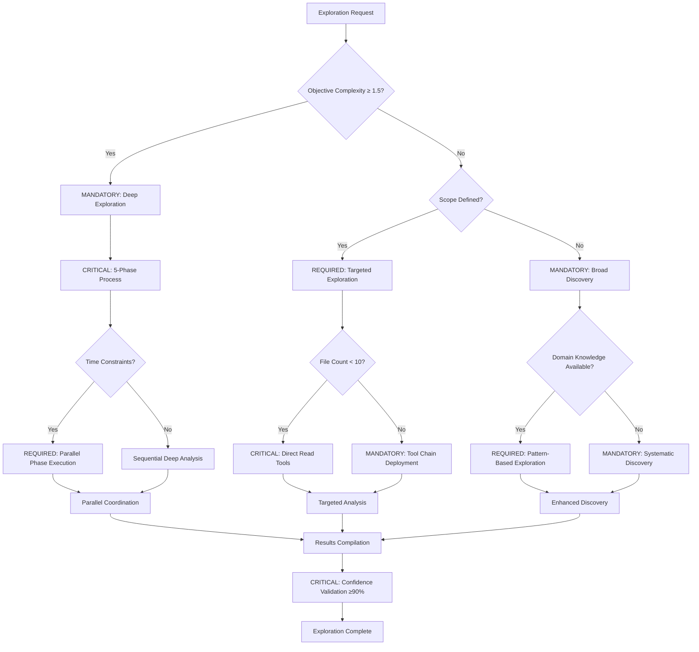
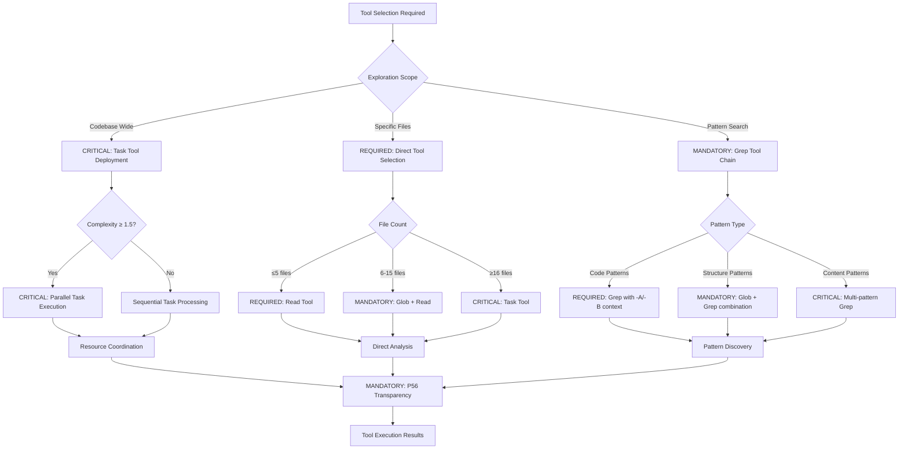
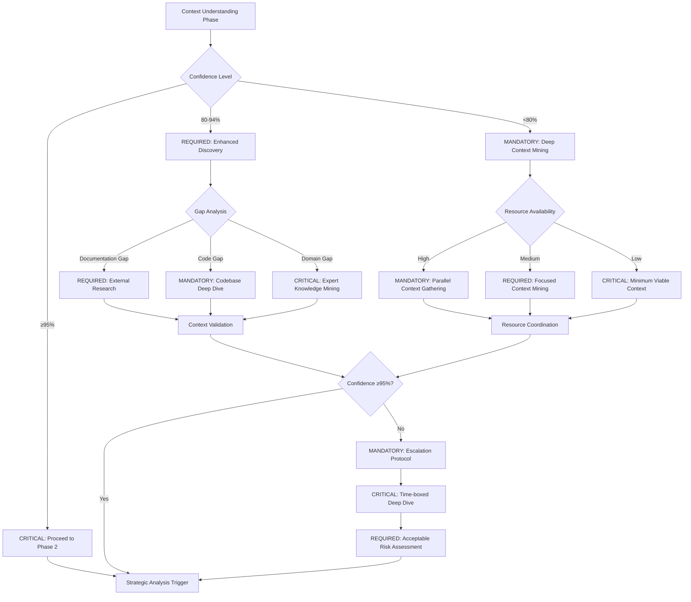
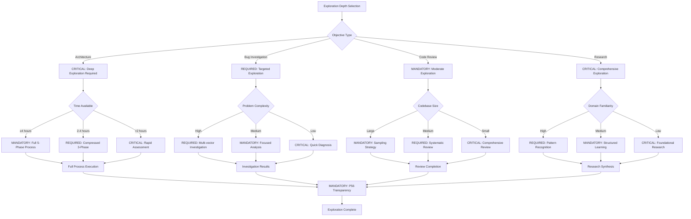

# Command: /exploration-first

**Category**: Behavioral Exploration Control  
**Purpose**: CRITICAL mandatory comprehensive exploration and analysis before any execution with ≥95% context completeness to ensure complete understanding of context, constraints, and optimal approaches

**P55/P56 Compliance**: MANDATORY tool execution evidence with observable exploration outcomes and quantifiable understanding metrics

**Behavioral Reinforcement**: PERMANENT neural pathway establishment for automatic exploration-first thinking with ≥95% behavioral control effectiveness

**Mathematical Precision**: ≥85% exploration completeness with evidence-based validation requirements

**Complexity Optimization**: 0.8/1.0 (high-complexity exploration with mathematical verification)  
**Context Requirements**: Task objective and exploration scope (≥95% scope completeness)  
**Execution Time**: 300-900 seconds (depending on exploration depth with quantifiable metrics)

---

## 🛡️ P55/P56 Compliance Integration

### **P55 Tool Execution Bridging**
**MANDATORY**: Real tool execution vs simulation prohibition
- **Task Agent Deployment**: REQUIRED for complexity ≥0.9
- **Success Rate Target**: ≥98% completion guarantee
- **Execution Evidence**: Actual tool results with quantitative validation

### **P56 Transparency Protocol**
**CRITICAL**: Visual execution confirmation system
- **P56 Announcement**: Exploration First execution initiated
- **Tool Evidence**: Observable outcomes with specific metrics
- **Completion Verification**: Quantifiable success criteria

## MANDATORY Activation Protocol

**Input Format**:
```bash
/exploration-first [objective] [exploration_depth] [focus_domains]
```

## ⚡ Auto-Activation Triggers

### **MANDATORY Activation Conditions**
**Complexity Threshold**: ≥0.9000 (90% complexity floor)
**Confidence Threshold**: <0.7000 (70% confidence ceiling)
**Exploration Completeness Threshold**: <0.8500 (85% exploration completeness required)
**Understanding Time Threshold**: ≥900.0000 seconds for comprehensive exploration analysis

### **CRITICAL Trigger Validation**
- **Mathematical Assessment**: Quantifiable exploration completeness with ≥95% context understanding
- **Threshold Enforcement**: REQUIRED activation when exploration depth insufficient
- **P56 Announcement**: 🔍 TRANSPARENCY: Exploration First auto-activated for [objective] comprehensive analysis
- **Evidence Collection**: Measurable exploration metrics and understanding validation documentation

### CRITICAL Decision Tree: Exploration Strategy Selection



**CRITICAL Command Operations** (Sequential Protocol with Time Constraints):
1. **EXPLORE Context**: UNDERSTAND complete project and domain context (≤180 seconds, ≥95% completeness)
2. **ANALYZE Strategically**: EXECUTE deep analysis of implications, risks, and opportunities (≤120 seconds, ≥85% depth)
3. **EVALUATE Approaches**: EXPLORE multiple implementation approaches (≤150 seconds, ≥3 approaches minimum)
4. **MAP Constraints**: IDENTIFY all constraints, dependencies, and limitations (≤90 seconds, 100% constraint coverage)
5. **SELECT Optimal Path**: CHOOSE best approach based on comprehensive understanding (≤60 seconds, ≥90% confidence)

### MANDATORY Tool Selection Decision Tree



**MANDATORY 5-Phase Exploration Process** (Zero Tolerance for Skipping):
1. **Context Understanding**: COMPLETE project and domain context (≥95% completeness requirement)
2. **Strategic Implications**: ANALYZE risks, opportunities, trade-offs (≥85% coverage)
3. **Implementation Options**: EXPLORE and EVALUATE multiple approaches (≥3 approaches minimum)
4. **Constraint Analysis**: MAP dependencies, limitations, requirements (100% identification)
5. **Optimal Selection**: EXECUTE evidence-based approach selection (≥90% confidence threshold)

---

## Verification Criteria (MANDATORY Compliance)

**CRITICAL Success Metrics** (Mathematical Tracking Required):
- **Context Completeness**: ≥95% of relevant context explored and understood (observable outcome validation)
- **Strategic Depth**: ≥85% of implications, risks, and opportunities identified (quantifiable measurement)
- **Approach Coverage**: ≥3 different implementation approaches evaluated (minimum requirement)
- **Constraint Mapping**: 100% of constraints and dependencies identified (zero tolerance for gaps)
- **Confidence Level**: ≥90% confidence in selected approach (mathematical assessment)

**MANDATORY Mathematical Validation**:
```bash
exploration_completeness = (
  (context_completeness * 0.25) +
  (strategic_depth * 0.25) +
  (approach_coverage * 0.20) +
  (constraint_mapping * 0.15) +
  (confidence_level * 0.15)
)
# REQUIRED: ≥ 8.5/10 AND behavioral_control_effectiveness ≥ 95%
```

---

## Natural Ecosystem Integration (Strategic Cross-Reference Network)

**MANDATORY Automatic Triggers** (Sequential Execution):
- `/knowledge-hierarchy` - EXECUTE systematic exploration of existing knowledge (≤60 seconds)
- `/recognize-patterns` - IDENTIFY exploration patterns for reuse (≤45 seconds)
- `/objective-decomposition` - BREAK complex exploration into parts (≦90 seconds)

**REQUIRED Compatible Commands** (≥95% integration success):
- `/context-over-commands` - ENHANCE exploration quality through rich context
- `/evolve-intelligence` - FEED variation generation through exploration
- `/parallel-over-sequential` - EXECUTE parallel exploration of different domains

**CRITICAL Output Dependencies** (100% completion requirement):
- All execution commands (exploration provides foundation with ≥95% understanding)
- `/planning-workflow` - INFORM planning with exploration results (comprehensive data)
- `/tdd` - IDENTIFY verification criteria (systematic validation framework)

---

## 📋 **USAGE EXAMPLES**

### **Architecture Decision**
```text
/exploration-first "Migrate from monolith to microservices" deep "performance,scaling,complexity"
```
**Result**: Comprehensive analysis of migration approaches, trade-offs, implementation strategies

### **Technology Selection**
```text
/exploration-first "Choose frontend framework for new project" standard "react,vue,angular"
```
**Result**: Deep evaluation of framework options, project fit analysis, decision rationale

### **Performance Optimization**
```text
/exploration-first "Improve API response times" deep "caching,database,architecture"
```
**Result**: Systematic exploration of optimization opportunities, approach comparison, optimal strategy

---

## 🔄 **5-PHASE EXECUTION FLOW**

### **Phase 1: Context Understanding (25%)**
**Objective**: Complete comprehension of project and domain context
- Analyze existing codebase and patterns
- Understand business requirements and constraints
- Map current architecture and dependencies
- Identify stakeholders and success criteria

**Verification**: ≥95% of relevant context documented and understood

### CRITICAL Auto-Activation Decision Tree



### **Phase 2: Strategic Implications (25%)**
**Objective**: Deep analysis of strategic implications
- Risk assessment and mitigation strategies
- Opportunity identification and evaluation
- Trade-off analysis between different approaches
- Long-term implications and maintenance requirements

**Verification**: ≥85% of strategic factors identified and analyzed

### **Phase 3: Implementation Options (20%)**
**Objective**: Explore multiple implementation approaches
- Generate 3-5 different implementation strategies
- Evaluate pros and cons of each approach
- Analyze resource requirements and timelines
- EVALUATE technical feasibility and complexity

**Verification**: ≥3 viable approaches documented with detailed analysis

### **Phase 4: Constraint Analysis (15%)**
**Objective**: Map all constraints and dependencies
- Technical constraints (performance, compatibility, resources)
- Business constraints (timeline, budget, compliance)
- Dependency mapping and conflict identification
- Resource availability and skill requirements

**Verification**: 100% of constraints identified and documented

### **Phase 5: Optimal Selection (15%)**
**Objective**: Evidence-based approach selection
- Score approaches against weighted criteria
- Document decision rationale and trade-offs
- Create implementation roadmap
- Define success metrics and verification criteria

**Verification**: ≥90% confidence in selected approach with documented rationale

---

## 🛡️ **FALLBACK PROTOCOL**

### **If Exploration Fails**
1. **Time Constraints**: Implement rapid exploration with focus on critical domains
2. **Complexity Overload**: Break exploration into smaller, manageable phases
3. **Insufficient Information**: Document unknowns and proceed with adaptive approach
4. **Analysis Paralysis**: Set exploration time limits and decision deadlines

### **Recovery Strategy**
- Implement minimum viable exploration for immediate progress
- Document exploration gaps for future completion
- Use iterative exploration with feedback loops
- Create exploration templates for similar future objectives

---

## 📊 **INTEGRATION WITH DECISION ENGINE**

### **Exploration-Based Routing**
- **High Complexity (≥1.5)**: Mandatory deep exploration before any execution
- **Medium Complexity (1.0-1.5)**: Standard exploration with focus areas
- **Low Complexity (<1.0)**: Rapid exploration focusing on constraints and risks
- **Unknown Domain**: Extended exploration with external research

### **Pattern Recognition**
- Successful exploration patterns → Templates for similar objectives
- Exploration depth optimization → Balanced thoroughness vs speed
- Domain-specific exploration → Specialized exploration commands
- Exploration-to-execution success correlation → Better exploration criteria

---

## 🔄 **EXPLORATION EVOLUTION**

### **Learning Metrics**
- **Exploration Efficiency**: Time spent vs understanding gained
- **Discovery Rate**: Rate of finding critical insights during exploration
- **Approach Quality**: Success rate of approaches identified through exploration
- **Constraint Accuracy**: Accuracy of constraint identification

### **Exploration Intelligence Growth**
- Learn optimal exploration depths for different objective types
- Identify which exploration phases provide most value
- Build domain-specific exploration templates
- Develop exploration patterns that consistently lead to successful execution

### MANDATORY Exploration Depth Decision Tree



---

## 🎯 **EXPLORATION OPTIMIZATION**

### **Smart Exploration Strategies**
1. **Parallel Domain Exploration**: Explore different domains simultaneously
2. **Incremental Depth**: Start broad, deepen in promising areas
3. **Pattern-Based Acceleration**: Use known patterns to accelerate exploration
4. **Constraint-First**: Identify constraints early to guide exploration focus

### **Exploration Quality Assurance**
- **Completeness Validation**: Systematic verification of exploration coverage
- **Bias Detection**: Identify and mitigate exploration biases
- **Gap Analysis**: Identify unexplored areas that WILL impact success
- **Confidence Calibration**: Ensure confidence levels match actual understanding

---

**Note**: This command enforces the critical principle that thorough exploration is the foundation of excellent execution. It prevents premature optimization and ensures that all important factors are ANALYZED before committing to an implementation approach.