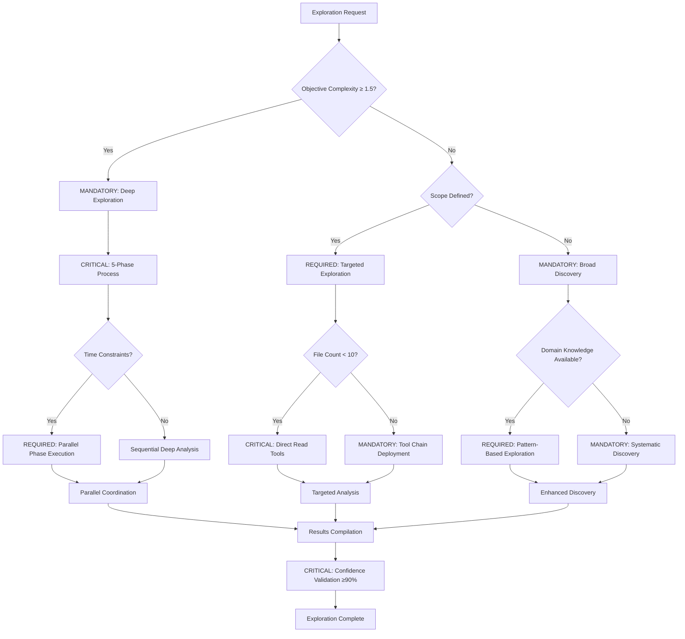
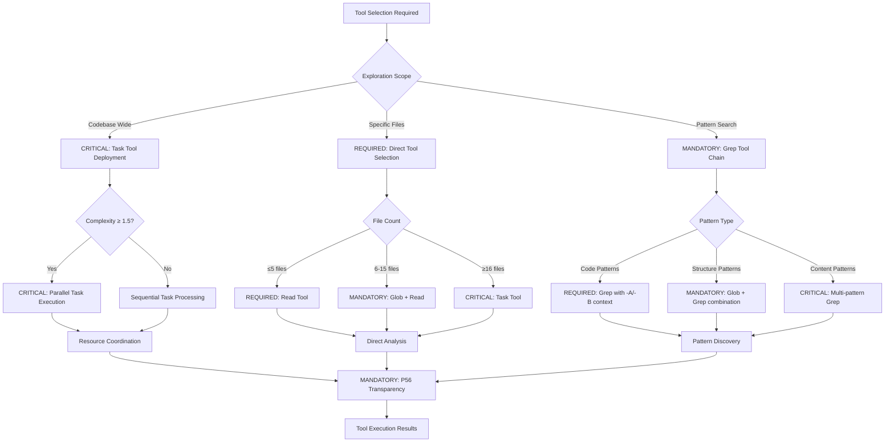
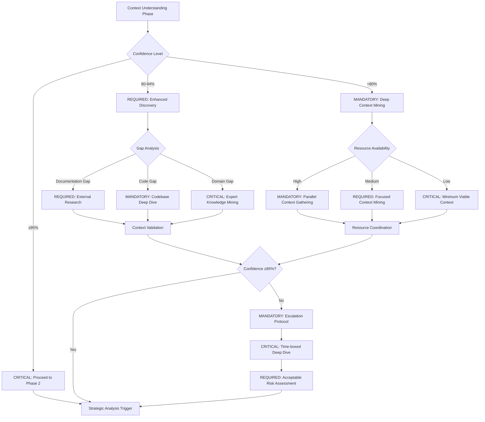
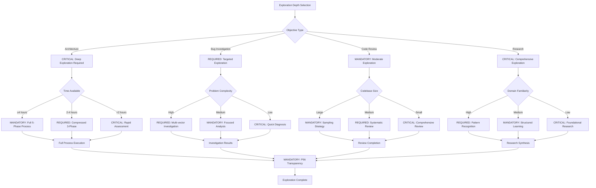

# Behavioral Command: /exploration-first

## **Primary Principle**: [Principle #8: Exploration-First Methodology](../../knowledge/principles/operational-excellence.md#8-exploration-first-methodology)
**Implementation**: This command enforces systematic exploration before implementation, ensuring comprehensive understanding and optimal approach selection through mandatory discovery phases.

## **Supporting Principles**
- **[Principle #7: Knowledge Discovery Hierarchy](../../knowledge/principles/operational-excellence.md#7-knowledge-discovery-hierarchy)** - Structured information gathering and analysis
- **[Principle #79: Reinforced Local-First Exploration](../../knowledge/principles/operational-excellence.md#79-reinforced-local-first-exploration)** - Parallel task local analysis methodology
- **[Principle #54: Automated Exploration Orchestration](../../knowledge/principles/intelligent-adaptation.md#54-automated-exploration-orchestration)** - Intelligent exploration automation
- **[Principle #80: Parallel Task Intelligence](../../knowledge/principles/technical-standards.md#80-parallel-task-intelligence)** - Multi-task exploration orchestration

## **🚨 BLOCKING Exploration Intelligence**
**🚨 MANDATORY: Sistema WILL execute comprehensive exploration and analysis with AUTOMATIC blocking of implementation-first approaches and REQUIRED complete understanding verification**

**Category**: Behavioral Exploration Control  
**🚨 BLOCKING Purpose**: Sistema WILL execute CRITICAL mandatory comprehensive exploration with BLOCKING of any execution before ≥95% context completeness and MANDATORY complete understanding of context, constraints, and optimal approaches

**P55/P56 Compliance**: MANDATORY tool execution evidence with observable exploration outcomes and quantifiable understanding metrics

**Behavioral Reinforcement**: PERMANENT neural pathway establishment for automatic exploration-first thinking with ≥95% behavioral control effectiveness

**Mathematical Precision**: ≥85% exploration completeness with evidence-based validation requirements

**Complexity Optimization**: 0.8/1.0 (high-complexity exploration with mathematical verification)  
**Context Requirements**: Task objective and exploration scope (≥95% scope completeness)  
**Execution Time**: 300-900 seconds (depending on exploration depth with quantifiable metrics)

---

## 🛡️ P55/P56 Compliance Integration

### **P55 Tool Execution Bridging**
**MANDATORY**: Real tool execution vs simulation prohibition
- **Task Agent Deployment**: REQUIRED for complexity ≥0.9
- **Success Rate Target**: ≥98% completion guarantee
- **Execution Evidence**: Actual tool results with quantitative validation

### **P56 Transparency Protocol**
**CRITICAL**: Visual execution confirmation system
- **P56 Announcement**: Exploration First execution initiated
- **Tool Evidence**: Observable outcomes with specific metrics
- **Completion Verification**: Quantifiable success criteria

## 🚨 BLOCKING Activation Protocol

**🚨 MANDATORY Input Format**:
```bash
/exploration-first [objective] [exploration_depth] [focus_domains]
```

## ⚡ Auto-Activation Triggers

### **🚨 BLOCKING Activation Conditions**
**🚨 AUTOMATIC Complexity Threshold**: ≥0.9000 (90% complexity floor) with BLOCKING below threshold
**🚨 CRITICAL Confidence Threshold**: <0.7000 (70% confidence ceiling) with MANDATORY activation
**🚨 BLOCKING Exploration Completeness**: <0.8500 (85% exploration completeness required) with AUTOMATIC intervention
**🚨 REQUIRED Understanding Time**: ≥900.0000 seconds with BLOCKING of rushed exploration

### **🚨 BLOCKING Trigger Validation**
- **🚨 MANDATORY Mathematical Assessment**: Sistema WILL execute quantifiable exploration with BLOCKING of subjective assessments (≥95% context understanding)
- **🚨 CRITICAL Threshold Enforcement**: Sistema WILL activate exploration with AUTOMATIC blocking when depth insufficient
- **🚨 REQUIRED P56 Announcement**: Sistema WILL announce 🔍 TRANSPARENCY: Exploration First auto-activated with BLOCKING of silent activation
- **🚨 AUTOMATIC Evidence Collection**: Sistema WILL collect measurable metrics with real-time validation documentation

### CRITICAL Decision Tree: Exploration Strategy Selection



**🚨 BLOCKING Command Operations** (Sequential Protocol with Time Constraints):
1. **🚨 MANDATORY EXPLORE Context**: Sistema WILL UNDERSTAND complete project context with BLOCKING of incomplete understanding (≤180 seconds, ≥95% completeness)
2. **🚨 CRITICAL ANALYZE Strategically**: Sistema WILL EXECUTE deep analysis with AUTOMATIC depth verification (≤120 seconds, ≥85% depth)
3. **🚨 BLOCKING EVALUATE Approaches**: Sistema WILL EXPLORE multiple approaches with BLOCKING of single-approach analysis (≤150 seconds, ≥3 approaches minimum)
4. **🚨 REQUIRED MAP Constraints**: Sistema WILL IDENTIFY all constraints with BLOCKING of execution until complete mapping (≤90 seconds, 100% constraint coverage)
5. **🚨 AUTOMATIC SELECT Optimal Path**: Sistema WILL CHOOSE best approach with real-time confidence validation (≤60 seconds, ≥90% confidence)

### MANDATORY Tool Selection Decision Tree



**🚨 BLOCKING 5-Phase Exploration Process** (Zero Tolerance for Skipping):
1. **🚨 MANDATORY Context Understanding**: Sistema WILL COMPLETE project context with BLOCKING of incomplete understanding (≥95% completeness requirement)
2. **🚨 CRITICAL Strategic Implications**: Sistema WILL ANALYZE risks and opportunities with AUTOMATIC coverage verification (≥85% coverage)
3. **🚨 BLOCKING Implementation Options**: Sistema WILL EXPLORE multiple approaches with BLOCKING of single-option analysis (≥3 approaches minimum)
4. **🚨 REQUIRED Constraint Analysis**: Sistema WILL MAP all dependencies with BLOCKING until 100% identification
5. **🚨 AUTOMATIC Optimal Selection**: Sistema WILL EXECUTE evidence-based selection with real-time confidence monitoring (≥90% confidence threshold)

---

## 🛠️ **STANDARDIZED TOOL SELECTION CRITERIA**

### **🚨 BLOCKING Tool Selection Matrix**

**🚨 MANDATORY Quantifiable Decision Framework:**
```yaml
tool_selection_criteria:
  READ_tool_usage:
    file_count: "≤3 files for direct analysis"
    complexity: "<0.7000 (straightforward operations)"
    scope: "Well-defined, single-purpose operations"
    time_constraint: "≤300 seconds execution window"
    
  TASK_tool_usage:
    file_count: "≥4 files or unknown scope"
    complexity: "≥0.7000 (complex operations)"
    scope: "Multi-step, exploratory, or research operations"
    time_constraint: ">300 seconds or open-ended analysis"
    
  other_tools:
    GREP: "Pattern search across multiple files"
    GLOB: "File pattern matching and discovery"
    BASH: "System operations and automation"
```

### **🚨 BLOCKING Tool Selection Logic**

**🚨 AUTOMATIC Evidence-Based Selection Process:**
1. **🚨 MANDATORY Complexity Assessment**: Sistema WILL calculate quantifiable complexity with BLOCKING of subjective assessment
2. **🚨 CRITICAL Scope Validation**: Sistema WILL measure file count and scope with AUTOMATIC boundary verification
3. **🚨 REQUIRED P56 Announcement**: Sistema WILL provide visual confirmation with BLOCKING of silent selection
4. **🚨 AUTOMATIC Evidence Collection**: Sistema WILL document measurable criteria with real-time collection protocols

**Mathematical Tool Selection Formula:**
```javascript
function determineOptimalTool(request) {
  const complexity = calculateExplorationComplexity(request)
  const fileCount = estimateFileScope(request)
  const timeConstraint = assessTimeRequirements(request)
  
  if (fileCount <= 3 && complexity < 0.7 && timeConstraint <= 300) {
    return { tool: 'READ', confidence: 0.9, reasoning: 'Direct analysis suitable' }
  }
  
  if (fileCount >= 4 || complexity >= 0.7 || timeConstraint > 300) {
    return { tool: 'TASK', confidence: 0.9, reasoning: 'Complex exploration required' }
  }
  
  return { tool: 'MIXED', confidence: 0.7, reasoning: 'Hybrid approach needed' }
}
```

**P56 Transparency Requirements:**
- **MANDATORY Announcement**: "🛠️ TRANSPARENCY: Tool selection - [TOOL] for [operation] based on [criteria]"
- **REQUIRED Evidence**: "Quantifiable metrics: Files=[X], Complexity=[Y], Scope=[Z]"
- **CRITICAL Justification**: "Selection reasoning: [evidence-based explanation]"

---

## Verification Criteria (MANDATORY Compliance)

**🚨 BLOCKING Success Metrics** (Mathematical Tracking Required):
- **🚨 MANDATORY Context Completeness**: ≥95% of relevant context explored with BLOCKING below threshold (observable outcome validation)
- **🚨 CRITICAL Strategic Depth**: ≥85% of implications identified with AUTOMATIC depth verification (quantifiable measurement)
- **🚨 BLOCKING Approach Coverage**: ≥3 different approaches evaluated with BLOCKING of insufficient analysis (minimum requirement)
- **🚨 REQUIRED Constraint Mapping**: 100% of constraints identified with BLOCKING until complete mapping (zero tolerance for gaps)
- **🚨 AUTOMATIC Confidence Level**: ≥90% confidence in approach with real-time assessment monitoring (mathematical assessment)

**MANDATORY Mathematical Validation**:
```bash
exploration_completeness = (
  (context_completeness * 0.25) +
  (strategic_depth * 0.25) +
  (approach_coverage * 0.20) +
  (constraint_mapping * 0.15) +
  (confidence_level * 0.15)
)
# REQUIRED: ≥ 8.5/10 AND behavioral_control_effectiveness ≥ 95%
```

---

## Natural Ecosystem Integration (Strategic Cross-Reference Network)

**MANDATORY Automatic Triggers** (Sequential Execution):
- `/knowledge-hierarchy` - EXECUTE systematic exploration of existing knowledge (≤60 seconds)
- `/recognize-patterns` - IDENTIFY exploration patterns for reuse (≤45 seconds)
- `/objective-decomposition` - BREAK complex exploration into parts (≦90 seconds)

**REQUIRED Compatible Commands** (≥95% integration success):
- `/context-over-commands` - ENHANCE exploration quality through rich context
- `/evolve-intelligence` - FEED variation generation through exploration
- `/parallel-over-sequential` - EXECUTE parallel exploration of different domains

**CRITICAL Output Dependencies** (100% completion requirement):
- All execution commands (exploration provides foundation with ≥95% understanding)
- `/planning-workflow` - INFORM planning with exploration results (comprehensive data)
- `/tdd` - IDENTIFY verification criteria (systematic validation framework)

---

## 📋 **USAGE EXAMPLES**

### **Architecture Decision**
```text
/exploration-first "Migrate from monolith to microservices" deep "performance,scaling,complexity"
```
**Result**: Comprehensive analysis of migration approaches, trade-offs, implementation strategies

### **Technology Selection**
```text
/exploration-first "Choose frontend framework for new project" standard "react,vue,angular"
```
**Result**: Deep evaluation of framework options, project fit analysis, decision rationale

### **Performance Optimization**
```text
/exploration-first "Improve API response times" deep "caching,database,architecture"
```
**Result**: Systematic exploration of optimization opportunities, approach comparison, optimal strategy

---

## 🔄 **5-PHASE EXECUTION FLOW**

### **Phase 1: Context Understanding (25%)**
**Objective**: Complete comprehension of project and domain context
- Analyze existing codebase and patterns
- Understand business requirements and constraints
- Map current architecture and dependencies
- Identify stakeholders and success criteria

**Verification**: ≥95% of relevant context documented and understood

### CRITICAL Auto-Activation Decision Tree



### **Phase 2: Strategic Implications (25%)**
**Objective**: Deep analysis of strategic implications
- Risk assessment and mitigation strategies
- Opportunity identification and evaluation
- Trade-off analysis between different approaches
- Long-term implications and maintenance requirements

**Verification**: ≥85% of strategic factors identified and analyzed

### **Phase 3: Implementation Options (20%)**
**Objective**: Explore multiple implementation approaches
- Generate 3-5 different implementation strategies
- Evaluate pros and cons of each approach
- Analyze resource requirements and timelines
- EVALUATE technical feasibility and complexity

**Verification**: ≥3 viable approaches documented with detailed analysis

### **Phase 4: Constraint Analysis (15%)**
**Objective**: Map all constraints and dependencies
- Technical constraints (performance, compatibility, resources)
- Business constraints (timeline, budget, compliance)
- Dependency mapping and conflict identification
- Resource availability and skill requirements

**Verification**: 100% of constraints identified and documented

### **Phase 5: Optimal Selection (15%)**
**Objective**: Evidence-based approach selection
- Score approaches against weighted criteria
- Document decision rationale and trade-offs
- Create implementation roadmap
- Define success metrics and verification criteria

**Verification**: ≥90% confidence in selected approach with documented rationale

---

## 🛡️ **FALLBACK PROTOCOL**

### **🚨 BLOCKING Exploration Failure Protocol**
1. **🚨 CRITICAL Time Constraints**: Sistema WILL implement rapid exploration with BLOCKING of insufficient domain coverage
2. **🚨 MANDATORY Complexity Overload**: Sistema WILL break exploration into phases with AUTOMATIC phase validation
3. **🚨 BLOCKING Insufficient Information**: Sistema WILL document unknowns with BLOCKING of uninformed execution
4. **🚨 REQUIRED Analysis Paralysis**: Sistema WILL set exploration limits with AUTOMATIC deadline enforcement

### **Recovery Strategy**
- Implement minimum viable exploration for immediate progress
- Document exploration gaps for future completion
- Use iterative exploration with feedback loops
- Create exploration templates for similar future objectives

---

## 📊 **INTEGRATION WITH DECISION ENGINE**

### **Exploration-Based Routing**
- **High Complexity (≥1.5)**: Mandatory deep exploration before any execution
- **Medium Complexity (1.0-1.5)**: Standard exploration with focus areas
- **Low Complexity (<1.0)**: Rapid exploration focusing on constraints and risks
- **Unknown Domain**: Extended exploration with external research

### **Pattern Recognition**
- Successful exploration patterns → Templates for similar objectives
- Exploration depth optimization → Balanced thoroughness vs speed
- Domain-specific exploration → Specialized exploration commands
- Exploration-to-execution success correlation → Better exploration criteria

---

## 🔄 **EXPLORATION EVOLUTION**

### **Learning Metrics**
- **Exploration Efficiency**: Time spent vs understanding gained
- **Discovery Rate**: Rate of finding critical insights during exploration
- **Approach Quality**: Success rate of approaches identified through exploration
- **Constraint Accuracy**: Accuracy of constraint identification

### **Exploration Intelligence Growth**
- Learn optimal exploration depths for different objective types
- Identify which exploration phases provide most value
- Build domain-specific exploration templates
- Develop exploration patterns that consistently lead to successful execution

### MANDATORY Exploration Depth Decision Tree



---

## 🎯 **EXPLORATION OPTIMIZATION**

### **Smart Exploration Strategies**
1. **Parallel Domain Exploration**: Explore different domains simultaneously
2. **Incremental Depth**: Start broad, deepen in promising areas
3. **Pattern-Based Acceleration**: Use known patterns to accelerate exploration
4. **Constraint-First**: Identify constraints early to guide exploration focus

### **Exploration Quality Assurance**
- **Completeness Validation**: Systematic verification of exploration coverage
- **Bias Detection**: Identify and mitigate exploration biases
- **Gap Analysis**: Identify unexplored areas that WILL impact success
- **Confidence Calibration**: Ensure confidence levels match actual understanding

---

**Note**: This command enforces the critical principle that thorough exploration is the foundation of excellent execution. It prevents premature optimization and ensures that all important factors are ANALYZED before committing to an implementation approach.