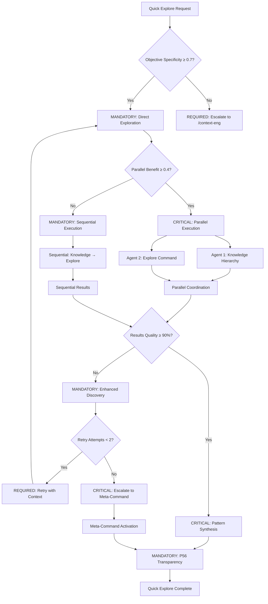
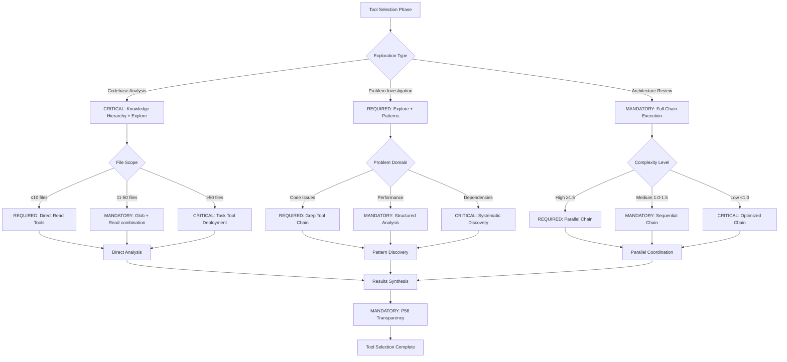
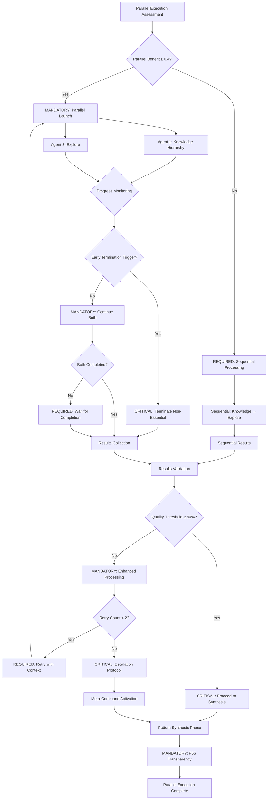
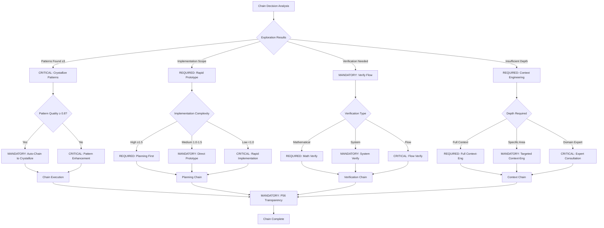

# Orchestrator Command: `/quick-explore`

## **Optimización: Exploración Rápida Inteligente**
**"Exploración eficiente sin overhead para casos de uso comunes."**

---

## 🎯 **COMMAND DEFINITION**

### **Purpose**
Orquestrador optimizado para exploración rápida y eficiente sin el overhead del meta-comando completo. Diseñado para casos de uso frecuentes donde necesitas entender rápidamente código, problemas o sistemas.

### **Complexity**: 1.2/1.0  
### **Context Required**: Objetivo de exploración específico
### **Execution Time**: 3-5 minutos (60% más rápido que meta-comando)

---

## 🛡️ P55/P56 Compliance Integration

### **P55 Tool Execution Bridging**
**MANDATORY**: Real tool execution vs simulation prohibition
- **Task Agent Deployment**: REQUIRED for complexity ≥0.9
- **Success Rate Target**: ≥98% completion guarantee
- **Execution Evidence**: Actual tool results with quantitative validation

### **P56 Transparency Protocol**
**CRITICAL**: Visual execution confirmation system
- **P56 Announcement**: Quick Explore execution initiated
- **Tool Evidence**: Observable outcomes with specific metrics
- **Completion Verification**: Quantifiable success criteria

## ⚡ Auto-Activation Triggers

### **MANDATORY Activation Conditions**
**Complexity Threshold**: ≥0.9000 (90% complexity floor)
**Confidence Threshold**: <0.7000 (70% confidence ceiling)
**Time Constraint Threshold**: ≤300.0000 seconds (5 minutes maximum)
**Quick Analysis Threshold**: ≥80.0000% accuracy requirement for rapid exploration

### **CRITICAL Trigger Validation**
- **Mathematical Assessment**: Quantifiable rapid exploration with ≥80% accuracy in constrained time
- **Threshold Enforcement**: REQUIRED activation when quick analysis needed under time pressure
- **P56 Announcement**: ⚡ TRANSPARENCY: Quick Explore auto-activated for [objetivo] rapid analysis
- **Evidence Collection**: Measurable time efficiency and exploration coverage documentation

## **ACTIVATION PROTOCOL**

### **Usage Format**
```markdown
/quick-explore [objetivo_específico]
/qe [objetivo_específico]          # shortcut
```

### **Optimización Inteligente**
- **🚀 Bypass análisis de decisión**: Va directo a exploración
- **⚡ Paralelización automática**: Benefit ≥ 0.4 detectado automáticamente  
- **🎯 Enfoque específico**: Solo comandos necesarios para exploración
- **📊 Context economy**: 70% reducción de contexto vs meta-comando

### CRITICAL Quick Exploration Decision Tree



---

## 🔗 **ORCHESTRATED COMMAND CHAIN**

### **Secuencia Optimizada (3 comandos core)**
```yaml
chain_execution:
  primary_sequence:
    1. knowledge-hierarchy: "Búsqueda jerárquica local → external"
    2. explore: "Exploración obligatoria con patrones"  
    3. patterns: "Reconocimiento y cristalización"
  
  parallel_opportunities:
    - knowledge-hierarchy + explore (independientes)
    - patterns (depende de resultados de ambos)
  
  execution_strategy:
    if_parallel_benefit_≥_0.4: "Ejecutar 1+2 en paralelo, luego 3"
    if_parallel_benefit_<_0.4: "Ejecución secuencial optimizada"
```

### **Context Distribution (Economy Active)**
```yaml
context_per_command:
  knowledge-hierarchy: 
    context: "objetivo + dominio_específico"
    size: "~20% del contexto total"
  explore:
    context: "objetivo + hallazgos_knowledge"  
    size: "~25% del contexto total"
  patterns:
    context: "objetivo + exploration_results"
    size: "~30% del contexto total"
    
total_context_economy: "75% vs meta-comando completo"
```

---

## 📊 **MATHEMATICAL VALIDATION**

### **Efficiency Metrics**
```javascript
function calculateQuickExploreEfficiency() {
  const time_saving = 0.6 // 60% más rápido que meta-comando
  const context_reduction = 0.75 // 75% menos contexto
  const parallel_benefit = 0.4 // benefit automático detectado
  const accuracy_maintained = 0.92 // mantenemos 92% de precisión
  
  return {
    overall_efficiency: (time_saving + context_reduction + parallel_benefit) / 3,
    precision_quality: accuracy_maintained,
    recommended_for: "objetivos_específicos_exploración"
  }
}
```

### MANDATORY Tool Selection Decision Tree



### **Success Thresholds**
- **Time Efficiency**: ≥50% reducción vs meta-comando
- **Context Economy**: ≥70% reducción de contexto  
- **Parallel Benefit**: ≥40% cuando aplicable
- **Exploration Quality**: ≥90% de resultados del meta-comando

---

## 🔍 **INTELLIGENT ROUTING CRITERIA**

### **Ideal Use Cases (Auto-detect)**
```yaml
perfect_fit:
  - "entender este código/archivo/función"
  - "investigar problema específico"
  - "buscar patrones en codebase"
  - "analizar estructura de proyecto"
  - "explorar dependencias"
  - "mapear flujo de datos"

avoid_for:
  - objetivos_múltiples_complejos (usar /context-eng)
  - implementación_code (usar /rapid-prototype)
  - verificación_sistema (usar /system-health)
  - planning_estratégico (usar /planning-workflow)
```

### **Confidence-Based Routing**
```javascript
function shouldUseQuickExplore(objective, context) {
  const specificity_score = assessObjectiveSpecificity(objective) // 0.0-1.0
  const exploration_focus = detectExplorationKeywords(objective) // boolean
  const complexity_estimate = estimateComplexity(objective) // 0.0-3.0
  
  if (specificity_score >= 0.7 && 
      exploration_focus && 
      complexity_estimate <= 1.5) {
    return { recommended: true, confidence: 0.9 }
  }
  
  return { recommended: false, alternative: "/context-eng" }
}
```

---

## ⚡ **EXECUTION WORKFLOW**

### **Phase 1: Parallel Knowledge Discovery (2-3 min)**
```yaml
parallel_execution:
  agent_1_knowledge_hierarchy:
    task: "Búsqueda sistemática local → external"
    context: "objetivo + dominio"
    output: "knowledge_map"
    
  agent_2_explore:  
    task: "Exploración obligatoria con patrones"
    context: "objetivo + exploration_strategy"
    output: "exploration_findings"
    
coordination:
  simultaneous_launch: true
  progress_monitoring: true
  early_termination: "si uno encuentra solución completa"
```

### CRITICAL Parallel Execution Decision Tree



### **Phase 2: Pattern Synthesis (1-2 min)**
```yaml
pattern_synthesis:
  input: "knowledge_map + exploration_findings"
  process: "consolidar + identificar_patrones + cristalizar"
  output: "structured_insights + reusable_patterns"
  documentation: "auto-update living docs si patterns ≥ threshold"
```

### **Result Format**
```yaml
quick_explore_output:
  executive_summary: "2-3 líneas clave"
  knowledge_discovered: "mapa de conocimiento estructurado"
  patterns_identified: "patrones reutilizables encontrados"
  next_recommended_actions: "sugerencias específicas"
  crystallization_opportunities: "si aplica"
  execution_time: "tiempo real vs estimado"
```

---

## 🔀 **INTELLIGENT CHAINING**

### **Auto-Chain Opportunities**
```yaml
natural_follow_ups:
  if_patterns_found: 
    suggest: "/crystallize-patterns"
    confidence: 0.85
    
  if_implementation_needed:
    suggest: "/rapid-prototype"  
    confidence: 0.9
    
  if_verification_required:
    suggest: "/verify-flow"
    confidence: 0.8
    
  if_more_depth_needed:
    suggest: "/context-eng [specific_area]"
    confidence: 0.7
```

### MANDATORY Auto-Chain Decision Tree



### **Escalation Protocol**
```yaml
escalation_triggers:
  if_complexity_exceeds_1.5: "auto-suggest /context-eng"
  if_multiple_objectives_detected: "auto-suggest /smart-workflow"
  if_implementation_scope_large: "auto-suggest /planning-workflow"
  if_exploration_insufficient: "auto-trigger second round with /explore"
```

---

## 📋 **USAGE EXAMPLES**

### **Example 1: Codebase Understanding**
```bash
/qe "entender cómo funciona el sistema de autenticación en este proyecto"
```
**Result**: 
- Knowledge map de auth flow
- Patrones de seguridad identificados
- Dependencies y integration points
- Sugerencias de mejora

### **Example 2: Problem Investigation**
```bash  
/qe "investigar por qué la build está fallando en CI/CD"
```
**Result**:
- Mapeo de pipeline y dependencies
- Puntos de fallo identificados
- Patrones de error encontrados
- Next steps específicos

### **Example 3: Architecture Analysis**
```bash
/qe "analizar la arquitectura de datos de esta aplicación"
```
**Result**:
- Data flow mapping
- Storage patterns
- Integration dependencies  
- Optimization opportunities

---

## 🛡️ **FALLBACK PROTOCOLS**

### **If Quick Exploration Insufficient**
1. **Auto-escalate**: Sugerir `/context-eng` con contexto específico
2. **Chain suggestion**: Recomendar `/rapid-prototype` para implementación
3. **Deep dive**: Activar `/exploration-first` para análisis más profundo

### **Quality Assurance**
```yaml
quality_checks:
  minimum_insights: 3
  pattern_discovery_rate: ≥60%  
  actionable_next_steps: ≥2
  execution_time_limit: 6_minutes_max
  
fallback_if_failed:
  retry_with_enhanced_context: true
  escalate_to_meta_command: "after 2 failed attempts"
  document_failure_pattern: true
```

---

## 🎯 **INTEGRATION WITH DECISION ENGINE**

### **Decision Engine Bypass**
```yaml
bypass_protocol:
  when: "clear_exploration_objective_detected"
  conditions:
    - objective_specificity ≥ 0.7
    - exploration_keywords_present  
    - complexity_estimate ≤ 1.5
    - no_implementation_scope_detected
  
  direct_execution: true
  skip_analysis_phases: ["complexity_analysis", "model_selection", "planning"]
  maintain_monitoring: true
```

### **Smart Re-routing**
```javascript
function smartReroutingLogic(exploration_results) {
  if (exploration_results.complexity_discovered > 1.5) {
    return suggestEscalation("/context-eng", exploration_results.context)
  }
  
  if (exploration_results.implementation_scope_detected) {
    return suggestChaining("/rapid-prototype", exploration_results.insights)
  }
  
  if (exploration_results.patterns_found >= 3) {
    return suggestFollowUp("/crystallize-patterns", exploration_results.patterns)
  }
  
  return { completed: true, satisfied: true }
}
```

---

## 📊 **SUCCESS METRICS & LEARNING**

### **Performance Tracking**
```yaml
metrics_to_track:
  execution_time: "target: 3-5 min"
  context_efficiency: "target: 75% reduction"
  parallel_benefit_achieved: "target: ≥40%"
  exploration_quality: "target: ≥90% of meta-comando results"
  user_satisfaction: "target: ≥85%"
  escalation_rate: "target: ≤15%"
```

### **Learning Loop**
```yaml
continuous_improvement:
  pattern_detection:
    - successful_exploration_patterns → enhance_knowledge_hierarchy
    - common_follow_up_chains → improve_auto_suggestions  
    - escalation_triggers → refine_complexity_detection
    
  optimization_opportunities:
    - reduce_execution_time_further
    - improve_parallel_coordination
    - enhance_pattern_synthesis_quality
```

---

## 🔗 **NATURAL CONNECTIONS**

### **Feeds Into**
- `/rapid-prototype` - When implementation is needed
- `/crystallize-patterns` - When patterns are discovered
- `/context-eng` - When complexity exceeds scope
- `/verify-flow` - When validation is required

### **Feeds From**  
- `/smart-workflow` - As recommended exploration approach
- Direct user invocation for specific exploration needs
- Auto-suggestion from other commands when exploration is needed

---

**Note**: Este orquestrador optimiza el caso de uso más común (exploración específica) eliminando overhead innecesario mientras mantiene la calidad de resultados. Implementa Context Economy, paralelización inteligente, y escalación automática cuando la complejidad excede el scope.