# Atomic Command: `/objective-decomposition`

## **Principle #8: Objective Decomposition**
**"Break large objectives into small, verifiable sub-objectives."**

---

## 🎯 **COMMAND DEFINITION**

### **Purpose**
Systematically decompose complex objectives into smaller, independently verifiable sub-objectives that MUST be executed in parallel or sequence with clear success criteria.

### **Complexity**: 0.8/1.0
### **Context Required**: Main objective and decomposition constraints
### **Execution Time**: 3-12 minutes (depending on objective complexity)

---

## 🔧 P55 Script Execution Protocol

**MANDATORY**: This command automatically executes objective decomposition and analysis scripts:

```bash
# Core complexity and decomposition analysis
./scripts/core/calculate-complexity.sh --decomposition-analysis
./scripts/validation/analyze-content-quality.sh --objective-breakdown

# Parallelization and workflow optimization
./scripts/automation/parallelization-analyzer.js --decomposition-parallelization
./scripts/automation/todo-workflow-optimizer.js --objective-optimization
```

**Execution Protocol**:
1. **Pre-execution**: Validate decomposition prerequisites and objective analysis parameters
2. **Complexity Analysis**: Execute comprehensive complexity calculation for decomposition optimization
3. **Content Breakdown**: Run content quality analysis with objective breakdown focus
4. **Parallelization Optimization**: Apply parallelization analysis and workflow optimization for sub-objectives

**P56 Execution Transparency**:

**I'm going to**:
1. Execute objective decomposition using comprehensive complexity and parallelization analysis
2. Validate sub-objective quality and optimization potential with workflow enhancement
3. Generate decomposition reports with parallelization metrics and objective breakdown validation
4. Apply workflow optimization protocols for comprehensive objective decomposition

**Status Updates**:
- 🔄 **Starting**: Objective decomposition initiated (4 specialized analysis and optimization scripts)
- 📊 **Progress**: Running complexity analysis and parallelization optimization for decomposition
- ✅ **Complete**: Decomposition completed with workflow optimization and parallelization validation
- 📈 **Metrics**: Objective breakdown validated and parallelization efficiency measured

---

## ⚡ Auto-Activation Triggers

### **MANDATORY Activation Conditions**
**Complexity Threshold**: ≥0.9000 (90% complexity floor)
**Confidence Threshold**: <0.7000 (70% confidence ceiling)
**Objective Size Threshold**: ≥720.0000 seconds (12 minutes estimated completion)
**Decomposition Opportunity Threshold**: ≥3.0000 identifiable sub-objectives

### **CRITICAL Trigger Validation**
- **Mathematical Assessment**: Quantifiable decomposition benefit with ≥70% parallelization opportunity
- **Threshold Enforcement**: REQUIRED activation when objective complexity exceeds manageable units
- **P56 Announcement**: 🔧 TRANSPARENCY: Objective Decomposition auto-activated for [objective] breakdown
- **Evidence Collection**: Measurable decomposition metrics and sub-objective verification documentation

## **ACTIVATION PROTOCOL**

### **Input Format**
```markdown
/objective-decomposition [main_objective] [decomposition_depth?] [parallelization_target?]
```

### **What This Command Does**
1. **Analyze Main Objective**: Understand scope, complexity, and requirements
2. **Identify Sub-Objectives**: Break down into logical, independent components
3. **Create Dependency Tree**: Map dependencies and relationships between sub-objectives
4. **Define Verification**: Establish clear success criteria for each sub-objective
5. **Optimize Execution**: Organize for maximum parallelization and efficiency

### **Implementation Steps**
1. Analyze main objective for natural decomposition points
2. Create hierarchical breakdown of sub-objectives
3. Map dependencies and execution order requirements
4. Define independent verification criteria for each sub-objective
5. Identify parallelization opportunities
6. Create execution roadmap with verification checkpoints

---

## 🧠 **DECOMPOSITION DECISION TREE**

### **CRITICAL Cognitive Flow for Objective Decomposition**

```mermaid
graph TD
    A[Decomposition Request Input] --> B{Complexity ≥ 0.9?}
    B -->|Yes| C[CRITICAL: Advanced Decomposition Processing]
    B -->|No| D[Standard Decomposition Analysis]
    
    C --> E{Confidence < 0.7?}
    E -->|Yes| F[MANDATORY: Expert Task Delegation]
    E -->|No| G[Direct Decomposition Execution]
    
    D --> H{Objective Clarity Score}
    H -->|≥0.8| I[Proceed with Decomposition]
    H -->|<0.8| J[REQUIRED: Objective Clarification]
    
    F --> K[Task Tool: Complex Decomposition]
    K --> L[P56: Advanced Decomposition Coordination]
    
    G --> M{Decomposition Depth?}
    M -->|≤2| N[Shallow Decomposition]
    M -->|3-4| O[Standard Decomposition]
    M -->|≥5| P[CRITICAL: Deep Decomposition]
    
    I --> Q{Natural Break Points?}
    Q -->|Yes| R[Functional Decomposition]
    Q -->|No| S[Analytical Decomposition]
    
    J --> T[Read Tool: Load Objective Context]
    T --> U[Edit Tool: Document Clarification]
    U --> I
    
    N --> V[Read Tool: Load Simple Patterns]
    V --> W[Edit Tool: Document Sub-objectives]
    
    O --> X[Read Tool: Load Complex Patterns]
    X --> Y[Edit Tool: Document Hierarchy]
    
    P --> Z[Task Tool: Multi-level Coordination]
    Z --> AA[P56: Deep Decomposition Management]
    
    R --> BB{Parallelization Potential?}
    BB -->|≥0.7| CC[Parallel Track Design]
    BB -->|<0.7| DD[Sequential Design]
    
    S --> EE[Bash Tool: Complexity Analysis]
    EE --> FF[Mathematical Decomposition]
    
    CC --> GG[Edit Tool: Parallel Documentation]
    GG --> HH[Bash Tool: Dependency Mapping]
    
    DD --> II[Edit Tool: Sequential Documentation]
    II --> JJ[Bash Tool: Critical Path Analysis]
    
    FF --> KK{Decomposition Complete?}
    KK -->|Yes| LL[Verification Criteria Definition]
    KK -->|No| MM[REQUIRED: Iterative Refinement]
    
    HH --> NN[P56: Parallel Decomposition Success]
    JJ --> OO[P56: Sequential Decomposition Success]
    
    LL --> PP[Read Tool: Load Verification Patterns]
    PP --> QQ[Edit Tool: Document Success Criteria]
    QQ --> RR[P56: Verification Framework Complete]
    
    MM --> SS[Read Tool: Load Refinement Patterns]
    SS --> TT[Edit Tool: Document Iterations]
    TT --> KK
    
    L --> UU[Agent Decomposition Results]
    UU --> VV[P56: Expert Decomposition Complete]
    
    AA --> WW[Multi-level Coordination Results]
    WW --> XX[P56: Deep Decomposition Complete]
    
    NN --> YY[Decomposition Metrics]
    OO --> YY
    RR --> YY
    VV --> YY
    XX --> YY
    
    style C fill:#ff6b6b
    style F fill:#4ecdc4
    style P fill:#ffe66d
    style MM fill:#ff8b94
    style YY fill:#95e1d3
```



### **MANDATORY P56 Transparency Announcements**

**Decomposition Decision Transparency**:
  **Complexity Assessment**:
    - **Announcement**: 🔍 TRANSPARENCY: Objective complexity assessed at [X]/1.0 - [STANDARD/ADVANCED] decomposition required
    - **Evidence**: Mathematical complexity analysis with decomposition requirements
  **Decomposition Strategy**:
    - **Announcement**: 📊 TRANSPARENCY: Decomposition strategy - [FUNCTIONAL/ANALYTICAL] with [X] levels depth
    - **Evidence**: Strategy selection logic with depth justification
  **Tool Selection**:
    - **Announcement**: 🛠️ TRANSPARENCY: Tool selection - [READ/EDIT/BASH/TASK] for [decomposition_operation]
    - **Evidence**: Tool selection matrix with decomposition-specific reasoning
  **Parallelization Assessment**:
    - **Announcement**: ⚡ TRANSPARENCY: Parallelization potential [X]/1.0 - [PARALLEL/SEQUENTIAL] execution recommended
    - **Evidence**: Dependency analysis with parallelization calculation
  **Verification Framework**:
    - **Announcement**: ✅ TRANSPARENCY: Verification criteria defined - [X] success metrics established
    - **Evidence**: Complete verification framework with measurable criteria

---

## 🛠️ **STANDARDIZED TOOL SELECTION CRITERIA**

### **MANDATORY Tool Selection Matrix**

**Quantifiable Decision Framework:**
**Tool Selection Criteria**:
  **Read Tool Usage**:
    - **File Count**: ≤3 files for direct analysis
    - **Complexity**: <0.7000 (straightforward operations)
    - **Scope**: Well-defined, single-purpose operations
    - **Time Constraint**: ≤300 seconds execution window
  **Task Tool Usage**:
    - **File Count**: ≥4 files or unknown scope
    - **Complexity**: ≥0.7000 (complex operations)
    - **Scope**: Multi-step, exploratory, or research operations
    - **Time Constraint**: >300 seconds or open-ended analysis
  **Other Tools**:
    - **Grep**: Pattern search across multiple files
    - **Glob**: File pattern matching and discovery
    - **Bash**: System operations and automation

### **CRITICAL Tool Selection Logic**

**Evidence-Based Selection Process:**
1. **Complexity Assessment**: Calculate quantifiable complexity using objective decomposition metrics
2. **Scope Validation**: Measure file count and operation scope boundaries
3. **P56 Announcement**: Visual confirmation of tool selection reasoning
4. **Evidence Collection**: Document measurable tool selection criteria

**Mathematical Tool Selection Formula:**
```javascript
function determineOptimalTool(request) {
  const complexity = calculateDecompositionComplexity(request)
  const fileCount = estimateFileScope(request)
  const timeConstraint = assessTimeRequirements(request)
  
  if (fileCount <= 3 && complexity < 0.7 && timeConstraint <= 300) {
    return { tool: 'READ', confidence: 0.9, reasoning: 'Direct decomposition analysis suitable' }
  }
  
  if (fileCount >= 4 || complexity >= 0.7 || timeConstraint > 300) {
    return { tool: 'TASK', confidence: 0.9, reasoning: 'Complex decomposition required' }
  }
  
  return { tool: 'MIXED', confidence: 0.7, reasoning: 'Hybrid decomposition approach needed' }
}
```

**P56 Transparency Requirements:**
- **MANDATORY Announcement**: "🛠️ TRANSPARENCY: Tool selection - [TOOL] for [operation] based on [criteria]"
- **REQUIRED Evidence**: "Quantifiable metrics: Files=[X], Complexity=[Y], Scope=[Z]"
- **CRITICAL Justification**: "Selection reasoning: [evidence-based explanation]"

---

## 🔍 **VERIFICATION CRITERIA**

### **Success Metrics**
- **Decomposition Completeness**: ≥95% of main objective covered by sub-objectives
- **Independence Verification**: ≥90% of sub-objectives independently verifiable
- **Dependency Accuracy**: 100% of dependencies correctly identified
- **Parallelization Potential**: ≥70% of sub-objectives executable in parallel
- **Verification Coverage**: 100% of sub-objectives have clear success criteria

### **Mathematical Validation**
```javascript
decomposition_effectiveness = (
  (completeness * 0.25) +
  (independence * 0.30) +
  (dependency_accuracy * 0.20) +
  (parallelization_potential * 0.15) +
  (verification_coverage * 0.10)
)
// Required: ≥ 8.5/10
```

---

## 🔗 **NATURAL CONNECTIONS**

### **Automatically Triggers**
- `/tdd` - Define verification criteria for each sub-objective
- `/parallel-over-sequential` - Execute independent sub-objectives in parallel
- `/strategic-git` - Create checkpoints at sub-objective completion

### **Compatible With**
- `/exploration-first` - Explore main objective before decomposition
- `/recognize-patterns` - Identify decomposition patterns for reuse
- `/evolve-intelligence` - Evolve decomposition strategies

### **Feeds Into**
- Execution workflows (decomposed objectives enable parallel execution)
- Planning processes (sub-objectives form detailed project plans)
- Progress tracking (sub-objective completion provides clear milestones)

---

## 📋 **USAGE EXAMPLES**

### **Feature Development**
```text
/objective-decomposition "Build e-commerce checkout system" 3 0.75
```
**Result**: Decomposed into payment processing, inventory validation, user interface, order management sub-objectives

### **System Migration**
```text
/objective-decomposition "Migrate from MongoDB to PostgreSQL" 2
```
**Result**: Broken into schema design, data migration, application updates, testing, deployment sub-objectives

### **Performance Optimization**
```text
/objective-decomposition "Improve application performance by 50%" 4 0.80
```
**Result**: Decomposed into database optimization, frontend caching, API efficiency, infrastructure scaling

---

## 🔄 **DECOMPOSITION METHODOLOGY**

### **Analysis Phase**
1. **Objective Understanding**: Complete analysis of main objective scope and requirements
2. **Complexity Assessment**: Evaluate objective complexity and natural break points
3. **Constraint Identification**: Identify technical, business, and resource constraints
4. **Success Criteria**: Define measurable success criteria for main objective

### **Decomposition Phase**
1. **Functional Breakdown**: Decompose by functional areas and capabilities
2. **Architectural Breakdown**: Decompose by system components and layers
3. **Process Breakdown**: Decompose by workflow stages and phases
4. **Resource Breakdown**: Decompose by required skills and resources

### **Organization Phase**
1. **Dependency Mapping**: Create detailed dependency graph between sub-objectives
2. **Priority Assignment**: Assign priorities based on business value and dependencies
3. **Resource Allocation**: Map required resources to each sub-objective
4. **Timeline Estimation**: Estimate effort and duration for each sub-objective

### **Optimization Phase**
1. **Parallelization Analysis**: Identify sub-objectives that can execute simultaneously
2. **Critical Path Identification**: Identify bottlenecks and critical dependencies
3. **Resource Optimization**: Balance resource allocation across parallel tracks
4. **Risk Assessment**: Identify risks and mitigation strategies for each sub-objective

---

## 🎯 **DECOMPOSITION PATTERNS**

### **Horizontal Decomposition**
Break objectives by functional areas or domains:
- Frontend, Backend, Database, Infrastructure
- User Experience, Business Logic, Data Layer, Integration

### **Vertical Decomposition**
Break objectives by feature completeness:
- Core functionality, Advanced features, Optimization, Polish
- MVP, Enhancement, Scaling, Maintenance

### **Process Decomposition**
Break objectives by workflow stages:
- Analysis, Design, Implementation, Testing, Deployment
- Planning, Development, Verification, Documentation, Release

### **Component Decomposition**
Break objectives by system components:
- Authentication, Authorization, Data Management, User Interface
- Services, APIs, Databases, Infrastructure, Monitoring

---

## 🛡️ **FALLBACK PROTOCOL**

### **If Decomposition Fails**
1. **Complexity Overload**: Use simpler decomposition with fewer levels
2. **Unclear Dependencies**: Document known dependencies, identify others iteratively
3. **Verification Difficulty**: Create provisional success criteria, refine during execution
4. **Parallelization Challenges**: Accept sequential execution for complex dependencies

### **Recovery Strategy**
- Start with obvious, high-level decomposition
- Use iterative refinement to improve decomposition quality
- Document decomposition rationale for future reference
- Create templates for similar objective types

---

## 📊 **INTEGRATION WITH DECISION ENGINE**

### **Complexity-Based Routing**
- **High Complexity (≥1.5)**: Mandatory deep decomposition with multiple levels
- **Medium Complexity (1.0-1.5)**: Standard decomposition with dependency analysis
- **Low Complexity (<1.0)**: Simple decomposition focusing on parallelization
- **Unknown Complexity**: Exploratory decomposition with adaptive refinement

### **Decomposition Pattern Recognition**
- Successful decomposition patterns → Templates for similar objectives
- Optimal decomposition depth → Guidelines for complexity levels
- Effective parallelization strategies → Improved execution planning
- Dependency patterns → Better dependency prediction

---

## 🔄 **DECOMPOSITION EVOLUTION**

### **Learning Metrics**
- **Decomposition Accuracy**: How well decomposition predicts actual work
- **Execution Efficiency**: Time savings from effective decomposition
- **Parallelization Success**: Actual parallelization achieved vs planned
- **Verification Quality**: Effectiveness of sub-objective success criteria

### **Decomposition Intelligence Growth**
- Learn optimal decomposition strategies for different objective types
- Identify common dependency patterns for predictive decomposition
- Build templates for recurring decomposition scenarios
- Develop automated decomposition suggestions for known patterns

---

## 🎯 **OPTIMIZATION STRATEGIES**

### **Dependency Optimization**
1. **Minimize Dependencies**: Reduce coupling between sub-objectives where possible
2. **Parallel Tracks**: Create independent tracks that can execute simultaneously
3. **Critical Path Focus**: Prioritize critical path items for early completion
4. **Dependency Buffering**: Build buffers around high-risk dependencies

### **Resource Optimization**
1. **Skill Matching**: Align sub-objectives with available expertise
2. **Resource Sharing**: Identify opportunities for resource reuse across sub-objectives
3. **Load Balancing**: Distribute work evenly across available resources
4. **Capacity Planning**: Ensure resource capacity matches decomposition requirements

---

## 🌟 **DECOMPOSITION BENEFITS**

### **Execution Benefits**
- **Parallel Execution**: Independent sub-objectives enable parallelization
- **Clear Progress**: Sub-objective completion provides measurable progress
- **Risk Reduction**: Smaller objectives reduce risk and complexity
- **Resource Efficiency**: Better resource allocation through clear breakdown

### **Quality Benefits**
- **Better Verification**: Smaller objectives are easier to verify
- **Incremental Delivery**: Sub-objectives enable incremental value delivery
- **Easier Debugging**: Problems isolated to specific sub-objectives
- **Pattern Recognition**: Decomposition patterns improve over time

---

**Note**: This command is fundamental to managing complexity in Context Engineering. It enables parallel execution, clear progress tracking, and systematic approach to complex objectives.
