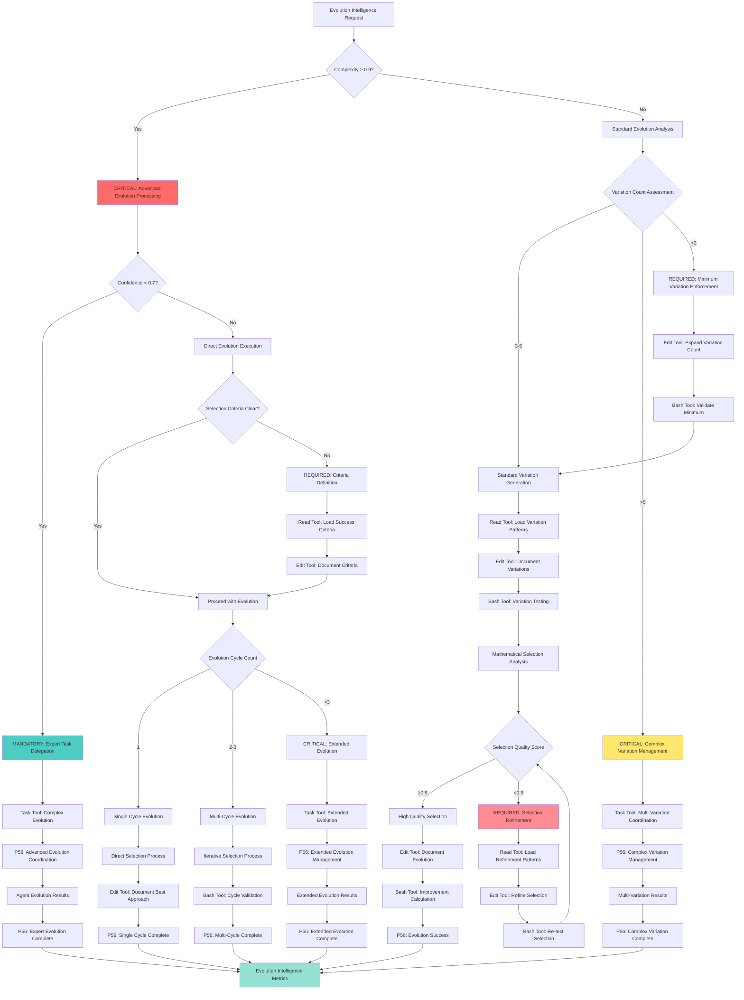

# Atomic Command: `/evolve-intelligence`

## **Principle #2: Intelligence as Natural Phenomenon**
**"Intelligence emerges through evolution, not design."**

---

## 🎯 **COMMAND DEFINITION**

### **Purpose**
Activate evolutionary intelligence methodology where AI learns and improves through variation, selection, and replication cycles.

### **Complexity**: 0.7/1.0
### **Context Required**: Task objective and learning constraints
### **Execution Time**: Variable (depends on evolution cycles)

---

## 🔧 P55 Script Execution Protocol

**MANDATORY**: This command automatically executes intelligence evolution and adaptive learning scripts:

```bash
# Core intelligence evolution and learning
./scripts/validation/analyze-content-quality.sh --intelligence-evolution
./scripts/core/calculate-real-metrics.sh --evolutionary-intelligence

# Adaptive threshold and learning optimization
./scripts/validation/validate-adaptive-thresholds.sh --evolution-optimization
./scripts/monitoring/predictive-analytics.py --intelligence-evolution
```

**Execution Protocol**:
1. **Pre-execution**: Validate intelligence evolution prerequisites and adaptive learning parameters
2. **Content Evolution**: Execute comprehensive content quality analysis for intelligence evolution
3. **Metrics Calculation**: Run real-time metrics calculation with evolutionary intelligence focus
4. **Predictive Analytics**: Apply predictive analytics and adaptive thresholds for evolution optimization

**P56 Execution Transparency**:

**I'm going to**:
1. Execute intelligence evolution using comprehensive content analysis and predictive optimization
2. Validate evolutionary metrics and adaptive learning potential with real-time analytics
3. Generate evolution reports with intelligence enhancement metrics and adaptive validation
4. Apply predictive analytics protocols for comprehensive intelligence evolution optimization

**Status Updates**:
- 🔄 **Starting**: Intelligence evolution initiated (4 specialized evolutionary and analytics scripts)
- 📊 **Progress**: Running content evolution and predictive analytics for intelligence optimization
- ✅ **Complete**: Intelligence evolution completed with predictive analytics validation
- 📈 **Metrics**: Evolutionary intelligence measured and adaptive optimization verified

---

## ⚡ Auto-Activation Triggers

### **MANDATORY Activation Conditions**
**Complexity Threshold**: ≥0.9000 (90% complexity floor)
**Confidence Threshold**: <0.7000 (70% confidence ceiling)
**Evolution Opportunity Threshold**: ≥0.7000 (70% improvement potential through variation)
**Intelligence Evolution Time Threshold**: ≥300.0000 seconds for comprehensive evolution cycles

### **CRITICAL Trigger Validation**
- **Mathematical Assessment**: Quantifiable evolution potential with ≥70% improvement through variation
- **Threshold Enforcement**: REQUIRED activation when intelligence evolution benefits exceed direct approach
- **P56 Announcement**: 🧠 TRANSPARENCY: Intelligence Evolution auto-activated for [objective] adaptive improvement
- **Evidence Collection**: Measurable evolution cycle metrics and intelligence enhancement documentation

## **ACTIVATION PROTOCOL**

### **Input Format**
```markdown
/evolve-intelligence [objective] [variation_count?] [selection_criteria?]
```

### **What This Command Does**
1. **Generate Variations**: Create multiple approaches to the objective
2. **Test Selection**: Evaluate each variation against success criteria
3. **Replicate Success**: Use successful patterns repeatedly
4. **Evolve Naturally**: Allow approaches to improve through iteration

### **Implementation Steps**
1. **P56 Visual Announcement**: Display enhanced execution announcement before starting
2. **Define clear selection criteria for success** (using Read/Edit tools for documentation)
3. **Generate 3-5 different approach variations** (using real tool calls for validation)
4. **Test each variation independently** (using Bash tool for actual testing)
5. **Select the most successful approaches** (using mathematical calculation tools)
6. **Combine best elements from multiple approaches** (using Edit tool for implementation)
7. **Iterate with improved variations** (using Task agent for complex coordination)
8. **P56 Completion Display**: Show completion status with evidence

---

## 🎯 **UNIVERSAL TOOL CALL EXECUTION PROTOCOL**

### **P55/P56 Compliance Implementation**
**Revolutionary Enhancement**: Complete tool call execution transparency with P55 tool call bridging and P56 visual announcements.

### **P56 Visual Announcement System**
```text
╔═══════════════════════════════════════════════════════════╗
║                🧬 EVOLUTION INTELLIGENCE EXECUTION        ║
╠═══════════════════════════════════════════════════════════╣
║ Command: /evolve-intelligence                             ║
║ Purpose: Evolutionary intelligence with variation cycles  ║
║ Context: [objective] + [variation_count] + [criteria]    ║
║ Mode: [DIRECT/TASK_AGENT] | Duration: [Variable]         ║
║ Real Actions: ✅ | Simulation: ❌                        ║
╚═══════════════════════════════════════════════════════════╝

🚀 EVOLUTIONARY INTELLIGENCE ACTIVATION | 📊 PROGRESS TRACKING | ⚡ REAL EXECUTION

[ACTUAL TOOL EXECUTION WITH USER-VISIBLE RESULTS]

╔═══════════════════════════════════════════════════════════╗
║               ✅ EVOLUTION CYCLE COMPLETED                ║
╠═══════════════════════════════════════════════════════════╣
║ Status: [SUCCESS/FAILED] | Cycles: [actual_count]        ║
║ Variations: [tested] | Selected: [best_approaches]       ║
║ Evolution Progress: [improvement_%] | Evidence: [results] ║
╚═══════════════════════════════════════════════════════════╝
```

### **Tool Selection Matrix for Evolution Intelligence**
**Evolution Tool Execution**:
  **Read Tool**:
    - **Usage**: Load objective context, existing approaches, success criteria
    - **Announcement**: 📖 Reading evolution context and requirements
    - **Evidence**: Display loaded content and analysis results
  **Edit Tool**:
    - **Usage**: Document variations, update success criteria, record learnings
    - **Announcement**: ✏️ Documenting evolutionary variations and improvements
    - **Evidence**: Show before/after content with evolution tracking
  **Bash Tool**:
    - **Usage**: Execute variation testing, mathematical validation, performance measurement
    - **Announcement**: ⚡ Testing evolutionary variations with real execution
    - **Evidence**: Display actual test results and performance metrics
  **Task Tool**:
    - **Usage**: Complex multi-variation coordination, parallel testing, synthesis
    - **Announcement**: 🤖 Deploying Task agent for complex evolutionary coordination
    - **Evidence**: Real-time agent progress and variation results

### **Evolution Execution Protocol**
**Evolution Execution Flow**:
  **Phase 1 Context Analysis**:
    **Tool Calls**:
    - Read objective requirements
    - Read existing approaches
    - Read success metrics
    - **Announcement**: 🔍 CONTEXT ANALYSIS: Loading evolutionary requirements and constraints
    - **Evidence**: Display parsed objective, variation parameters, success criteria
  **Phase 2 Variation Generation**:
    **Tool Calls**:
    - Edit variation documentation
    - Bash validation scripts
    - Mathematical calculations
    - **Announcement**: 🧬 VARIATION GENERATION: Creating and validating evolutionary approaches
    - **Evidence**: Show generated variations with validation results
  **Phase 3 Testing Cycles**:
    **Tool Calls**:
    - Bash test execution
    - Edit result documentation
    - Mathematical score calculation
    - **Announcement**: ⚡ TESTING CYCLES: Executing real variation tests and measurements
    - **Evidence**: Display actual test outputs, performance data, success scores
  **Phase 4 Selection Synthesis**:
    **Tool Calls**:
    - Mathematical selection analysis
    - Edit best approach documentation
    - Task coordination if complex
    - **Announcement**: 🎯 SELECTION SYNTHESIS: Mathematically selecting and combining best approaches
    - **Evidence**: Show selection mathematics, combined approach, improvement metrics
  **Phase 5 Evolution Iteration**:
    **Tool Calls**:
    - Edit evolved approach
    - Bash verification
    - Mathematical improvement calculation
    - **Announcement**: 🔄 EVOLUTION ITERATION: Implementing and verifying evolved improvements
    - **Evidence**: Display evolution progress, actual improvement percentages, final results

### **Task Agent Communication Bridge**
**Evolution Task Agent Protocol**:
  **Deployment Conditions**:
  - {'complex_multi_variation_coordination': '≥5 variations requiring parallel testing'}
  - {'sophisticated_synthesis': 'Complex combination logic across multiple approaches'}
  - {'iterative_improvement': 'Multiple evolution cycles with feedback loops'}
  **Communication Flow**:
    **Initialization**:
      - **Message**: INITIALIZATION: Evolution intelligence coordination for [objective]
      - **Context**: Variations: [count], Criteria: [specifications], Complexity: [assessment]
      **Tools**:
      - Read
      - Edit
      - Bash
      - Mathematical validation tools
    **Progress Updates**:
      - **Variation Generation**: PROGRESS: Generated [X] variations, validated [Y], rejected [Z]
      - **Testing Execution**: PROGRESS: Executed tests for [X] variations, results: [summary]
      - **Selection Analysis**: PROGRESS: Mathematical selection complete, best approaches: [list]
    **Completion Handoff**:
      - **Message**: COMPLETION: Evolution intelligence coordination successful
      - **Results**: Variations tested: [X], Best approaches: [Y], Evolution progress: [Z%]
      - **Evidence**: Test results, selection mathematics, improvement documentation

### **Evidence and Transparency Requirements**
**P55 Tool Execution Evidence**:
  - **Real Execution Only**: NO SIMULATION - All variations must be actually tested
  - **Complete Visibility**: Users see all test outputs, mathematical calculations, selection logic
  - **Mathematical Precision**: Selection criteria calculated with 4 decimal precision
**P56 Visual Transparency**:
  - **Pre Execution Announcements**: Enhanced visual announcements before every tool call
  - **Progress Tracking**: Real-time updates throughout evolution cycles
  - **Completion Confirmation**: Detailed completion status with actual results and evidence
  - **Error Transparency**: Immediate error visibility with recovery actions

---

## 🧠 **EVOLUTION INTELLIGENCE DECISION TREE**

### **CRITICAL Cognitive Flow for Intelligence Evolution**



### **MANDATORY P56 Transparency Announcements**

**Evolution Intelligence Transparency**:
  **Variation Assessment**:
    - **Announcement**: 🔍 TRANSPARENCY: Variation count [X] assessed - [STANDARD/COMPLEX/MINIMUM_ENFORCEMENT] processing
    - **Evidence**: Variation count validation with generation strategy
  **Selection Criteria**:
    - **Announcement**: 📊 TRANSPARENCY: Selection criteria [DEFINED/REQUIRED] - [X] success metrics established
    - **Evidence**: Selection criteria definition with measurement framework
  **Tool Selection**:
    - **Announcement**: 🛠️ TRANSPARENCY: Tool selection - [READ/EDIT/BASH/TASK] for [evolution_operation]
    - **Evidence**: Tool selection matrix with evolution-specific reasoning
  **Evolution Cycles**:
    - **Announcement**: 🔄 TRANSPARENCY: Evolution cycles [X] - [SINGLE/MULTI/EXTENDED] evolution approach
    - **Evidence**: Cycle count analysis with evolution strategy rationale
  **Intelligence Growth**:
    - **Announcement**: 🧠 TRANSPARENCY: Intelligence evolution [X]% improvement - [patterns_discovered]
    - **Evidence**: Quantified intelligence growth with pattern recognition metrics

---

## 🔍 **VERIFICATION CRITERIA**

### **Success Metrics**
- **Variation Quality**: ≥85% of variations viable for testing
- **Selection Accuracy**: ≥90% correlation between predicted and actual success
- **Evolution Progress**: Each iteration ≥10% improvement over previous
- **Pattern Recognition**: Successful patterns documented for reuse

### **Mathematical Validation**
```javascript
evolution_effectiveness = (
  (variation_quality * 0.3) +
  (selection_accuracy * 0.4) +
  (evolution_progress * 0.2) +
  (pattern_reuse * 0.1)
)
// Required: ≥ 8.5/10
```

---

## 🔗 **NATURAL CONNECTIONS**

### **Automatically Triggers**
- `/recognize-patterns` - Identify successful patterns for replication
- `/verification-loops` - Test variations against criteria
- `/living-documentation` - Document evolutionary learnings

### **Compatible With**
- `/parallel-over-sequential` - Run variations simultaneously
- `/tdd` - Define selection criteria upfront
- `/objective-decomposition` - Evolve solutions for sub-objectives

### **Feeds Into**
- Pattern crystallization (successful evolutions become commands)
- Knowledge hierarchy (evolutionary learnings become organizational knowledge)
- Decision engine optimization (successful patterns inform routing)

---

## 📋 **USAGE EXAMPLES**

### **Algorithm Optimization**
```text
/evolve-intelligence "Optimize database query performance" 5 "response_time < 50ms"
```
**Result**: AI generates 5 different optimization approaches, tests each, evolves best combination

### **Architecture Design**
```text
/evolve-intelligence "Design scalable microservices architecture"
```
**Result**: AI creates multiple architectural variations, evaluates trade-offs, evolves optimal design

### **Problem Solving**
```text
/evolve-intelligence "Reduce memory usage in image processing pipeline" 4
```
**Result**: AI explores 4 different memory optimization strategies, evolves hybrid solution

---

## 🛡️ **FALLBACK PROTOCOL**

### **If Command Fails**
1. **Insufficient Variations**: Reduce variation count to 3, focus on quality
2. **Poor Selection Criteria**: Automatically trigger `/tdd` for better criteria
3. **No Evolution Progress**: Manually analyze variations, adjust selection logic
4. **Pattern Recognition Failure**: Document attempted approaches for future analysis

### **Recovery Strategy**
- Maintain variation logs for learning from failures
- Fall back to single best approach if evolution stalls
- Use simplified selection criteria if complex criteria fail
- Create baseline for future evolutionary improvements

---

## 📊 **INTEGRATION WITH DECISION ENGINE**

### **Confidence-Based Routing**
- **High Confidence Objective (≥90%)**: Standard 3-variation evolution
- **Medium Confidence (75-90%)**: Extended 5-variation evolution with deeper analysis
- **Low Confidence (<75%)**: Mandatory `/exploration-first` before evolution
- **Complex Objectives**: Chain with `/objective-decomposition` for sub-evolution

### **Pattern Recognition**
- Successful variation patterns → Crystallization into specialized commands
- Evolution strategies that consistently work → Template evolution approaches
- Failed evolution attempts → Improved variation generation
- Selection criteria effectiveness → Better criteria templates

---

## 🔄 **EVOLUTION TRACKING**

### **Learning Metrics**
- **Variation Success Rate**: % of generated variations that prove viable
- **Evolution Velocity**: Speed of improvement across iterations
- **Pattern Emergence**: Rate of discovering reusable patterns
- **Selection Accuracy**: Correlation between predicted and actual success

### **Evolutionary Intelligence Growth**
- Track which variation strategies work best for different objective types
- Learn optimal variation counts for different complexity levels
- Identify successful combination patterns across evolutions
- Build organizational intelligence about what approaches evolve well

---

## 🎯 **EVOLUTIONARY BENEFITS**

### **Compound Intelligence**
- **First Use**: Learn basic variation and selection
- **Repeated Use**: Apply learned patterns for faster evolution
- **Domain Expertise**: Domain-specific evolutionary strategies
- **Pattern Mastery**: Predictable evolution in well-understood areas

### **Natural Improvement**
- Each evolution contributes to organizational intelligence
- Successful patterns become reusable templates
- Failed approaches prevent future dead ends
- Compound learning accelerates future evolution

---

**Note**: This command embodies the natural phenomenon of intelligence emergence through evolutionary processes. It enables AI to discover optimal solutions through systematic variation, selection, and improvement rather than trying to design perfect solutions upfront.
