# Atomic Command: `/knowledge-hierarchy`

## **Principle #4: Knowledge Discovery Hierarchy**
**"Systematic knowledge search from local to external, documenting everything for future reuse."**

---

## 🎯 **COMMAND DEFINITION**

### **Purpose**
Execute systematic knowledge discovery protocol that prioritizes existing codebase patterns before external research, documenting all findings for organizational intelligence growth.

### **Complexity**: 0.7/1.0
### **Context Required**: Project context and search objectives
### **Execution Time**: 2-10 minutes (depending on codebase size)

---

## ⚡ Auto-Activation Triggers

### **MANDATORY Activation Conditions**
**Complexity Threshold**: ≥0.9000 (90% complexity floor)
**Confidence Threshold**: <0.7000 (70% confidence ceiling)
**Knowledge Gap Threshold**: ≥0.4000 (40% missing knowledge requiring hierarchy search)
**Discovery Time Threshold**: ≥600.0000 seconds for comprehensive knowledge search

### **CRITICAL Trigger Validation**
- **Mathematical Assessment**: Quantifiable knowledge completeness with ≥60% existing knowledge discovery
- **Threshold Enforcement**: REQUIRED activation when knowledge gaps impede effective execution
- **P56 Announcement**: 📚 TRANSPARENCY: Knowledge Hierarchy auto-activated for [topic] systematic discovery
- **Evidence Collection**: Measurable knowledge discovery metrics and pattern documentation

## **ACTIVATION PROTOCOL**

### **Input Format**
```markdown
/knowledge-hierarchy [search_topic] [scope?] [depth?]
```

### **What This Command Does**
1. **Codebase-First Search**: Exhaustive search of existing patterns, solutions, and documentation
2. **Pattern Documentation**: Immediate capture of discovered patterns
3. **Gap Identification**: Determine what knowledge is missing
4. **External Research**: Only if internal search yields insufficient results
5. **Knowledge Integration**: Add findings to organizational memory

### **Mandatory Search Protocol**
1. **Local Documentation**: README, CLAUDE.md, inline docs
2. **Code Patterns**: Similar implementations, utilities, frameworks
3. **Configuration Files**: Build tools, dependencies, environment setup
4. **Test Patterns**: Existing test approaches and utilities
5. **External Research**: Only if steps 1-4 insufficient

---

## 🧠 **KNOWLEDGE HIERARCHY DECISION TREE**

### **CRITICAL Cognitive Flow for Knowledge Discovery**

```mermaid
graph TD
    A[Knowledge Discovery Request] --> B{Complexity ≥ 0.9?}
    B -->|Yes| C[CRITICAL: Advanced Knowledge Processing]
    B -->|No| D[Standard Knowledge Analysis]
    
    C --> E{Confidence < 0.7?}
    E -->|Yes| F[MANDATORY: Expert Task Delegation]
    E -->|No| G[Direct Knowledge Discovery]
    
    D --> H{Search Scope Assessment}
    H -->|Complete| I[Full Hierarchy Search]
    H -->|Partial| J[REQUIRED: Scope Expansion]
    
    F --> K[Task Tool: Complex Knowledge Discovery]
    K --> L[P56: Advanced Knowledge Coordination]
    
    G --> M[Phase 1: Internal Documentation]
    M --> N[Read Tool: Load Documentation]
    N --> O[Read Tool: Load Code Patterns]
    
    I --> P[Phase 1: Internal Search]
    P --> Q[Read Tool: Systematic Codebase Search]
    Q --> R[Edit Tool: Document Findings]
    
    J --> S[Read Tool: Load Search Context]
    S --> T[Edit Tool: Expand Scope]
    T --> I
    
    O --> U{Coverage Assessment}
    U -->|≥75%| V[Internal Search Complete]
    U -->|<75%| W[Phase 2: Gap Analysis]
    
    R --> X{Internal Coverage}
    X -->|≥90%| Y[Excellent Internal Coverage]
    X -->|75-90%| Z[Good Internal Coverage]
    X -->|<75%| AA[REQUIRED: External Research]
    
    W --> BB[Read Tool: Load Gap Patterns]
    BB --> CC[Edit Tool: Document Gaps]
    CC --> DD[Bash Tool: Gap Prioritization]
    
    Y --> EE[Edit Tool: Document Reuse Opportunities]
    EE --> FF[P56: Knowledge Discovery Success]
    
    Z --> GG[Edit Tool: Document Hybrid Approach]
    GG --> HH[Bash Tool: Integration Planning]
    HH --> II[P56: Hybrid Knowledge Success]
    
    AA --> JJ[Phase 3: External Research]
    JJ --> KK[Read Tool: Load External Sources]
    KK --> LL[Edit Tool: Integrate External]
    
    DD --> MM{Critical Gaps?}
    MM -->|Yes| JJ
    MM -->|No| NN[Edit Tool: Document Partial Solution]
    
    LL --> OO[Bash Tool: Knowledge Integration]
    OO --> PP[Edit Tool: Update Knowledge Base]
    PP --> QQ[P56: External Research Complete]
    
    NN --> RR[P56: Partial Knowledge Success]
    
    L --> SS[Agent Knowledge Results]
    SS --> TT[P56: Expert Knowledge Complete]
    
    FF --> UU[Knowledge Discovery Metrics]
    II --> UU
    QQ --> UU
    RR --> UU
    TT --> UU
    
    style C fill:#ff6b6b
    style F fill:#4ecdc4
    style AA fill:#ffe66d
    style MM fill:#ff8b94
    style UU fill:#95e1d3
```



### **MANDATORY P56 Transparency Announcements**

```yaml
knowledge_hierarchy_transparency:
  search_assessment:
    announcement: "🔍 TRANSPARENCY: Knowledge search scope [COMPLETE/PARTIAL] - [X]% coverage expected"
    evidence: "Search scope analysis with coverage prediction"
    
  internal_discovery:
    announcement: "📚 TRANSPARENCY: Internal coverage [X]% - [EXCELLENT/GOOD/EXTERNAL_REQUIRED]"
    evidence: "Systematic internal search results with coverage metrics"
    
  tool_selection:
    announcement: "🛠️ TRANSPARENCY: Tool selection - [READ/EDIT/BASH/TASK] for [knowledge_operation]"
    evidence: "Tool selection matrix with knowledge-specific reasoning"
    
  gap_analysis:
    announcement: "📊 TRANSPARENCY: Knowledge gaps [X] identified - [CRITICAL/MANAGEABLE] priority"
    evidence: "Gap analysis with prioritization and external research requirements"
    
  knowledge_integration:
    announcement: "🔄 TRANSPARENCY: Knowledge integration [SUCCESS/PARTIAL] - [X] patterns added"
    evidence: "Complete knowledge integration results with organizational learning"
```

---

## 🔍 **SYSTEMATIC SEARCH ALGORITHM**

### **Phase 1: Internal Knowledge Discovery**
```javascript
function searchCodebase(topic, scope) {
  const findings = {
    documentation: searchDocumentation(topic),
    code_patterns: searchCodePatterns(topic),
    similar_implementations: findSimilarImplementations(topic),
    utilities: identifyRelevantUtilities(topic),
    tests: findTestPatterns(topic),
    configuration: searchConfiguration(topic)
  }
  
  return consolidateFindings(findings)
}
```

### **Phase 2: Gap Analysis**
```javascript
function analyzeKnowledgeGaps(internal_findings, search_objective) {
  const coverage = calculateCoverage(internal_findings, search_objective)
  const gaps = identifyGaps(internal_findings, search_objective)
  const priority = prioritizeGaps(gaps)
  
  return {
    coverage_percentage: coverage,
    critical_gaps: gaps.filter(gap => gap.priority === 'high'),
    research_needed: coverage < 0.75
  }
}
```

### **Phase 3: External Research (If Needed)**
- Only triggered if internal coverage < 75%
- Focused search based on identified gaps
- Immediate documentation of external findings
- Integration with existing patterns

---

## 📋 **SEARCH METHODOLOGY**

### **Codebase Search Patterns**
1. **Exact Match Search**: Direct search for topic keywords
2. **Semantic Search**: Related concepts and synonyms
3. **Pattern Recognition**: Similar implementation patterns
4. **Dependency Analysis**: Related libraries and frameworks
5. **Historical Analysis**: Git history for evolution patterns

### **Documentation Hierarchy**
1. **Project Documentation**: README, docs/, CLAUDE.md
2. **Inline Documentation**: Comments, docstrings, type annotations
3. **Configuration Documentation**: Package.json, requirements.txt, etc.
4. **External Documentation**: Only after exhausting internal sources

---

## 🛠️ **STANDARDIZED TOOL SELECTION CRITERIA**

### **MANDATORY Tool Selection Matrix**

**Quantifiable Decision Framework:**
```yaml
tool_selection_criteria:
  READ_tool_usage:
    file_count: "≤3 files for direct analysis"
    complexity: "<0.7000 (straightforward operations)"
    scope: "Well-defined, single-purpose operations"
    time_constraint: "≤300 seconds execution window"
    
  TASK_tool_usage:
    file_count: "≥4 files or unknown scope"
    complexity: "≥0.7000 (complex operations)"
    scope: "Multi-step, exploratory, or research operations"
    time_constraint: ">300 seconds or open-ended analysis"
    
  other_tools:
    GREP: "Pattern search across multiple files"
    GLOB: "File pattern matching and discovery"
    BASH: "System operations and automation"
```

### **CRITICAL Tool Selection Logic**

**Evidence-Based Selection Process:**
1. **Complexity Assessment**: Calculate quantifiable complexity using knowledge discovery hierarchy metrics
2. **Scope Validation**: Measure file count and operation scope boundaries
3. **P56 Announcement**: Visual confirmation of tool selection reasoning
4. **Evidence Collection**: Document measurable tool selection criteria

**Mathematical Tool Selection Formula:**
```javascript
function determineOptimalTool(request) {
  const complexity = calculateKnowledgeDiscoveryComplexity(request)
  const fileCount = estimateFileScope(request)
  const timeConstraint = assessTimeRequirements(request)
  
  if (fileCount <= 3 && complexity < 0.7 && timeConstraint <= 300) {
    return { tool: 'READ', confidence: 0.9, reasoning: 'Direct knowledge analysis suitable' }
  }
  
  if (fileCount >= 4 || complexity >= 0.7 || timeConstraint > 300) {
    return { tool: 'TASK', confidence: 0.9, reasoning: 'Complex knowledge discovery required' }
  }
  
  return { tool: 'MIXED', confidence: 0.7, reasoning: 'Hybrid knowledge approach needed' }
}
```

**P56 Transparency Requirements:**
- **MANDATORY Announcement**: "🛠️ TRANSPARENCY: Tool selection - [TOOL] for [operation] based on [criteria]"
- **REQUIRED Evidence**: "Quantifiable metrics: Files=[X], Complexity=[Y], Scope=[Z]"
- **CRITICAL Justification**: "Selection reasoning: [evidence-based explanation]"

---

## 🔍 **VERIFICATION CRITERIA**

### **Success Metrics**
- **Codebase Coverage**: ≥90% of relevant internal patterns discovered
- **Documentation Quality**: All findings documented with context
- **Search Efficiency**: ≥85% of useful patterns found in internal search
- **Knowledge Reuse**: New learnings integrated into existing knowledge base

### **Search Completeness Validation**
```javascript
function validateSearchCompleteness(findings, topic) {
  const completeness_score = (
    findings.documentation_coverage * 0.2 +
    findings.code_pattern_coverage * 0.3 +
    findings.utility_coverage * 0.2 +
    findings.test_coverage * 0.2 +
    findings.configuration_coverage * 0.1
  )
  
  return completeness_score >= 0.85
}
```

---

## 📚 **KNOWLEDGE DOCUMENTATION PROTOCOL**

### **Immediate Documentation Format**
```markdown
## Knowledge Discovery: [Topic]
**Search Date**: [timestamp]
**Scope**: [search scope]

### Internal Findings
- **Existing Patterns**: [list with file references]
- **Utilities Available**: [list with usage examples]
- **Similar Implementations**: [references with differences noted]
- **Test Patterns**: [existing test approaches]
- **Configuration**: [relevant config patterns]

### Gaps Identified
- **Missing Patterns**: [what wasn't found internally]
- **External Research Needed**: [specific research requirements]

### Recommendations
- **Reuse Opportunities**: [how to leverage existing patterns]
- **Extension Needs**: [how existing patterns need modification]
- **New Development**: [what needs to be built from scratch]
```

### **Living Documentation Integration**
- Add findings to project knowledge base
- Update CLAUDE.md with new patterns discovered
- Create reference links for future searches
- Contribute to organizational intelligence growth

---

## 🔗 **NATURAL CONNECTIONS**

### **Automatically Triggers**
- `/recognize-patterns` - Identify reusable patterns from findings
- `/living-documentation` - Document discoveries for future reuse
- `/single-source-truth` - Ensure no duplication of existing patterns

### **Compatible With**
- `/exploration-first` - Provides knowledge foundation for exploration
- `/context-over-commands` - Enriches context with discovered patterns
- `/objective-decomposition` - Informs breakdown based on existing capabilities

### **Feeds Into**
- `/tdd` - Existing test patterns inform testing approach
- `/parallel-over-sequential` - Discovered utilities enable parallel development
- `/crystallize-patterns` - Successful patterns become reusable commands

---

## 📋 **USAGE EXAMPLES**

### **Feature Implementation Search**
```text
/knowledge-hierarchy "user authentication" "backend" "comprehensive"
```
**Result**: Discovers existing auth utilities, session management patterns, user models, test approaches

### **Technology Integration Search**
```text
/knowledge-hierarchy "database optimization" "performance" "deep"
```
**Result**: Finds existing ORM patterns, query optimization utilities, performance test setups

### **Pattern Discovery Search**
```text
/knowledge-hierarchy "error handling" "frontend" "patterns"
```
**Result**: Discovers error boundary patterns, API error handling, user notification systems

---

## 🛡️ **FALLBACK PROTOCOL**

### **If Internal Search Insufficient**
1. **Expand Search Scope**: Include related concepts and broader patterns
2. **Historical Analysis**: Examine git history for pattern evolution
3. **Dependency Research**: Research external libraries for patterns
4. **External Research**: Focused research based on specific gaps identified

### **Search Failure Recovery**
- Document what was searched (avoid future redundant searches)
- Identify why patterns weren't found (naming, organization, etc.)
- Suggest improvements to code organization
- Create pattern documentation for future implementations

---

## 📊 **INTEGRATION WITH DECISION ENGINE**

### **Confidence Routing**
- **High Internal Coverage (>90%)**: Direct implementation using existing patterns
- **Medium Coverage (75-90%)**: Hybrid approach combining existing and new patterns
- **Low Coverage (<75%)**: Trigger external research before implementation
- **No Relevant Patterns**: Full exploration and documentation required

### **Search Optimization**
- **Previous Search Results**: Reuse documented findings from similar searches
- **Pattern Database**: Maintain searchable database of discovered patterns
- **Search History**: Learn from previous searches to improve efficiency
- **Automated Suggestions**: Suggest related searches based on current findings

---

## 🔄 **EVOLUTION TRACKING**

### **Learning Metrics**
- **Search Success Rate**: % of searches that find usable internal patterns
- **Reuse Rate**: How often discovered patterns are actually used
- **Documentation Quality**: Usefulness of documented findings for future searches
- **Knowledge Base Growth**: Rate of new pattern addition to organizational memory

### **Pattern Recognition**
- Frequently searched topics → Candidates for better documentation
- Common gaps → Areas needing pattern development
- Reusable search strategies → Crystallization into search templates
- Successful pattern reuse → Validation of documentation quality

---

## 🎯 **ORGANIZATIONAL INTELLIGENCE**

### **Knowledge Base Building**
- Every search contributes to organizational knowledge
- Pattern documentation becomes searchable for future use
- Knowledge gaps inform development priorities
- Search patterns improve for similar future searches

### **Efficiency Compound Growth**
- First search in area: Full exploration required
- Second search: Leverage previous documentation
- Third+ search: Rapidly find and reuse established patterns
- Organizational learning accelerates over time

---

**Note**: This command embodies the Context Engineering principle of building on existing knowledge before creating new solutions, enabling exponential organizational intelligence growth through systematic knowledge discovery and documentation.