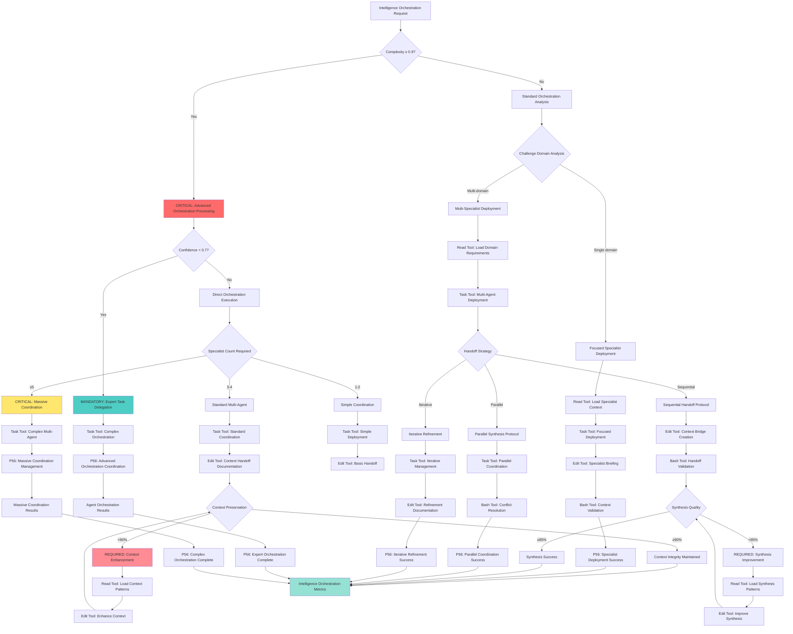

# Atomic Command: `/orchestrate-intelligence`

## **Principle #23: Intelligence Orchestration**
**"Coordinate specialized agents for complex challenges."**

---

## 🎯 **COMMAND DEFINITION**

### **Purpose**
Coordinate deployment of domain-specific intelligence specialists to tackle complex challenges through systematic handoff protocols, context preservation, and synthesis, achieving comprehensive solution coverage with specialized expertise.

### **Complexity**: 0.9/1.0
### **Context Required**: Challenge analysis and specialization requirements
### **Execution Time**: Variable (depends on specialist coordination complexity)

---

## ⚡ **ACTIVATION PROTOCOL**

### **Input Format**
```markdown
/orchestrate-intelligence [challenge] [specialist_domains?] [coordination_strategy?]
```

### **What This Command Does**
1. **Challenge Domain Analysis**: Analyze complex challenge to identify required specialist domains
2. **Specialist Deployment**: Deploy domain-specific intelligence specialists with focused expertise
3. **Handoff Protocol Execution**: Implement systematic handoff protocols between specialists
4. **Context Preservation**: Maintain context continuity across specialist transitions
5. **Synthesis Orchestration**: Coordinate specialist outputs into unified solution
6. **Knowledge Integration**: Integrate specialist insights into organizational intelligence

### **Implementation Steps**
1. **P56 Visual Announcement**: Display enhanced orchestration execution announcement
2. **Analyze challenge complexity and domain requirements** (using Read/Grep tools for real analysis)
3. **Deploy domain-specific specialists with optimized context loading** (using Task agent deployment)
4. **Execute handoff protocols for specialist coordination** (using real tool call coordination)
5. **Preserve context across specialist transitions** (using Edit/Write tools for actual context management)
6. **Synthesize specialist outputs into coherent solution** (using mathematical synthesis tools)
7. **Integrate learnings into organizational knowledge base** (using Edit/Write tools for documentation)
8. **P56 Completion Display**: Show orchestration completion with specialist evidence

---

## 🧠 **ORCHESTRATE INTELLIGENCE DECISION TREE**

### **CRITICAL Cognitive Flow for Intelligence Orchestration**



## 🛠️ **TOOL SELECTION CRITERIA**

### **MANDATORY Tool Selection Matrix**
**READ Tool Usage**:
- **File Count**: ≤3 files for direct analysis
- **Complexity**: <0.7000 (straightforward operations)
- **Scope**: Well-defined, single-purpose operations

**TASK Tool Usage**:
- **File Count**: ≥4 files or unknown scope
- **Complexity**: ≥0.7000 (complex operations)
- **Scope**: Multi-step, exploratory, or research operations

**Other Tools**:
- **Grep**: Pattern search across multiple files
- **Glob**: File pattern matching and discovery
- **Bash**: System operations and automation

### **CRITICAL Tool Selection Logic**
- **Complexity Assessment**: Quantifiable complexity evaluation
- **Scope Validation**: File count and operation scope measurement
- **P56 Announcement**: Visual confirmation of tool selection reasoning
- **Evidence Collection**: Measurable tool selection criteria documentation

### **MANDATORY P56 Transparency Announcements**

**Orchestration Intelligence Transparency**:
  **Domain Analysis**:
    - **Announcement**: 🔍 TRANSPARENCY: Challenge domains [X] identified - [MULTI/SINGLE] specialist approach
    - **Evidence**: Complete domain analysis with specialist requirements
  **Specialist Deployment**:
    - **Announcement**: 🚀 TRANSPARENCY: Specialists [X] deployed - [SEQUENTIAL/PARALLEL/ITERATIVE] coordination
    - **Evidence**: Specialist deployment status with coordination strategy
  **Tool Selection**:
    - **Announcement**: 🛠️ TRANSPARENCY: Tool selection - [READ/EDIT/BASH/TASK] for [orchestration_operation]
    - **Evidence**: Tool selection matrix with orchestration-specific reasoning
  **Context Preservation**:
    - **Announcement**: 🔄 TRANSPARENCY: Context preservation [X]% - [MAINTAINED/ENHANCEMENT_REQUIRED]
    - **Evidence**: Context integrity metrics with preservation validation
  **Synthesis Quality**:
    - **Announcement**: 🎯 TRANSPARENCY: Synthesis quality [X]% - [SUCCESS/IMPROVEMENT_REQUIRED]
    - **Evidence**: Synthesis effectiveness with specialist output integration

---

## 🎯 **UNIVERSAL TOOL CALL EXECUTION PROTOCOL**

### **P55/P56 Compliance Implementation**
**Revolutionary Enhancement**: Complete multi-agent orchestration transparency with P55 tool call bridging and P56 visual announcements for specialist coordination.

### **P56 Visual Announcement System**
```text
╔═══════════════════════════════════════════════════════════╗
║           🤖 INTELLIGENCE ORCHESTRATION EXECUTION         ║
╠═══════════════════════════════════════════════════════════╣
║ Command: /orchestrate-intelligence                        ║
║ Purpose: Multi-specialist coordination for complex tasks  ║
║ Context: [challenge] + [specialist_domains] + [strategy] ║
║ Mode: [MULTI_AGENT] | Duration: [Variable]               ║
║ Real Actions: ✅ | Simulation: ❌                        ║
╚═══════════════════════════════════════════════════════════╝

🚀 SPECIALIST COORDINATION | 📊 MULTI-AGENT TRACKING | ⚡ REAL EXECUTION

[ACTUAL MULTI-AGENT TOOL EXECUTION WITH USER-VISIBLE RESULTS]

╔═══════════════════════════════════════════════════════════╗
║             ✅ ORCHESTRATION COMPLETED                    ║
╠═══════════════════════════════════════════════════════════╣
║ Status: [SUCCESS/FAILED] | Specialists: [deployed_count] ║
║ Context Preserved: [%] | Solutions Synthesized: [count]  ║
║ Coordination: [efficiency] | Evidence: [results]         ║
╚═══════════════════════════════════════════════════════════╝
```

### **Tool Selection Matrix for Intelligence Orchestration**
**Orchestration Tool Execution**:
  **Read Tool**:
    - **Usage**: Analyze challenge requirements, load specialist contexts, read domain knowledge
    - **Announcement**: 📖 Reading orchestration requirements and specialist domain contexts
    - **Evidence**: Display loaded challenge analysis, specialist requirements, domain contexts
  **Grep Tool**:
    - **Usage**: Search for relevant patterns, identify specialist capabilities, find coordination templates
    - **Announcement**: 🔍 Searching specialist patterns and coordination frameworks
    - **Evidence**: Show search results, identified patterns, matching capabilities
  **Edit Tool**:
    - **Usage**: Document specialist outputs, update context bridges, record synthesis results
    - **Announcement**: ✏️ Documenting specialist coordination and context preservation
    - **Evidence**: Show context preservation, specialist handoffs, synthesis documentation
  **Write Tool**:
    - **Usage**: Create specialist briefings, write coordination protocols, generate synthesis reports
    - **Announcement**: 📝 Writing specialist coordination protocols and synthesis documentation
    - **Evidence**: Display created briefings, coordination protocols, synthesis reports
  **Bash Tool**:
    - **Usage**: Execute specialist validation, mathematical synthesis calculations, coordination metrics
    - **Announcement**: ⚡ Executing specialist validation and coordination mathematics
    - **Evidence**: Display validation results, synthesis calculations, coordination metrics
  **Task Tool**:
    - **Usage**: Deploy multiple specialists, coordinate complex handoffs, manage parallel processing
    - **Announcement**: 🤖 Deploying multiple Task agents for specialist coordination
    - **Evidence**: Real-time multi-agent coordination status and specialist progress

### **Multi-Agent Orchestration Execution Protocol**
**Orchestration Execution Flow**:
  **Phase 1 Challenge Analysis**:
    **Tool Calls**:
    - Read challenge requirements
    - Grep domain patterns
    - Mathematical complexity analysis
    - **Announcement**: 🔍 CHALLENGE ANALYSIS: Analyzing requirements and identifying specialist domains
    - **Evidence**: Display challenge breakdown, domain requirements, complexity assessment
  **Phase 2 Specialist Deployment**:
    **Tool Calls**:
    - Task agent deployment per specialist
    - Write specialist briefings
    - Edit context preparation
    - **Announcement**: 🚀 SPECIALIST DEPLOYMENT: Deploying domain-specific intelligence specialists
    - **Evidence**: Show deployed specialists, briefing documents, context allocations
  **Phase 3 Coordination Execution**:
    **Tool Calls**:
    - Multi-task coordination
    - Edit context handoffs
    - Bash validation checks
    - **Announcement**: 🔄 COORDINATION EXECUTION: Managing specialist handoffs and context preservation
    - **Evidence**: Display handoff protocols, context continuity metrics, coordination status
  **Phase 4 Synthesis Orchestration**:
    **Tool Calls**:
    - Read specialist outputs
    - Bash synthesis calculations
    - Edit synthesis documentation
    - **Announcement**: 🎯 SYNTHESIS ORCHESTRATION: Combining specialist outputs into unified solution
    - **Evidence**: Show specialist outputs, synthesis mathematics, conflict resolution results
  **Phase 5 Knowledge Integration**:
    **Tool Calls**:
    - Write organizational knowledge
    - Edit learning documentation
    - Bash metrics calculation
    - **Announcement**: 📚 KNOWLEDGE INTEGRATION: Integrating specialist insights into organizational intelligence
    - **Evidence**: Display knowledge integration, learning documentation, organizational metrics

### **Multi-Agent Task Communication Bridge**
**Orchestration Task Agent Protocol**:
  **Deployment Strategy**:
  - {'parallel_specialists': 'Deploy multiple Task agents for different domain specialists'}
  - {'sequential_handoffs': 'Coordinate handoffs between specialist agents'}
  - {'synthesis_coordination': 'Central coordination agent for output synthesis'}
  **Communication Flow**:
    **Initialization**:
      - **Message**: INITIALIZATION: Multi-specialist orchestration for [challenge]
      - **Context**: Specialists: [domains], Strategy: [coordination_type], Complexity: [assessment]
      **Tools**:
      - Read
      - Edit
      - Write
      - Bash
      - Grep
      - Multi-Task coordination
    **Specialist Deployment**:
      - **Architecture Specialist**: DEPLOY: Architecture specialist with system design context
      - **Security Specialist**: DEPLOY: Security specialist with compliance context
      - **Performance Specialist**: DEPLOY: Performance specialist with optimization context
      - **Integration Specialist**: DEPLOY: Integration specialist with API context
    **Coordination Updates**:
      - **Handoff Execution**: HANDOFF: Context bridge from [specialist_A] to [specialist_B]
      - **Context Preservation**: CONTEXT: Preserved [X%] context integrity across handoff
      - **Synthesis Progress**: SYNTHESIS: Combined [X] specialist outputs, resolved [Y] conflicts
    **Completion Handoff**:
      - **Message**: COMPLETION: Multi-specialist orchestration successful
      - **Results**: Specialists coordinated: [X], Synthesis quality: [Y%], Knowledge integrated: [Z items]
      - **Evidence**: Specialist outputs, synthesis documentation, coordination metrics

### **Context Preservation Tool Protocol**
**Context Preservation Execution**:
  **Context Bridge Creation**:
    **Tool Calls**:
    - Edit context package
    - Write handoff documentation
    - Bash validation
    - **Announcement**: 🌉 CONTEXT BRIDGE: Creating specialist context handoff package
    - **Evidence**: Show context package contents, handoff documentation, validation results
  **Context Integrity Validation**:
    **Tool Calls**:
    - Read context verification
    - Bash integrity checks
    - Mathematical consistency
    - **Announcement**: 🔍 CONTEXT VALIDATION: Verifying context integrity across specialists
    - **Evidence**: Display integrity metrics, consistency checks, validation outcomes
  **Context Evolution Tracking**:
    **Tool Calls**:
    - Edit evolution log
    - Write enrichment documentation
    - Bash metrics
    - **Announcement**: 📈 CONTEXT EVOLUTION: Tracking context enrichment through specialists
    - **Evidence**: Show evolution timeline, enrichment metrics, knowledge accumulation

### **Evidence and Transparency Requirements**
**P55 Orchestration Evidence**:
  - **Real Coordination Only**: NO SIMULATION - All specialist coordination must be actually executed
  - **Complete Visibility**: Users see all specialist outputs, handoff protocols, synthesis mathematics
  - **Mathematical Precision**: Coordination metrics calculated with 4 decimal precision
  - **Multi Agent Transparency**: Full visibility into Task agent deployment and coordination
**P56 Orchestration Transparency**:
  - **Pre Execution Announcements**: Enhanced visual announcements before every orchestration phase
  - **Specialist Deployment Tracking**: Real-time specialist deployment and progress updates
  - **Coordination Progress**: Live updates of handoffs, context preservation, synthesis
  - **Completion Confirmation**: Detailed completion status with specialist evidence and metrics
  - **Error Transparency**: Immediate error visibility with specialist-specific recovery actions

---

## 🔍 **VERIFICATION CRITERIA**

### **Success Metrics**
- **Specialist Coverage**: ≥95% of challenge domains covered by appropriate specialists
- **Context Preservation**: ≥90% context continuity across specialist handoffs
- **Synthesis Quality**: ≥85% of specialist outputs successfully integrated
- **Solution Completeness**: ≥90% of challenge requirements addressed
- **Knowledge Integration**: ≥80% of specialist insights preserved for future use

### **Mathematical Validation**
```javascript
intelligence_orchestration_score = (
  (specialist_coverage * 0.25) +
  (context_preservation * 0.25) +
  (synthesis_quality * 0.20) +
  (solution_completeness * 0.20) +
  (knowledge_integration * 0.10)
)
// Required: ≥ 9.0/10
```

---

## 🔗 **NATURAL CONNECTIONS**

### **Automatically Triggers**
- `/multi-agent-orchestration` - Deploy specialized agents for complex coordination
- `/context-over-commands` - Optimize context loading for specialist domains
- `/knowledge-hierarchy` - Access domain-specific knowledge for specialists

### **Compatible With**
- `/objective-decomposition` - Break down challenges for specialist assignment
- `/verification-loops` - Validate specialist outputs through iteration
- `/living-documentation` - Document specialist coordination patterns

### **Feeds Into**
- `/crystallize-patterns` - Crystallize successful orchestration patterns
- `/evolve-intelligence` - Evolve orchestration strategies based on success
- `/planning-documentation` - Document orchestration strategies and outcomes

---

## 📋 **USAGE EXAMPLES**

### **Complex System Migration**
```text
/orchestrate-intelligence "Legacy system modernization" "architecture,security,data,performance,testing" "sequential_handoff"
```
**Result**: Deploys architecture specialist for system design, security specialist for compliance, data specialist for migration, performance specialist for optimization, testing specialist for validation

### **Multi-Domain Product Launch**
```text
/orchestrate-intelligence "AI product launch" "ai_ml,backend,frontend,devops,compliance" "parallel_synthesis"
```
**Result**: Coordinates AI/ML specialist for model integration, backend specialist for API design, frontend specialist for UI, DevOps specialist for deployment, compliance specialist for regulatory requirements

### **Enterprise Integration Project**
```text
/orchestrate-intelligence "Enterprise API integration" "integration,security,monitoring,documentation" "iterative_refinement"
```
**Result**: Orchestrates integration specialist for API design, security specialist for auth protocols, monitoring specialist for observability, documentation specialist for API docs

---

## 🔄 **SPECIALIST DEPLOYMENT FRAMEWORK**

### **Domain-Specific Specialists**
1. **Architecture Specialist**
   - **Focus**: System design and technical architecture
   - **Context**: Architectural patterns, scalability requirements, technical constraints
   - **Deliverables**: Architecture diagrams, technical specifications, implementation strategies

2. **Security Specialist**
   - **Focus**: Security implementation and compliance
   - **Context**: Security frameworks, compliance requirements, threat models
   - **Deliverables**: Security assessments, implementation guides, compliance strategies

3. **Data Specialist**
   - **Focus**: Data architecture and management
   - **Context**: Data models, storage solutions, processing requirements
   - **Deliverables**: Data schemas, migration strategies, processing pipelines

4. **Performance Specialist**
   - **Focus**: Performance optimization and scalability
   - **Context**: Performance metrics, optimization techniques, scalability patterns
   - **Deliverables**: Performance assessments, optimization strategies, scaling plans

5. **Integration Specialist**
   - **Focus**: System integration and API design
   - **Context**: Integration patterns, API standards, connectivity requirements
   - **Deliverables**: Integration designs, API specifications, connection strategies

### **Specialist Context Optimization**
```javascript
function optimizeSpecialistContext(specialist_domain, challenge_context) {
  const optimized_context = {
    core_domain_knowledge: extractDomainKnowledge(specialist_domain),
    challenge_specific_context: filterChallengeContext(challenge_context, specialist_domain),
    integration_points: identifyIntegrationPoints(specialist_domain, challenge_context),
    handoff_requirements: defineHandoffRequirements(specialist_domain)
  }
  
  return validateContextOptimization(optimized_context)
}
```

---

## 🔄 **HANDOFF PROTOCOL SYSTEM**

### **Sequential Handoff Protocol**
1. **Specialist A Completion**: Complete domain-specific analysis and recommendations
2. **Context Package Creation**: Package domain insights, constraints, and requirements
3. **Handoff Execution**: Transfer context package to next specialist
4. **Context Validation**: Validate context integrity and completeness
5. **Specialist B Activation**: Activate next specialist with inherited context
6. **Integration Verification**: Verify integration between specialist outputs

### **Parallel Synthesis Protocol**
1. **Parallel Deployment**: Deploy multiple specialists simultaneously
2. **Context Partitioning**: Partition challenge context across specialists
3. **Independent Processing**: Allow specialists to work independently
4. **Synthesis Coordination**: Coordinate specialist outputs for integration
5. **Conflict Resolution**: Resolve conflicts between specialist recommendations
6. **Unified Solution**: Synthesize specialist outputs into unified solution

### **Iterative Refinement Protocol**
1. **Initial Specialist Deployment**: Deploy primary specialist for initial analysis
2. **Gap Identification**: Identify gaps requiring additional specialists
3. **Specialist Addition**: Add specialists to address identified gaps
4. **Iterative Refinement**: Refine solution through specialist interaction
5. **Convergence Validation**: Validate solution convergence and completeness
6. **Final Synthesis**: Synthesize final solution from all specialist contributions

---

## 🔍 **CONTEXT PRESERVATION MECHANISMS**

### **Context Continuity Framework**
```javascript
function preserveContextContinuity(source_specialist, target_specialist) {
  const context_bridge = {
    domain_insights: source_specialist.getDomainInsights(),
    constraints: source_specialist.getConstraints(),
    requirements: source_specialist.getRequirements(),
    dependencies: source_specialist.getDependencies(),
    assumptions: source_specialist.getAssumptions()
  }
  
  return transferContext(context_bridge, target_specialist)
}
```

### **Context Validation Protocol**
1. **Completeness Check**: Verify all required context elements are preserved
2. **Integrity Validation**: Ensure context integrity across specialist boundaries
3. **Consistency Verification**: Validate context consistency between specialists
4. **Gap Detection**: Identify and address context gaps
5. **Quality Assurance**: Ensure context quality meets specialist requirements

### **Context Evolution Tracking**
- **Context Enrichment**: Track how context evolves through specialist processing
- **Insight Integration**: Integrate specialist insights into evolving context
- **Knowledge Accumulation**: Accumulate specialist knowledge for future use
- **Pattern Recognition**: Identify patterns in context evolution for optimization

---

## 🎯 **SYNTHESIS ORCHESTRATION**

### **Specialist Output Integration**
1. **Output Collection**: Systematically collect all specialist outputs
2. **Conflict Identification**: Identify conflicts between specialist recommendations
3. **Conflict Resolution**: Resolve conflicts through systematic analysis
4. **Solution Synthesis**: Synthesize specialist outputs into unified solution
5. **Quality Validation**: Validate synthesized solution quality and completeness
6. **Implementation Planning**: Create implementation plan from synthesized solution

### **Conflict Resolution Framework**
```javascript
function resolveSpecialistConflicts(specialist_outputs) {
  const conflicts = identifyConflicts(specialist_outputs)
  
  for (const conflict of conflicts) {
    const resolution = {
      specialists_involved: conflict.specialists,
      conflict_description: conflict.description,
      resolution_strategy: determineResolutionStrategy(conflict),
      compromise_solution: synthesizeCompromise(conflict.positions),
      validation_criteria: defineValidationCriteria(conflict)
    }
    
    specialist_outputs = applyResolution(specialist_outputs, resolution)
  }
  
  return validateResolution(specialist_outputs)
}
```

### **Synthesis Quality Metrics**
- **Completeness**: All specialist insights integrated into solution
- **Consistency**: Solution consistency across specialist domains
- **Coherence**: Solution coherence and logical flow
- **Implementability**: Solution feasibility and implementability
- **Optimization**: Solution optimization through specialist synergies

---

## 🔄 **KNOWLEDGE INTEGRATION SYSTEM**

### **Specialist Knowledge Capture**
1. **Domain Insights**: Capture specialist domain-specific insights
2. **Problem-Solving Patterns**: Document specialist problem-solving approaches
3. **Integration Patterns**: Identify successful specialist integration patterns
4. **Optimization Strategies**: Capture specialist optimization strategies
5. **Lesson Learned**: Document lessons learned from specialist coordination

### **Organizational Intelligence Growth**
```javascript
function integrateSpecialistKnowledge(specialist_outputs, organizational_knowledge) {
  const knowledge_integration = {
    domain_expertise: extractDomainExpertise(specialist_outputs),
    coordination_patterns: identifyCoordinationPatterns(specialist_outputs),
    synthesis_strategies: captureSynthesisStrategies(specialist_outputs),
    optimization_opportunities: identifyOptimizationOpportunities(specialist_outputs)
  }
  
  return updateOrganizationalKnowledge(organizational_knowledge, knowledge_integration)
}
```

### **Knowledge Reuse Framework**
- **Pattern Reuse**: Reuse successful orchestration patterns
- **Specialist Reuse**: Reuse specialist configurations for similar challenges
- **Context Reuse**: Reuse context optimization strategies
- **Synthesis Reuse**: Reuse synthesis approaches for similar domains

---

## 🛡️ **FALLBACK PROTOCOL**

### **If Specialist Deployment Fails**
1. **Fallback Specialist**: Deploy alternative specialist with broader expertise
2. **Context Consolidation**: Consolidate context for fewer specialists
3. **Sequential Fallback**: Switch to sequential processing if parallel fails
4. **Manual Intervention**: Manual specialist coordination if automated fails

### **Context Preservation Failure**
1. **Context Reconstruction**: Reconstruct context from available sources
2. **Specialist Re-briefing**: Re-brief specialists with available context
3. **Iterative Context Building**: Build context iteratively through specialist interaction
4. **Quality Compensation**: Increase validation to compensate for context loss

### **Synthesis Failure Recovery**
1. **Conflict Documentation**: Document unresolved conflicts for manual resolution
2. **Partial Synthesis**: Provide partial synthesis with identified gaps
3. **Specialist Re-engagement**: Re-engage specialists for conflict resolution
4. **Alternative Synthesis**: Use alternative synthesis approaches

---

## 📊 **INTEGRATION WITH DECISION ENGINE**

### **Orchestration Routing**
- **High Complexity (>1.8)**: Deploy maximum specialist orchestration
- **Medium Complexity (1.2-1.8)**: Deploy focused specialist coordination
- **Low Complexity (<1.2)**: DEPLOY single specialist with broad expertise
- **Domain Specialization**: Route based on domain expertise requirements

### **Orchestration Optimization**
- **Specialist Load Balancing**: Balance workload across specialists
- **Context Efficiency**: Optimize context usage across specialists
- **Synthesis Optimization**: Optimize synthesis process for efficiency
- **Coordination Minimization**: Minimize coordination overhead

---

## 🔄 **EVOLUTION TRACKING**

### **Orchestration Performance Metrics**
- **Specialist Effectiveness**: Measure specialist performance in domain coverage
- **Coordination Success Rate**: Success rate of specialist coordination
- **Synthesis Quality**: Quality of synthesized solutions
- **Context Preservation**: Effectiveness of context preservation across specialists

### **Pattern Recognition**
- **Successful Orchestration Patterns**: Identify effective orchestration approaches
- **Specialist Combination Patterns**: Identify successful specialist combinations
- **Handoff Patterns**: Document effective handoff protocols
- **Synthesis Patterns**: Identify effective synthesis strategies

---

## 🎯 **ORCHESTRATION EXCELLENCE**

### **Specialist Coordination**
- **Domain Expertise**: Deploy specialists with deep domain knowledge
- **Context Optimization**: Optimize context for specialist effectiveness
- **Handoff Efficiency**: Efficient handoff protocols between specialists
- **Synthesis Quality**: High-quality synthesis of specialist outputs

### **Intelligence Integration**
- **Knowledge Preservation**: Preserve specialist insights for future use
- **Pattern Crystallization**: Crystallize successful orchestration patterns
- **Organizational Learning**: Contribute to organizational intelligence growth
- **Continuous Improvement**: Continuously improve orchestration effectiveness

---

**Note**: This command enables sophisticated intelligence orchestration for complex challenges, achieving comprehensive solution coverage through systematic specialist coordination, context preservation, and synthesis protocols.
