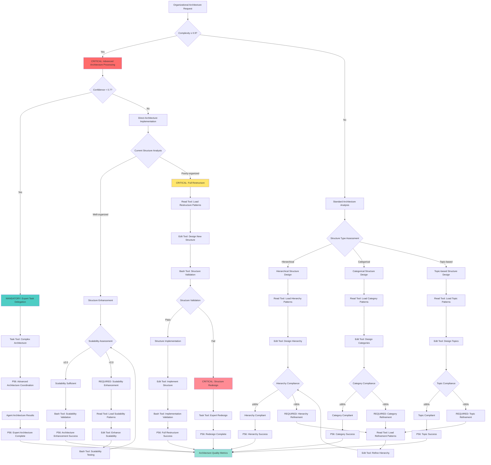

# Atomic Command: `/organizational-architecture`

## **Principle #35: Organizational Architecture**
**"Strict organization structure for scalable documentation growth and predictable information location."**

---

## 🎯 **COMMAND DEFINITION**

### **Purpose**
Implement and maintain strict organizational structure for all documentation and system components to ensure scalability, predictability, and efficient information access.

### **Complexity**: 0.6/1.0
### **Context Required**: Current organizational structure and growth requirements
### **Execution Time**: Medium (depends on organizational scope)

---

## ⚡ **ACTIVATION PROTOCOL**

### **Input Format**
```markdown
/organizational-architecture [domain] [structure_type?] [growth_projection?]
```

### **What This Command Does**
1. **Analyzes Current Structure**: Evaluates existing organizational patterns
2. **Defines Architecture**: Establishes clear organizational hierarchy
3. **Implements Structure**: Creates organized directory and file structure
4. **Enforces Standards**: Ensures compliance with organizational standards
5. **Validates Scalability**: Confirms structure supports future growth

### **Mandatory Requirements**
- **Hierarchical Organization**: Clear hierarchy by purpose and category
- **Predictable Locations**: Consistent, logical file and directory placement
- **Scalable Structure**: Architecture supports unlimited growth
- **Standard Compliance**: Adherence to established naming and organization conventions

---

## 🧠 **ORGANIZATIONAL ARCHITECTURE DECISION TREE**

### **CRITICAL Cognitive Flow for Organizational Architecture**



## 🛠️ **TOOL SELECTION CRITERIA**

### **MANDATORY Tool Selection Matrix**
**READ Tool Usage**:
- **File Count**: ≤3 files for direct analysis
- **Complexity**: <0.7000 (straightforward operations)
- **Scope**: Well-defined, single-purpose operations

**TASK Tool Usage**:
- **File Count**: ≥4 files or unknown scope
- **Complexity**: ≥0.7000 (complex operations)
- **Scope**: Multi-step, exploratory, or research operations

**Other Tools**:
- **Grep**: Pattern search across multiple files
- **Glob**: File pattern matching and discovery
- **Bash**: System operations and automation

### **CRITICAL Tool Selection Logic**
- **Complexity Assessment**: Quantifiable complexity evaluation
- **Scope Validation**: File count and operation scope measurement
- **P56 Announcement**: Visual confirmation of tool selection reasoning
- **Evidence Collection**: Measurable tool selection criteria documentation

### **MANDATORY P56 Transparency Announcements**

**Organizational Architecture Transparency**:
  **Structure Analysis**:
    - **Announcement**: 🔍 TRANSPARENCY: Structure type [HIERARCHICAL/CATEGORICAL/TOPIC] - [WELL/POORLY] organized
    - **Evidence**: Current structure assessment with organization quality metrics
  **Architecture Design**:
    - **Announcement**: 🏗️ TRANSPARENCY: Architecture design [ENHANCEMENT/RESTRUCTURE] - [X] components organized
    - **Evidence**: Complete architecture design with organizational patterns
  **Tool Selection**:
    - **Announcement**: 🛠️ TRANSPARENCY: Tool selection - [READ/EDIT/BASH/TASK] for [architecture_operation]
    - **Evidence**: Tool selection matrix with architecture-specific reasoning
  **Scalability Assessment**:
    - **Announcement**: 📈 TRANSPARENCY: Scalability factor [X] - [SUFFICIENT/ENHANCEMENT_REQUIRED]
    - **Evidence**: Scalability analysis with growth projection validation
  **Compliance Validation**:
    - **Announcement**: ✅ TRANSPARENCY: Compliance [X]% - [COMPLIANT/REFINEMENT_REQUIRED]
    - **Evidence**: Organizational compliance metrics with standard adherence

---

## 📊 **MATHEMATICAL VALIDATION**

### **Organizational Efficiency Score**
```javascript
function calculateOrganizationalEfficiency(structure) {
  const hierarchy_clarity = assessHierarchyClarity(structure)
  const location_predictability = assessLocationPredictability(structure)
  const scalability_score = assessScalability(structure)
  const standard_compliance = assessStandardCompliance(structure)
  
  return {
    efficiency_score: (hierarchy_clarity * 0.3 + location_predictability * 0.3 + 
                      scalability_score * 0.2 + standard_compliance * 0.2),
    architecture_quality: efficiency_score >= 0.9
  }
}
```

### **Growth Sustainability Assessment**
```javascript
function assessGrowthSustainability(structure, growth_projection) {
  const current_capacity = calculateCurrentCapacity(structure)
  const projected_needs = calculateProjectedNeeds(growth_projection)
  const scalability_factor = assessScalabilityFactor(structure)
  
  return {
    sustainability_score: (current_capacity * scalability_factor) / projected_needs,
    growth_ready: sustainability_score >= 2.0
  }
}
```

---

## 🔗 **ORGANIZATIONAL ARCHITECTURE ENGINE**

### **Structure Implementation Protocol**
1. **Current State Analysis**: Assess existing organizational patterns
2. **Architecture Design**: Design optimal organizational structure
3. **Hierarchy Definition**: Define clear categorical hierarchy
4. **Location Standards**: Establish predictable location conventions
5. **Implementation**: Create and organize structure according to design
6. **Validation**: Verify structure meets organizational requirements
7. **Evolution Planning**: Plan for future growth and adaptation

### **Standard Structure Components**
- **Categorical Hierarchy**: `docs/operations/outputs/[category]/[timestamp]-[topic].md`
- **Purpose-Based Organization**: Grouping by function and intent
- **Timestamp Integration**: Chronological organization within categories
- **Naming Conventions**: Clear, consistent naming patterns
- **Scalability Features**: Structure supports unlimited growth

---

## 🔍 **VERIFICATION CRITERIA**

### **Success Metrics**
- **Hierarchy Clarity**: ≥95% of users can locate information quickly
- **Location Predictability**: ≥90% accuracy in predicting file locations
- **Standard Compliance**: 100% adherence to organizational standards
- **Scalability Validation**: Structure supports 10x growth without modification

### **Organizational Monitoring**
```javascript
function monitorOrganizationalArchitecture(structure) {
  return {
    hierarchy_effectiveness: assessHierarchyEffectiveness(structure),
    location_accuracy: measureLocationAccuracy(structure),
    standard_compliance: auditStandardCompliance(structure),
    scalability_health: assessScalabilityHealth(structure),
    user_efficiency: measureUserEfficiency(structure)
  }
}
```

---

## 🔀 **DYNAMIC ARCHITECTURE MANAGEMENT**

### **Adaptive Structure Management**
1. **Usage Pattern Analysis**: Monitor how users interact with structure
2. **Efficiency Optimization**: Optimize structure based on usage patterns
3. **Growth Adaptation**: Adapt structure to accommodate growth
4. **Standard Evolution**: Evolve standards while maintaining consistency
5. **Migration Management**: Handle structural changes with minimal disruption

### **Evolution Protocol**
- **Incremental Changes**: Implement structural changes gradually
- **Backward Compatibility**: Maintain compatibility during transitions
- **Migration Tools**: Provide tools for smooth structural transitions
- **User Communication**: Clearly communicate structural changes
- **Validation**: Verify structural changes improve efficiency

---

## 🔗 **NATURAL CONNECTIONS**

### **Automatically Triggers**
- `/single-source-truth` - Organize authoritative sources
- `/living-documentation` - Structure evolving documentation
- `/context-economy` - Organize context for optimal access

### **Compatible With**
- `/crystallize-patterns` - Organize crystallized patterns
- `/knowledge-hierarchy` - Structure knowledge for efficient search
- `/verification-loops` - Organize verification processes
- `/progressive-intelligence` - Structure intelligence evolution

### **Feeds Into**
- `/optimize-context` - Optimize context through better organization
- `/orchestrate-intelligence` - Coordinate through organized structure
- `/complexity-enforcement` - Enforce complexity through organization

---

## 📋 **USAGE EXAMPLES**

### **Documentation Architecture**
```text
/organizational-architecture "system-documentation" structure_type=hierarchical growth_projection=high
```
**Result**: Implement hierarchical documentation structure for high growth

### **Command Architecture**
```bash
/organizational-architecture "command-system" structure_type=categorical growth_projection=medium
```
**Result**: Organize command system with categorical structure for medium growth

### **Knowledge Architecture**
```text
/organizational-architecture "knowledge-base" structure_type=topic-based growth_projection=unlimited
```
**Result**: Create topic-based knowledge organization for unlimited growth

---

## 🛡️ **FALLBACK PROTOCOL**

### **If Organizational Architecture Fails**
1. **Complex Migration**: Implement gradual migration approach
2. **User Resistance**: Provide training and transition support
3. **Scalability Issues**: Redesign architecture for better scalability
4. **Standard Conflicts**: Resolve conflicts through expert consultation

### **Recovery Strategy**
- Implement incremental organizational changes
- Provide comprehensive migration tools and support
- Enhance scalability analysis and planning
- Establish clear conflict resolution processes

---

## 📊 **INTEGRATION WITH DECISION ENGINE**

### **Confidence Routing**
- **High Architecture Confidence (≥0.9)**: Automatic implementation
- **Medium Confidence (0.7-0.9)**: Implementation with validation
- **Low Confidence (0.5-0.7)**: Expert review before implementation
- **Very Low Confidence (<0.5)**: Comprehensive analysis required

### **Threshold Enforcement**
- **Hierarchy Clarity < 90%**: Redesign hierarchy structure
- **Location Predictability < 85%**: Improve location conventions
- **Standard Compliance < 100%**: Enforce standards strictly
- **Scalability Factor < 2.0**: Enhance scalability architecture

---

## 🔄 **EVOLUTION TRACKING**

### **Learning Metrics**
- **Architectural Effectiveness**: Track effectiveness of organizational changes
- **User Efficiency**: Monitor user efficiency improvements
- **Growth Adaptation**: Measure success of growth accommodations
- **Standard Evolution**: Track evolution of organizational standards

### **Pattern Recognition**
- Effective organizational patterns → Enhanced architecture templates
- Successful growth adaptations → Improved scalability designs
- User efficiency patterns → Optimized organizational structures
- Standard evolution patterns → Better evolution protocols

---

**Note**: This command implements the Context Engineering principle of organizational architecture, creating strict organizational structures that ensure scalability, predictability, and efficient information access while supporting unlimited growth and evolution.
