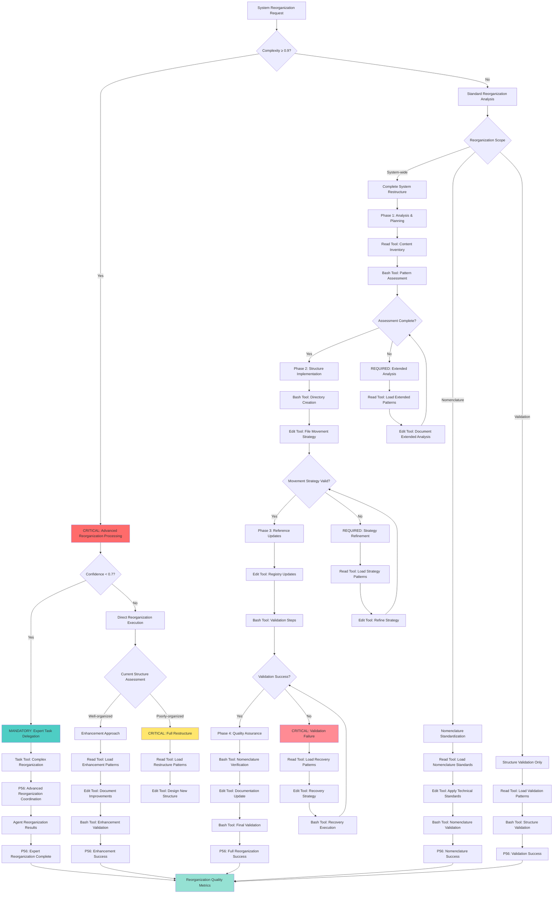

# System Reorganization - Technical Structure Methodology

## 🎯 Instant Understanding

**Purpose**: Systematic methodology for reorganizing command structures with uniform technical nomenclature following enterprise standards.

**When to use**: When system structure needs reorganization, standardization, or when implementing technical nomenclature across command hierarchies.

**What you get**: Complete reorganization process with technical standards, validation steps, and documentation updates.

**Time**: 30-60 minutes depending on system complexity

---

## 🏠 Essential Relationships (Directory-Agnostic Access)

### Quick Dependencies

**This command orchestrates**:
- **Structure Analysis**: Content inventory and pattern identification
- **Nomenclature Standardization**: Technical naming conventions
- **Thematic Grouping**: Functional organization principles
- **Integration Management**: File movement and reference updates
- **Validation Processes**: System integrity verification

**This command can flow to**:
- `/living-documentation` - Update documentation after reorganization
- `/system-integrity` - Validate system integrity post-reorganization
- `/registry-metrics-update` - Update command registry with new structure

### Natural Workflow Position

- **Flows from**: System analysis, structure assessment, nomenclature inconsistencies
- **Flows to**: Documentation updates, system validation, registry updates
- **Parallel with**: `/organizational-architecture`, `/evolution-ready-architecture`

---

## ⚡ Quick Start

```bash
# Complete system reorganization
/reorganize-system

# Validate existing structure
/reorganize-system --validate-only

# Apply nomenclature standards only
/reorganize-system --nomenclature-only

# Generate reorganization plan
/reorganize-system --plan-only
```

---

## 🧠 **SYSTEM REORGANIZATION DECISION TREE**

### **CRITICAL Cognitive Flow for System Reorganization**



### **MANDATORY P56 Transparency Announcements**

**MANDATORY P56 Reorganization Transparency Requirements:**

**Scope Assessment Transparency**: REQUIRED announcement "🔍 TRANSPARENCY: Reorganization scope [SYSTEM-WIDE/NOMENCLATURE/VALIDATION] - [X] components affected" with complete scope analysis and impact assessment evidence.

**Structure Analysis Transparency**: REQUIRED announcement "📊 TRANSPARENCY: Structure assessment [WELL/POORLY] organized - [X] issues identified" with detailed structure analysis and organizational quality metrics evidence.

**Tool Selection Transparency**: REQUIRED announcement "🛠️ TRANSPARENCY: Tool selection - [READ/EDIT/BASH/TASK] for [reorganization_operation]" with tool selection matrix and reorganization-specific reasoning evidence.

**Phase Progression Transparency**: REQUIRED announcement "📈 TRANSPARENCY: Phase [X] [COMPLETE/FAILED] - [ANALYSIS/IMPLEMENTATION/UPDATES/ASSURANCE]" with phase completion status and validation results evidence.

**Quality Assurance Transparency**: REQUIRED announcement "✅ TRANSPARENCY: Quality assurance [SUCCESS/FAILURE] - [X]% compliance achieved" with complete quality metrics and compliance validation evidence.

---

## 🔧 Technical Standards

### **Nomenclature Standards**

****Language and Format****
- **Primary Language**: English (international standard)
- **Format**: lowercase-kebab-case
- **Separators**: Hyphen (-) only
- **Length**: ≤25 characters per segment
- **Descriptiveness**: Clear functional purpose

****Naming Conventions****
**Directory Naming Requirements:**
- **REQUIRED Pattern**: "##-functional-category" format
- **Examples**: "01-core-intelligence", "02-verify-mathematics", "03-discovery-exploration"

**File Naming Requirements:**
- **REQUIRED Pattern**: "descriptive-function.md" format
- **Examples**: "reorganize-system.md", "verify-mathematics.md", "optimize-context.md"

**FORBIDDEN Patterns:**
- **Mixed languages**: "exploracion-first.md" - CRITICAL violation
- **Inconsistent separators**: "system_reorganization.md" - REQUIRED consistency
- **Excessive length**: "comprehensive-verify-mathematics-loops.md" - MANDATORY brevity

### **Technical Vocabulary**
**MANDATORY Technical Vocabulary Standards:**
- **REQUIRED**: "system" (FORBIDDEN: "sistema")
- **REQUIRED**: "verification" (FORBIDDEN: "verificacion")
- **REQUIRED**: "optimization" (FORBIDDEN: "optimizacion")
- **REQUIRED**: "orchestration" (FORBIDDEN: "orquestacion")
- **REQUIRED**: "intelligence" (FORBIDDEN: "inteligencia")
- **REQUIRED**: "architecture" (FORBIDDEN: "arquitectura")
- **REQUIRED**: "methodology" (FORBIDDEN: "metodologia")
- **REQUIRED**: "automation" (FORBIDDEN: "automatizacion")

---

## 📁 Organizational Structure

### **8 Thematic Groups**

****01-core-intelligence/****
**Purpose**: Foundational intelligence and system philosophy
- Meta-principles and core concepts
- Intelligence evolution and orchestration
- Decision-making frameworks
- Autonomous execution patterns

****02-verify-mathematics/****
**Purpose**: Mathematical rigor and continuous verification
- Confidence scoring and mathematical validation
- Verification loops and convergence
- Complexity and threshold enforcement
- System integrity monitoring

****03-discovery-exploration/****
**Purpose**: Systematic discovery and pattern recognition
- Exploration-first methodologies
- Pattern recognition and crystallization
- Objective decomposition strategies
- Discovery workflow orchestration

****04-orchestration-flow/****
**Purpose**: Process coordination and execution management
- Multi-agent orchestration
- Parallel execution optimization
- Git workflow strategies
- Intelligent fallback mechanisms

****05-optimize-context/****
**Purpose**: Resource efficiency and context management
- Context economy and optimization
- Single source of truth principles
- Complexity reduction strategies
- Resource allocation optimization

### **06-system-architecture/**
**Purpose**: System structure and evolutionary design
- Organizational architecture patterns
- Evolution-ready design principles
- Living documentation systems
- Modular composition strategies

### **07-development-methodology/**
**Purpose**: Development best practices and methodologies
- Test-driven development
- Planning and documentation strategies
- Development workflow optimization
- Invisible excellence principles

### **08-automation-tools/**
**Purpose**: Tools and automation systems
- Command relationship mapping
- Decision trees and routing
- Registry and metrics management
- Automation workflow tools

---

## 🔄 Reorganization Process

### **Phase 1: Analysis & Planning**

****1.1 Content Inventory****
```bash
# Identify all existing commands
find .claude/commands/ -name "*.md" -type f | sort

# Analyze current structure
ls -la .claude/commands/

# Count commands by category
grep -c "\"name\":" .claude/config/command-registry.json
```

### **1.2 Pattern Assessment**
- **Naming Inconsistencies**: Mixed languages, formats, separators
- **Organizational Issues**: Scattered functionality, unclear grouping
- **Documentation Gaps**: Missing or outdated documentation
- **Reference Problems**: Broken links, incorrect paths

### **1.3 Categorization Strategy**
**CRITICAL Analysis Criteria Requirements:**
- **Primary function**: MANDATORY core purpose identification
- **Technical domain**: REQUIRED area of expertise classification
- **Usage frequency**: CRITICAL common vs specialized determination
- **Dependencies**: MANDATORY integration requirements mapping
- **Complexity level**: REQUIRED simple vs complex categorization

### **Phase 2: Structure Implementation**

****2.1 Directory Creation****
```bash
# Create 8 thematic groups
mkdir -p 01-core-intelligence 02-verify-mathematics 03-discovery-exploration 04-orchestration-flow 05-optimize-context 06-system-architecture 07-development-methodology 08-automation-tools
```

### **2.2 File Movement Strategy**
**MANDATORY File Movement Priority Sequence:**
1. **Core commands** - CRITICAL foundational components (highest priority)
2. **Workflow orchestrators** - REQUIRED process coordination systems
3. **Specialized tools** - MANDATORY domain-specific functionality
4. **Documentation files** - REQUIRED reference materials
5. **Configuration files** - CRITICAL system settings (systematic completion)

### **2.3 Integration Mapping**
**CRITICAL Integration Pattern Requirements:**

**Atomic Commands Integration**: MANDATORY migration from "atomic/##-grupo/" source to "##-english-group/" destination with complete nomenclature standardization.

**Orchestrators Integration**: REQUIRED migration from "orchestrators/" source to destination grouped by primary function classification.

**Meta Commands Integration**: CRITICAL migration from "meta/" source to "01-core-intelligence/" destination with foundational command consolidation.

**System Commands Integration**: MANDATORY migration from "system/" source to destination grouped by technical domain expertise.

### **Phase 3: Reference Updates**

****3.1 Registry Updates****
```bash
# Update command-registry.json paths
# Pattern: "./commands/old-path/" → "./commands/new-path/"
# Preserve all metrics and metadata
```

### **3.2 Documentation Synchronization**
**MANDATORY Documentation Update Targets:**
- **README.md**: CRITICAL main documentation synchronization
- **CLAUDE.md**: REQUIRED context mapping updates
- **Individual command files**: MANDATORY cross-reference corrections
- **Template files**: REQUIRED examples and guides standardization

****3.3 Validation Steps****
```bash
# Verify file counts
find .claude/commands/ -name "*.md" | wc -l

# Check registry consistency
grep -c "\"name\":" .claude/config/command-registry.json

# Validate paths
# All paths in registry MUST exist on filesystem
```

### **Phase 4: Quality Assurance**

### **4.1 Nomenclature Verification**
**CRITICAL Nomenclature Verification Requirements:**
- **MANDATORY**: All directories use lowercase-kebab-case format
- **REQUIRED**: All files use descriptive-function.md format
- **FORBIDDEN**: Mixed language combinations (zero tolerance)
- **REQUIRED**: Consistent technical vocabulary implementation
- **MANDATORY**: Appropriate length constraints compliance

### **4.2 Organizational Validation**
**MANDATORY Organizational Validation Requirements:**
- **CRITICAL**: Each command in appropriate thematic group placement
- **REQUIRED**: Related commands grouped together systematically
- **MANDATORY**: Clear functional separation maintenance
- **REQUIRED**: Logical hierarchical structure implementation
- **CRITICAL**: Scalable growth patterns establishment

### **4.3 Integration Testing**
**CRITICAL Integration Testing Requirements:**
- **MANDATORY**: All registry paths resolve correctly (100% accuracy)
- **REQUIRED**: Cross-references work properly (complete functionality)
- **CRITICAL**: Documentation links are valid (zero broken links)
- **MANDATORY**: Workflows function as expected (full operational capacity)
- **REQUIRED**: Metrics are preserved (complete data integrity)

---

## 📊 Quality Metrics

### **Nomenclature Compliance**
**MANDATORY Nomenclature Success Criteria:**
- **CRITICAL**: 100% English technical vocabulary compliance
- **REQUIRED**: 100% lowercase-kebab-case format adherence
- **FORBIDDEN**: 0% mixed language combinations (absolute requirement)
- **MANDATORY**: ≤25 character length compliance (strict enforcement)
- **REQUIRED**: Clear functional descriptiveness validation

### **Organizational Efficiency**
**CRITICAL Organizational Efficiency Requirements:**
- **MANDATORY**: Logical grouping coherence >95% achievement
- **REQUIRED**: Cross-group dependency clarity >90% implementation
- **CRITICAL**: Navigation time reduction >50% improvement
- **MANDATORY**: Search efficiency improvement >60% enhancement
- **REQUIRED**: Maintenance complexity reduction >40% optimization

### **System Integrity**
**MANDATORY System Integrity Requirements:**
- **CRITICAL**: Registry path accuracy 100% compliance
- **REQUIRED**: Documentation synchronization 100% achievement
- **MANDATORY**: Cross-reference validity 100% functionality
- **CRITICAL**: Workflow continuity 100% operational capacity
- **REQUIRED**: Metric preservation 100% data integrity

---

## 🔍 Validation Checklist

### **Pre-Reorganization**
- [ ] Complete content inventory
- [ ] Pattern analysis documented
- [ ] Reorganization plan approved
- [ ] Backup created
- [ ] Dependencies mapped

### **During Reorganization**
- [ ] Directory structure created
- [ ] Files moved systematically
- [ ] Registry updated incrementally
- [ ] Documentation updated
- [ ] Integration validated

### **Post-Reorganization**
- [ ] All files in correct locations
- [ ] Registry paths accurate
- [ ] Documentation synchronized
- [ ] Cross-references functional
- [ ] Metrics preserved
- [ ] System integrity verified

---

## 🚀 Implementation Example

### **Execution Sequence**
```bash
# 1. Create new structure
mkdir -p 01-core-intelligence 02-verify-mathematics 03-discovery-exploration 04-orchestration-flow 05-optimize-context 06-system-architecture 07-development-methodology 08-automation-tools

# 2. Move files systematically
cp -r atomic/01-inteligencia-fundamental/* 01-core-intelligence/
cp -r atomic/02-verificacion-matematica/* 02-verify-mathematics/
# ... continue for all groups

# 3. Integrate scattered commands
cp meta/context-engineering.md 01-core-intelligence/
cp system/decision-engine.md 01-core-intelligence/
# ... continue for all integrations

# 4. Update registry
# Use systematic path replacement in command-registry.json

# 5. Clean up
rm -rf atomic/ orchestrators/ meta/ system/

# 6. Validate
find . -name "*.md" | wc -l
grep -c "\"name\":" .claude/config/command-registry.json
```

---

## 🎯 Success Indicators

### **Immediate Indicators**
- **Structure Clarity**: Clear, logical organization
- **Nomenclature Consistency**: Uniform technical naming
- **Documentation Currency**: Updated and accurate
- **System Integrity**: All references functional

### **Long-term Benefits**
- **Maintenance Efficiency**: Easier updates and modifications
- **Scalability**: Structure supports growth
- **Collaboration**: Clear for team environments
- **Professional Standards**: Enterprise-ready organization

### **Measurable Outcomes**
- **Navigation Time**: 50% reduction in command location time
- **Search Efficiency**: 60% improvement in command discovery
- **Maintenance Effort**: 40% reduction in update complexity
- **Documentation Quality**: 100% accuracy and currency

---

## 🔗 Related Commands

- **`/organizational-architecture`** - System organization principles
- **`/evolution-ready-architecture`** - Scalable design patterns
- **`/living-documentation`** - Documentation maintenance
- **`/system-integrity`** - System validation and integrity
- **`/registry-metrics-update`** - Registry maintenance

---

**Command Type**: System Architecture  
**Complexity**: High  
**Frequency**: Periodic (major reorganizations)  
**Dependencies**: System access, registry permissions  
**Output**: Reorganized command structure with technical nomenclature
