# Command: /progressive-thinking

**Category**: Behavioral Intelligence Control  
**Purpose**: CRITICAL progressive thinking sequence execution (Think → Think More → Think Harder → Ultra Think) as reusable module with ≥90% breakthrough insight generation for deep strategic analysis capabilities

**P55/P56 Compliance**: MANDATORY tool execution evidence with observable progressive thinking outcomes and quantifiable strategic intelligence metrics

**Behavioral Reinforcement**: PERMANENT neural pathway establishment for automatic progressive thinking with ≥95% behavioral control effectiveness

**Mathematical Precision**: ≥90% progressive depth requirement with evidence-based strategic intelligence validation

**Complexity Optimization**: 0.9/1.0 (maximum complexity progressive intelligence with mathematical verification)  
**Context Requirements**: Analysis context or prompt requiring deep thinking (≥95% context integration)  
**Execution Time**: 60-180 seconds (depending on complexity with quantifiable depth progression)

---

## MANDATORY Activation Protocol

**Input Format**:
```bash
/progressive-thinking [context] [focus_area] [depth_requirements]
```

**CRITICAL Command Operations** (4-Stage Sequential Protocol with Time Constraints):
1. **EXECUTE Stage 1 - Contextual Think**: GENERATE initial understanding enriched by available context (≤30 seconds)
2. **EXECUTE Stage 2 - Analytical Think**: PERFORM deep analysis leveraging all gathered intelligence (≤45 seconds)
3. **EXECUTE Stage 3 - Strategic Think**: DEVELOP strategic optimization with practical implementation details (≤60 seconds)
4. **EXECUTE Stage 4 - Breakthrough Think**: CREATE revolutionary insights and innovative approaches (≤45 seconds)
5. **SYNTHESIZE Integration**: COMBINE all thinking stages into actionable strategic intelligence (≤30 seconds)

**MANDATORY Requirements** (Zero Tolerance for Deviation):
- **Complete Sequence**: EXECUTE all 4 thinking stages (100% completion requirement)
- **Progressive Depth**: BUILD meaningfully on previous insights (≥90% depth progression)
- **Context Integration**: LEVERAGE provided context throughout progression (≥95% integration)
- **Strategic Output**: GENERATE actionable strategic intelligence (≥85% actionability score)

---

## 📊 **PROGRESSIVE THINKING ENGINE**

### **4-Stage Thinking Architecture**
```yaml
progressive_thinking_framework:
  stage_1_contextual_think:
    focus: "Strategic understanding enriched by comprehensive context"
    process: "Synthesize available context with initial analysis for deep comprehension"
    input: "Provided context + Available intelligence"
    output: "Context-enriched strategic understanding and approach options"
    
  stage_2_analytical_think:
    focus: "Strategic implications leveraging full intelligence gathering" 
    process: "Analyze strategic trade-offs, dependencies, and optimization opportunities"
    input: "Contextual understanding + Intelligence insights + Pattern recognition"
    output: "Strategic analysis with optimized approach recommendations"
    
  stage_3_strategic_think:
    focus: "Strategic execution planning with practical implementation details"
    process: "Design concrete strategic implementation with specific coordination"
    input: "Strategic analysis + Available tools/commands + Context constraints"
    output: "Executable strategic implementation plan with coordination strategy"
    
  stage_4_breakthrough_think:
    focus: "Revolutionary insights and comprehensive verification strategy"
    process: "Generate breakthrough insights and define verification approach"
    input: "Implementation plan + Strategic objectives + Innovation requirements"
    output: "Breakthrough insights + Comprehensive verification framework"
```

## 🧠 **PROGRESSIVE THINKING DECISION TREE**

### **CRITICAL Cognitive Flow for Progressive Thinking**

```mermaid
graph TD
    A[Progressive Thinking Request] --> B{Complexity ≥ 0.9?}
    B -->|Yes| C[CRITICAL: Advanced Progressive Processing]
    B -->|No| D[Standard Progressive Analysis]
    
    C --> E{Confidence < 0.7?}
    E -->|Yes| F[MANDATORY: Expert Task Delegation]
    E -->|No| G[Direct Progressive Execution]
    
    D --> H{Context Integration Assessment}
    H -->|≥95%| I[Full 4-Stage Progression]
    H -->|<95%| J[REQUIRED: Context Enhancement]
    
    F --> K[Task Tool: Complex Progressive Coordination]
    K --> L[P56: Advanced Progressive Intelligence]
    
    G --> M[Stage 1: Contextual Think]
    M --> N[Read Tool: Load Context Patterns]
    N --> O[Edit Tool: Strategic Understanding]
    
    I --> P[Stage 1: Contextual Think]
    P --> Q[Read Tool: Load Available Context]
    Q --> R[Edit Tool: Context-Enriched Analysis]
    
    J --> S[Read Tool: Load Context Enhancement]
    S --> T[Edit Tool: Enhanced Context Integration]
    T --> U[Bash Tool: Context Validation]
    U --> H
    
    O --> V{Stage 1 Complete?}
    V -->|Yes| W[Stage 2: Analytical Think]
    V -->|No| X[REQUIRED: Stage 1 Enhancement]
    
    R --> Y{Contextual Understanding ≥95%?}
    Y -->|Yes| Z[Stage 2: Analytical Think]
    Y -->|No| AA[REQUIRED: Contextual Enhancement]
    
    W --> BB[Read Tool: Load Analysis Patterns]
    BB --> CC[Edit Tool: Strategic Analysis]
    
    Z --> DD[Read Tool: Load Intelligence Patterns]
    DD --> EE[Edit Tool: Deep Analysis]
    
    X --> FF[Read Tool: Load Enhancement Patterns]
    FF --> GG[Edit Tool: Enhanced Stage 1]
    GG --> V
    
    AA --> HH[Read Tool: Load Context Patterns]
    HH --> II[Edit Tool: Context Integration]
    II --> Y
    
    CC --> JJ{Stage 2 Complete?}
    JJ -->|Yes| KK[Stage 3: Strategic Think]
    JJ -->|No| LL[REQUIRED: Stage 2 Enhancement]
    
    EE --> MM{Analysis Depth ≥90%?}
    MM -->|Yes| NN[Stage 3: Strategic Think]
    MM -->|No| OO[REQUIRED: Analysis Enhancement]
    
    KK --> PP[Read Tool: Load Strategic Patterns]
    PP --> QQ[Edit Tool: Strategic Implementation]
    
    NN --> RR[Read Tool: Load Implementation Patterns]
    RR --> SS[Edit Tool: Strategic Execution Plan]
    
    LL --> TT[Read Tool: Load Analysis Enhancement]
    TT --> UU[Edit Tool: Enhanced Analysis]
    UU --> JJ
    
    OO --> VV[Read Tool: Load Depth Enhancement]
    VV --> WW[Edit Tool: Enhanced Deep Analysis]
    WW --> MM
    
    QQ --> XX{Stage 3 Complete?}
    XX -->|Yes| YY[Stage 4: Breakthrough Think]
    XX -->|No| ZZ[REQUIRED: Stage 3 Enhancement]
    
    SS --> AAA{Strategic Planning ≥90%?}
    AAA -->|Yes| BBB[Stage 4: Breakthrough Think]
    AAA -->|No| CCC[REQUIRED: Strategic Enhancement]
    
    YY --> DDD[Read Tool: Load Breakthrough Patterns]
    DDD --> EEE[Edit Tool: Revolutionary Insights]
    
    BBB --> FFF[Read Tool: Load Innovation Patterns]
    FFF --> GGG[Edit Tool: Breakthrough Innovation]
    
    ZZ --> HHH[Read Tool: Load Strategic Enhancement]
    HHH --> III[Edit Tool: Enhanced Strategic Plan]
    III --> XX
    
    CCC --> JJJ[Read Tool: Load Planning Enhancement]
    JJJ --> KKK[Edit Tool: Enhanced Planning]
    KKK --> AAA
    
    EEE --> LLL{Stage 4 Complete?}
    LLL -->|Yes| MMM[Synthesis Integration]
    LLL -->|No| NNN[REQUIRED: Stage 4 Enhancement]
    
    GGG --> OOO{Breakthrough Insights ≥90%?}
    OOO -->|Yes| PPP[Synthesis Integration]
    OOO -->|No| QQQ[REQUIRED: Breakthrough Enhancement]
    
    MMM --> RRR[Read Tool: Load Synthesis Patterns]
    RRR --> SSS[Edit Tool: Strategic Intelligence]
    
    PPP --> TTT[Read Tool: Load Integration Patterns]
    TTT --> UUU[Edit Tool: Comprehensive Integration]
    
    NNN --> VVV[Read Tool: Load Stage Enhancement]
    VVV --> WWW[Edit Tool: Enhanced Breakthrough]
    WWW --> LLL
    
    QQQ --> XXX[Read Tool: Load Insight Enhancement]
    XXX --> YYY[Edit Tool: Enhanced Breakthrough]
    YYY --> OOO
    
    SSS --> ZZZ[Bash Tool: Progressive Validation]
    ZZZ --> AAAA[P56: Progressive Thinking Success]
    
    UUU --> BBBB[Bash Tool: Integration Validation]
    BBBB --> CCCC[P56: Comprehensive Progressive Success]
    
    L --> DDDD[Agent Progressive Results]
    DDDD --> EEEE[P56: Expert Progressive Complete]
    
    AAAA --> FFFF[Progressive Thinking Metrics]
    CCCC --> FFFF
    EEEE --> FFFF
    
    style C fill:#ff6b6b
    style F fill:#4ecdc4
    style J fill:#ffe66d
    style NNN fill:#ff8b94
    style FFFF fill:#95e1d3
```



### **MANDATORY P56 Transparency Announcements**

```yaml
progressive_thinking_transparency:
  stage_progression:
    announcement: "🔍 TRANSPARENCY: Stage [X] [CONTEXTUAL/ANALYTICAL/STRATEGIC/BREAKTHROUGH] - [X]% depth achieved"
    evidence: "Complete stage progression with depth metrics"
    
  context_integration:
    announcement: "📊 TRANSPARENCY: Context integration [X]% - [STANDARD/ENHANCED] approach required"
    evidence: "Context integration assessment with enhancement requirements"
    
  tool_selection:
    announcement: "🛠️ TRANSPARENCY: Tool selection - [READ/EDIT/BASH/TASK] for [thinking_operation]"
    evidence: "Tool selection matrix with progressive thinking reasoning"
    
  depth_assessment:
    announcement: "📈 TRANSPARENCY: Thinking depth [X]% - [SUFFICIENT/ENHANCEMENT] required"
    evidence: "Depth assessment with progression requirements"
    
  synthesis_integration:
    announcement: "✅ TRANSPARENCY: Synthesis [SUCCESS/ENHANCEMENT] - [X]% strategic intelligence achieved"
    evidence: "Complete synthesis with strategic intelligence metrics"
```

---

### **Synthesis Protocol**
- **Context Optimization**: Optimize context utilization across all thinking stages
- **Insight Integration**: Combine insights across stages for breakthrough solutions  
- **Strategic Coordination**: Design optimal coordination strategy based on progression


---

**Note**: This command implements the core progressive thinking capability as a reusable module, enabling any command in the Context Engineering ecosystem to add deep strategic thinking and breakthrough insight generation to their functionality.

## 🏗️ **INHERITED INFRASTRUCTURE**

### **Universal-Meta-Core-Infrastructure**
- Auto-sourced monitoring, scripts, reporting, triggers, learning systems
- Mathematical foundation integration with context engineering formulas
- P55/P56 compliance with tool call execution and transparency protocols

### **Core-Cognitive-Processor**  
- Multi-dimensional analysis, problem decomposition, information synthesis
- Logical progression and meta-cognition capabilities
- Universal quality assurance and error handling frameworks