# Command: /context-economy

**Category**: Behavioral Optimization Control  
**Purpose**: CRITICAL systematic context optimization protocol achieving 80% context reduction with 100% functionality preservation through intelligent lazy loading, specialized loading, and continuous pruning strategies

**P55/P56 Compliance**: MANDATORY tool execution evidence with observable context optimization outcomes and quantifiable efficiency metrics

**Behavioral Reinforcement**: PERMANENT neural pathway establishment for automatic context economy with ≥95% behavioral control effectiveness

**Mathematical Precision**: 80% context reduction requirement with 100% functionality preservation (zero tolerance for feature loss)

**Complexity Optimization**: 0.8/1.0 (high-complexity optimization with mathematical verification)  
**Context Requirements**: Current context load and task objectives (≥95% load assessment accuracy)  
**Execution Time**: 180-480 seconds (depending on context complexity with quantifiable efficiency gains)

---

## MANDATORY Optimization Decision Framework

**CRITICAL**: Context economy optimization requires systematic decision-making with quantifiable metrics and auto-activation triggers.

```mermaid
graph TD
    A[Context Economy Request] --> B{Current Context Load?}
    B -->|>90%| C[CRITICAL: Emergency Context Reduction]
    B -->|70-90%| D[MANDATORY: Targeted Optimization]
    B -->|<70%| E[REQUIRED: Efficiency Enhancement]
    
    C --> F{Complexity ≥ 0.9?}
    F -->|Yes| G[MANDATORY: Task Tool Deployment]
    F -->|No| H[Direct Emergency Optimization]
    
    D --> I{Optimization Scope?}
    I -->|Global| J[Full Context Audit]
    I -->|Targeted| K[Specialized Context Pruning]
    I -->|Incremental| L[Continuous Optimization]
    
    E --> M[Performance Monitoring]
    
    G --> N[Complex Context Reduction]
    H --> N
    J --> N
    K --> N
    L --> N
    M --> N
    
    N --> O{Efficiency Target Met?}
    O -->|Yes| P[P56: Context Economy SUCCESS]
    O -->|No| Q[MANDATORY: Escalate Optimization]
    
    P --> R[Context Monitoring]
    Q --> C
```



**Auto-Activation Triggers** (MANDATORY):
- Context load >90% → CRITICAL emergency optimization
- Efficiency <70% → MANDATORY targeted improvement  
- Task complexity ≥0.9 → REQUIRED specialized loading
- Performance degradation >15% → CRITICAL intervention

**P56 Transparency Announcements** (REQUIRED):
- Context reduction percentage achieved
- Functionality preservation verification
- Efficiency improvement metrics
- Optimization strategy selection reasoning

---

## 🛡️ P55/P56 Compliance Integration

### **P55 Tool Execution Bridging**
**MANDATORY**: Real tool execution vs simulation prohibition
- **Task Agent Deployment**: REQUIRED for complexity ≥0.9
- **Success Rate Target**: ≥98% completion guarantee
- **Execution Evidence**: Actual tool results with quantitative validation

### **P56 Transparency Protocol**
**CRITICAL**: Visual execution confirmation system
- **P56 Announcement**: Context Economy execution initiated
- **Tool Evidence**: Observable outcomes with specific metrics
- **Completion Verification**: Quantifiable success criteria

## MANDATORY Activation Protocol

**Input Format**:
```bash
/context-economy [optimization_scope] [efficiency_target] [preserve_requirements]
```

**MANDATORY Inheritance**: Universal-Meta-Core-Infrastructure + Core-Optimization-Framework (100% integration requirement)

**CRITICAL Optimization Targets** (Mathematical Requirements):
- **Context Reduction**: ≥80% reduction (quantifiable measurement)
- **Functionality Preservation**: 100% (zero tolerance for feature loss)
- **Efficiency Target**: User-specified or default ≥85%
- **Preserve Requirements**: MANDATORY specification of critical features

---

## 🔧 **UNIQUE CONTEXT OPTIMIZATION PROCESS**

### **Essential Context Loading**
```javascript
function loadEssentialContext(task_objective) {
  const essential = {
    core_requirements: extractCoreRequirements(task_objective),
    success_criteria: defineSuccessCriteria(task_objective),
    key_constraints: identifyKeyConstraints(task_objective),
    architectural_decisions: getCriticalArchitecture(task_objective)
  }
  
  return validateEssentials(essential)
}
```

**Essential Context Categories**:
- Core project requirements and constraints
- Primary objectives and success criteria
- Key architectural decisions and patterns
- Critical dependencies and limitations

### **Specialized Context On-Demand**
```javascript
function loadSpecializedContext(task_type, context_domain) {
  const specialization_map = {
    security: () => loadSecurityContext(),
    performance: () => loadPerformanceContext(),
    ui_ux: () => loadUIContext(),
    testing: () => loadTestingContext(),
    deployment: () => loadDeploymentContext()
  }
  
  return specialization_map[context_domain]?.() || null
}
```

### **Lazy Loading Strategy**
```javascript
function implementLazyLoading(context_request) {
  const loading_priority = {
    immediate: ['core_requirements', 'success_criteria'],
    deferred: ['historical_decisions', 'detailed_implementation'],
    on_demand: ['testing_context', 'deployment_context'],
    archived: ['completed_tasks', 'outdated_constraints']
  }
  
  return scheduleContextLoading(context_request, loading_priority)
}
```

---

## 📊 **CONTEXT SYNTHESIS PROTOCOL**

### **Pre-Handoff Synthesis**
```javascript
function synthesizeForHandoff(current_context, next_phase) {
  const synthesis = {
    key_findings: extractKeyFindings(current_context),
    essential_insights: distillInsights(current_context),
    critical_context: preserveCriticalElements(current_context, next_phase),
    redundancy_removal: eliminateRedundancy(current_context)
  }
  
  return validateSynthesis(synthesis, next_phase)
}
```

### **Continuous Context Pruning**
```javascript
function continuousContextPruning(active_context) {
  const pruning_actions = {
    archive: identifyCompletedTasks(active_context),
    remove: findOutdatedConstraints(active_context),
    compress: compressRedundantInformation(active_context),
    maintain: preserveActiveRelevantContext(active_context)
  }
  
  return executePruning(pruning_actions)
}
```

---

## 🎯 **CONTEXT OPTIMIZATION STRATEGIES**

### **Context Compression Techniques**
- **Pattern Recognition**: Identify and compress repeated patterns
- **Reference Linking**: Replace redundant content with references
- **Summary Generation**: Create executive summaries of detailed context
- **Hierarchical Structuring**: Organize context by access frequency

### **Context Caching Strategy**
```javascript
function implementContextCaching(frequently_accessed) {
  const cache_strategy = {
    hot_cache: 'immediately_accessible_essentials',
    warm_cache: 'frequently_used_specialized_context',
    cold_cache: 'occasionally_needed_detailed_context',
    archive: 'historical_reference_only_context'
  }
  
  return optimizeCacheDistribution(frequently_accessed, cache_strategy)
}
```

### **Adaptive Context Loading**
```javascript
function adaptiveContextLoading(task_complexity, performance_target) {
  const adaptation_strategy = {
    simple_tasks: 'minimal_context_only',
    moderate_tasks: 'essential_plus_specialized',
    complex_tasks: 'phased_loading_strategy',
    critical_tasks: 'full_context_with_optimization'
  }
  
  return selectStrategy(task_complexity, adaptation_strategy)
}
```

---

## 📋 **USAGE EXAMPLES**

### **Feature Development Optimization**
```text
/context-economy "user authentication feature" "85%" "preserve_security_requirements"
```
**Result**: Load core auth requirements first, security context on-demand, testing context during verification

### **Performance Optimization Context**
```text
/context-economy "database optimization" "80%" "preserve_functionality"
```
**Result**: Essential DB context first, performance metrics on-demand, implementation details during development

### **Complex System Integration**
```text
/context-economy "microservices integration" "75%" "preserve_all_requirements"
```
**Result**: Phased context loading across multiple services, just-in-time integration patterns

---

## 🎯 **CONTEXT ECONOMY PRINCIPLES**

### **Efficiency Optimization**
- Load context just-in-time, not just-in-case
- Preserve 100% functionality with minimal context overhead
- Optimize for context-to-effectiveness ratio
- Implement adaptive context management strategies

### **Optimization Targets**
- **80% Context Reduction**: From naive full-loading approach
- **100% Functionality Preservation**: No loss of capability or quality
- **Context-to-Effectiveness Ratio**: Maximize output per unit of context

---

**Note**: This command embodies the Context Engineering principle of intelligent resource optimization, achieving maximum functionality with minimal context overhead through systematic optimization strategies.