```mermaid
graph TD
    A[Context-Over-Commands Request] --> B{Current Context Quality?}
    B -->|<70%| C[CRITICAL: Context Enhancement Required]
    B -->|70-90%| D[MANDATORY: Context Optimization]
    B -->|>90%| E[REQUIRED: Context Refinement]
    
    C --> F{Complexity ≥ 0.9?}
    F -->|Yes| G[MANDATORY: Task Tool Deployment]
    F -->|No| H[Direct Context Loading]
    
    D --> I{Context Scope?}
    I -->|Full Project| J[Complete Context Audit]
    I -->|Domain-Specific| K[Specialized Context Loading]
    I -->|Feature-Focused| L[Targeted Context Enhancement]
    
    E --> M[Context Quality Monitoring]
    
    G --> N[Context Integration Process]
    H --> N
    J --> N
    K --> N
    L --> N
    M --> N
    
    N --> O{Autonomous Capability ≥85%?}
    O -->|Yes| P[P56: Context-Over-Commands SUCCESS]
    O -->|No| Q[MANDATORY: Escalate Context Loading]
    
    P --> R[Autonomous Operations]
    Q --> C
```

# Behavioral Command: `/context-over-commands`

## **🚨 BLOCKING Context Engineering: Context > Commands > Prompts**
**🚨 MANDATORY: Sistema WILL enable autonomous excellence through rich context with AUTOMATIC blocking of prompt-only approaches and REQUIRED contextual verification**

**Principle #3**: "Rich context enables autonomous excellence."

---

## 🎯 **COMMAND DEFINITION**

### **🚨 BLOCKING Purpose**
🚨 MANDATORY: Sistema WILL load comprehensive project context to enable autonomous AI decision-making with AUTOMATIC blocking of prompt-only approaches and REQUIRED contextual verification. BLOCKING of context-deficient requests and MANDATORY enforcement of context-driven decisions.

### **Complexity**: 0.6/1.0
### **Context Required**: Project structure and domain knowledge
### **Execution Time**: 2-5 minutes (depending on context size)

---

## 🚨 BLOCKING Context Priority Decision Framework

**🚨 CRITICAL**: Sistema WILL execute context-over-commands optimization with AUTOMATIC blocking of non-contextual approaches and MANDATORY systematic decision-making with quantifiable metrics and real-time auto-activation triggers.



**🚨 BLOCKING Auto-Activation Triggers** (MANDATORY):
- 🚨 AUTOMATIC: Context quality <70% → BLOCKING of execution until context enhancement
- 🚨 MANDATORY: Pattern recognition <90% → Sistema WILL enforce context optimization
- 🚨 CRITICAL: Autonomous capability <85% → BLOCKING of prompt-only approaches
- 🚨 REQUIRED: Context utilization <80% → IMMEDIATE intervention with real-time correction
- 🚨 ERROR PROTOCOL: Any error detected → MANDATORY 8-step resolution protocol (Principle #89)

**P56 Transparency Announcements** (REQUIRED):
- Context completeness percentage achieved
- Pattern recognition accuracy metrics
- Autonomous capability improvement
- Context utilization effectiveness

---

## 🛡️ P55/P56 Compliance Integration

### **P55 Tool Execution Bridging**
**MANDATORY**: Real tool execution vs simulation prohibition
- **Task Agent Deployment**: REQUIRED for complexity ≥0.9
- **Success Rate Target**: ≥98% completion guarantee
- **Execution Evidence**: Actual tool results with quantitative validation

### **P56 Transparency Protocol**
**CRITICAL**: Visual execution confirmation system
- **P56 Announcement**: Context Over Commands execution initiated
- **Tool Evidence**: Observable outcomes with specific metrics
- **Completion Verification**: Quantifiable success criteria

## 🚨 BLOCKING ACTIVATION PROTOCOL

### **🚨 MANDATORY Input Format**
```markdown
/context-over-commands [domain] [depth_level?] [focus_areas?]
```

### **🚨 BLOCKING Command Operations**
1. **🚨 MANDATORY Load Complete Context**: Sistema WILL load project structure, patterns, constraints, conventions with BLOCKING of incomplete loading
2. **🚨 CRITICAL Enable Understanding**: Sistema WILL comprehend domain-specific knowledge with AUTOMATIC pattern verification
3. **🚨 BLOCKING Autonomous Decision-Making**: Sistema WILL make intelligent choices within context boundaries with BLOCKING of prompt-only fallbacks
4. **🚨 REQUIRED Pattern Recognition**: Sistema WILL identify and apply existing project patterns with real-time validation

### **🚨 BLOCKING Implementation Steps**
1. **🚨 MANDATORY Load CLAUDE.md**: Sistema WILL load project documentation with BLOCKING of execution without complete context
2. **🚨 CRITICAL Analyze Patterns**: Sistema WILL analyze codebase patterns with AUTOMATIC convention verification
3. **🚨 REQUIRED Domain Understanding**: Sistema WILL understand constraints with BLOCKING of domain-blind execution
4. **🚨 AUTOMATIC Dependency Loading**: Sistema WILL load relevant libraries with real-time verification
5. **🚨 BLOCKING Solution Identification**: Sistema WILL identify existing approaches with BLOCKING of reinvention
6. **🚨 MANDATORY Autonomous Operation**: Sistema WILL enable contextual boundaries with BLOCKING of context-free decisions

---

## 🔍 **VERIFICATION CRITERIA**

### **🚨 BLOCKING Success Metrics**
- **🚨 MANDATORY Context Completeness**: ≥95% of relevant project context loaded with BLOCKING below threshold
- **🚨 CRITICAL Pattern Recognition**: ≥90% of existing patterns identified with AUTOMATIC verification
- **🚨 BLOCKING Autonomous Capability**: ≥85% of decisions made without guidance with BLOCKING of prompt-dependency
- **🚨 REQUIRED Context Utilization**: Sistema WILL actively use loaded context with real-time monitoring

### **Mathematical Validation**
```javascript
context_effectiveness = (
  (context_completeness * 0.35) +
  (pattern_recognition * 0.30) +
  (autonomous_capability * 0.25) +
  (context_utilization * 0.10)
)
// Required: ≥ 8.5/10
```

---

## 🔗 **NATURAL CONNECTIONS**

### **Automatically Triggers**
- `/knowledge-hierarchy` - Systematic context loading from local to external
- `/recognize-patterns` - Identify reusable patterns in loaded context
- `/living-documentation` - Document context insights for future reuse

### **Compatible With**
- `/activate-meta-principle` - Context enablement is foundation of autonomy
- `/exploration-first` - Rich context enhances exploration quality
- `/evolve-intelligence` - Context guides variation generation

### **Feeds Into**
- All subsequent commands (context provides foundation)
- Decision engine routing (context informs routing decisions)
- Autonomous execution (context enables independent decision-making)

---

## 📋 **USAGE EXAMPLES**

### **New Feature Development**
```text
/context-over-commands "frontend" deep "component_patterns,state_management,routing"
```
**Result**: AI loads complete frontend context, understands patterns, enables autonomous component development

### **API Integration**
```text
/context-over-commands "backend" standard "api_patterns,error_handling,authentication"
```
**Result**: AI understands existing API patterns, can autonomously implement consistent integrations

### **Performance Optimization**
```text
/context-over-commands "performance" deep "caching,database,monitoring"
```
**Result**: AI loads performance context, understands optimization patterns, autonomous improvement decisions

---

## 🛡️ **FALLBACK PROTOCOL**

### **🚨 BLOCKING Failure Protocol**
1. **🚨 CRITICAL Incomplete Context Loading**: Sistema WILL prioritize essential context with BLOCKING of execution until threshold
2. **🚨 MANDATORY Pattern Recognition Failure**: Sistema WILL execute manual pattern analysis with BLOCKING of pattern-blind execution
3. **🚨 BLOCKING Insufficient Autonomy**: Sistema WILL provide minimal guidance with BLOCKING of prompt-dependency regression
4. **🚨 AUTOMATIC Context Overload**: Sistema WILL implement lazy loading with real-time prioritization monitoring

### **Recovery Strategy**
- Start with minimal essential context, expand incrementally
- Document context loading failures for future optimization
- Implement context caching for repeated domain work
- Create context summaries for faster loading

---

## 📊 **INTEGRATION WITH DECISION ENGINE**

### **🚨 BLOCKING Context-Based Routing**
- **🚨 CRITICAL Rich Context Available**: Sistema WILL execute direct autonomous operation with real-time verification
- **🚨 MANDATORY Partial Context**: Sistema WILL load additional context with BLOCKING until sufficient
- **🚨 BLOCKING No Context**: Sistema WILL execute mandatory `/knowledge-hierarchy` with BLOCKING of context-free execution
- **🚨 REQUIRED Context Conflicts**: Sistema WILL analyze and resolve conflicts with AUTOMATIC blocking until resolution

### **Pattern-Based Optimization**
- Successful context patterns → Faster context loading templates
- Context loading strategies → Optimized loading sequences
- Context utilization patterns → Improved context prioritization
- Domain-specific contexts → Specialized context loading commands

---

## 🔄 **CONTEXT EVOLUTION**

### **Learning Metrics**
- **Loading Efficiency**: Time to load context vs context completeness
- **Utilization Rate**: How effectively loaded context is used in decisions
- **Pattern Success**: Accuracy of pattern recognition and application
- **Autonomous Quality**: Quality of decisions made with rich context

### **Context Intelligence Growth**
- Learn optimal context loading strategies for different domains
- Identify which context elements are most valuable for autonomous operation
- Build domain-specific context templates for faster loading
- Develop context summarization techniques for efficiency

---

## 🎯 **CONTEXT OPTIMIZATION**

### **Lazy Loading Strategy**
1. **Essential Context**: Load immediately (project structure, core patterns)
2. **Domain Context**: Load when entering specific domain work
3. **Specialized Context**: Load only when specific functionality needed
4. **Historical Context**: Load for complex decisions requiring full background

### **Context Prioritization**
- **High Priority**: Current project patterns, active dependencies, core conventions
- **Medium Priority**: Historical decisions, alternative approaches, edge cases
- **Low Priority**: Deprecated patterns, unused dependencies, experimental features

---

## 🌟 **CONTEXTUAL AUTONOMY BENEFITS**

### **Intelligent Decision Making**
- AI understands project conventions without explicit instruction
- Decisions align with existing patterns and architectural choices
- Autonomous problem-solving within established project boundaries
- Consistent code quality through pattern understanding

### **Efficiency Gains**
- Reduced need for detailed instructions
- Faster development through pattern reuse
- Fewer clarification questions
- More consistent implementation choices

---

**Note**: This command embodies the core philosophy that providing rich context is more effective than giving precise commands. It enables AI to operate autonomously while maintaining consistency with project patterns and constraints.