# Atomic Command: `/context-over-commands`

## **Principle #3: Context > Commands > Prompts**
**"Rich context enables autonomous excellence."**

---

## 🎯 **COMMAND DEFINITION**

### **Purpose**
Load comprehensive project context to enable autonomous AI decision-making within contextual boundaries instead of relying on precise commands.

### **Complexity**: 0.6/1.0
### **Context Required**: Project structure and domain knowledge
### **Execution Time**: 2-5 minutes (depending on context size)

---

## MANDATORY Context Priority Decision Framework

**CRITICAL**: Context-over-commands optimization requires systematic decision-making with quantifiable metrics and auto-activation triggers.

```mermaid
graph TD
    A[Context-Over-Commands Request] --> B{Current Context Quality?}
    B -->|<70%| C[CRITICAL: Context Enhancement Required]
    B -->|70-90%| D[MANDATORY: Context Optimization]
    B -->|>90%| E[REQUIRED: Context Refinement]
    
    C --> F{Complexity ≥ 0.9?}
    F -->|Yes| G[MANDATORY: Task Tool Deployment]
    F -->|No| H[Direct Context Loading]
    
    D --> I{Context Scope?}
    I -->|Full Project| J[Complete Context Audit]
    I -->|Domain-Specific| K[Specialized Context Loading]
    I -->|Feature-Focused| L[Targeted Context Enhancement]
    
    E --> M[Context Quality Monitoring]
    
    G --> N[Context Integration Process]
    H --> N
    J --> N
    K --> N
    L --> N
    M --> N
    
    N --> O{Autonomous Capability ≥85%?}
    O -->|Yes| P[P56: Context-Over-Commands SUCCESS]
    O -->|No| Q[MANDATORY: Escalate Context Loading]
    
    P --> R[Autonomous Operations]
    Q --> C
```



**Auto-Activation Triggers** (MANDATORY):
- Context quality <70% → CRITICAL context enhancement
- Pattern recognition <90% → MANDATORY context optimization
- Autonomous capability <85% → REQUIRED context loading
- Context utilization <80% → CRITICAL intervention

**P56 Transparency Announcements** (REQUIRED):
- Context completeness percentage achieved
- Pattern recognition accuracy metrics
- Autonomous capability improvement
- Context utilization effectiveness

---

## 🛡️ P55/P56 Compliance Integration

### **P55 Tool Execution Bridging**
**MANDATORY**: Real tool execution vs simulation prohibition
- **Task Agent Deployment**: REQUIRED for complexity ≥0.9
- **Success Rate Target**: ≥98% completion guarantee
- **Execution Evidence**: Actual tool results with quantitative validation

### **P56 Transparency Protocol**
**CRITICAL**: Visual execution confirmation system
- **P56 Announcement**: Context Over Commands execution initiated
- **Tool Evidence**: Observable outcomes with specific metrics
- **Completion Verification**: Quantifiable success criteria

## ⚡ **ACTIVATION PROTOCOL**

### **Input Format**
```markdown
/context-over-commands [domain] [depth_level?] [focus_areas?]
```

### **What This Command Does**
1. **Load Complete Context**: Project structure, patterns, constraints, conventions
2. **Enable Understanding**: AI comprehends domain-specific knowledge and patterns
3. **Autonomous Decision-Making**: AI makes intelligent choices within context boundaries
4. **Pattern Recognition**: AI identifies and applies existing project patterns

### **Implementation Steps**
1. Load CLAUDE.md and project documentation
2. Analyze codebase patterns and conventions
3. Understand domain-specific constraints and requirements
4. Load relevant libraries, frameworks, and dependencies
5. Identify existing solutions and approaches
6. Enable autonomous operation within contextual boundaries

---

## 🔍 **VERIFICATION CRITERIA**

### **Success Metrics**
- **Context Completeness**: ≥95% of relevant project context loaded
- **Pattern Recognition**: ≥90% of existing patterns identified and understood
- **Autonomous Capability**: ≥85% of decisions made without additional guidance
- **Context Utilization**: AI actively uses loaded context in decision-making

### **Mathematical Validation**
```javascript
context_effectiveness = (
  (context_completeness * 0.35) +
  (pattern_recognition * 0.30) +
  (autonomous_capability * 0.25) +
  (context_utilization * 0.10)
)
// Required: ≥ 8.5/10
```

---

## 🔗 **NATURAL CONNECTIONS**

### **Automatically Triggers**
- `/knowledge-hierarchy` - Systematic context loading from local to external
- `/recognize-patterns` - Identify reusable patterns in loaded context
- `/living-documentation` - Document context insights for future reuse

### **Compatible With**
- `/activate-meta-principle` - Context enablement is foundation of autonomy
- `/exploration-first` - Rich context enhances exploration quality
- `/evolve-intelligence` - Context guides variation generation

### **Feeds Into**
- All subsequent commands (context provides foundation)
- Decision engine routing (context informs routing decisions)
- Autonomous execution (context enables independent decision-making)

---

## 📋 **USAGE EXAMPLES**

### **New Feature Development**
```text
/context-over-commands "frontend" deep "component_patterns,state_management,routing"
```
**Result**: AI loads complete frontend context, understands patterns, enables autonomous component development

### **API Integration**
```text
/context-over-commands "backend" standard "api_patterns,error_handling,authentication"
```
**Result**: AI understands existing API patterns, can autonomously implement consistent integrations

### **Performance Optimization**
```text
/context-over-commands "performance" deep "caching,database,monitoring"
```
**Result**: AI loads performance context, understands optimization patterns, autonomous improvement decisions

---

## 🛡️ **FALLBACK PROTOCOL**

### **If Command Fails**
1. **Incomplete Context Loading**: Prioritize essential context, load additional on-demand
2. **Pattern Recognition Failure**: Manual pattern analysis with documentation
3. **Insufficient Autonomy**: Provide minimal guidance while preserving context benefits
4. **Context Overload**: Implement lazy loading and context prioritization

### **Recovery Strategy**
- Start with minimal essential context, expand incrementally
- Document context loading failures for future optimization
- Implement context caching for repeated domain work
- Create context summaries for faster loading

---

## 📊 **INTEGRATION WITH DECISION ENGINE**

### **Context-Based Routing**
- **Rich Context Available**: Direct autonomous execution
- **Partial Context**: Load additional context before proceeding
- **No Context**: Mandatory `/knowledge-hierarchy` before execution
- **Context Conflicts**: Analyze and resolve conflicts before proceeding

### **Pattern-Based Optimization**
- Successful context patterns → Faster context loading templates
- Context loading strategies → Optimized loading sequences
- Context utilization patterns → Improved context prioritization
- Domain-specific contexts → Specialized context loading commands

---

## 🔄 **CONTEXT EVOLUTION**

### **Learning Metrics**
- **Loading Efficiency**: Time to load context vs context completeness
- **Utilization Rate**: How effectively loaded context is used in decisions
- **Pattern Success**: Accuracy of pattern recognition and application
- **Autonomous Quality**: Quality of decisions made with rich context

### **Context Intelligence Growth**
- Learn optimal context loading strategies for different domains
- Identify which context elements are most valuable for autonomous operation
- Build domain-specific context templates for faster loading
- Develop context summarization techniques for efficiency

---

## 🎯 **CONTEXT OPTIMIZATION**

### **Lazy Loading Strategy**
1. **Essential Context**: Load immediately (project structure, core patterns)
2. **Domain Context**: Load when entering specific domain work
3. **Specialized Context**: Load only when specific functionality needed
4. **Historical Context**: Load for complex decisions requiring full background

### **Context Prioritization**
- **High Priority**: Current project patterns, active dependencies, core conventions
- **Medium Priority**: Historical decisions, alternative approaches, edge cases
- **Low Priority**: Deprecated patterns, unused dependencies, experimental features

---

## 🌟 **CONTEXTUAL AUTONOMY BENEFITS**

### **Intelligent Decision Making**
- AI understands project conventions without explicit instruction
- Decisions align with existing patterns and architectural choices
- Autonomous problem-solving within established project boundaries
- Consistent code quality through pattern understanding

### **Efficiency Gains**
- Reduced need for detailed instructions
- Faster development through pattern reuse
- Fewer clarification questions
- More consistent implementation choices

---

**Note**: This command embodies the core philosophy that providing rich context is more effective than giving precise commands. It enables AI to operate autonomously while maintaining consistency with project patterns and constraints.