# Atomic Command: `/optimize-complexity`

## **Principle #41: Invisible Excellence**
**"Architecture feels like magic while remaining debuggable."**

---

## 🎯 **COMMAND DEFINITION**

### **Purpose**
Optimize system complexity to achieve invisible excellence - making complex systems feel magically simple while maintaining full debuggability and systematic reliability through balanced architectural principles.

### **Complexity**: 0.9/1.0
### **Context Required**: System architecture, component dependencies, and complexity metrics
### **Execution Time**: 2-5 minutes (depending on system scope)

---

## MANDATORY Complexity Optimization Decision Framework

**CRITICAL**: Complexity optimization requires systematic decision-making with quantifiable metrics and auto-activation triggers.

```mermaid
graph TD
    A[Complexity Optimization Request] --> B{Current Complexity Level?}
    B -->|>0.8| C[CRITICAL: Emergency Complexity Reduction]
    B -->|0.6-0.8| D[MANDATORY: Targeted Optimization]
    B -->|<0.6| E[REQUIRED: Excellence Enhancement]
    
    C --> F{Debuggability Risk?}
    F -->|High| G[MANDATORY: Task Tool Deployment]
    F -->|Low| H[Direct Complexity Reduction]
    
    D --> I{Optimization Focus?}
    I -->|Magic Experience| J[Invisible Excellence Implementation]
    I -->|Debuggability| K[Transparency Enhancement]
    I -->|Balance| L[Pillar Optimization]
    
    E --> M[Excellence Monitoring]
    
    G --> N[Complexity Transformation]
    H --> N
    J --> N
    K --> N
    L --> N
    M --> N
    
    N --> O{Magic Experience ≥90%?}
    O -->|Yes| P[P56: Complexity Optimization SUCCESS]
    O -->|No| Q[MANDATORY: Escalate Optimization]
    
    P --> R[Excellence Monitoring]
    Q --> C
```



**Auto-Activation Triggers** (MANDATORY):
- System complexity >0.8 → CRITICAL complexity reduction
- Magic experience <90% → MANDATORY optimization
- Debuggability score <95% → REQUIRED transparency enhancement
- Pillar balance <0.8 → CRITICAL intervention

**P56 Transparency Announcements** (REQUIRED):
- Complexity reduction percentage achieved
- Magic experience improvement metrics
- Debuggability preservation verification
- Excellence pillar balance results

---

## 🛡️ P55/P56 Compliance Integration

### **P55 Tool Execution Bridging**
**MANDATORY**: Real tool execution vs simulation prohibition
- **Task Agent Deployment**: REQUIRED for complexity ≥0.9
- **Success Rate Target**: ≥98% completion guarantee
- **Execution Evidence**: Actual tool results with quantitative validation

### **P56 Transparency Protocol**
**CRITICAL**: Visual execution confirmation system
- **P56 Announcement**: Optimize Complexity execution initiated
- **Tool Evidence**: Observable outcomes with specific metrics
- **Completion Verification**: Quantifiable success criteria

## ⚡ **ACTIVATION PROTOCOL**

### **Input Format**
```markdown
/optimize-complexity [target] [optimization_mode?] [debuggability_level?]
```

### **What This Command Does**
1. **Complexity Assessment**: Analyze current system complexity and user experience
2. **Magic Identification**: Identify opportunities for magical simplification
3. **Debuggability Preservation**: Ensure all optimizations maintain debugging capabilities
4. **Balance Optimization**: Apply the four excellence pillars systematically
5. **Invisible Excellence Implementation**: Transform complex systems into magically simple experiences
6. **Verification Integration**: Embed reliability verification into optimized architecture

### **Excellence Balance Framework**
1. **Predictability through Patterns**: Standardize complex operations into recognizable patterns
2. **Power through Composition**: Build sophisticated capabilities from simple, composable components
3. **Flexibility through Orchestration**: Enable dynamic behavior without complexity explosion
4. **Reliability through Verification**: Ensure magical simplicity doesn't compromise system reliability

---

## 🔮 **INVISIBLE EXCELLENCE METHODOLOGY**

### **Magic Detection Algorithm**
```javascript
function assessMagicalPotential(component) {
  const complexity_burden = calculateUserComplexityBurden(component)
  const simplification_opportunities = identifySimplificationOpportunities(component)
  const pattern_recognition = assessPatternRecognition(component)
  const automation_potential = calculateAutomationPotential(component)
  
  return {
    magic_score: (simplification_opportunities * 0.4 + 
                  pattern_recognition * 0.3 + 
                  automation_potential * 0.3),
    complexity_reduction: complexity_burden - calculateOptimizedComplexity(component),
    debuggability_preservation: assessDebuggabilityMaintenance(component)
  }
}
```

### **Invisible Excellence Transformation**
1. **Pattern Abstraction**: Hide complexity behind intuitive patterns
2. **Automatic Orchestration**: Eliminate manual complexity management
3. **Predictable Magic**: Make complex operations feel naturally simple
4. **Transparent Debugging**: Provide clear visibility into magical operations
5. **Composable Sophistication**: Build complex capabilities from simple parts
6. **Reliable Automation**: Ensure magical simplicity maintains system reliability

---

## 🏛️ **ARCHITECTURE EXCELLENCE PILLARS**

### **Pillar 1: Predictability through Patterns**
```javascript
function implementPredictabilityPatterns(system) {
  return {
    standard_interfaces: createStandardizedInterfaces(system),
    consistent_behavior: enforceConsistentBehavior(system),
    pattern_recognition: implementPatternRecognition(system),
    predictable_outcomes: ensurePredictableOutcomes(system),
    debug_patterns: createDebuggingPatterns(system)
  }
}
```

**Implementation Strategy**:
- **Standardized Interfaces**: Create consistent interaction patterns
- **Behavioral Consistency**: Ensure similar operations behave similarly
- **Pattern Libraries**: Build reusable pattern components
- **Outcome Predictability**: Make results consistently predictable
- **Debug Standardization**: Standardize debugging approaches

### **Pillar 2: Power through Composition**
```javascript
function implementPowerComposition(system) {
  return {
    atomic_components: createAtomicComponents(system),
    composition_rules: defineCompositionRules(system),
    emergent_capabilities: enableEmergentCapabilities(system),
    power_scaling: implementPowerScaling(system),
    debug_composition: createCompositionDebugging(system)
  }
}
```

**Implementation Strategy**:
- **Atomic Building Blocks**: Create simple, powerful components
- **Composition Rules**: Define how components combine effectively
- **Emergent Power**: Enable sophisticated capabilities from simple combinations
- **Scaling Architecture**: Allow power to scale through composition
- **Debug Visibility**: Maintain debugging clarity in composed systems

### **Pillar 3: Flexibility through Orchestration**
```javascript
function implementFlexibilityOrchestration(system) {
  return {
    dynamic_orchestration: createDynamicOrchestration(system),
    adaptive_behavior: implementAdaptiveBehavior(system),
    flexible_composition: enableFlexibleComposition(system),
    runtime_optimization: implementRuntimeOptimization(system),
    debug_orchestration: createOrchestrationDebugging(system)
  }
}
```

**Implementation Strategy**:
- **Dynamic Orchestration**: Enable runtime system reconfiguration
- **Adaptive Systems**: Build systems that adapt to changing requirements
- **Flexible Composition**: Allow components to be combined in multiple ways
- **Runtime Optimization**: Optimize system behavior dynamically
- **Debug Orchestration**: Provide visibility into orchestration decisions

### **Pillar 4: Reliability through Verification**
```javascript
function implementReliabilityVerification(system) {
  return {
    embedded_verification: embedVerificationInSystem(system),
    continuous_validation: implementContinuousValidation(system),
    failure_resilience: createFailureResilience(system),
    reliability_monitoring: implementReliabilityMonitoring(system),
    debug_verification: createVerificationDebugging(system)
  }
}
```

**Implementation Strategy**:
- **Embedded Verification**: Build verification directly into system architecture
- **Continuous Validation**: Continuously validate system behavior
- **Failure Resilience**: Design systems that gracefully handle failures
- **Reliability Monitoring**: Monitor system reliability continuously
- **Debug Verification**: Provide clear debugging for verification systems

---

## 🔍 **DEBUGGABILITY PRESERVATION PROTOCOL**

### **Debuggability Requirements**
- **Transparent Operations**: All magical operations must be debuggable
- **Clear Traceability**: Maintain clear traces through complex operations
- **Visible State**: System state must be inspectable at all levels
- **Predictable Debugging**: Debugging patterns must be consistent
- **Error Visibility**: Errors must be clearly visible and traceable

### **Debuggability Implementation**
```javascript
function preserveDebuggability(optimized_system) {
  return {
    operation_tracing: implementOperationTracing(optimized_system),
    state_inspection: createStateInspection(optimized_system),
    error_tracking: implementErrorTracking(optimized_system),
    performance_monitoring: createPerformanceMonitoring(optimized_system),
    debug_interfaces: createDebugInterfaces(optimized_system)
  }
}
```

### **Magic vs Debuggability Balance**
- **Invisible Complexity**: Hide complexity without hiding functionality
- **Debugging Accessibility**: Make debugging as simple as using the system
- **Trace Visibility**: Provide clear traces through magical operations
- **Error Transparency**: Make errors as visible as successes
- **Performance Insight**: Provide insight into magical performance

---

## 🔍 **VERIFICATION CRITERIA**

### **Success Metrics**
- **Magic Experience**: ≥90% of users experience system as "magical"
- **Debuggability Score**: ≥95% of issues debuggable within expected timeframe
- **Complexity Reduction**: ≥70% reduction in perceived complexity
- **Reliability Maintenance**: ≥99% reliability preservation during optimization
- **Performance Magic**: ≥85% of operations feel instantaneous

### **Excellence Measurement**
```javascript
function measureInvisibleExcellence(system) {
  const magic_score = assessMagicalExperience(system)
  const debuggability_score = assessDebuggabilityMaintenance(system)
  const complexity_reduction = calculateComplexityReduction(system)
  const reliability_preservation = assessReliabilityPreservation(system)
  
  return {
    excellence_score: (magic_score * 0.3 + debuggability_score * 0.3 + 
                      complexity_reduction * 0.2 + reliability_preservation * 0.2),
    pillar_balance: assessPillarBalance(system),
    optimization_success: excellence_score >= 0.85 && pillar_balance >= 0.8
  }
}
```

---

## 🎯 **OPTIMIZATION STRATEGIES**

### **Magical Simplification Patterns**
1. **Intelligent Defaults**: Reduce configuration through intelligent defaults
2. **Automatic Orchestration**: Eliminate manual complexity management
3. **Pattern Recognition**: Automatically recognize and handle complex patterns
4. **Predictive Optimization**: Anticipate and prevent complexity before it occurs
5. **Invisible Automation**: Automate complex operations transparently

### **Debuggability Enhancement Patterns**
1. **Transparent Logging**: Automatically log all magical operations
2. **Visual Debugging**: Provide visual representations of complex operations
3. **Interactive Inspection**: Enable interactive inspection of magical systems
4. **Predictable Debugging**: Make debugging as predictable as system operation
5. **Error Contextualization**: Provide rich context for all errors

### **Complexity Optimization Workflow**
```javascript
function optimizeComplexity(system) {
  const current_complexity = assessCurrentComplexity(system)
  const optimization_opportunities = identifyOptimizationOpportunities(system)
  const debuggability_requirements = defineDebuggabilityRequirements(system)
  
  const optimization_plan = createOptimizationPlan(
    optimization_opportunities, 
    debuggability_requirements
  )
  
  return {
    optimized_system: applyOptimizations(system, optimization_plan),
    debuggability_verification: verifyDebuggabilityPreservation(optimized_system),
    excellence_validation: validateInvisibleExcellence(optimized_system)
  }
}
```

---

## 🔗 **NATURAL CONNECTIONS**

### **Automatically Triggers**
- `/crystallize-patterns` - Crystallize magical patterns for reuse
- `/verify-mathematics` - Verify optimization effectiveness mathematically
- `/living-documentation` - Document invisible excellence patterns

### **Compatible With**
- `/complexity-enforcement` - Ensure optimizations don't exceed complexity thresholds
- `/verification-loops` - Continuously verify invisible excellence
- `/progressive-intelligence` - Learn from optimization successes and failures

### **Feeds Into**
- `/decision-engine` - Provide optimization criteria for decision routing
- `/context-economy` - Optimize context usage through invisible excellence
- `/multi-agent-orchestration` - Coordinate multiple agents with invisible excellence

---

## 📋 **USAGE EXAMPLES**

### **System Architecture Optimization**
```text
/optimize-complexity "user-authentication-system" "full-stack" "production"
```
**Result**: Optimize authentication system for invisible excellence while maintaining full debuggability

### **Workflow Complexity Reduction**
```text
/optimize-complexity "deployment-pipeline" "magical-automation" "development"
```
**Result**: Transform complex deployment into magical one-click operation with full debugging

### **API Interface Simplification**
```text
/optimize-complexity "data-processing-api" "intelligent-defaults" "staging"
```
**Result**: Simplify API interface through intelligent defaults while preserving debugging capabilities

---

## 🛡️ **FALLBACK PROTOCOL**

### **If Optimization Reduces Debuggability**
1. **Rollback Optimization**: Revert to previous state immediately
2. **Debuggability Analysis**: Analyze why optimization affected debugging
3. **Alternative Optimization**: Find optimization approach that preserves debugging
4. **Graduated Optimization**: Apply optimization incrementally with debugging validation

### **If Magic Becomes Unpredictable**
1. **Predictability Restoration**: Restore predictable behavior patterns
2. **Magic Calibration**: Recalibrate magical operations for predictability
3. **Pattern Reinforcement**: Strengthen underlying patterns for consistency
4. **User Feedback Integration**: Incorporate user feedback to improve predictability

---

## 📊 **INTEGRATION WITH DECISION ENGINE**

### **Optimization Routing**
- **High Excellence Potential (≥0.9)**: Full invisible excellence optimization
- **Medium Excellence Potential (0.7-0.9)**: Graduated optimization with verification
- **Low Excellence Potential (0.5-0.7)**: Focused optimization on specific components
- **Minimal Excellence Potential (<0.5)**: Defer optimization until system maturity

### **Pillar Balance Enforcement**
- **Predictability Score < 0.8**: Strengthen pattern consistency
- **Power Score < 0.8**: Enhance composition capabilities
- **Flexibility Score < 0.8**: Improve orchestration mechanisms
- **Reliability Score < 0.8**: Reinforce verification systems

---

## 🔄 **EVOLUTION TRACKING**

### **Learning Metrics**
- **Magic Effectiveness**: How well optimizations create magical experiences
- **Debuggability Preservation**: Success rate of maintaining debugging capabilities
- **Complexity Reduction**: Actual vs predicted complexity reduction
- **Pillar Balance**: Maintenance of balance across all four pillars

### **Pattern Recognition**
- Successful optimizations → Reusable invisible excellence patterns
- Debuggability challenges → Enhanced debugging preservation strategies
- Magic failures → Improved magical experience design
- Balance issues → Better pillar coordination approaches

---

## 🎯 **INVISIBLE EXCELLENCE GUARANTEE**

### **Magical Experience Assurance**
- **Effortless Operation**: Complex systems feel naturally simple
- **Predictable Magic**: Magical operations behave consistently
- **Transparent Power**: Sophisticated capabilities accessible simply
- **Reliable Enchantment**: Magical simplicity maintains system reliability

### **Debuggability Preservation Promise**
- **Complete Transparency**: All magical operations fully debuggable
- **Predictable Debugging**: Debugging patterns as consistent as magical experience
- **Error Visibility**: Problems as visible as successes
- **Performance Insight**: Clear visibility into magical performance characteristics

---

**Note**: This command embodies the Context Engineering principle of invisible excellence, transforming complex systems into magical experiences while maintaining complete debuggability through balanced implementation of predictability, power, flexibility, and reliability pillars.