# Atomic Command: `/optimize-context`

## **Principle #24: Context Optimization Implementation**
**"Load minimum necessary context while maintaining effectiveness - 80% reduction, 100% functionality."**

---

## 🎯 **COMMAND DEFINITION**

### **Purpose**
Implement systematic context optimization that loads only minimum necessary context while maintaining full effectiveness through intelligent lazy loading, essential-first loading, and specialized context on-demand strategies.

### **Complexity**: 0.7/1.0
### **Context Required**: Task objective and current context requirements
### **Execution Time**: 2-6 minutes (depending on optimization scope)

---

## MANDATORY Context Optimization Decision Framework

**CRITICAL**: Context optimization requires systematic decision-making with quantifiable metrics and auto-activation triggers.

```mermaid
graph TD
    A[Context Optimization Request] --> B{Current Context Efficiency?}
    B -->|<70%| C[CRITICAL: Emergency Context Optimization]
    B -->|70-85%| D[MANDATORY: Targeted Context Enhancement]
    B -->|>85%| E[REQUIRED: Context Refinement]
    
    C --> F{Task Complexity ≥ 0.9?}
    F -->|Yes| G[MANDATORY: Task Tool Deployment]
    F -->|No| H[Direct Context Reduction]
    
    D --> I{Optimization Strategy?}
    I -->|Aggressive| J[80%+ Context Reduction]
    I -->|Balanced| K[Selective Context Optimization]
    I -->|Conservative| L[Gradual Context Enhancement]
    
    E --> M[Context Efficiency Monitoring]
    
    G --> N[Context Implementation]
    H --> N
    J --> N
    K --> N
    L --> N
    M --> N
    
    N --> O{Context Utilization ≥85%?}
    O -->|Yes| P[P56: Context Optimization SUCCESS]
    O -->|No| Q[MANDATORY: Escalate Optimization]
    
    P --> R[Context Monitoring]
    Q --> C
```



**Auto-Activation Triggers** (MANDATORY):
- Context efficiency <70% → CRITICAL context optimization
- Context utilization <85% → MANDATORY context enhancement
- Context-to-output ratio suboptimal → REQUIRED optimization
- Functionality preservation at risk → CRITICAL intervention

**P56 Transparency Announcements** (REQUIRED):
- Context reduction percentage achieved
- Functionality preservation verification
- Context utilization effectiveness metrics
- Context-to-output ratio improvements

---

## 🛡️ P55/P56 Compliance Integration

### **P55 Tool Execution Bridging**
**MANDATORY**: Real tool execution vs simulation prohibition
- **Task Agent Deployment**: REQUIRED for complexity ≥0.9
- **Success Rate Target**: ≥98% completion guarantee
- **Execution Evidence**: Actual tool results with quantitative validation

### **P56 Transparency Protocol**
**CRITICAL**: Visual execution confirmation system
- **P56 Announcement**: Optimize Context execution initiated
- **Tool Evidence**: Observable outcomes with specific metrics
- **Completion Verification**: Quantifiable success criteria

## ⚡ **ACTIVATION PROTOCOL**

### **Input Format**
```markdown
/optimize-context [task_scope] [optimization_level?] [preserve_requirements?]
```

### **What This Command Does**
1. **Essential Context Immediately**: Load only critical context first
2. **Specialized Context On-Demand**: Load domain-specific context when needed
3. **Lazy Loading Strategy**: Defer non-essential context until required
4. **Context Effectiveness Measurement**: Track context-to-output ratio
5. **Optimization Validation**: Ensure 100% functionality preservation
6. **Adaptive Context Management**: Adjust loading based on effectiveness

### **Optimization Targets**
- **80% Context Reduction**: From full-context loading approach
- **100% Functionality**: Complete capability preservation
- **Effectiveness Optimization**: Maximum output per context unit

---

## 🔧 **CONTEXT OPTIMIZATION PROCESS**

### **Phase 1: Essential Context Identification**
```javascript
function identifyEssentialContext(task_objective) {
  const essential_context = {
    immediate_requirements: extractImmediateNeeds(task_objective),
    success_criteria: defineSuccessMetrics(task_objective),
    critical_constraints: identifyCriticalLimitations(task_objective),
    core_dependencies: mapCoreDependencies(task_objective)
  }
  
  return validateEssentialContext(essential_context)
}
```

**Essential Context Categories**:
- Immediate task requirements and objectives
- Success criteria and quality standards
- Critical constraints and limitations
- Core dependencies and integrations

### **Phase 2: Specialized Context On-Demand**
```javascript
function loadSpecializedContext(context_domain, task_phase) {
  const specialized_loading = {
    architecture: () => loadWhenDesigning(),
    implementation: () => loadWhenCoding(),
    testing: () => loadWhenVerifying(),
    security: () => loadWhenSecuring(),
    performance: () => loadWhenOptimizing(),
    deployment: () => loadWhenDeploying()
  }
  
  return specialized_loading[context_domain]?.call(task_phase)
}
```

**On-Demand Loading Triggers**:
- Architecture context loaded during design phase
- Implementation context loaded during development
- Testing context loaded during verification
- Security context loaded for security tasks
- Performance context loaded for optimization

### **Phase 3: Lazy Loading Implementation**
```javascript
function implementLazyLoading(context_requirements) {
  const loading_strategy = {
    immediate: ['core_objectives', 'critical_constraints'],
    deferred: ['detailed_specs', 'implementation_examples'],
    conditional: ['testing_requirements', 'deployment_config'],
    archived: ['historical_context', 'completed_references']
  }
  
  return executeLayeredLoading(context_requirements, loading_strategy)
}
```

**Lazy Loading Principles**:
- Core objectives loaded immediately
- Detailed specifications loaded when needed
- Testing requirements loaded during verification
- Historical context loaded only when referenced

---

## 📊 **EFFECTIVENESS MEASUREMENT**

### **Context-to-Output Ratio**
```javascript
function measureContextEffectiveness(context_loaded, output_quality) {
  const effectiveness_metrics = {
    context_utilization: calculateUtilization(context_loaded),
    output_quality_score: assessOutputQuality(output_quality),
    efficiency_ratio: computeEfficiencyRatio(context_loaded, output_quality),
    optimization_potential: identifyOptimizationOpportunities(context_loaded)
  }
  
  return validateEffectiveness(effectiveness_metrics)
}
```

### **Success Criteria**
- **Context Reduction**: ≥80% reduction from full-context approach
- **Functionality Preservation**: 100% capability maintenance
- **Effectiveness Ratio**: Optimized output per context unit
- **Utilization Rate**: ≥85% of loaded context actively used

### **Optimization Validation**
```javascript
function validateOptimization(optimization_result) {
  const validation_checks = {
    reduction_achieved: optimization_result.reduction >= 80,
    functionality_preserved: optimization_result.functionality === 100,
    effectiveness_maintained: optimization_result.effectiveness >= baseline,
    quality_standards_met: optimization_result.quality >= minimum_threshold
  }
  
  return confirmOptimizationSuccess(validation_checks)
}
```

---

## 🔄 **ADAPTIVE CONTEXT MANAGEMENT**

### **Context Loading Lifecycle**
1. **Initialization**: Load only essential context
2. **Expansion**: Add specialized context on-demand
3. **Optimization**: Continuously refine context relevance
4. **Validation**: Ensure effectiveness targets met
5. **Adaptation**: Adjust strategy based on performance
6. **Synthesis**: Prepare optimized context for handoffs

### **Dynamic Context Adjustment**
```javascript
function adaptContextStrategy(performance_metrics, task_evolution) {
  const adaptation_rules = {
    high_effectiveness: 'maintain_current_strategy',
    medium_effectiveness: 'selective_context_expansion',
    low_effectiveness: 'strategic_context_augmentation',
    declining_effectiveness: 'context_strategy_revision'
  }
  
  return executeAdaptation(performance_metrics, adaptation_rules)
}
```

**Adaptation Triggers**:
- Performance metrics below effectiveness threshold
- Task complexity evolution requiring context adjustment
- New requirements emerging during execution
- Context utilization patterns changing

---

## 🎯 **OPTIMIZATION STRATEGIES**

### **Context Compression Techniques**
- **Pattern Extraction**: Identify and compress repeated patterns
- **Reference Optimization**: Replace redundant content with efficient references
- **Hierarchical Structuring**: Organize context by access priority
- **Summary Generation**: Create concise context summaries

### **Context Efficiency Patterns**
```javascript
function implementEfficiencyPatterns(context_type) {
  const efficiency_patterns = {
    requirements: 'essential_first_detailed_later',
    implementation: 'patterns_before_specifics',
    testing: 'criteria_before_methods',
    documentation: 'summaries_before_details'
  }
  
  return applyEfficiencyPattern(context_type, efficiency_patterns)
}
```

### **Context Caching Strategy**
- **Hot Context**: Immediately accessible essentials
- **Warm Context**: Frequently accessed specialized content
- **Cold Context**: Occasionally needed detailed information
- **Archived Context**: Reference-only historical information

---

## 🔍 **CONTEXT EFFECTIVENESS TRACKING**

### **Real-Time Monitoring**
```javascript
function monitorContextEffectiveness(active_context, task_progress) {
  const monitoring_metrics = {
    context_utilization: trackUtilization(active_context),
    output_generation: measureOutputGeneration(task_progress),
    effectiveness_trend: calculateEffectivenessTrend(active_context, task_progress),
    optimization_opportunities: identifyOptimizationOpportunities(active_context)
  }
  
  return updateOptimizationStrategy(monitoring_metrics)
}
```

### **Effectiveness Optimization Loop**
1. **Measure**: Track context utilization and output quality
2. **Analyze**: Identify patterns and optimization opportunities
3. **Optimize**: Implement context loading improvements
4. **Validate**: Confirm effectiveness improvements
5. **Adapt**: Adjust strategy based on results

---

## 🔗 **NATURAL CONNECTIONS**

### **Automatically Triggers**
- `/context-economy` - Implement broader context economy strategies
- `/recognize-patterns` - Identify context optimization patterns
- `/living-documentation` - Update optimization patterns documentation

### **Compatible With**
- `/knowledge-hierarchy` - Optimize knowledge discovery context
- `/single-source-truth` - Prevent context duplication
- `/objective-decomposition` - Context-aware task breakdown

### **Feeds Into**
- `/model-selection` - Context size influences model selection
- `/planning-documentation` - Optimized context for planning
- `/crystallize-patterns` - Context optimization patterns become reusable

---

## 📋 **USAGE EXAMPLES**

### **Feature Development Optimization**
```text
/optimize-context "user authentication system" "aggressive" "preserve_security"
```
**Result**: Load core auth requirements immediately, security context on-demand, implementation details during development

### **Bug Investigation Optimization**
```text
/optimize-context "database performance issue" "balanced" "preserve_debugging_capability"
```
**Result**: Essential debugging context first, performance metrics on-demand, detailed logs when needed

### **Architecture Planning Optimization**
```text
/optimize-context "microservices design" "conservative" "preserve_all_requirements"
```
**Result**: Core requirements immediately, architectural patterns on-demand, implementation details deferred

---

## 🛡️ **OPTIMIZATION SAFETY PROTOCOLS**

### **Functionality Preservation Checks**
- All original requirements remain addressable
- No capability degradation occurs
- Quality standards maintained throughout
- Performance targets achievable with optimized context

### **Context Safety Validation**
```javascript
function validateContextSafety(optimized_context, original_requirements) {
  const safety_checks = {
    requirement_coverage: validateRequirementCoverage(optimized_context, original_requirements),
    capability_preservation: validateCapabilityPreservation(optimized_context),
    quality_maintenance: validateQualityMaintenance(optimized_context),
    performance_sustainability: validatePerformanceSustainability(optimized_context)
  }
  
  return confirmContextSafety(safety_checks)
}
```

### **Rollback Protocol**
- **Context Expansion**: Add more context if effectiveness drops
- **Strategy Adjustment**: Modify optimization approach if needed
- **Safety Restoration**: Restore fuller context if functionality threatened
- **Learning Integration**: Update optimization patterns based on outcomes

---

## 📊 **INTEGRATION WITH DECISION ENGINE**

### **Context-Aware Routing**
- **High Optimization (>85%)**: Direct task execution
- **Medium Optimization (70-85%)**: Selective context expansion
- **Low Optimization (<70%)**: Full context optimization protocol
- **Effectiveness Decline**: Context strategy revision

### **Optimization Learning**
- **Successful Patterns**: Crystallize effective optimization strategies
- **Effectiveness Gains**: Track and replicate optimization successes
- **Context Patterns**: Identify optimal context loading sequences
- **Performance Metrics**: Continuous improvement of context effectiveness

---

## 🔄 **EVOLUTION TRACKING**

### **Optimization Metrics**
- **Context Reduction Rate**: Average percentage reduction achieved
- **Functionality Preservation Rate**: Percentage of tasks maintaining full capability
- **Effectiveness Ratio**: Context-to-output efficiency measurement
- **Loading Efficiency**: Percentage of loaded context actively utilized

### **Learning Patterns**
- Effective context combinations → Optimized loading templates
- High-utilization context → Priority loading candidates
- Low-utilization context → Lazy loading candidates
- Context bottlenecks → Optimization priority targets

---

## 💡 **OPTIMIZATION COMMUNICATION**

### **Context Optimization Report**
```yaml
🎯 **Context Optimization Results**

**Reduction Achieved**: 82% context reduction
**Functionality**: 100% preserved
**Effectiveness**: 94% efficiency ratio
**Utilization**: 89% of loaded context actively used

**Strategy Applied**: Essential-first with specialized on-demand
**Key Optimizations**: 
- Deferred implementation details until coding phase
- Lazy-loaded testing context until verification
- Cached frequently accessed patterns

**Recommendation**: Strategy validated for similar tasks
```

### **Optimization Insights**
- Context loading patterns that maximize effectiveness
- Identification of consistently low-utilization context
- Optimization strategies that preserve full functionality
- Adaptive adjustments based on task evolution

---

## 🎯 **CONTEXT OPTIMIZATION PRINCIPLES**

### **Effectiveness Optimization**
- Load context just-in-time for maximum utilization
- Preserve 100% functionality with minimal context overhead
- Optimize for context-to-effectiveness ratio
- Implement adaptive context management

### **Efficiency Benefits**
- Reduced cognitive load through focused context
- Faster task execution through optimized context delivery
- Improved system performance through efficient resource usage
- Enhanced model effectiveness through targeted context

---

**Note**: This command embodies the Context Engineering principle of intelligent context optimization, achieving maximum effectiveness with minimum necessary context through systematic optimization strategies and continuous effectiveness measurement.