# Atomic Command: `/optimize-intelligent-writing`

## **Principles #6 + #43: Unified Intelligent Writing with Density Optimization**
**"Communication achieves maximum value density with optimal comprehension and minimal cognitive friction."**

---

## 🎯 **COMMAND DEFINITION**

### **Purpose**
Implement unified intelligent writing standards combining natural language principles with cognitive optimization and density maximization for clear, concise, consistent, accessible, high-value communication across Context Engineering documentation.

### **Complexity**: 0.8/1.0
### **Context Required**: Content scope, audience level, communication objective, and value density targets
### **Execution Time**: 3-7 minutes (depending on content complexity and density optimization)

---

## MANDATORY Intelligent Writing Decision Framework

**CRITICAL**: Intelligent writing optimization requires systematic decision-making with quantifiable metrics and auto-activation triggers.

```mermaid
graph TD
    A[Intelligent Writing Request] --> B{Current Writing Quality?}
    B -->|<75%| C[CRITICAL: Emergency Writing Optimization]
    B -->|75-90%| D[MANDATORY: Targeted Writing Enhancement]
    B -->|>90%| E[REQUIRED: Writing Refinement]
    
    C --> F{Content Complexity ≥ 0.9?}
    F -->|Yes| G[MANDATORY: Task Tool Deployment]
    F -->|No| H[Direct Writing Optimization]
    
    D --> I{Optimization Focus?}
    I -->|Density| J[Information Density Maximization]
    I -->|Clarity| K[Clarity Enhancement]
    I -->|Value| L[Value Density Optimization]
    
    E --> M[Writing Quality Monitoring]
    
    G --> N[Writing Transformation]
    H --> N
    J --> N
    K --> N
    L --> N
    M --> N
    
    N --> O{Information Density ≥95%?}
    O -->|Yes| P[P56: Intelligent Writing SUCCESS]
    O -->|No| Q[MANDATORY: Escalate Optimization]
    
    P --> R[Writing Quality Monitoring]
    Q --> C
```



**Auto-Activation Triggers** (MANDATORY):
- Information density <95% → CRITICAL writing optimization
- Value-to-word ratio <90% → MANDATORY density enhancement
- Clarity score <90% → REQUIRED clarity improvement
- Reader ROI score <85% → CRITICAL intervention

**P56 Transparency Announcements** (REQUIRED):
- Information density percentage achieved
- Value-to-word ratio improvement metrics
- Clarity score enhancement results
- Reader ROI optimization outcomes

---

## 🛡️ P55/P56 Compliance Integration

### **P55 Tool Execution Bridging**
**MANDATORY**: Real tool execution vs simulation prohibition
- **Task Agent Deployment**: REQUIRED for complexity ≥0.9
- **Success Rate Target**: ≥98% completion guarantee
- **Execution Evidence**: Actual tool results with quantitative validation

### **P56 Transparency Protocol**
**CRITICAL**: Visual execution confirmation system
- **P56 Announcement**: Optimize Intelligent Writing execution initiated
- **Tool Evidence**: Observable outcomes with specific metrics
- **Completion Verification**: Quantifiable success criteria

## ⚡ **ACTIVATION PROTOCOL**

### **Input Format**
```markdown
/optimize-intelligent-writing [content_scope] [audience_level?] [communication_objective?] [density_target?]
```

### **What This Command Does**
1. **Density Analysis**: Pre-optimization density assessment and value mapping
2. **Absolute Clarity**: Apply maximum clarity with zero ambiguity
3. **Intelligent Concision**: Maximize information density while maintaining comprehension
4. **Natural Flow**: Structure content following natural cognitive progression
5. **Universal Accessibility**: Ensure content accessibility across all technical levels
6. **Systematic Consistency**: Maintain uniform style across all documentation
7. **Cognitive Optimization**: Minimize cognitive load while maximizing understanding
8. **Document Structure**: Create well-structured documents with logical hierarchy
9. **Inter-Document Uniformity**: Ensure consistency across multiple documents
10. **Cross-References**: Generate and validate cross-references and navigation links
11. **Quality Synthesis**: Maximize value generation per word and sentence
12. **Value Amplification**: Enhance content impact and reader ROI

### **Writing Optimization Targets**
- **≥95% Information Density**: Maximum meaningful content per word
- **≥90% Clarity Score**: Content immediately understandable
- **≥85% Concision Efficiency**: Maximum information with minimum words
- **≥95% Professional Neutrality**: Consistent professional tone without bias
- **≤15% Verbosity Index**: Minimal unnecessary words or redundancy
- **≥90% Value-to-Word Ratio**: High semantic and practical value per word
- **100% Consistency**: Uniform style across all content
- **≤3 Cognitive Steps**: Any concept accessible within 3 mental steps
- **≥95% Structural Consistency**: Well-organized hierarchical document structure
- **≥90% Inter-Document Uniformity**: Consistent formatting across document collection
- **≥90% Valid Cross-References**: Accurate and functional internal/external links
- **≤5% Semantic Redundancy**: Minimal semantic duplication
- **≥85% Reader ROI Score**: High time-to-value ratio for readers

---

## 🔧 **INTELLIGENT WRITING PROCESS**

### **Phase 0: Density Analysis & Value Mapping**
```javascript
function analyzeTextDensityAndValue(content_input) {
  const density_analysis = {
    baseline_density_assessment: assessInformationDensity(content_input),
    value_per_word_calculation: calculateValuePerWord(content_input),
    information_hierarchy_mapping: mapInformationHierarchy(content_input),
    content_priority_analysis: analyzePriorityDistribution(content_input),
    semantic_redundancy_detection: detectSemanticRedundancy(content_input),
    value_concentration_points: identifyValueConcentrationPoints(content_input),
    quality_baseline_measurement: measureQualityBaseline(content_input),
    reader_roi_potential: assessReaderROIPotential(content_input),
    density_optimization_targets: setDensityOptimizationTargets(content_input),
    value_amplification_opportunities: identifyValueAmplificationOpportunities(content_input)
  }
  
  return createDensityValueMap(density_analysis)
}
```

**Density & Value Analysis Principles**:
- **Baseline information density**: Measure current information-to-word ratio
- **Value per word**: Calculate semantic and practical value per word
- **Information hierarchy**: Map content importance and priority levels
- **Priority analysis**: Identify high-value vs. low-value content segments
- **Semantic redundancy detection**: Find and flag semantic duplications
- **Value concentration points**: Locate areas with highest information density
- **Quality baseline measurement**: Establish quality metrics baseline
- **Reader ROI potential**: Assess time-to-value ratio for readers
- **Optimization targets**: Set specific density improvement targets
- **Amplification opportunities**: Identify potential value enhancement areas

### **Phase 1: Absolute Clarity & Professional Tone**
```javascript
function implementAbsoluteClarity(density_mapped_content) {
  const clarity_optimization = {
    ambiguity_elimination: removeAllAmbiguities(density_mapped_content),
    simplification: simplifyComplexConcepts(density_mapped_content),
    directness: makeCommunicationDirect(density_mapped_content),
    precision: ensurePreciseLanguage(density_mapped_content),
    professional_tone: establishProfessionalTone(density_mapped_content),
    neutrality_validation: ensureNeutrality(density_mapped_content),
    value_preservation: preserveHighValueContent(density_mapped_content),
    density_aware_clarity: optimizeClarityWithoutLosingDensity(density_mapped_content)
  }
  
  return validateClarity(clarity_optimization)
}
```

**Clarity & Professional Tone Principles**:
- **Single concept per sentence**: One idea per sentence with maximum value
- **Direct language**: No circumlocution or unnecessary complexity
- **Precise terms**: Exact words for exact meanings with high semantic value
- **Professional tone**: Neutral, objective, and formally appropriate
- **Clear structure**: Logical progression from start to finish
- **Ambiguity elimination**: Zero tolerance for unclear references
- **Absolute neutrality**: No personal opinions, bias, or emotional language
- **Value preservation**: Maintain high-value content during clarification
- **Density-aware clarity**: Achieve clarity without reducing information density

### **Phase 2: Intelligent Concision & Advanced Density Optimization**
```javascript
function implementAdvancedDensityOptimization(clarified_content) {
  const density_optimization = {
    information_density_maximization: maximizeInformationDensity(clarified_content),
    value_weighted_prioritization: prioritizeByValueWeight(clarified_content),
    semantic_compression: applySemanticCompression(clarified_content),
    context_aware_redundancy_elimination: eliminateContextAwareRedundancy(clarified_content),
    word_efficiency: maximizeWordEfficiency(clarified_content),
    intelligent_synthesis: synthesizeRelatedConcepts(clarified_content),
    value_concentration: concentrateValueInKeySections(clarified_content),
    cognitive_optimization: optimizeForCognitiveProcessing(clarified_content),
    essential_preservation: preserveEssentialInformation(clarified_content),
    professional_brevity: maintainProfessionalBrevity(clarified_content)
  }
  
  return validateDensityOptimization(density_optimization)
}
```

**Advanced Density & Concision Strategies**:
- **Information density maximization**: Pack maximum meaning into minimum space
- **Value-weighted prioritization**: Prioritize content by semantic and practical value
- **Semantic compression**: Use precise terms that carry multiple meanings efficiently
- **Contextual redundancy elimination**: Remove duplications while preserving context
- **Word economy**: Every word must earn its place with high value
- **Intelligent synthesis**: Combine related concepts for efficiency
- **Value concentration**: Focus high-value information in key sections
- **Cognitive optimization**: Structure for optimal mental processing
- **Essential preservation**: Never sacrifice critical information
- **Professional brevity**: Maintain professional standards while maximizing density

### **Phase 3: Natural Flow & Professional Consistency**
```javascript
function implementNaturalFlow(density_optimized_content) {
  const flow_optimization = {
    cognitive_sequence: followCognitiveSequence(density_optimized_content),
    logical_progression: ensureLogicalProgression(density_optimized_content),
    smooth_transitions: createSmoothTransitions(density_optimized_content),
    reader_journey: optimizeReaderJourney(density_optimized_content),
    professional_consistency: maintainProfessionalConsistency(density_optimized_content),
    tone_uniformity: ensureToneUniformity(density_optimized_content),
    value_flow_optimization: optimizeValueFlow(density_optimized_content),
    density_conscious_flow: maintainFlowWithoutReducingDensity(density_optimized_content)
  }
  
  return validateFlow(flow_optimization)
}
```

**Flow & Professional Consistency Principles**:
- **Cognitive sequence**: Information order matches thinking process with maximum value delivery
- **Logical progression**: Each point builds on previous understanding efficiently
- **Smooth transitions**: Seamless movement between concepts without losing density
- **Reader journey**: Reader guided naturally through high-value content
- **Narrative coherence**: Consistent story arc throughout with value progression
- **Professional consistency**: Uniform professional tone maintained
- **Sustained neutrality**: Objective stance throughout document
- **Value flow optimization**: Arrange content to maximize value delivery
- **Density-conscious flow**: Maintain natural flow without reducing information density

### **Phase 4: Intelligent Document Structure**
```javascript
function implementDocumentStructure(content_with_flow) {
  const structure_optimization = {
    hierarchical_organization: createLogicalHierarchy(content_with_flow),
    section_optimization: optimizeSectionStructure(content_with_flow),
    navigation_elements: generateNavigationElements(content_with_flow),
    content_indexing: createContentIndexing(content_with_flow),
    structural_validation: validateDocumentStructure(content_with_flow),
    value_distribution: optimizeValueDistribution(content_with_flow),
    density_aware_structure: structureForOptimalDensity(content_with_flow)
  }
  
  return validateStructuralIntegrity(structure_optimization)
}
```

**Document Structure Principles**:
- **Logical hierarchy**: Clear heading hierarchy (H1→H2→H3→H4) with value concentration
- **Optimized sections**: Logical content grouping and flow with maximum density
- **Navigation elements**: Table of contents, section links, breadcrumbs
- **Intelligent indexing**: Searchable and cross-referenceable content
- **Structural consistency**: Uniform document organization patterns
- **Automatic validation**: Structure integrity checks
- **Value distribution**: Optimal placement of high-value content
- **Density-aware structure**: Organization that supports information density

### **Phase 5: Uniformity & Cross-References**
```javascript
function implementUniformityAndCrossReferences(structured_content) {
  const uniformity_optimization = {
    inter_document_consistency: ensureInterDocumentConsistency(structured_content),
    cross_reference_generation: generateCrossReferences(structured_content),
    link_validation: validateAllLinks(structured_content),
    format_standardization: standardizeFormatting(structured_content),
    navigation_integration: integrateNavigationSystems(structured_content),
    value_linking: linkHighValueContent(structured_content),
    density_preservation: preserveDensityAcrossDocuments(structured_content)
  }
  
  return validateUniformityAndReferences(uniformity_optimization)
}
```

**Uniformity & Cross-Reference Principles**:
- **Inter-document consistency**: Uniform style across document collection
- **Automatic cross-references**: Intelligent link generation between related content
- **Link validation**: Automated link checking and maintenance
- **Format standardization**: Consistent formatting patterns and templates
- **Navigation integration**: Seamless navigation between documents
- **Automatic updates**: Dynamic reference updates when content changes
- **Value linking**: Connect high-value content across documents
- **Density preservation**: Maintain information density across document collection

### **Phase 6: Value Maximization & Quality Synthesis**
```javascript
function implementValueMaximizationAndQualitySynthesis(unified_content) {
  const value_synthesis = {
    maximum_value_per_sentence: optimizeValuePerSentence(unified_content),
    quality_density_measurement: measureQualityDensity(unified_content),
    reader_roi_calculation: calculateReaderROI(unified_content),
    content_impact_amplification: amplifyContentImpact(unified_content),
    semantic_value_optimization: optimizeSemanticValue(unified_content),
    practical_value_enhancement: enhancePracticalValue(unified_content),
    cognitive_value_maximization: maximizeCognitiveValue(unified_content),
    quality_synthesis_validation: validateQualitySynthesis(unified_content),
    value_integration: integrateValueAcrossContent(unified_content),
    excellence_amplification: amplifyExcellenceFactors(unified_content)
  }
  
  return validateValueMaximization(value_synthesis)
}
```

**Value Maximization & Quality Synthesis Principles**:
- **Maximum value per sentence**: Every sentence delivers maximum semantic and practical value
- **Quality density measurement**: Quantify quality concentration per content unit
- **Reader ROI calculation**: Measure time-to-value ratio for content consumers
- **Impact amplification**: Enhance content impact and effectiveness
- **Semantic value optimization**: Maximize meaning and conceptual value
- **Practical value enhancement**: Enhance actionable and applicable value
- **Cognitive value maximization**: Optimize learning and understanding value
- **Synthesis validation**: Ensure quality integration is successful
- **Value integration**: Create synergistic value across content sections
- **Excellence amplification**: Enhance excellence factors throughout content

---

## 📊 **ADVANCED DENSITY & QUALITY MEASUREMENT**

### **Density & Quality Assessment Framework**
```javascript
function measureDensityAndQuality(optimized_content) {
  const density_quality_metrics = {
    information_density: measureInformationDensity(optimized_content),
    value_to_word_ratio: calculateValueToWordRatio(optimized_content),
    semantic_redundancy: assessSemanticRedundancy(optimized_content),
    quality_concentration: measureQualityConcentration(optimized_content),
    reader_roi_score: calculateReaderROIScore(optimized_content),
    cognitive_efficiency: assessCognitiveEfficiency(optimized_content),
    value_distribution: analyzeValueDistribution(optimized_content),
    density_sustainability: assessDensitySustainability(optimized_content),
    comprehension_speed: measureComprehensionSpeed(optimized_content),
    ambiguity_score: calculateAmbiguityScore(optimized_content),
    cognitive_load: assessCognitiveLoad(optimized_content),
    accessibility_level: evaluateAccessibility(optimized_content),
    professional_tone: assessProfessionalTone(optimized_content),
    neutrality_score: measureNeutralityScore(optimized_content),
    verbosity_index: calculateVerbosityIndex(optimized_content),
    structural_consistency: assessDocumentStructure(optimized_content),
    inter_document_uniformity: measureUniformityAcrossDocuments(optimized_content),
    cross_reference_quality: validateCrossReferences(optimized_content)
  }
  
  return calculateDensityQualityScore(density_quality_metrics)
}
```

### **Enhanced Success Criteria**
- **Information Density**: ≥95% meaningful content per word
- **Clarity Score**: ≥90% immediate comprehension
- **Concision Efficiency**: ≥85% information-to-word ratio
- **Professional Neutrality**: ≥95% neutral, objective tone
- **Verbosity Index**: ≤15% unnecessary words or redundancy
- **Value-to-Word Ratio**: ≥90% semantic and practical value per word
- **Consistency Rating**: 100% style uniformity
- **Cognitive Steps**: ≤3 mental steps to understand any concept
- **Structural Consistency**: ≥95% well-organized document hierarchy
- **Inter-Document Uniformity**: ≥90% consistent formatting across documents
- **Cross-Reference Validity**: ≥90% accurate and functional links
- **Semantic Redundancy**: ≤5% semantic duplication
- **Reader ROI Score**: ≥85% time-to-value optimization
- **Quality Concentration**: ≥88% quality density per content unit

### **Density-Specific Optimization Strategies**

### **Semantic Layering Techniques**
```javascript
function implementSemanticLayering(content) {
  const layering_strategies = {
    multi_level_meaning: createMultiLevelMeaning(content),
    contextual_compression: implementContextualCompression(content),
    conceptual_synthesis: synthesizeConcepts(content),
    semantic_efficiency: maximizeSemanticEfficiency(content)
  }
  
  return applySemanticLayering(layering_strategies)
}
```

### **Information Architecture Optimization**
```javascript
function optimizeInformationArchitecture(content) {
  const architecture_optimization = {
    value_hierarchy: createValueHierarchy(content),
    density_zones: establishDensityZones(content),
    information_flow: optimizeInformationFlow(content),
    cognitive_mapping: createCognitiveMapping(content)
  }
  
  return implementArchitectureOptimization(architecture_optimization)
}
```

### **Value Proposition Enhancement**
```javascript
function enhanceValueProposition(content) {
  const value_enhancement = {
    value_identification: identifyAllValueSources(content),
    value_amplification: amplifyIdentifiedValue(content),
    value_integration: integrateValueThroughout(content),
    value_validation: validateValueDelivery(content)
  }
  
  return implementValueEnhancement(value_enhancement)
}
```

---

## 🔄 **UNIFIED WRITING PRINCIPLES**

### **Principle 1: Density > Verbosity**
```javascript
function prioritizeDensity(content) {
  const density_optimization = {
    information_maximization: maximizeInformationContent(content),
    verbosity_elimination: eliminateVerbosity(content),
    density_enhancement: enhanceDensityLevel(content),
    efficiency_optimization: optimizeEfficiency(content)
  }
  
  return implementDensityFirst(density_optimization)
}
```

**Density Implementation**:
- **Information maximization**: Pack maximum meaningful content per unit
- **Verbosity elimination**: Remove all unnecessary words and phrases
- **Density enhancement**: Continuously enhance information concentration
- **Efficiency optimization**: Maximize information-to-space ratio

### **Principle 2: Value > Volume**
```javascript
function prioritizeValue(density_content) {
  const value_optimization = {
    value_concentration: concentrateValue(density_content),
    volume_subordination: subordinateVolumeToValue(density_content),
    quality_enhancement: enhanceQuality(density_content),
    impact_maximization: maximizeImpact(density_content)
  }
  
  return implementValueFirst(value_optimization)
}
```

**Value Implementation**:
- **Value concentration**: Focus on high-value content delivery
- **Volume subordination**: Quality and value over quantity
- **Quality enhancement**: Continuous quality enhancement
- **Impact maximization**: Optimize for maximum reader impact

### **Principle 3: Synthesis > Analysis**
```javascript
function prioritizeSynthesis(valuable_content) {
  const synthesis_optimization = {
    conceptual_integration: integrateConceptsEfficiently(valuable_content),
    analytical_subordination: subordinateAnalysisToSynthesis(valuable_content),
    holistic_understanding: createHolisticUnderstanding(valuable_content),
    synthesis_validation: validateSynthesisQuality(valuable_content)
  }
  
  return implementSynthesisFirst(synthesis_optimization)
}
```

**Synthesis Implementation**:
- **Conceptual integration**: Combine related concepts efficiently
- **Analysis subordination**: Use analysis to support synthesis
- **Holistic understanding**: Create unified understanding
- **Synthesis validation**: Ensure synthesis adds value

### **Principle 4: Impact > Information**
```javascript
function prioritizeImpact(synthesized_content) {
  const impact_optimization = {
    impact_amplification: amplifyContentImpact(synthesized_content),
    information_subordination: subordinateInformationToImpact(synthesized_content),
    effectiveness_enhancement: enhanceEffectiveness(synthesized_content),
    impact_validation: validateImpactAchievement(synthesized_content)
  }
  
  return implementImpactFirst(impact_optimization)
}
```

**Impact Implementation**:
- **Impact amplification**: Maximize content effectiveness and influence
- **Information subordination**: Information serves impact, not vice versa
- **Effectiveness enhancement**: Continuous effectiveness enhancement
- **Impact validation**: Measure and confirm impact achievement

---

## 📊 **INTEGRATION WITH DECISION ENGINE**

### **Density & Quality Routing**
- **High Density & Quality (≥95% density, ≥90% quality, ≥85% ROI)**: Direct content publication
- **Medium Density & Quality (80-94% density, 75-89% quality, 70-84% ROI)**: Selective enhancement
- **Low Density & Quality (<80% density, <75% quality, <70% ROI)**: Full optimization protocol
- **Quality Degradation**: Complete strategy revision with density redesign

### **Value Learning Integration**
- **Successful Density Patterns**: Crystallize effective density approaches
- **Quality Improvements**: Track and replicate successful optimizations
- **Value Patterns**: Identify optimal value delivery sequences
- **ROI Metrics**: Continuous improvement of reader value delivery

---

## 🔄 **EVOLUTION TRACKING**

### **Density & Quality Optimization Metrics**
- **Information Density Rate**: Average information per word improvement
- **Value-to-Word Efficiency**: Improvement in semantic value per word
- **Quality Concentration**: Density of quality elements per content unit
- **Reader ROI Improvement**: Enhancement in time-to-value ratio
- **Semantic Redundancy Reduction**: Percentage of semantic duplication eliminated
- **Cognitive Efficiency**: Improvement in comprehension-to-effort ratio
- **Impact Amplification**: Increase in content effectiveness and influence
- **Value Integration**: Success rate of value synthesis across content

---

## 💡 **INTELLIGENT WRITING COMMUNICATION**

### **Enhanced Writing Optimization Report**
- 📝 **Advanced Writing Optimization Results**
- ****Information Density****: 96% meaningful content per word achieved
- ****Value-To-Word Ratio****: 91% semantic and practical value per word
- ****Quality Concentration****: 89% quality density per content unit
- ****Reader Roi Score****: 87% time-to-value optimization
- ****Semantic Redundancy****: 3% semantic duplication (target: ≤5%)
- ****Clarity Score****: 92% immediate comprehension achieved
- ****Concision Efficiency****: 87% information-to-word ratio
- ****Professional Neutrality****: 96% neutral, objective tone maintained
- ****Verbosity Index****: 12% unnecessary words eliminated
- ****Consistency Rating****: 100% style uniformity maintained
- ****Structural Consistency****: 97% well-organized document hierarchy
- ****Inter-Document Uniformity****: 94% consistent formatting across documents
- ****Cross-Reference Validity****: 91% accurate and functional links
- ****Cognitive Load****: 68% reduction in reader mental effort
****Advanced Optimizations Applied****:
- Pre-optimization density analysis and value mapping
- Advanced density optimization with semantic compression
- Value maximization and quality synthesis
- Information architecture optimization
- Semantic layering for maximum meaning efficiency
- Value proposition enhancement throughout content
- Impact amplification and effectiveness optimization
****Density & Quality Principles Applied****:
- Density > Verbosity (Information density prioritized)
- Value > Volume (Value over volume approach)
- Synthesis > Analysis (Synthesis over analysis focus)
- Impact > Information (Impact over information priority)
- ****Recommendation****: Advanced density and quality optimization validated for high-value content delivery

---

**Note**: This enhanced command embodies the Context Engineering principle of maximum value communication, achieving optimal information density and quality synthesis with minimum cognitive effort through systematic density optimization and continuous value measurement based on reader ROI and content impact patterns.
