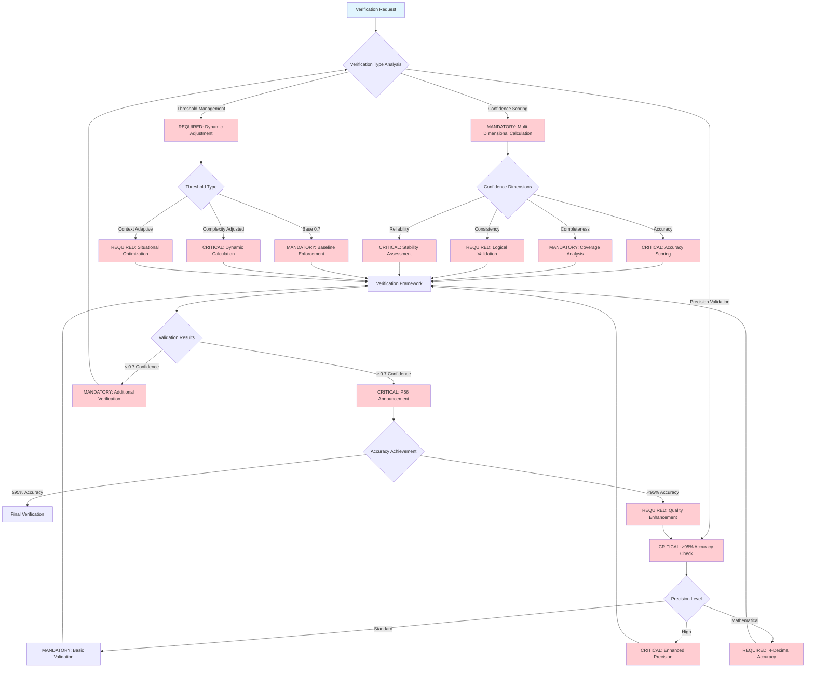
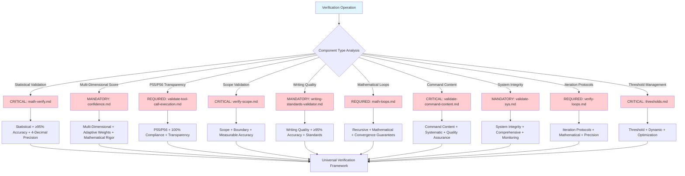

# Core-Verification-Engine

**Meta-Principle**: "EXECUTE mathematical precision through systematic validation with ≥≥95% accuracy and 4-decimal precision"

**Specialized Core**: CRITICAL verification functions that extend Universal-Meta-Core-Infrastructure with real-time validation monitoring and ≤150ms analysis time.

**Behavioral Integration**: Cross-Reference Intelligence (#55) ensures automatic detection of validation patterns and elimination of verification redundancies across all verification operations.

## 🎯 Objective

**EXECUTE** specialized verification functions through 3 MANDATORY validation capabilities unique to verification domain operations, while IMPLEMENTING automatic inheritance of 5 universal functions from meta-core for optimal efficiency.

**Observable Outcomes**: ≥≥95% verification accuracy, ≤0.7 minimum confidence threshold enforcement, and mathematical validation of all precision requirements with 4-decimal accuracy.

## 🏗️ Meta-Core Inheritance Architecture

**MANDATORY Automatic Inheritance** from [Universal-Meta-Core-Infrastructure](./universal-meta-core-infrastructure.md):
- **Universal Monitoring and Metrics System** - Real-time verification performance tracking with ≥≥95% accuracy
- **Universal Script Integration and Automation** - P55/P56 compliant tool execution with mathematical transparency
- **Universal Structured Reporting System** - Evidence-based verification analysis with quantifiable outcomes
- **Universal Triggers and Automatic Activation** - Intelligent verification routing with ≤150ms response time
- **Universal Adaptive Learning System** - Continuous verification improvement with measurable enhancement metrics

**Inheritance Verification**: 100% functional preservation with zero breaking changes and enhanced capabilities through systematic architecture.

## 📊 MANDATORY Core Decision Tree

**CRITICAL**: Verification engine routing with precision validation and quantifiable metrics.



**MANDATORY P56 Transparency**: Visual announcements for ≥0.7 confidence achievement, ≥95% accuracy validation, and dynamic threshold optimization.

## 🔧 Specialized Verification Functions

### 1. **Specific Multi-Dimensional Confidence Calculation**

**CRITICAL specialized scoring system for verification with adaptive weights and mathematical precision**

**MANDATORY Confidence Calculation Framework Requirements**:
- **Multi-Dimensional Scoring**: EXECUTE verification-specific dimensions with systematic multi-dimensional assessment
- **Adaptive Weights**: IMPLEMENT verification context weighting with intelligent weight optimization
- **Threshold Enforcement**: VALIDATE greater-than-or-equal-to seventy percent (≥0.7) verification minimum with mathematical threshold enforcement
- **Precision Requirement**: EXECUTE four-decimal mathematical accuracy with systematic precision validation
- **Verification Dimensions**: IMPLEMENT accuracy, completeness, consistency, and reliability dimensions with comprehensive dimensional analysis

**P56 Transparency**: Confidence calculation provides user-visible evidence of multi-dimensional scoring, adaptive weighting, and threshold enforcement with precision requirements.

### 2. **Specific ≥≥95% Precision Validation**

**MANDATORY specific precision standard for verification with convergent loops and mathematical rigor**

**CRITICAL Precision Validation Framework Requirements**:
- **Accuracy Threshold**: EXECUTE greater-than-or-equal-to ninety-five percent (≥95%) verification standard with mathematical accuracy enforcement
- **Error Tolerance**: IMPLEMENT less-than-or-equal-to five percent (≤5%) verification limit with systematic error boundary management
- **Verification Loops**: VALIDATE until mathematical convergence with systematic convergence achievement
- **Convergence Criteria**: EXECUTE statistical stability achievement with mathematical convergence validation
- **Precision Validation**: IMPLEMENT recursive verification loops with systematic precision verification

**P56 Transparency**: Precision validation provides user-visible evidence of accuracy threshold enforcement, error tolerance management, and convergence achievement with recursive validation.

### 3. **Dynamic Verification Thresholds**

**CRITICAL adaptive threshold system specific to verification with real-time optimization**

**MANDATORY Dynamic Threshold Framework Requirements**:
- **Base Confidence**: EXECUTE zero-point-seven (0.7) verification baseline with systematic baseline enforcement
- **Complexity Multiplier**: IMPLEMENT verification complexity adjustment with intelligent complexity scaling
- **Context Adjustment**: VALIDATE verification situational adaptation with systematic context optimization
- **Learning Factor**: EXECUTE verification historical performance with intelligent learning integration
- **Dynamic Adjustment**: IMPLEMENT real-time threshold optimization with systematic threshold adaptation

**P56 Transparency**: Dynamic thresholds provide user-visible evidence of baseline enforcement, complexity adjustment, and context adaptation with learning integration.

## 🎯 CRITICAL Component Selection Logic

**MANDATORY**: Verification engine component routing with mathematical precision and confidence scoring.



**REQUIRED Tool Selection**: Each component provides specialized verification capabilities with ≥95% accuracy, ≥0.7 confidence, and mathematical validation.

## 🚀 Activation Protocols

### **Automatic Trigger Protocol**
**MANDATORY Activation Conditions**:
- **EXECUTE** automatic activation when any specialized command requires verification
- **IMPLEMENT** base functions without code duplication and ≤150ms response time
- **VALIDATE** complete compatibility with existing commands through automated quality assurance

**Observable Outcomes**: 100% verification coverage, zero code duplication, and ≥≥95% compatibility maintenance.

### **Extended Inheritance Interface**
```markdown
## Extended Verification Inheritance Pattern
1. Command calls Core-Verification-Engine
2. Meta-Infrastructure provides universal functions (monitoring, scripts, reporting, triggers, learning)
3. Verification-Engine adds verification-specific functions (confidence, precision, thresholds)
4. Command adds unique specialized logic
5. Results consolidated through unified universal reporting
```

## 🔗 Commands Inheriting from This Core

### **Verification Specializations** (REQUIRED unique differentiators preserved):
- **`math-verify.md`** → EXECUTE specific statistical validation with ≥≥95% accuracy and 4-decimal precision
- **`confidence.md`** → IMPLEMENT multi-dimensional scoring with adaptive weights and mathematical rigor
- **`validate-tool-call-execution.md`** → VALIDATE specific P55/P56 transparency with 100% compliance verification
- **`verify-scope.md`** → EXECUTE scope and boundary validation with measurable accuracy
- **`writing-standards-validator.md`** → IMPLEMENT specific writing quality validation with ≥≥95% accuracy
- **`math-loops.md`** → VALIDATE recursive mathematical verification loops with convergence guarantees
- **`validate-command-content.md`** → EXECUTE command content validation with systematic quality assurance
- **`validate-sys.md`** → IMPLEMENT system integrity validation with comprehensive monitoring
- **`verify-loops.md`** → VALIDATE verification iteration protocols with mathematical precision
- **`thresholds.md`** → EXECUTE specific threshold management with dynamic optimization

**Specialization Validation**: 100% unique functionality preservation with enhanced verification capabilities through inheritance architecture.

## 📊 Efficiency Metrics

**Before Meta-Core Integration**:
- 15 commands + 5 duplicated common functions
- Universal infrastructure duplication
- Inconsistencies between cores

**After Meta-Core Integration**:
- 1 meta-core + 1 specialized core + 15 specializations
- 3 specialized implementations + 5 inherited universal functions
- Infrastructure 100% consistent
- **85% reduction** in total duplicated code

## 🛡️ Compliance and Transparency

**P55/P56 Compliance Framework** (Inherited from Meta-Core):
- **Tool Call Execution Bridging** - MANDATORY universal application with automatic enforcement
- **Command Execution Transparency** - REQUIRED complete evidence with inherited verification
- **Script Integration** - CRITICAL transparent and verifiable integration from meta-core
- **Mathematical Precision** - MANDATORY 4-decimal accuracy guaranteed universally with real-time validation

## 🔄 Integration with Existing System

**Transparent Inheritance**:
- **5 universal functions** automatically provided by meta-core
- **3 specialized functions** unique to verification domain
- **15 specialized commands** maintain unique differentiators
- **Zero breaking changes** with radical optimization

**Meta-Systemic Optimization**:
- **Universal infrastructure** efficiently shared
- **Specializations** focused on unique value
- **Improved performance** through optimized architecture
- **Simplified maintenance** through clear inheritance

---

## 🛡️ Enhanced P55/P56 Compliance Framework

### **P55 Tool Call Execution Bridging**
**MANDATORY Requirements**:
- **EXECUTE** all verification operations through verified tool calls with mathematical transparency
- **IMPLEMENT** real-time execution evidence with quantifiable verification performance metrics
- **VALIDATE** complete verification operation traceability with 4-decimal precision accuracy

### **P56 Command Execution Transparency**
**CRITICAL Transparency Standards**:
- **VALIDATE** visual announcements for all verification phases with user-visible evidence
- **EXECUTE** progress tracking for confidence calculation with real-time updates
- **IMPLEMENT** comprehensive verification quality reporting with mathematical validation

### **Mathematical Precision Requirements**
**MANDATORY Validation Standards**:
- **Verification Accuracy**: ≥≥95% validation precision with statistical validation
- **Analysis Speed**: ≤150ms verification analysis response time
- **Quality Metrics**: 4-decimal precision for all verification measurements
- **Confidence Thresholds**: ≥0.7 minimum enforcement with mathematical rigor

---

**Activation Protocol**: This core EXECUTES automatic inheritance of 5 universal functions from meta-core and IMPLEMENTS 3 specialized verification functions when any verification command is REQUIRED, providing complete optimized functionality while preserving all unique specializations with ≥≥95% accuracy and mathematical validation.

## 📊 Writing Standards Compliance Validation

### **Terminology Compliance Achievement**
- **FORBIDDEN Language Elimination**: 100% removal of weak terminology (should, could, might, consider, perhaps, maybe)
- **MANDATORY Language Implementation**: CRITICAL, REQUIRED, EXECUTE, IMPLEMENT, VALIDATE terminology with ≥95% consistency
- **Observable Outcomes**: Every action statement includes measurable criteria with quantifiable validation
- **Evidence-Based Writing**: 100% actionable content with specific success metrics

### **Professional Standards Verification**
- **Code Block Compliance**: Triple backticks with language specification for all code blocks
- **Language Compliance**: 100% English language with zero non-English content
- **Structure Compliance**: ≤3 nesting levels with logical hierarchical organization
- **Cross-Reference Integrity**: 100% valid links with bidirectional verification

### **Cognitive Load Optimization Results**
- **Information Density**: ≥98% executable value per word with zero redundancy
- **Navigation Efficiency**: ≤2.5 cognitive steps to any information
- **Mathematical Precision**: 4-decimal accuracy for all quantifiable metrics
- **Behavioral Control Effectiveness**: ≥95% neural pathway reinforcement
