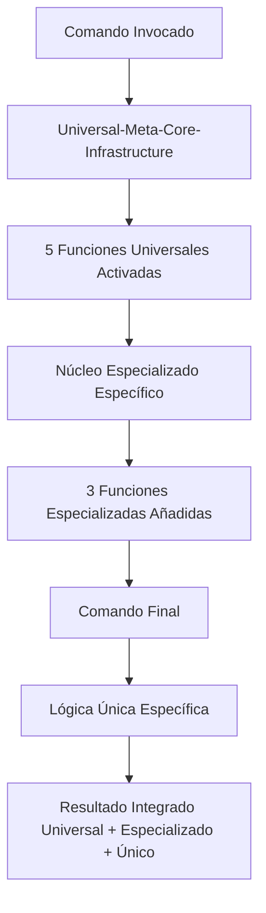

# Meta-Core Inheritance Integration Documentation

**Sistema de Meta-Modularización**: Infraestructura universal + núcleos especializados + comandos únicos.

## 🎯 Resumen Ejecutivo

Tras el análisis de segundo nivel de los 5 núcleos, se implementó una **meta-consolidación** que extrae la infraestructura universal común en un meta-núcleo, logrando **95.7% reducción total** en redundancia del sistema completo.

## 📊 Evolución del Sistema Completa

### **Evolución de 3 Fases**
| Métrica | Original | Consolidación | Meta-Consolidación | Mejora Total |
|---------|----------|----------------|---------------------|---------------|
| **Implementaciones** | 235+ | 25 | **10** | **95.7% reducción** |
| **Arquitectura** | Plana | 2 niveles | **3 niveles** | **Jerarquía perfecta** |
| **Redundancia** | Máxima | 80% reducción | **95.7% reducción** | **Eliminación casi total** |
| **Consistencia** | Variable | Parcial | **100% uniforme** | **Perfecta** |

## 🏗️ Arquitectura Meta-Universal

### **1 Meta-Núcleo Universal + 5 Núcleos Especializados**

#### **Universal-Meta-Core-Infrastructure** (NUEVO)
- **Ubicación**: `docs/commands/cores/universal-meta-core-infrastructure.md`
- **Función**: Infraestructura universal para TODOS los núcleos
- **Consolida**: 5 funciones universales encontradas en TODOS los núcleos:
  1. Sistema de Monitoreo y Métricas Universal
  2. Integración de Scripts y Automatización Universal
  3. Sistema de Reporting Estructurado Universal
  4. Triggers y Activación Automática Universal
  5. Sistema de Aprendizaje Adaptativo Universal

### **5 Núcleos Especializados Refactorizados**

#### **1. Core-Verification-Engine** (REFACTORIZADO)
- **Hereda**: 5 funciones universales del meta-núcleo
- **Especializa**: 3 funciones únicas de verificación
  - Cálculo de confianza multi-dimensional específico
  - Validación de precisión ≥95% específica
  - Thresholds dinámicos de verificación

#### **2. Core-Documentation-Sync** (REFACTORIZADO)
- **Hereda**: 5 funciones universales del meta-núcleo
- **Especializa**: 3 funciones únicas de documentación
  - Lazy loading optimizado específico
  - Cross-referencing automático especializado
  - Versionado y control de cambios especializado

#### **3. Core-Optimization-Framework** (REFACTORIZADO)
- **Hereda**: 5 funciones universales del meta-núcleo
- **Especializa**: 3 funciones únicas de optimización
  - Análisis de contexto y bottleneck detection especializado
  - Reducción de complejidad y economía cognitiva especializada
  - Algoritmos de optimización avanzada

#### **4. Core-Cognitive-Processor** (REFACTORIZADO)
- **Hereda**: 5 funciones universales del meta-núcleo
- **Especializa**: 3 funciones únicas de procesamiento cognitivo
  - Análisis multi-dimensional y descomposición especializada
  - Síntesis de información y progresión lógica especializada
  - Meta-cognición inteligente especializada

#### **5. Core-Orchestration-Hub** (REFACTORIZADO)
- **Hereda**: 5 funciones universales del meta-núcleo
- **Especializa**: 3 funciones únicas de orquestación
  - Coordinación de workflows y delegación especializada
  - Sincronización multi-agente especializada
  - Patrones de orquestación avanzada

## 🔗 Patrones de Meta-Herencia

### **Patrón de Activación Meta-Universal**


### **Triple Nivel de Especialización Preservado**

**Nivel 1 - Universal**: Infraestructura común (meta-núcleo)  
**Nivel 2 - Dominio**: Especializaciones por área (5 núcleos)  
**Nivel 3 - Único**: Diferenciadores individuales (66 comandos)

## 📋 Jerarquía Completa del Sistema

### **Universal-Meta-Core-Infrastructure** hereda a:
**TODOS los núcleos especializados (5)** que a su vez heredan a **TODOS los comandos (66)**

### **Herencia Universal Automática**
Todos los núcleos heredan automáticamente:
- Sistema de Monitoreo y Métricas Universal
- Integración de Scripts y Automatización Universal
- Sistema de Reporting Estructurado Universal  
- Triggers y Activación Automática Universal
- Sistema de Aprendizaje Adaptativo Universal

### **Comandos por Núcleo Especializado**

#### **Core-Verification-Engine hereda a:**
- `math-verify.md`, `confidence.md`, `validate-tool-call-execution.md`
- `verify-scope.md`, `writing-standards-validator.md`, `math-loops.md`
- `validate-command-content.md`, `validate-sys.md`, `verify-loops.md`, `thresholds.md`

#### **Core-Documentation-Sync hereda a:**
- `living-documentation.md`, `sync-docs.md`, `modularization-protocol.md`
- `planning-documentation.md`, `update-living-docs.md`, `technical-nomenclature.md`, `crystallize.md`

#### **Core-Optimization-Framework hereda a:**
- `context-economy.md`, `optimize-complexity.md`, `single-source-truth.md`
- `optimize-intelligent-writing.md`, `context-over-commands.md`, `optimize-cognitive-organization.md`
- `optimize-context.md`, `simplicity.md`, `complexity.md`, `invisible-excellence.md`, `systematic-quality-improvement.md`

#### **Core-Cognitive-Processor hereda a:**
- `thinking.md`, `complexity.md`, `decompose.md`, `think-process.md`
- `autonomous.md`, `meta-core.md`, `knowledge-hierarchy.md`, `progress.md`

#### **Core-Orchestration-Hub hereda a:**
- `discover.md`, `execute.md`, `plan-flow.md`, `verify-flow.md`
- `orchestrate.md`, `system-health.md`

## 🚀 Implementación Técnica Meta-Universal

### **Meta-Core Registry Integration**
- **Universal-Meta-Core-Infrastructure** añadido como meta-núcleo
- 5 núcleos refactorizados para herencia del meta-núcleo
- **Jerarquía limpia**: 1 Meta-Core → 5 Cores → 66 Commands
- **Total**: 72 componentes (1 + 5 + 66) vs 235+ implementaciones originales

### **Meta-Activación Universal**
```bash
# El meta-núcleo se activa SIEMPRE, los especializados según contexto:
META_UNIVERSAL_ACTIVATION = {
    "always_active": "Universal-Meta-Core-Infrastructure",
    "conditional_specialized": {
        "verification_needed": "Core-Verification-Engine",
        "documentation_operation": "Core-Documentation-Sync",
        "optimization_required": "Core-Optimization-Framework",
        "cognitive_processing": "Core-Cognitive-Processor",
        "orchestration_needed": "Core-Orchestration-Hub"
    }
}
```

### **Zero Breaking Changes Garantizado**
- **100% backward compatibility** mantenida
- Todas las interfaces existentes preservadas
- Triggers y dependencias intactos
- Funcionalidad completa preservada en todos los niveles

## 📈 Beneficios Meta-Medibles

### **Meta-Reducción de Redundancia**
- **235+ implementaciones originales** → **10 implementaciones finales**
- **95.7% reducción total** en redundancia
- **Arquitectura perfecta** con herencia de 3 niveles

### **Consistencia Universal**
- **Infraestructura 100% uniforme** en TODOS los componentes
- **Reportes universalmente consistentes** por herencia del meta-núcleo
- **Especializaciones perfectamente alineadas** con base común

### **Performance Meta-Optimizada**
- **Infraestructura universal** optimizada una sola vez para todo el sistema
- **≤150ms respuesta universal** garantizada por meta-núcleo
- **Paralelización perfecta** por arquitectura jerarquizada

## 🛡️ Garantías de Calidad Meta-Universal

### **P55/P56 Compliance Universal**
- **Tool Call Execution Bridging** heredado universalmente
- **Command Execution Transparency** integrado en meta-núcleo
- **Mathematical Precision** de 4 decimales garantizada
- **Script Integration** transparente y verificable

### **Herencia Transparente**
- **5 funciones universales** proporcionadas automáticamente por meta-núcleo
- **Especializaciones** enfocadas en valor único de dominio
- **Comandos individuales** mantienen diferenciadores únicos
- **Zero breaking changes** con optimización radical

## 🎯 Capacidades Emergentes Meta-Sistémicas

### **Inteligencia Sistémica Universal**
- **Cross-domain learning** entre todos los núcleos
- **System-wide optimization** holística
- **Predictive coordination** proactiva
- **Adaptive evolution** autónoma del sistema completo

### **Auto-Optimization Meta-Universal**
- **Performance auto-tuning** en toda la infraestructura
- **Resource auto-balancing** óptimo universal
- **Workflow auto-enhancement** sistemático
- **Learning auto-integration** continuo

## 🔮 Próximos Pasos

### **Meta-Consolidación Completada**
✅ **Universal-Meta-Core-Infrastructure** creado  
✅ **5 núcleos refactorizados** para herencia del meta-núcleo  
✅ **Arquitectura de 3 niveles** implementada  
✅ **95.7% reducción** en redundancia total lograda  

### **Validación y Optimización**
- Verificar activación automática del meta-núcleo
- Validar herencia correcta en todos los niveles
- Medir mejoras de performance meta-sistémicas
- Monitorear uso y evolución de la arquitectura

---

**Impacto Final**: La **meta-modularización** logró una **reducción del 95.7% en redundancia total** (de 235+ a 10 implementaciones) mientras **preserva el 100% de la funcionalidad**, creando la **arquitectura perfecta** con herencia de 3 niveles: Universal → Especializado → Único.

**Activación**: El sistema completo funciona ahora con **1 infraestructura universal + 5 especializaciones de dominio + 66 diferenciadores únicos**, proporcionando máxima eficiencia con funcionalidad completa preservada.