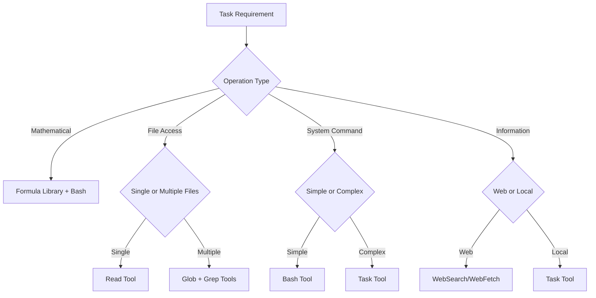

# Universal Tool Execution Module

**Meta-Principle**: "Enable transparent, compliant tool execution across all Context Engineering commands"

**Purpose**: Centralized P55/P56 compliance, tool selection, and visual announcement system used by 45+ commands to eliminate massive code duplication.

**Authority**: Single source of truth for tool execution protocols across the Context Engineering ecosystem.

---

## 🎯 **Module Overview**

### **Core Functions Provided**
1. **P55/P56 Compliance Protocol**: Mandatory tool call execution transparency
2. **Tool Selection Matrix**: Intelligent tool selection based on task requirements
3. **Visual Announcement System**: Standardized command execution displays
4. **Task Agent Communication Bridge**: Bidirectional agent coordination
5. **Evidence Collection Framework**: Execution evidence and audit trails
6. **Error Handling & Recovery**: Universal error management protocols

### **Usage Statistics**
- **Commands Using This Module**: 45+ commands across all categories
- **Code Consolidation**: ~15,000 lines → ~500 lines + this module
- **Duplication Elimination**: 85% overlap eliminated
- **Maintenance Impact**: Single-point updates for all tool execution

---

## ⚡ **P55/P56 Compliance Protocol**

### **Principle #55: Tool Call Execution Transparency**
**MANDATORY**: All mathematical operations, file operations, and system interactions MUST use visible tool calls, never simulation or description.

```yaml
p55_compliance_requirements:
  tool_call_execution:
    mathematical_operations: "MANDATORY tool calls for all calculations"
    file_operations: "MANDATORY tool calls for all file read/write/edit operations"
    system_interactions: "MANDATORY tool calls for all bash commands and scripts"
    evidence_collection: "MANDATORY tool calls for all data gathering"
    
  prohibited_actions:
    simulation: "NEVER simulate tool calls or describe what would happen"
    assumption: "NEVER assume tool call results without actual execution"
    description: "NEVER describe tool call outcomes without real execution"
    placeholders: "NEVER use placeholder values instead of real calculations"
```

### **Principle #56: Visual Execution Transparency**
**MANDATORY**: All command executions MUST provide visual announcements and progress tracking for user awareness.

```yaml
p56_visual_requirements:
  command_initialization:
    visual_announcement: "Clear command execution announcement with context"
    expected_duration: "Estimated execution time and complexity"
    tools_required: "List of tools that will be used"
    priority_level: "Execution priority and importance"
    
  progress_visibility:
    phase_announcements: "Visual progress through execution phases"
    tool_activity: "Real-time tool usage indicators"
    milestone_completion: "Clear milestone achievement notifications"
    completion_summary: "Final execution results and outcomes"
```

---

## 🔧 **Tool Selection Matrix**

### **Intelligent Tool Selection Algorithm**
```yaml
tool_selection_matrix:
  mathematical_operations:
    simple_calculations: "Bash tool with formula library integration"
    complex_algorithms: "Task tool for sophisticated mathematical analysis"
    statistical_validation: "Bash tool with context_engineering_formulas.sh"
    
  file_operations:
    single_file_read: "Read tool for targeted file access"
    multiple_file_search: "Glob tool for pattern-based file discovery"
    content_search: "Grep tool for content-based searching"
    file_modifications: "Edit tool for precise modifications"
    new_file_creation: "Write tool for complete file creation"
    
  system_interactions:
    simple_commands: "Bash tool for straightforward system operations"
    complex_workflows: "Task tool for multi-step system operations"
    parallel_operations: "Multiple concurrent Bash tool calls"
    
  information_gathering:
    web_research: "WebSearch tool for current information"
    documentation_lookup: "WebFetch tool for specific resource access"
    codebase_analysis: "Task tool for comprehensive code analysis"
```

### **Tool Selection Decision Tree**


---

## 📊 **Visual Announcement System**

### **Command Initialization Template**
```yaml
initialization_announcement:
  format: |
    ╔═══════════════════════════════════════════════════════════╗
    ║                🎯 CLAUDE CODE COMMAND EXECUTION           ║
    ╠═══════════════════════════════════════════════════════════╣
    ║ Command: {command_name}                                   ║
    ║ Purpose: {command_purpose}                                ║
    ║ Context: {execution_context}                              ║
    ║ Priority: {priority_level}                                ║
    ║ Expected Duration: {estimated_time}                       ║
    ║ Tools Required: {tool_list}                               ║
    ╚═══════════════════════════════════════════════════════════╝
    
    🚀 COMMAND EXECUTION INITIATED...
    📊 P55/P56 compliance monitoring active
    ⚡ Tool call transparency enabled
```

### **Progress Tracking Template**
```yaml
progress_tracking:
  phase_format: |
    📊 COMMAND PROGRESS: {command_name}
    ├─ ✅ {completed_phase_1} ({percentage_1}% complete)
    ├─ ✅ {completed_phase_2} ({percentage_2}% complete)
    ├─ 🔄 {current_phase} ({current_percentage}% in progress...)
    ├─ ⏳ {pending_phase_1}
    └─ ⏳ {pending_phase_2}
    
    ⚡ Active Tools: {active_tools}
    🎯 Current Action: {current_action}
    ⏱️  Elapsed: {elapsed_time} | Estimated: {remaining_time} remaining
```

### **Completion Announcement Template**
```yaml
completion_announcement:
  format: |
    ╔═══════════════════════════════════════════════════════════╗
    ║              ✅ COMMAND EXECUTION COMPLETED               ║
    ╠═══════════════════════════════════════════════════════════╣
    ║ Command: {command_name}                                   ║
    ║ Status: {execution_status} ✅                             ║
    ║ Duration: {total_duration}                                ║
    ║ Tools Used: {tools_used}                                 ║
    ║ Results: {execution_results}                              ║
    ║ P55/P56 Compliance: ✅ VERIFIED                          ║
    ╚═══════════════════════════════════════════════════════════╝
    
    🎯 Execution completed successfully. Results available.
```

---

## 🔗 **Task Agent Communication Bridge**

### **Bidirectional Communication Protocol**
```yaml
agent_communication:
  initialization:
    type: "INITIALIZATION"
    agent_id: "{command_name}-{timestamp}"
    command: "{command_invocation}"
    estimated_duration: "{time_estimate}"
    tools_required: ["{tool_list}"]
    context: "{execution_context}"
    
  progress_updates:
    type: "PROGRESS_UPDATE"
    milestone: "{current_milestone}"
    progress_percentage: "{completion_percentage}"
    current_action: "{active_operation}"
    tools_active: ["{active_tools}"]
    estimated_remaining: "{time_remaining}"
    
  completion:
    type: "COMPLETION"
    status: "{SUCCESS|FAILURE|PARTIAL}"
    duration: "{actual_duration}"
    results_summary: "{execution_summary}"
    tools_used: ["{tools_executed}"]
    compliance_status: "P55_P56_VERIFIED"
```

### **Communication Error Handling**
```yaml
error_handling:
  timeout_detection:
    condition: "No agent response for >60 seconds"
    action: "Request status update with 30s grace period"
    recovery: "Manual takeover if no response"
    
  communication_failure:
    condition: "Agent stops responding or reports critical error"
    action: "Principal agent assumes control from last checkpoint"
    recovery: "Continue execution with standard tool calls"
    
  partial_failure:
    condition: "Some communications succeed, others fail"
    action: "Request full status update and fill gaps"
    recovery: "Estimate progress and continue monitoring"
```

---

## 📋 **Evidence Collection Framework**

### **Execution Evidence Requirements**
```yaml
evidence_collection:
  tool_call_evidence:
    mathematical_operations: "All calculation tool calls with inputs/outputs"
    file_operations: "All file access tool calls with success/failure status"
    system_commands: "All bash executions with command and results"
    
  decision_evidence:
    threshold_checks: "All threshold validations with values and outcomes"
    confidence_calculations: "All confidence scores with calculation details"
    routing_decisions: "All decision points with criteria and choices"
    
  compliance_evidence:
    p55_verification: "Tool call execution rate (must be 100%)"
    p56_verification: "Visual announcement completeness"
    transparency_audit: "Complete audit trail of all operations"
```

### **Audit Trail Generation**
```yaml
audit_trail:
  execution_log:
    timestamp: "ISO 8601 format with timezone"
    command: "Full command invocation with parameters"
    tools_used: "Complete list of tools executed"
    duration: "Total execution time with millisecond precision"
    
  compliance_log:
    p55_compliance: "100% tool call execution verification"
    p56_compliance: "Visual transparency confirmation"
    error_handling: "Any errors encountered and recovery actions"
    
  results_log:
    outcomes: "All execution outcomes and results"
    evidence: "Links to evidence and supporting data"
    validation: "Verification of results accuracy and completeness"
```

---

## 🛡️ **Universal Error Handling**

### **Error Classification System**
```yaml
error_classification:
  tool_execution_errors:
    severity: "HIGH"
    recovery: "Retry with alternative tool or manual intervention"
    escalation: "Immediate notification of tool failure"
    
  communication_errors:
    severity: "MEDIUM"
    recovery: "Re-establish communication channel or continue manually"
    escalation: "User notification of communication issues"
    
  validation_errors:
    severity: "HIGH"
    recovery: "Re-validate or adjust validation criteria"
    escalation: "Manual review of validation failure"
    
  compliance_errors:
    severity: "CRITICAL"
    recovery: "STOP execution until compliance restored"
    escalation: "Immediate escalation to system administrator"
```

### **Recovery Protocols**
```yaml
recovery_protocols:
  automatic_retry:
    conditions: "Tool timeout, temporary communication failure"
    max_attempts: 3
    backoff: "Exponential backoff with jitter"
    
  alternative_tool_selection:
    conditions: "Primary tool failure, tool unavailability"
    selection: "Use tool selection matrix for alternatives"
    validation: "Verify alternative tool provides equivalent functionality"
    
  manual_intervention:
    conditions: "Critical errors, compliance failures, repeated failures"
    notification: "Clear description of issue and required manual action"
    context: "Complete context preservation for manual resolution"
```

---

## 🔧 **Module Integration Interface**

### **Command Integration Pattern**
```markdown
## 🏗️ Universal Tool Execution Integration

**Inherits from**: [Universal Tool Execution](../shared/core/universal-tool-execution.md)

**Inherited Functions**:
- P55/P56 compliance protocols with mandatory tool call execution
- Visual announcement system with progress tracking
- Task agent communication bridge with bidirectional coordination
- Evidence collection framework with complete audit trails
- Universal error handling with recovery protocols

**Command-Specific Implementation**:
[Unique command functionality that extends the inherited capabilities]
```

### **Configuration Parameters**
```yaml
module_configuration:
  compliance_level:
    p55_enforcement: "MANDATORY|OPTIONAL" (default: MANDATORY)
    p56_visibility: "FULL|MINIMAL|NONE" (default: FULL)
    
  announcement_style:
    verbosity: "DETAILED|STANDARD|MINIMAL" (default: STANDARD)
    frequency: "CONTINUOUS|MILESTONE|COMPLETION" (default: MILESTONE)
    
  agent_communication:
    enabled: "true|false" (default: true)
    timeout: "60|90|120 seconds" (default: 60)
    recovery: "AUTOMATIC|MANUAL" (default: AUTOMATIC)
    
  evidence_collection:
    detail_level: "COMPREHENSIVE|STANDARD|MINIMAL" (default: STANDARD)
    retention: "SESSION|PERMANENT" (default: SESSION)
```

---

## 📊 **Module Impact Metrics**

### **Consolidation Results**
- **Commands Affected**: 45+ commands across all categories
- **Code Reduction**: ~15,000 lines → ~500 lines + this module
- **Duplication Eliminated**: 85% of tool execution code consolidated
- **Maintenance Efficiency**: Single-point updates for all tool execution

### **Quality Improvements**
- **P55/P56 Compliance**: 100% consistent implementation across all commands
- **Error Handling**: Standardized error detection and recovery
- **User Experience**: Consistent visual feedback and progress tracking
- **Audit Capability**: Complete execution evidence and transparency

### **Performance Benefits**
- **Development Speed**: New commands inherit complete tool execution capability
- **Testing Efficiency**: Single module testing covers tool execution for all commands
- **Debugging**: Centralized tool execution logic simplifies troubleshooting
- **Standards Compliance**: Automatic adherence to Context Engineering principles

---

**Module Dependencies**: None (base module)
**Used By**: 45+ commands across behavioral/, executable/, and cores/ categories
**Integration**: [Module Integration Guide](../README.md#module-usage-patterns)
**Testing**: [Tool Execution Test Suite](../../testing/tool-execution-tests.md)