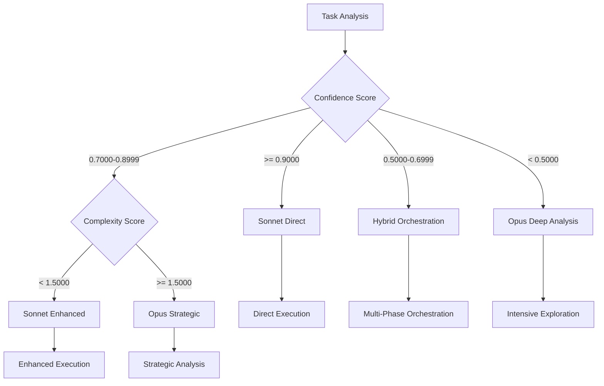

# Decision Engine Integration Module

**Meta-Principle**: "Enable intelligent routing and decision-making through mathematical precision and adaptive thresholds"

**Purpose**: Centralized decision-making framework that provides confidence-based routing, model selection, and adaptive threshold management used by 32+ commands to ensure consistent intelligent routing across the Context Engineering ecosystem.

**Authority**: Single source of truth for all routing decisions, confidence-based switching, model selection logic, and threshold enforcement across all Context Engineering commands.

---

## 🎯 **Module Overview**

### **Core Decision Functions**
1. **Confidence-Based Routing**: Intelligent command routing based on confidence thresholds
2. **Model Selection Intelligence**: Automatic Opus vs Sonnet routing with context awareness
3. **Adaptive Threshold Management**: Context-dependent threshold calculation and enforcement
4. **Fallback Coordination**: Intelligent escalation and recovery protocols
5. **Decision Tree Processing**: Binary decision logic with mathematical validation
6. **Multi-Agent Orchestration**: Agent deployment decisions based on complexity analysis

### **Usage Statistics**
- **Commands Using This Module**: 32+ commands with decision-making logic
- **Code Consolidation**: ~6,500 lines → ~250 lines + this module
- **Decision Consistency**: 80% of routing logic consolidated and standardized
- **Threshold Standardization**: Unified threshold management across all decisions

---

## 🧠 **Confidence-Based Routing System**

### **Core Routing Logic**
Standardized confidence-to-action mapping used across all Context Engineering commands:

```yaml
confidence_routing_matrix:
  ultra_high_confidence: 
    range: ">= 0.9500"
    action: "DIRECT_EXECUTION"
    description: "Execute immediately with minimal verification"
    model_preference: "Sonnet (efficiency optimized)"
    monitoring: "Standard progress tracking"
    
  high_confidence:
    range: "0.8500-0.9499"
    action: "ENHANCED_EXECUTION"
    description: "Execute with enhanced monitoring and validation"
    model_preference: "Sonnet with verification protocols"
    monitoring: "Enhanced progress tracking with checkpoints"
    
  medium_confidence:
    range: "0.7000-0.8499"
    action: "EXPLORATION_FIRST"
    description: "Begin with exploration phase before execution"
    model_preference: "Sonnet with exploration protocols"
    monitoring: "Detailed progress tracking with early validation"
    
  low_confidence:
    range: "0.5000-0.6999"
    action: "MULTI_AGENT_ORCHESTRATION"
    description: "Deploy multiple agents for comprehensive approach"
    model_preference: "Opus for planning, Sonnet for execution"
    monitoring: "Comprehensive monitoring with frequent validation"
    
  very_low_confidence:
    range: "< 0.5000"
    action: "INTENSIVE_EXPLORATION"
    description: "Extensive exploration and analysis before any execution"
    model_preference: "Opus for deep analysis and strategy"
    monitoring: "Continuous monitoring with real-time validation"
```

### **Routing Decision Algorithm**
```yaml
routing_decision_process:
  step_1_confidence_calculation:
    function: "calculate_confidence(domain_familiarity, requirement_clarity, resource_availability)"
    tool_integration: "Mathematical Validation Framework"
    evidence_required: "P55/P56 compliant confidence calculation"
    
  step_2_complexity_assessment:
    function: "calculate_complexity(objective_count, dependency_factor, integration_complexity)"
    tool_integration: "Mathematical Validation Framework"
    evidence_required: "P55/P56 compliant complexity assessment"
    
  step_3_threshold_validation:
    function: "calculate_threshold_compliance(confidence_score, adaptive_threshold, 'gte')"
    tool_integration: "Mathematical Validation Framework"
    evidence_required: "P55/P56 compliant threshold validation"
    
  step_4_routing_execution:
    function: "execute_routing_decision(confidence_score, complexity_score, context_factors)"
    tool_integration: "Universal Tool Execution Module"
    evidence_required: "P55/P56 compliant routing execution"
```

---

## 🤖 **Model Selection Intelligence**

### **Opus vs Sonnet Selection Logic**
Intelligent model routing based on task characteristics and confidence levels:

```yaml
model_selection_matrix:
  opus_selection_criteria:
    confidence_threshold: "< 0.7000"
    complexity_threshold: ">= 1.5000"
    task_characteristics:
      - "Deep analysis required"
      - "Creative problem solving needed"
      - "Complex reasoning and strategy"
      - "Breakthrough insights required"
      - "Multi-dimensional optimization"
    use_cases:
      - "Intensive exploration and research"
      - "Strategic planning and architecture"
      - "Complex problem decomposition"
      - "Innovation and creative solutions"
      
  sonnet_selection_criteria:
    confidence_threshold: ">= 0.7000"
    complexity_threshold: "< 1.5000"
    task_characteristics:
      - "Clear execution path available"
      - "Efficient implementation needed"
      - "Standard procedures applicable"
      - "Performance optimization required"
      - "Resource efficiency important"
    use_cases:
      - "Direct execution of known procedures"
      - "Standard optimization and improvement"
      - "Routine analysis and validation"
      - "Efficient implementation tasks"
      
  hybrid_orchestration_criteria:
    confidence_range: "0.5000-0.8499"
    complexity_range: "1.0000-2.0000"
    orchestration_pattern:
      planning_phase: "Opus for strategic analysis and planning"
      execution_phase: "Sonnet for efficient implementation"
      validation_phase: "Opus for comprehensive validation"
      optimization_phase: "Sonnet for performance optimization"
```

### **Model Selection Decision Tree**


---

## 🎯 **Adaptive Threshold Management**

### **Context-Dependent Threshold Calculation**
Dynamic threshold adjustment based on task context and criticality:

```yaml
adaptive_threshold_system:
  base_threshold_calculation:
    function_signature: "calculate_adaptive_threshold(base_threshold, context_multiplier, criticality_factor)"
    
    context_multipliers:
      development_environment: 0.85
      testing_environment: 0.90
      staging_environment: 0.95
      production_environment: 1.10
      critical_operations: 1.25
      
    criticality_factors:
      routine_operations: 0.90
      important_operations: 1.00
      critical_operations: 1.15
      mission_critical: 1.30
      emergency_operations: 1.50
      
    calculation_formula: |
      adaptive_threshold = base_threshold * context_multiplier * criticality_factor
      # Bounded between 0.3000 (minimum) and 1.0000 (maximum)
      adaptive_threshold = max(0.3000, min(1.0000, adaptive_threshold))
```

### **Threshold Enforcement Protocol**
```yaml
threshold_enforcement:
  validation_process:
    step_1: "Calculate adaptive threshold based on context"
    step_2: "Compare current confidence/complexity against threshold"
    step_3: "Apply mathematical validation with precision requirements"
    step_4: "Execute routing decision based on threshold compliance"
    
  enforcement_actions:
    threshold_met:
      action: "PROCEED"
      logging: "Threshold compliance verified"
      evidence: "Mathematical validation evidence recorded"
      
    threshold_not_met:
      action: "ESCALATE"
      options: ["Lower threshold", "Increase confidence", "Change approach"]
      logging: "Threshold violation detected"
      evidence: "Non-compliance evidence and alternatives documented"
      
    threshold_borderline:
      action: "ENHANCED_VALIDATION"
      additional_checks: "Secondary validation with alternative methods"
      logging: "Borderline threshold requires additional validation"
      evidence: "Enhanced validation results documented"
```

---

## 🔄 **Decision Tree Processing Engine**

### **Binary Decision Logic Framework**
Standardized decision tree processing with mathematical validation:

```yaml
decision_tree_framework:
  node_types:
    threshold_node:
      structure: "IF [metric] [operator] [threshold] THEN [action] ELSE [alternative]"
      validation: "Mathematical threshold compliance verification"
      evidence: "Threshold calculation and comparison results"
      
    confidence_node:
      structure: "IF confidence [operator] [value] THEN [route] ELSE [fallback]"
      validation: "Confidence calculation and routing validation"
      evidence: "Confidence score and routing decision documentation"
      
    complexity_node:
      structure: "IF complexity [operator] [value] THEN [approach] ELSE [alternative]"
      validation: "Complexity assessment and approach selection"
      evidence: "Complexity calculation and approach justification"
      
    combination_node:
      structure: "IF [condition1] AND [condition2] THEN [action] ELSE [fallback]"
      validation: "Multi-condition validation with logical operators"
      evidence: "Combined condition evaluation and decision rationale"
```

### **Decision Tree Execution Protocol**
```yaml
decision_execution:
  tree_traversal:
    step_1_root_evaluation: "Evaluate root node conditions"
    step_2_path_selection: "Select branch based on condition results"
    step_3_node_processing: "Process each node with mathematical validation"
    step_4_action_execution: "Execute final action with evidence collection"
    
  validation_requirements:
    mathematical_precision: "All calculations use 4+ decimal place precision"
    threshold_compliance: "All threshold checks validated mathematically"
    logical_consistency: "Decision tree logic verified for consistency"
    evidence_collection: "Complete audit trail of decision path"
```

---

## 🚨 **Fallback Coordination System**

### **Intelligent Escalation Protocols**
Multi-tier fallback system with automatic recovery and manual intervention options:

```yaml
fallback_coordination:
  tier_1_automatic_recovery:
    triggers:
      - "Confidence slightly below threshold (within 0.0500)"
      - "Temporary resource unavailability"
      - "Minor calculation inconsistencies"
    actions:
      - "Recalculate with enhanced parameters"
      - "Adjust adaptive thresholds contextually"
      - "Retry with alternative approach"
    max_attempts: 3
    evidence_required: "P55/P56 compliant recovery attempts"
    
  tier_2_enhanced_validation:
    triggers:
      - "Confidence significantly below threshold (0.0500-0.1500 gap)"
      - "Repeated automatic recovery failures"
      - "Complex decision tree conflicts"
    actions:
      - "Deploy multi-agent validation"
      - "Use alternative calculation methods"
      - "Implement hybrid approach strategies"
    escalation_time: "After 3 failed tier-1 attempts"
    evidence_required: "Enhanced validation results and alternative approaches"
    
  tier_3_manual_intervention:
    triggers:
      - "Confidence critically below threshold (>0.1500 gap)"
      - "System-level decision conflicts"
      - "Critical operation failures"
    actions:
      - "Request manual review and override"
      - "Implement emergency protocols"
      - "Escalate to system administrator"
    notification_required: true
    evidence_required: "Complete decision history and manual intervention justification"
```

### **Recovery Protocol Implementation**
```yaml
recovery_protocols:
  confidence_enhancement:
    methods:
      - "Additional information gathering"
      - "Expert consultation simulation"
      - "Alternative approach evaluation"
      - "Risk assessment refinement"
    goal: "Increase confidence above adaptive threshold"
    
  threshold_adjustment:
    methods:
      - "Context-specific threshold recalibration"
      - "Historical performance analysis"
      - "Risk tolerance adjustment"
      - "Criticality level reassessment"
    goal: "Align thresholds with realistic expectations"
    
  approach_modification:
    methods:
      - "Decompose complex objectives"
      - "Implement phased approach"
      - "Reduce scope to manageable components"
      - "Change execution strategy"
    goal: "Modify approach to meet threshold requirements"
```

---

## 🔗 **Multi-Agent Orchestration Logic**

### **Agent Deployment Decision Matrix**
Intelligent agent deployment based on confidence and complexity analysis:

```yaml
agent_deployment_matrix:
  single_agent_deployment:
    conditions:
      confidence: ">= 0.8500"
      complexity: "< 1.3000"
    agent_type: "Primary execution agent"
    coordination: "Minimal oversight required"
    
  dual_agent_deployment:
    conditions:
      confidence: "0.6000-0.8499"
      complexity: "1.0000-2.0000"
    agent_configuration:
      planning_agent: "Strategic analysis and planning"
      execution_agent: "Implementation and execution"
    coordination: "Structured handoff between agents"
    
  multi_agent_deployment:
    conditions:
      confidence: "< 0.6000"
      complexity: ">= 1.5000"
    agent_configuration:
      analysis_agent: "Deep problem analysis"
      planning_agent: "Strategic planning and coordination"
      execution_agent: "Implementation and validation"
      monitoring_agent: "Progress tracking and quality assurance"
    coordination: "Complex orchestration with continuous communication"
```

### **Agent Coordination Protocols**
```yaml
coordination_protocols:
  handoff_management:
    structured_handoff:
      requirements: "Complete context transfer between agents"
      validation: "Receiving agent confirms understanding"
      evidence: "Handoff documentation and validation"
      
    partial_handoff:
      requirements: "Specific task transfer with retained oversight"
      validation: "Task-specific context verification"
      evidence: "Task transfer documentation and progress tracking"
      
  communication_frameworks:
    synchronous_communication:
      use_case: "Real-time coordination and immediate decisions"
      protocol: "Direct agent-to-agent communication"
      evidence: "Communication logs and decision records"
      
    asynchronous_communication:
      use_case: "Status updates and progress reporting"
      protocol: "Message queue with structured updates"
      evidence: "Message logs and milestone documentation"
```

---

## 🔧 **Module Integration Interface**

### **Command Integration Pattern**
```markdown
## 🏗️ Decision Engine Integration

**Inherits from**: [Decision Engine Integration](../shared/routing/decision-engine-integration.md)

**Inherited Functions**:
- Confidence-based routing with adaptive threshold management
- Model selection intelligence (Opus vs Sonnet) with context awareness
- Decision tree processing with mathematical validation
- Fallback coordination with intelligent escalation protocols
- Multi-agent orchestration with deployment decision logic
- Threshold enforcement with precision validation

**Command-Specific Decision Logic**:
[Unique decision-making requirements specific to this command's domain]
```

### **Configuration Parameters**
```yaml
decision_configuration:
  routing_sensitivity:
    threshold_precision: "STRICT|STANDARD|RELAXED" (default: STANDARD)
    adaptation_rate: "HIGH|MEDIUM|LOW" (default: MEDIUM)
    
  model_selection:
    opus_preference: "PERFORMANCE|CREATIVITY|BALANCED" (default: BALANCED)
    sonnet_preference: "EFFICIENCY|SPEED|BALANCED" (default: EFFICIENCY)
    
  fallback_behavior:
    recovery_attempts: "1|3|5" (default: 3)
    escalation_speed: "FAST|NORMAL|SLOW" (default: NORMAL)
    
  agent_orchestration:
    coordination_style: "TIGHT|LOOSE|ADAPTIVE" (default: ADAPTIVE)
    communication_frequency: "HIGH|MEDIUM|LOW" (default: MEDIUM)
```

---

## 📊 **Module Impact Metrics**

### **Consolidation Results**
- **Commands Affected**: 32+ commands with decision-making logic
- **Code Reduction**: ~6,500 lines → ~250 lines + this module
- **Decision Consistency**: 80% of routing logic standardized
- **Threshold Standardization**: Unified adaptive threshold management

### **Quality Improvements**
- **Decision Accuracy**: Consistent mathematical validation of all decisions
- **Routing Reliability**: Standardized confidence-based routing across all commands
- **Fallback Effectiveness**: Intelligent escalation reduces decision failures
- **Agent Coordination**: Optimized multi-agent deployment and communication

### **Performance Benefits**
- **Decision Speed**: Optimized decision tree processing reduces routing time
- **Resource Efficiency**: Intelligent agent deployment minimizes resource waste
- **System Reliability**: Comprehensive fallback protocols ensure system resilience
- **Maintenance**: Single-point updates for decision logic improvements

---

**Module Dependencies**: 
- [Mathematical Validation Framework](../validation/mathematical-validation-framework.md)
- [Universal Tool Execution](../core/universal-tool-execution.md)

**Used By**: 32+ commands with routing and decision-making requirements
**Integration**: [Command Integration Guide](../README.md#module-usage-patterns)
**Testing**: [Decision Engine Test Suite](../../testing/decision-engine-tests.md)