# Decision & Coordination Rules

**Purpose**: MANDATORY comprehensive rules for decision trees, tool coordination, and visual decision making within the Context Engineering system.

**Meta-Principle**: "Enable intelligent decision-making through visual clarity and systematic coordination."

**Integration Reference**: (Reference: [Writing Standards](../writing-standards.md) - Complete decision optimization and coordination standards)

---

## 🔗 REGLAS DE COORDINACIÓN DE TOOL CALLS (Estándar Universal)

### **PROTOCOLO DE COORDINACIÓN DE TOOL CALLS (Obligatorio)**

**Principio Fundamental**: Los comandos coordinadores NUNCA ejecutan acciones directamente. TODA funcionalidad se coordina mediante tool calls específicos - READ tool para comandos existentes, TASK tool para agentes especialistas externos.

**Transformación Arquitectónica Requerida**: Eliminación de 100% de ejecución directa → Coordinación pura vía tool calls.

```yaml
tool_call_coordination_standard:
  core_requirement:
    no_direct_execution: "PROHIBIDO: Comandos coordinadores nunca ejecutan lógica interna directamente"
    mandatory_tool_coordination: "OBLIGATORIO: TODA funcionalidad vía tool calls específicos"
    complete_delegation: "100% coordinación - 0% ejecución directa"
    
  transformation_evidence:
    before: "200+ líneas de lógica interna compleja"
    after: "Tool call coordination patterns con funcionalidad preservada"
    reduction: "87% reducción de complejidad interna"
    preservation: "100% funcionalidad mantenida vía coordinación"
```

### **CRITERIOS DE SELECCIÓN DE HERRAMIENTAS (Clarificado)**

**Definición Definitiva**: Clarificación del uso correcto entre READ tool y TASK tool.

```yaml
tool_selection_decision_matrix:
  read_tool_usage:
    when_to_use: "Para cargar y ejecutar comandos existentes del sistema de comandos"
    scenarios: 
      - "El agente actual debe ejecutar la instrucción"
      - "Comando atómico existe en .claude/commands/"
      - "Comportamiento predefinido disponible"
    pattern: "READ tool → Cargar comando → EJECUTAR comando directamente → Mostrar resultados"
    examples: ["Cargar /decision", "Ejecutar /parallel-over-sequential", "Activar /verify-loops"]
    
  task_tool_usage:
    when_to_use: "Para desplegar agentes especialistas externos para delegación"
    scenarios:
      - "Desplegar agente externo para delegación"
      - "Coordinación compleja que requiere especialista"
      - "Funcionalidad no disponible como comando atómico"
    pattern: "TASK tool → Desplegar especialista → Supervisar progreso → Recibir resultados"
    examples: ["Análisis de arquitectura", "Coordinación multi-agente", "Optimización especializada"]
    
  decision_criteria:
    primary_question: "¿Es una instrucción que el agente actual debe ejecutar?"
    if_yes: "USE READ tool para cargar comando existente"
    if_no: "USE TASK tool para desplegar agente especialista"
    
  behavioral_enforcement:
    mandatory_announcement: "ALWAYS anunciar tool selection con P56 visual"
    evidence_requirement: "Usuario debe ver tool call execution real"
    no_simulation: "PROHIBIDO simular - solo ejecución real de tools"
```

---

## 🌳 DECISION TREES CON MERMAID (Obligatorio para Decisiones Binarias)

### **REQUIREMENT FUNDAMENTAL**

**CRITICAL REQUIREMENT**: Todos los comandos coordinadores DEBEN usar decision trees en formato Mermaid para decisiones binarias con ≥95% visual clarity.

**EVIDENCE REQUIRED**: Users MUST observe clear visual decision trees with documented decision paths and systematic coordination logic.

```yaml
decision_tree_requirement:
  mandatory_usage: "OBLIGATORIO para toda decisión binaria en comandos coordinadores"
  format: "Sintaxis Mermaid estándar para visualización"
  implementation: "Integrar en secciones de protocolo de coordinación"
  visual_clarity: "≥95% comprensión visual en primera lectura"
  
  integration_requirements:
    placement: "Incluir en secciones de protocolo donde aplique"
    consistency: "Usar patrones estándar para decisiones similares"
    visualization: "Asegurar claridad visual para usuarios y LLMs"
    documentation: "Documentar cada nodo de decisión claramente"
```

### **STANDARD DECISION TREE PATTERNS**

**CRITICAL REQUIREMENT**: ALL commands MUST use standardized decision tree patterns for consistent visual decision-making.

**EVIDENCE REQUIRED**: Users MUST observe consistent decision tree patterns with documented decision logic and clear visual flow.

#### **Tool Selection Decision Tree**



```mermaid
graph TD
  A[¿Es instrucción para agente actual?] --> B[YES: READ tool]
  A --> C[NO: TASK tool]
  B --> D[Cargar comando existente]
  C --> E[Desplegar especialista]
  D --> F[Ejecutar directamente]
  E --> G[Supervisar progreso]
```

**Usage**: For determining whether to use READ tool (current agent execution) or TASK tool (specialist delegation).

#### **Complexity Routing Decision Tree**



```mermaid
graph TD
  A[Evaluar complejidad] --> B{Complejidad ≥ 1.5?}
  B -->|YES| C[Coordinación multi-tool]
  B -->|NO| D{Confianza < 0.7?}
  D -->|YES| E[Activar soporte adicional]
  D -->|NO| F[Ejecución directa]
  C --> G[Desplegar especialistas]
  E --> H[read tool: /confidence]
  F --> I[read tool: comando atómico]
```

**Usage**: For routing tasks based on complexity and confidence thresholds with appropriate tool selection.

#### **Coordination Decision Tree**


**Usage**: For systematic coordination decisions with error handling and proper tool selection.

#### **Advanced Multi-Path Decision Tree**



```mermaid
graph TD
  A[Iniciar análisis de tarea] --> B{Evaluar complejidad}
  B -->|≤ 1.0| C[Tarea simple]
  B -->|1.0-1.5| D[Tarea media]
  B -->|≥ 1.5| E[Tarea compleja]
  
  C --> F{¿Comando atómico existe?}
  F -->|YES| G[READ tool: comando existente]
  F -->|NO| H[task tool: especialista simple]
  
  D --> I{¿Requiere coordinación?}
  I -->|YES| J[task tool: coordinador medio]
  I -->|NO| K[read tool: comando estratégico]
  
  E --> L{¿Confianza < 0.6?}
  L -->|YES| M[task tool: meta-orquestador]
  L -->|NO| N[task tool: especialista complejo]
  
  G --> O[Ejecución directa]
  H --> P[Supervisión simple]
  J --> Q[Coordinación media]
  K --> R[Ejecución estratégica]
  M --> S[Orquestación completa]
  N --> T[Especialización avanzada]
```

**Usage**: For comprehensive task analysis with multi-path routing based on complexity and coordination requirements.

### **DECISION TREE IMPLEMENTATION STANDARDS**

**CRITICAL REQUIREMENT**: ALL decision trees MUST follow implementation standards achieving ≥95% consistency and visual clarity.

**EVIDENCE REQUIRED**: Users MUST observe standardized decision tree implementation with documented consistency metrics and clear visual patterns.

```yaml
implementation_standards:
  syntax_requirements:
    mermaid_format: "MANDATORY: Use standard Mermaid graph TD syntax"
    node_naming: "Clear, descriptive node labels in Spanish/English"
    edge_labeling: "YES/NO labels for decision branches where applicable"
    styling_consistency: "Consistent node shapes and colors across trees"
    
  structural_requirements:
    root_node: "Single clear starting point for decision flow"
    decision_nodes: "Diamond shapes {} for binary decision points"
    action_nodes: "Rectangle shapes [] for action/execution points"
    terminal_nodes: "Clear end points with specific outcomes"
    
  documentation_requirements:
    purpose_statement: "Clear purpose statement for each decision tree"
    usage_context: "Specific usage scenarios and applications"
    decision_criteria: "Explicit criteria for each decision point"
    outcome_description: "Clear description of each terminal outcome"
    
  integration_requirements:
    protocol_placement: "Include trees in relevant protocol sections"
    cross_referencing: "Link trees to related coordination patterns"
    consistency_validation: "Ensure tree logic aligns with tool usage rules"
    visual_optimization: "Optimize for both human and LLM comprehension"
```

---

## 📡 ENHANCED COMMUNICATION PROTOCOL (MANDATORY)

### **BIDIRECTIONAL COMMUNICATION REQUIREMENTS**

**CRITICAL REQUIREMENT**: Commands MUST implement bidirectional communication with ≤30 second status update intervals and complete handoff management achieving ≥95% communication effectiveness.

**EVIDENCE REQUIRED**: Users MUST observe bidirectional communication with documented status updates and proper handoff procedures with quantifiable communication quality metrics.

```yaml
communication_protocol:
  bidirectional_communication: "Comunicación bidireccional con agentes Task"
  progress_monitoring: "Monitoreo de progreso cada ≤30 segundos"
  status_updates: "Actualizaciones de estado en tiempo real"
  handoff_management: "Manejo adecuado de transferencias de control"
  message_fidelity: "≥95% fidelidad en transmisión de mensajes"
  
  communication_patterns:
    command_to_tool:
      message_structure: "Structured context and parameter passing"
      confirmation_protocol: "Tool execution acknowledgment required"
      progress_tracking: "Real-time progress monitoring and reporting"
      error_communication: "Complete error transparency and recovery options"
      
    tool_to_command:
      result_packaging: "Structured results with confidence metrics"
      status_reporting: "Regular status updates during execution"
      completion_notification: "Clear completion signals and handoff readiness"
      evidence_provision: "Supporting data and validation evidence"
      
    error_handling:
      error_detection: "Automatic error detection and classification"
      error_communication: "Clear error messaging to user and coordinating command"
      recovery_protocols: "Systematic error recovery and alternative path selection"
      escalation_procedures: "Escalation to higher-level coordination when needed"
```

### **COORDINATION STATE MANAGEMENT**

**CRITICAL REQUIREMENT**: ALL coordination activities MUST maintain state consistency achieving ≥98% state synchronization accuracy.

**EVIDENCE REQUIRED**: Users MUST observe systematic state management with documented synchronization quality and consistency metrics.

```yaml
state_management:
  context_preservation:
    state_tracking: "Continuous tracking of coordination state across tool calls"
    context_synchronization: "Synchronization of context between tools and commands"
    memory_continuity: "Persistent memory across coordination sessions"
    state_validation: "Regular validation of state consistency and integrity"
    
  handoff_protocols:
    pre_handoff_validation: "Validate state consistency before handoff"
    context_packaging: "Complete context packaging for tool execution"
    handoff_confirmation: "Confirmation of successful context transfer"
    post_handoff_monitoring: "Monitoring of tool execution and state evolution"
    
  recovery_mechanisms:
    state_backup: "Automatic backup of coordination state at key points"
    rollback_capability: "Ability to rollback to previous consistent state"
    state_reconstruction: "Reconstruction of state from available evidence"
    consistency_repair: "Automatic repair of minor state inconsistencies"
```

### **PROGRESS MONITORING AND FEEDBACK**

**CRITICAL REQUIREMENT**: ALL coordination MUST provide real-time progress monitoring with ≤5 second update intervals.

**EVIDENCE REQUIRED**: Users MUST observe real-time progress updates with documented monitoring accuracy and feedback quality.

```yaml
progress_monitoring:
  real_time_updates:
    update_frequency: "≤5 seconds for critical operations, ≤30 seconds for standard operations"
    progress_metrics: "Quantifiable progress indicators with percentage completion"
    time_estimation: "Dynamic time estimation based on current progress"
    quality_indicators: "Real-time quality metrics and confidence scoring"
    
  visual_feedback:
    progress_bars: "Visual progress indicators for long-running operations"
    status_indicators: "Clear status indicators (running, waiting, completed, error)"
    milestone_notifications: "Notifications for major milestone completion"
    completion_summaries: "Comprehensive completion summaries with results"
    
  user_communication:
    status_announcements: "P56 compliant status announcements for major state changes"
    progress_narration: "Natural language progress narration for user understanding"
    expectation_management: "Clear communication of expected completion times"
    intervention_options: "Options for user intervention when appropriate"
```

---

## 🎯 COORDINATION DECISION MATRICES

### **COMPLEXITY-BASED COORDINATION MATRIX**

**CRITICAL REQUIREMENT**: ALL commands MUST use complexity-based decision matrices for systematic coordination with ≥95% routing accuracy.

**EVIDENCE REQUIRED**: Users MUST observe systematic complexity-based routing with documented decision accuracy and performance optimization.

```yaml
complexity_coordination_matrix:
  simple_tasks:
    complexity_range: "0.0 - 1.0"
    coordination_strategy: "Direct execution via READ tool"
    tool_selection: "Atomic commands and direct behaviors"
    expected_duration: "≤ 2 minutes"
    monitoring_level: "Basic progress tracking"
    
  medium_tasks:
    complexity_range: "1.0 - 1.5"
    coordination_strategy: "Strategic coordination via mixed tools"
    tool_selection: "Combination of READ and selective TASK tools"
    expected_duration: "2 - 10 minutes"
    monitoring_level: "Enhanced progress tracking with status updates"
    
  complex_tasks:
    complexity_range: "≥ 1.5"
    coordination_strategy: "Comprehensive orchestration via TASK tools"
    tool_selection: "Primarily TASK tools with specialist deployment"
    expected_duration: "≥ 10 minutes"
    monitoring_level: "Full orchestration monitoring with real-time feedback"
    
  adaptive_thresholds:
    confidence_adjustment: "Adjust complexity thresholds based on confidence levels"
    context_consideration: "Consider user context and preferences in routing"
    performance_learning: "Learn from successful routing patterns"
    optimization_feedback: "Continuous optimization based on results"
```

### **CONFIDENCE-BASED DECISION MATRIX**

**CRITICAL REQUIREMENT**: ALL coordination decisions MUST incorporate confidence scoring achieving ≥90% confidence-based optimization.

**EVIDENCE REQUIRED**: Users MUST observe confidence-based decision making with documented confidence accuracy and decision optimization.

```yaml
confidence_decision_matrix:
  high_confidence:
    confidence_range: "≥ 0.8"
    decision_approach: "Direct execution with minimal oversight"
    tool_preference: "READ tool for proven patterns"
    validation_level: "Standard validation protocols"
    escalation_threshold: "Only on explicit failure"
    
  medium_confidence:
    confidence_range: "0.6 - 0.8"
    decision_approach: "Strategic execution with enhanced monitoring"
    tool_preference: "Mixed READ and TASK tools based on complexity"
    validation_level: "Enhanced validation with intermediate checkpoints"
    escalation_threshold: "On quality degradation or unexpected results"
    
  low_confidence:
    confidence_range: "< 0.6"
    decision_approach: "Cautious execution with comprehensive oversight"
    tool_preference: "TASK tools with specialist consultation"
    validation_level: "Comprehensive validation with multiple checkpoints"
    escalation_threshold: "Proactive escalation and alternative path exploration"
    
  confidence_adaptation:
    dynamic_adjustment: "Real-time confidence adjustment based on execution results"
    learning_integration: "Integration of confidence learning from past executions"
    context_sensitivity: "Adjust confidence thresholds based on task context"
    user_feedback: "Incorporate user feedback into confidence calibration"
```

---

## 🔄 COORDINATION PATTERNS AND WORKFLOWS

### **SEQUENTIAL COORDINATION PATTERN**

**CRITICAL REQUIREMENT**: Commands MUST implement sequential coordination patterns achieving ≥95% execution order accuracy.

**EVIDENCE REQUIRED**: Users MUST observe systematic sequential coordination with documented execution order and dependency management.

```yaml
sequential_coordination:
  pattern_structure:
    step_sequencing: "Clear definition of execution order and dependencies"
    dependency_management: "Explicit dependency tracking and validation"
    context_flow: "Systematic context flow between sequential steps"
    error_propagation: "Controlled error propagation with recovery options"
    
  implementation_requirements:
    step_validation: "Validate successful completion before proceeding"
    context_preservation: "Preserve context across sequential steps"
    progress_tracking: "Track progress through sequential execution"
    rollback_capability: "Ability to rollback to previous successful step"
    
  decision_integration:
    conditional_branching: "Support for conditional branching based on results"
    dynamic_routing: "Dynamic routing based on intermediate results"
    optimization_opportunities: "Identification of optimization opportunities"
    adaptive_sequencing: "Adaptive sequencing based on performance"
```

### **PARALLEL COORDINATION PATTERN**

**CRITICAL REQUIREMENT**: Commands MUST implement parallel coordination patterns achieving ≥85% parallelization efficiency.

**EVIDENCE REQUIRED**: Users MUST observe effective parallel coordination with documented parallelization benefits and resource optimization.

```yaml
parallel_coordination:
  pattern_structure:
    independence_analysis: "Analysis of task independence for parallelization"
    resource_allocation: "Optimal resource allocation across parallel tasks"
    synchronization_points: "Clear synchronization points for result integration"
    load_balancing: "Dynamic load balancing across parallel executions"
    
  implementation_requirements:
    parallel_execution: "Simultaneous execution of independent tasks"
    progress_aggregation: "Aggregation of progress across parallel tasks"
    result_synchronization: "Synchronization and integration of parallel results"
    error_isolation: "Isolation of errors to prevent cascade failures"
    
  decision_integration:
    parallelization_analysis: "Automatic analysis of parallelization opportunities"
    benefit_assessment: "Assessment of parallelization benefits vs overhead"
    dynamic_adjustment: "Dynamic adjustment of parallelization strategy"
    performance_optimization: "Continuous optimization of parallel execution"
```

### **HIERARCHICAL COORDINATION PATTERN**

**CRITICAL REQUIREMENT**: Commands MUST implement hierarchical coordination patterns achieving ≥90% coordination effectiveness.

**EVIDENCE REQUIRED**: Users MUST observe systematic hierarchical coordination with documented coordination quality and management effectiveness.

```yaml
hierarchical_coordination:
  pattern_structure:
    hierarchy_definition: "Clear definition of coordination hierarchy"
    responsibility_allocation: "Allocation of responsibilities across hierarchy levels"
    communication_channels: "Establishment of communication channels between levels"
    escalation_procedures: "Clear escalation procedures for issue resolution"
    
  implementation_requirements:
    level_coordination: "Coordination within and between hierarchy levels"
    information_flow: "Systematic information flow up and down hierarchy"
    decision_authority: "Clear decision authority at each hierarchy level"
    performance_monitoring: "Performance monitoring across hierarchy levels"
    
  decision_integration:
    distributed_decision_making: "Distributed decision making across hierarchy"
    consensus_building: "Consensus building mechanisms when needed"
    conflict_resolution: "Systematic conflict resolution procedures"
    optimization_coordination: "Coordination of optimization efforts across levels"
```

---

**Usage**: This module defines comprehensive rules for decision-making, tool coordination, and visual decision trees. All commands MUST implement these decision and coordination patterns to ensure systematic, transparent, and effective coordination within the Context Engineering system.