# Decision & Coordination Rules

**Purpose**: MANDATORY comprehensive rules for decision trees, tool coordination, and visual decision making within the Context Engineering system.

**Meta-Principle**: "Enable intelligent decision-making through visual clarity and systematic coordination."

**Integration Reference**: (Reference: [Writing Standards](../writing-standards.md) - Complete decision optimization and coordination standards)

---

## 🔗 REGLAS DE COORDINACIÓN DE TOOL CALLS (Estándar Universal)

### **PROTOCOLO DE COORDINACIÓN DE TOOL CALLS (Obligatorio)**

**Principio Fundamental**: Los comandos coordinadores NUNCA ejecutan acciones directamente. TODA funcionalidad se coordina mediante tool calls específicos - READ tool para comandos existentes, TASK tool para agentes especialistas externos.

**Transformación Arquitectónica Requerida**: Eliminación de 100% de ejecución directa → Coordinación pura vía tool calls.

**Tool Call Coordination Standard Requirements**:

**Core Requirement Framework**:
- **PROHIBIDO Direct Execution**: Coordinating commands NEVER execute internal logic directly
- **OBLIGATORIO Tool Coordination**: ALL functionality MUST be implemented via specific tool calls
- **Complete Delegation**: 100% coordination approach with 0% direct execution tolerance

**Transformation Evidence Standards**:
- **Before State**: 200+ lines of complex internal logic
- **After State**: Tool call coordination patterns with preserved functionality
- **Complexity Reduction**: 87% reduction in internal complexity achieved
- **Functionality Preservation**: 100% functionality maintained through coordination

### **CRITERIOS DE SELECCIÓN DE HERRAMIENTAS (Clarificado)**

**Definición Definitiva**: Clarificación del uso correcto entre READ tool y TASK tool.

**Tool Selection Decision Matrix**:

**READ Tool Usage Protocol**:
- **When to Use**: For loading and executing existing commands from the command system
- **Applicable Scenarios**: 
  - Current agent must execute the instruction
  - Atomic command exists in .claude/commands/
  - Predefined behavior is available
- **Execution Pattern**: READ tool → Load command → EXECUTE command directly → Display results
- **Examples**: Load /decision, Execute /parallel-over-sequential, Activate /verify-loops

**TASK Tool Usage Protocol**:
- **When to Use**: For deploying external specialist agents for delegation
- **Applicable Scenarios**:
  - Deploy external agent for delegation
  - Complex coordination requiring specialist
  - Functionality not available as atomic command
- **Execution Pattern**: TASK tool → Deploy specialist → Monitor progress → Receive results
- **Examples**: Architecture analysis, Multi-agent coordination, Specialized optimization

**Decision Criteria Framework**:
- **Primary Question**: Is this an instruction that the current agent should execute?
- **If YES**: USE READ tool to load existing command
- **If NO**: USE TASK tool to deploy specialist agent

**Behavioral Enforcement Requirements**:
- **MANDATORY Announcement**: ALWAYS announce tool selection with P56 visual confirmation
- **Evidence Requirement**: User MUST observe real tool call execution
- **PROHIBIDO Simulation**: FORBIDDEN to simulate - only real tool execution permitted

---

## 🌳 DECISION TREES CON MERMAID (Obligatorio para Decisiones Binarias)

### **REQUIREMENT FUNDAMENTAL**

**CRITICAL REQUIREMENT**: Todos los comandos coordinadores DEBEN usar decision trees en formato Mermaid para decisiones binarias con ≥95% visual clarity.

**EVIDENCE REQUIRED**: Users MUST observe clear visual decision trees with documented decision paths and systematic coordination logic.

**Decision Tree Requirements**:

**MANDATORY Usage Standards**:
- **OBLIGATORIO**: For all binary decisions in coordinating commands
- **Format**: Standard Mermaid syntax for visualization
- **Implementation**: Integrate into coordination protocol sections
- **Visual Clarity**: ≥95% visual comprehension on first reading

**Integration Requirements**:
- **Placement**: Include in applicable protocol sections
- **Consistency**: Use standard patterns for similar decisions
- **Visualization**: Ensure visual clarity for both users and LLMs
- **Documentation**: Document each decision node clearly

### **STANDARD DECISION TREE PATTERNS**

**CRITICAL REQUIREMENT**: ALL commands MUST use standardized decision tree patterns for consistent visual decision-making.

**EVIDENCE REQUIRED**: Users MUST observe consistent decision tree patterns with documented decision logic and clear visual flow.

### **Tool Selection Decision Tree**

```mermaid
graph TD
  A[¿Es instrucción para agente actual?] --> B[YES: READ tool]
  A --> C[NO: TASK tool]
  B --> D[Cargar comando existente]
  C --> E[Desplegar especialista]
  D --> F[Ejecutar directamente]
  E --> G[Supervisar progreso]
```

**Usage**: For determining whether to use READ tool (current agent execution) or TASK tool (specialist delegation).

### **Complexity Routing Decision Tree**

```mermaid
graph TD
  A[Evaluar complejidad] --> B{Complejidad ≥ 1.5?}
  B -->|YES| C[Coordinación multi-tool]
  B -->|NO| D{Confianza < 0.7?}
  D -->|YES| E[Activar soporte adicional]
  D -->|NO| F[Ejecución directa]
  C --> G[Desplegar especialistas]
  E --> H[read tool: /confidence]
  F --> I[read tool: comando atómico]
```

**Usage**: For routing tasks based on complexity and confidence thresholds with appropriate tool selection.

### **Coordination Decision Tree**

**Usage**: For systematic coordination decisions with error handling and proper tool selection.

### **Advanced Multi-Path Decision Tree**

```mermaid
graph TD
  A[Iniciar análisis de tarea] --> B{Evaluar complejidad}
  B -->|≤ 1.0| C[Tarea simple]
  B -->|1.0-1.5| D[Tarea media]
  B -->|≥ 1.5| E[Tarea compleja]
  
  C --> F{¿Comando atómico existe?}
  F -->|YES| G[READ tool: comando existente]
  F -->|NO| H[task tool: especialista simple]
  
  D --> I{¿Requiere coordinación?}
  I -->|YES| J[task tool: coordinador medio]
  I -->|NO| K[read tool: comando estratégico]
  
  E --> L{¿Confianza < 0.6?}
  L -->|YES| M[task tool: meta-orquestador]
  L -->|NO| N[task tool: especialista complejo]
  
  G --> O[Ejecución directa]
  H --> P[Supervisión simple]
  J --> Q[Coordinación media]
  K --> R[Ejecución estratégica]
  M --> S[Orquestación completa]
  N --> T[Especialización avanzada]
```

**Usage**: For comprehensive task analysis with multi-path routing based on complexity and coordination requirements.

### **DECISION TREE IMPLEMENTATION STANDARDS**

**CRITICAL REQUIREMENT**: ALL decision trees MUST follow implementation standards achieving ≥95% consistency and visual clarity.

**EVIDENCE REQUIRED**: Users MUST observe standardized decision tree implementation with documented consistency metrics and clear visual patterns.

**Implementation Standards**:

**Syntax Requirements**:
- **MANDATORY Format**: Use standard Mermaid graph TD syntax
- **Node Naming**: Clear, descriptive node labels in Spanish/English
- **Edge Labeling**: YES/NO labels for decision branches where applicable
- **Styling Consistency**: Consistent node shapes and colors across trees

**Structural Requirements**:
- **Root Node**: Single clear starting point for decision flow
- **Decision Nodes**: Diamond shapes {} for binary decision points
- **Action Nodes**: Rectangle shapes [] for action/execution points
- **Terminal Nodes**: Clear end points with specific outcomes

**Documentation Requirements**:
- **Purpose Statement**: Clear purpose statement for each decision tree
- **Usage Context**: Specific usage scenarios and applications
- **Decision Criteria**: Explicit criteria for each decision point
- **Outcome Description**: Clear description of each terminal outcome

**Integration Requirements**:
- **Protocol Placement**: Include trees in relevant protocol sections
- **Cross-Referencing**: Link trees to related coordination patterns
- **Consistency Validation**: Ensure tree logic aligns with tool usage rules
- **Visual Optimization**: Optimize for both human and LLM comprehension

---

## 📡 ENHANCED COMMUNICATION PROTOCOL (MANDATORY)

### **BIDIRECTIONAL COMMUNICATION REQUIREMENTS**

**CRITICAL REQUIREMENT**: Commands MUST implement bidirectional communication with ≤30 second status update intervals and complete handoff management achieving ≥95% communication effectiveness.

**EVIDENCE REQUIRED**: Users MUST observe bidirectional communication with documented status updates and proper handoff procedures with quantifiable communication quality metrics.

**Communication Protocol Framework**:

**Core Communication Requirements**:
- **Bidirectional Communication**: Two-way communication with Task agents
- **Progress Monitoring**: Progress monitoring every ≤30 seconds
- **Status Updates**: Real-time status updates
- **Handoff Management**: Proper control transfer management
- **Message Fidelity**: ≥95% fidelity in message transmission

**Communication Patterns**:

**Command-to-Tool Communication**:
- **Message Structure**: Structured context and parameter passing
- **Confirmation Protocol**: Tool execution acknowledgment required
- **Progress Tracking**: Real-time progress monitoring and reporting
- **Error Communication**: Complete error transparency and recovery options

**Tool-to-Command Communication**:
- **Result Packaging**: Structured results with confidence metrics
- **Status Reporting**: Regular status updates during execution
- **Completion Notification**: Clear completion signals and handoff readiness
- **Evidence Provision**: Supporting data and validation evidence

**Error Handling Communication**:
- **Error Detection**: Automatic error detection and classification
- **Error Communication**: Clear error messaging to user and coordinating command
- **Recovery Protocols**: Systematic error recovery and alternative path selection
- **Escalation Procedures**: Escalation to higher-level coordination when needed

### **COORDINATION STATE MANAGEMENT**

**CRITICAL REQUIREMENT**: ALL coordination activities MUST maintain state consistency achieving ≥98% state synchronization accuracy.

**EVIDENCE REQUIRED**: Users MUST observe systematic state management with documented synchronization quality and consistency metrics.

**State Management Framework**:

**Context Preservation Requirements**:
- **State Tracking**: Continuous tracking of coordination state across tool calls
- **Context Synchronization**: Synchronization of context between tools and commands
- **Memory Continuity**: Persistent memory across coordination sessions
- **State Validation**: Regular validation of state consistency and integrity

**Handoff Protocols**:
- **Pre-Handoff Validation**: Validate state consistency before handoff
- **Context Packaging**: Complete context packaging for tool execution
- **Handoff Confirmation**: Confirmation of successful context transfer
- **Post-Handoff Monitoring**: Monitoring of tool execution and state evolution

**Recovery Mechanisms**:
- **State Backup**: Automatic backup of coordination state at key points
- **Rollback Capability**: Ability to rollback to previous consistent state
- **State Reconstruction**: Reconstruction of state from available evidence
- **Consistency Repair**: Automatic repair of minor state inconsistencies

### **PROGRESS MONITORING AND FEEDBACK**

**CRITICAL REQUIREMENT**: ALL coordination MUST provide real-time progress monitoring with ≤5 second update intervals.

**EVIDENCE REQUIRED**: Users MUST observe real-time progress updates with documented monitoring accuracy and feedback quality.

**Progress Monitoring Framework**:

**Real-Time Updates Requirements**:
- **Update Frequency**: ≤5 seconds for critical operations, ≤30 seconds for standard operations
- **Progress Metrics**: Quantifiable progress indicators with percentage completion
- **Time Estimation**: Dynamic time estimation based on current progress
- **Quality Indicators**: Real-time quality metrics and confidence scoring

**Visual Feedback Standards**:
- **Progress Bars**: Visual progress indicators for long-running operations
- **Status Indicators**: Clear status indicators (running, waiting, completed, error)
- **Milestone Notifications**: Notifications for major milestone completion
- **Completion Summaries**: Comprehensive completion summaries with results

**User Communication Requirements**:
- **Status Announcements**: P56 compliant status announcements for major state changes
- **Progress Narration**: Natural language progress narration for user understanding
- **Expectation Management**: Clear communication of expected completion times
- **Intervention Options**: Options for user intervention when appropriate

---

## 🎯 COORDINATION DECISION MATRICES

### **COMPLEXITY-BASED COORDINATION MATRIX**

**CRITICAL REQUIREMENT**: ALL commands MUST use complexity-based decision matrices for systematic coordination with ≥95% routing accuracy.

**EVIDENCE REQUIRED**: Users MUST observe systematic complexity-based routing with documented decision accuracy and performance optimization.

**Complexity-Based Coordination Matrix**:

**Simple Tasks (Complexity 0.0 - 1.0)**:
- **Coordination Strategy**: Direct execution via READ tool
- **Tool Selection**: Atomic commands and direct behaviors
- **Expected Duration**: ≤ 2 minutes
- **Monitoring Level**: Basic progress tracking

**Medium Tasks (Complexity 1.0 - 1.5)**:
- **Coordination Strategy**: Strategic coordination via mixed tools
- **Tool Selection**: Combination of READ and selective TASK tools
- **Expected Duration**: 2 - 10 minutes
- **Monitoring Level**: Enhanced progress tracking with status updates

**Complex Tasks (Complexity ≥ 1.5)**:
- **Coordination Strategy**: Comprehensive orchestration via TASK tools
- **Tool Selection**: Primarily TASK tools with specialist deployment
- **Expected Duration**: ≥ 10 minutes
- **Monitoring Level**: Full orchestration monitoring with real-time feedback

**Adaptive Thresholds Framework**:
- **Confidence Adjustment**: Adjust complexity thresholds based on confidence levels
- **Context Consideration**: Consider user context and preferences in routing
- **Performance Learning**: Learn from successful routing patterns
- **Optimization Feedback**: Continuous optimization based on results

### **CONFIDENCE-BASED DECISION MATRIX**

**CRITICAL REQUIREMENT**: ALL coordination decisions MUST incorporate confidence scoring achieving ≥90% confidence-based optimization.

**EVIDENCE REQUIRED**: Users MUST observe confidence-based decision making with documented confidence accuracy and decision optimization.

**Confidence-Based Decision Matrix**:

**High Confidence (≥ 0.8)**:
- **Decision Approach**: Direct execution with minimal oversight
- **Tool Preference**: READ tool for proven patterns
- **Validation Level**: Standard validation protocols
- **Escalation Threshold**: Only on explicit failure

**Medium Confidence (0.6 - 0.8)**:
- **Decision Approach**: Strategic execution with enhanced monitoring
- **Tool Preference**: Mixed READ and TASK tools based on complexity
- **Validation Level**: Enhanced validation with intermediate checkpoints
- **Escalation Threshold**: On quality degradation or unexpected results

**Low Confidence (< 0.6)**:
- **Decision Approach**: Cautious execution with comprehensive oversight
- **Tool Preference**: TASK tools with specialist consultation
- **Validation Level**: Comprehensive validation with multiple checkpoints
- **Escalation Threshold**: Proactive escalation and alternative path exploration

**Confidence Adaptation Framework**:
- **Dynamic Adjustment**: Real-time confidence adjustment based on execution results
- **Learning Integration**: Integration of confidence learning from past executions
- **Context Sensitivity**: Adjust confidence thresholds based on task context
- **User Feedback**: Incorporate user feedback into confidence calibration

---

## 🔄 COORDINATION PATTERNS AND WORKFLOWS

### **SEQUENTIAL COORDINATION PATTERN**

**CRITICAL REQUIREMENT**: Commands MUST implement sequential coordination patterns achieving ≥95% execution order accuracy.

**EVIDENCE REQUIRED**: Users MUST observe systematic sequential coordination with documented execution order and dependency management.

**Sequential Coordination Pattern**:

**Pattern Structure Requirements**:
- **Step Sequencing**: Clear definition of execution order and dependencies
- **Dependency Management**: Explicit dependency tracking and validation
- **Context Flow**: Systematic context flow between sequential steps
- **Error Propagation**: Controlled error propagation with recovery options

**Implementation Requirements**:
- **Step Validation**: Validate successful completion before proceeding
- **Context Preservation**: Preserve context across sequential steps
- **Progress Tracking**: Track progress through sequential execution
- **Rollback Capability**: Ability to rollback to previous successful step

**Decision Integration Features**:
- **Conditional Branching**: Support for conditional branching based on results
- **Dynamic Routing**: Dynamic routing based on intermediate results
- **Optimization Opportunities**: Identification of optimization opportunities
- **Adaptive Sequencing**: Adaptive sequencing based on performance

### **PARALLEL COORDINATION PATTERN**

**CRITICAL REQUIREMENT**: Commands MUST implement parallel coordination patterns achieving ≥85% parallelization efficiency.

**EVIDENCE REQUIRED**: Users MUST observe effective parallel coordination with documented parallelization benefits and resource optimization.

**Parallel Coordination Pattern**:

**Pattern Structure Requirements**:
- **Independence Analysis**: Analysis of task independence for parallelization
- **Resource Allocation**: Optimal resource allocation across parallel tasks
- **Synchronization Points**: Clear synchronization points for result integration
- **Load Balancing**: Dynamic load balancing across parallel executions

**Implementation Requirements**:
- **Parallel Execution**: Simultaneous execution of independent tasks
- **Progress Aggregation**: Aggregation of progress across parallel tasks
- **Result Synchronization**: Synchronization and integration of parallel results
- **Error Isolation**: Isolation of errors to prevent cascade failures

**Decision Integration Features**:
- **Parallelization Analysis**: Automatic analysis of parallelization opportunities
- **Benefit Assessment**: Assessment of parallelization benefits vs overhead
- **Dynamic Adjustment**: Dynamic adjustment of parallelization strategy
- **Performance Optimization**: Continuous optimization of parallel execution

### **HIERARCHICAL COORDINATION PATTERN**

**CRITICAL REQUIREMENT**: Commands MUST implement hierarchical coordination patterns achieving ≥90% coordination effectiveness.

**EVIDENCE REQUIRED**: Users MUST observe systematic hierarchical coordination with documented coordination quality and management effectiveness.

**Hierarchical Coordination Pattern**:

**Pattern Structure Requirements**:
- **Hierarchy Definition**: Clear definition of coordination hierarchy
- **Responsibility Allocation**: Allocation of responsibilities across hierarchy levels
- **Communication Channels**: Establishment of communication channels between levels
- **Escalation Procedures**: Clear escalation procedures for issue resolution

**Implementation Requirements**:
- **Level Coordination**: Coordination within and between hierarchy levels
- **Information Flow**: Systematic information flow up and down hierarchy
- **Decision Authority**: Clear decision authority at each hierarchy level
- **Performance Monitoring**: Performance monitoring across hierarchy levels

**Decision Integration Features**:
- **Distributed Decision Making**: Distributed decision making across hierarchy
- **Consensus Building**: Consensus building mechanisms when needed
- **Conflict Resolution**: Systematic conflict resolution procedures
- **Optimization Coordination**: Coordination of optimization efforts across levels

---

**Usage**: This module defines comprehensive rules for decision-making, tool coordination, and visual decision trees. All commands MUST implement these decision and coordination patterns to ensure systematic, transparent, and effective coordination within the Context Engineering system.
