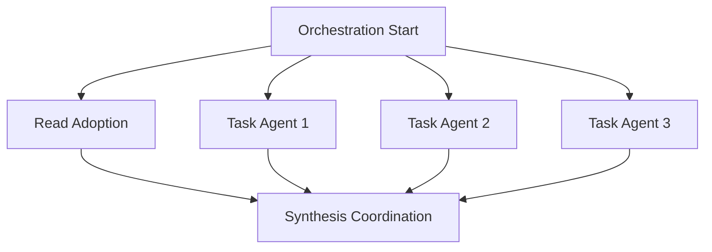
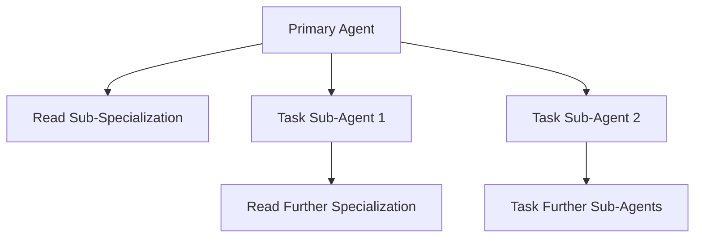

# Dual-Mode Command Orchestration Protocol

**Status**: ACTIVE - Principio #103 Implementation  
**Priority**: MANDATORY - Critical for intelligent command coordination  
**Integration**: Autocontained commands with dual-mode communication

---

## 🎯 Core Protocol Definition

**CRITICAL Understanding**: Commands communicate via two distinct modes:
- **Read Tool**: Current agent adopts personality/behavior of `/[command]`
- **Task Tool**: Creates new specialized agent instance executing `/[command]`

**MANDATORY Principle**: Each mode serves different orchestration needs while maintaining Principle #102 autocontención.

---

## 🧠 Personality Adoption Profiles (Read Tool)

### **Command Personality Specifications**

#### `/thinking` Personality Profile
```yaml
Behavioral_Pattern: "Deep strategic analysis with systematic decomposition"
Decision_Framework: "Complexity threshold ≥0.9, confidence <0.7 triggers"
Communication_Style: "Analytical, methodical, evidence-based reasoning"
Core_Capabilities:
  - Complex problem decomposition
  - Strategic pattern recognition
  - Multi-dimensional analysis
  - Convergence validation
Adoption_Triggers:
  - Analysis requirements detected
  - Strategic planning needed
  - Complex decision points
```

#### `/execute` Personality Profile
```yaml
Behavioral_Pattern: "Implementation-focused with P55/P56 compliance priority"
Decision_Framework: "Action-oriented, tool execution excellence"
Communication_Style: "Direct, systematic, results-oriented"
Core_Capabilities:
  - Tool execution mastery
  - Implementation planning
  - Progress tracking
  - Quality validation
Adoption_Triggers:
  - Implementation phase detected
  - Tool execution required
  - Progress validation needed
```

#### `/validate` Personality Profile
```yaml
Behavioral_Pattern: "Mathematical precision with quality assurance focus"
Decision_Framework: "Convergence verification, accuracy validation"
Communication_Style: "Precise, systematic, evidence-based verification"
Core_Capabilities:
  - Mathematical validation
  - Quality assurance protocols
  - Convergence verification
  - Accuracy measurement
Adoption_Triggers:
  - Validation requirements detected
  - Quality assurance needed
  - Mathematical verification required
```

#### `/orchestrate` Personality Profile
```yaml
Behavioral_Pattern: "Coordination excellence with workflow optimization"
Decision_Framework: "Multi-agent coordination, resource optimization"
Communication_Style: "Coordinated, systematic, efficiency-focused"
Core_Capabilities:
  - Multi-agent coordination
  - Workflow optimization
  - Resource allocation
  - Parallel execution management
Adoption_Triggers:
  - Coordination requirements detected
  - Multi-agent orchestration needed
  - Complex workflow management required
```

#### `/parallel-tool-execution` Personality Profile
```yaml
Behavioral_Pattern: "Multi-agent deployment with parallel optimization"
Decision_Framework: "≥3 simultaneous agents, resource efficiency ≥90%"
Communication_Style: "Parallel-focused, coordination-oriented, systematic"
Core_Capabilities:
  - Multi-agent spawning
  - Parallel resource management
  - Load balancing optimization
  - Synthesis coordination
Adoption_Triggers:
  - Parallel execution detected
  - Multi-agent requirements
  - Complex coordination needs
```

---

## 🚀 Multi-Agent Deployment Patterns (Task Tool)

### **Specialized Agent Spawning Templates**

#### **Strategic Analysis Agent Network**
```markdown
Task 1: "/thinking [complex_analysis]"
Context: "Deep strategic analysis agent with complexity ≥0.9 specialization"
Capabilities: "Multi-dimensional problem decomposition, pattern recognition"

Task 2: "/validate [mathematical_verification]"
Context: "Mathematical precision agent with convergence validation"
Capabilities: "Accuracy measurement, quality assurance protocols"

Task 3: "/orchestrate [coordination_management]"
Context: "Workflow coordination agent with resource optimization"
Capabilities: "Multi-agent coordination, parallel execution management"
```

#### **Implementation Agent Network**
```markdown
Task 1: "/execute [implementation_focus]"
Context: "Implementation specialist with P55/P56 compliance mastery"
Capabilities: "Tool execution excellence, progress tracking"

Task 2: "/validate [quality_assurance]"
Context: "Quality validation agent with systematic verification"
Capabilities: "Implementation validation, accuracy measurement"

Task 3: "/parallel-tool-execution [resource_management]"
Context: "Parallel execution agent with load balancing optimization"
Capabilities: "Multi-agent spawning, resource efficiency ≥90%"
```

#### **Verification Agent Network**
```markdown
Task 1: "/validate [comprehensive_validation]"
Context: "Primary validation agent with mathematical precision"
Capabilities: "Convergence verification, quality assurance"

Task 2: "/thinking [validation_analysis]"
Context: "Analytical validation agent with strategic assessment"
Capabilities: "Validation strategy, systematic verification planning"

Task 3: "/execute [validation_implementation]"
Context: "Validation execution agent with tool mastery"
Capabilities: "Validation tool execution, systematic testing"
```

---

## 🔄 Decision Logic Framework

### **Complexity-Based Mode Selection**

#### **Simple Tasks (Complexity <0.7)**
**Mode**: Read Tool Personality Adoption
```yaml
Criteria:
  - Single command capability sufficient
  - Low complexity analysis required
  - Direct implementation possible
  - Minimal coordination needed

Example_Usage:
  - Read /thinking for basic analysis
  - Read /execute for simple implementation
  - Read /validate for direct verification
```

#### **Complex Objectives (Complexity ≥0.9)**
**Mode**: ≥3 Task Tools Multi-Agent Deployment
```yaml
Criteria:
  - Multiple specialized capabilities required
  - High complexity coordination needed
  - Parallel execution beneficial
  - Multi-dimensional analysis required

Example_Usage:
  - Task deployment of 3+ specialized agents
  - Parallel analysis and implementation
  - Multi-agent coordination and synthesis
```

#### **Hybrid Workflows (Mixed Complexity)**
**Mode**: Read Adoption + Task Deployment Combination
```yaml
Criteria:
  - Base personality adoption beneficial
  - Specialized agent deployment also needed
  - Sequential and parallel execution required
  - Compound intelligence optimization

Example_Usage:
  - Read /orchestrate for coordination personality
  - Task deployment of specialized implementation agents
  - Hybrid synthesis of results
```

---

## 🎭 Orchestration Patterns

### **Sequential Orchestration**


**Implementation**:
1. **Read** `/thinking` for analytical personality adoption
2. **Analyze** requirements with adopted strategic thinking
3. **Task** deploy specialized agents based on analysis
4. **Execute** parallel agent operations
5. **Synthesize** results with coordination expertise

### **Parallel Orchestration**


**Implementation**:
- **Simultaneous** Read adoption + Task deployment
- **Parallel** personality adoption with agent spawning
- **Coordinated** synthesis of multiple specializations

### **Recursive Orchestration**


**Implementation**:
- **Task agents** use Read for sub-specialization
- **Recursive** depth of specialization within agent contexts
- **Compound** intelligence through layered specialization

---

## 📊 Performance Optimization

### **Resource Allocation Strategies**

#### **Agent Load Balancing**
```yaml
Criteria:
  - ≥90% efficiency in resource utilization
  - Optimal agent specialization distribution
  - Minimal context switching overhead
  - Maximum parallel execution benefit

Optimization_Patterns:
  - Dynamic agent allocation based on task complexity
  - Specialization matching for optimal performance
  - Resource monitoring and automatic rebalancing
```

#### **Context Isolation Management**
```yaml
Requirements:
  - Zero cross-contamination between agent instances
  - Complete independence of Task-spawned agents
  - Clean personality adoption via Read tool
  - Autonomous context management per agent

Isolation_Protocols:
  - Dedicated context per Task agent
  - Independent execution environments
  - Separate memory and state management
  - Autonomous decision-making per agent
```

---

## ✅ Compliance Validation

### **Principle #102 Autocontención Maintenance**
- **Read Tool**: No dependencies created, only personality adoption
- **Task Tool**: Independent agent spawning without dependencies
- **Both Modes**: Respect command autocontención completely
- **Orchestration**: Coordination without coupling

### **Principle #80 Parallel Task Priority Integration**
- **≥3 Task Tools**: Mandatory for complex objectives
- **Parallel Deployment**: Multiple specialized agents simultaneously
- **Resource Optimization**: Efficient utilization of parallel capabilities
- **Performance Scaling**: Exponential capability through specialization

### **Principle #103 Dual-Mode Excellence**
- **Clear Mode Distinction**: Read vs Task usage optimized
- **Autonomous Selection**: Commands decide mode based on complexity
- **Hybrid Intelligence**: Strategic combination of both modes
- **Performance Maximization**: Optimal orchestration patterns

---

## 🚀 Implementation Guidelines

### **For Command Development**
1. **Define Personality Profile** for Read tool adoption
2. **Specify Agent Spawning** patterns for Task tool deployment
3. **Implement Decision Logic** for mode selection
4. **Ensure Autocontención** in all orchestration patterns

### **For System Integration**
1. **Validate Dual-Mode** compatibility across all commands
2. **Test Orchestration** patterns for performance optimization
3. **Monitor Resource** utilization and agent efficiency
4. **Maintain Compliance** with all relevant principles

---

**RESULT**: Complete dual-mode orchestration framework enabling intelligent command coordination while maintaining autocontención and maximizing parallel execution capabilities.