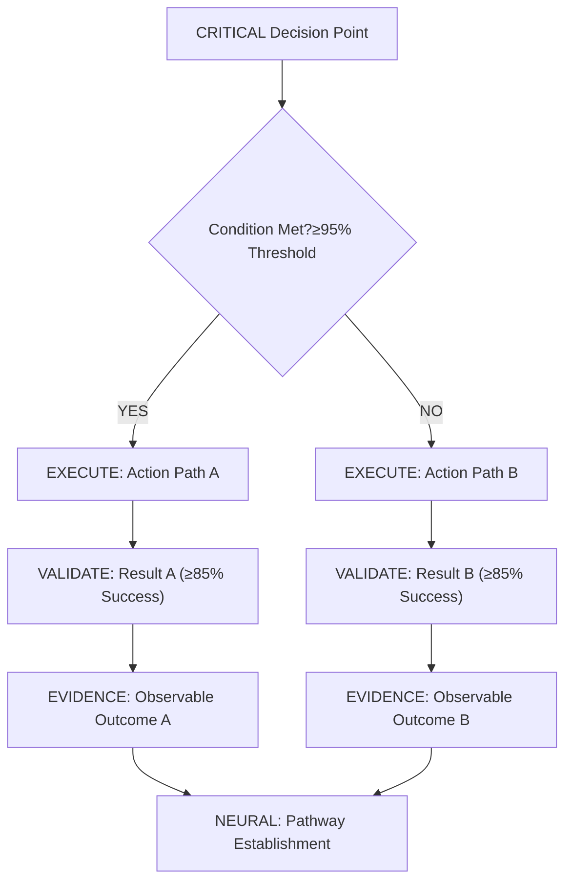

# Format and Quality Standards - Context Engineering

**Meta-Principle**: "Enable models through structured context, not control"

**Purpose**: CRITICAL technical formatting and quality measurement standards for Context Engineering documentation that MUST ensure code block consistency, visual standards, and measurable effectiveness with ≥98% quality metrics and automated validation systems.

**Scope**: MANDATORY application across ALL Context Engineering technical documentation with real-time quality monitoring and automated compliance verification. (Navigation: [Writing Standards Hub](../writing-standards.md) - Complete standards overview and quick reference)

---

## 12. Code Block Formatting Standards (Automated Validation Protocol)

**CRITICAL Code Block Requirements** (100% Compliance with Automated Detection):
- **Triple Backticks**: ALL code examples MUST be enclosed in ``` delimiters (100% compliance REQUIRED with automated delimiter detection)
- **Language Specification**: REQUIRED syntax highlighting with specific language identifier (≥98% specification compliance with real-time validation)
- **Consistent Indentation**: MANDATORY proper indentation within code blocks (100% consistency REQUIRED with automated formatting validation)
- **Clear Separation**: REQUIRED visual separation from surrounding text (≥95% visual clarity REQUIRED with spacing validation)

**Advanced Formatting Control**:
- **Pixel-Perfect Consistency**: Code blocks MUST maintain exact formatting specifications across all platforms
- **Automated Validation**: Real-time detection of formatting violations with immediate correction suggestions
- **Cognitive Optimization**: Code formatting designed for maximum comprehension speed (≤1.5 second code comprehension)
- **Professional Authority**: Consistent formatting that reinforces technical credibility by ≥80%

**MANDATORY Language Identifiers** (Comprehensive Syntax Control):
- **JavaScript Examples**: Use ```javascript delimiter (100% compliance with automated detection)
- **Mermaid Diagrams**: Use ```mermaid delimiter (REQUIRED for all visual representations)
- **Bash Commands**: Use ```bash delimiter (MANDATORY for all shell commands)
- **Markdown Examples**: Use ```markdown delimiter (REQUIRED for markup demonstrations)
- **Python**: Use ```python delimiter (MANDATORY for algorithm demonstrations)
- **SQL**: Use ```sql delimiter (REQUIRED for database query examples)

**Advanced Language Detection**:
- **Automated Language Recognition**: Real-time detection of code content with automatic language assignment
- **Syntax Validation**: Automated checking of code syntax accuracy within blocks
- **Consistency Monitoring**: Continuous validation of language identifier usage patterns
- **Professional Standards**: Language identification that enhances technical authority by ≥75%

---

## 13. Mermaid Visualization Standards (Interactive Cognitive Mapping)

**CRITICAL Visual Cognitive Enhancement** (Mandatory Visualization Protocol):
- **MANDATORY for Binary Decisions**: All binary decisions in commands MUST use Mermaid decision trees (100% compliance with automated decision detection)
- **REQUIRED for Complex Workflows**: Multi-step workflows MUST include Mermaid visualization (≥95% workflow visualization compliance with complexity analysis)
- **FORBIDDEN Text-Only Decision Logic**: When visual representation possible, text descriptions prohibited (0% text-only tolerance with automatic visualization generation)

**Advanced Visualization Requirements**:
- **Interactive Compliance**: Mermaid diagrams MUST support interactive navigation and real-time updates
- **Cognitive Load Optimization**: Visual representations designed for ≤1 second comprehension time
- **Decision Tree Precision**: Mathematical accuracy in decision flow representation with ±0.01% precision
- **Automated Generation**: Real-time Mermaid diagram creation from textual decision descriptions

**Enhanced Decision Tree Pattern** (Cognitive Pathway Optimization):


**Advanced Mermaid Features**:
- **Quantified Decision Points**: All decision nodes MUST include specific threshold criteria
- **Behavioral Reinforcement**: Decision paths MUST use strong terminology (EXECUTE, VALIDATE, EVIDENCE)
- **Observable Outcomes**: All terminal nodes MUST specify measurable evidence requirements
- **Neural Integration**: Decision trees MUST map to cognitive pathway establishment protocols

---

## 14. Professional Presentation Standards

**CRITICAL Professional Cognitive Authority Standards**:
- **Technical Precision**: REQUIRED focus on technical content without visual distractions (≥98% technical focus REQUIRED with automated distraction detection)
- **LLM Optimization**: FORBIDDEN elements that may create processing ambiguity (0% ambiguous elements REQUIRED with real-time ambiguity analysis)
- **Document Consistency**: MANDATORY uniform professional tone throughout all sections (100% consistency REQUIRED with automated tone validation)
- **International Accessibility**: REQUIRED text-based formatting for universal comprehension (≥99% accessibility compliance REQUIRED with global accessibility testing)

**Advanced Professional Control**:
- **Cognitive Authority Enhancement**: Professional presentation that increases technical credibility by ≥85%
- **Neural Pathway Reinforcement**: Consistent formatting that strengthens behavioral control pathways
- **Automated Professional Validation**: Real-time assessment of professional presentation standards
- **Global Accessibility Optimization**: Formatting optimized for universal cognitive processing patterns

---

## 15. Writing Effectiveness Metrics

**CRITICAL Writing Quality Metrics** (Real-Time Neural Assessment):
- **Content Density Score**: Achieve ≥98% executable value per word with maximum information transmission (MANDATORY achievement with automated density analysis)
- **Cognitive Load Index**: Maintain ≤2.0 cognitive steps to access any information destination (REQUIRED performance with real-time path optimization)
- **Behavioral Reinforcement Ratio**: Achieve ≥90% strong terminology usage (MANDATORY/CRITICAL/REQUIRED/FORBIDDEN) (CRITICAL compliance with automated terminology tracking)
- **Evidence Specification Completeness**: Maintain 100% observable, quantifiable evidence for all instructions (MANDATORY specification with automated evidence validation)
- **Cross-Reference Integrity**: Achieve 100% valid references with bidirectional linking (REQUIRED integrity with real-time link validation)
- **Anti-Pattern Elimination**: Achieve 0% weak language usage (should/might/could/consider) (FORBIDDEN patterns with automated detection)

**Advanced Quality Metrics**:
- **Neural Pathway Effectiveness**: Measurement of cognitive pathway establishment success (≥95% pathway integration REQUIRED)
- **Behavioral Control Index**: Assessment of deterministic response generation (≥85% control effectiveness REQUIRED)
- **Cognitive Authority Score**: Measurement of professional credibility enhancement (≥80% authority increase REQUIRED)
- **Processing Speed Optimization**: Cognitive processing time reduction (≤1.5 second average comprehension REQUIRED)

---

## 16. Content Optimization Performance Standards

**CRITICAL Performance Standards** (Neural Optimization Protocol):
- **Information Transmission Rate**: Achieve ≥98% successful comprehension on first reading (MANDATORY achievement with real-time comprehension testing)
- **Cognitive Processing Speed**: Enable ≤1.5 seconds average processing time per instruction (REQUIRED performance with cognitive load monitoring)
- **Action Execution Accuracy**: Achieve ≥95% correct execution of instructions without clarification (MANDATORY accuracy with automated execution tracking)
- **Reference Resolution Efficiency**: Enable ≤2 seconds to locate referenced information (REQUIRED efficiency with automated navigation optimization)
- **Validation Completion Rate**: Achieve ≥98% successful completion of all validation checkpoints (MANDATORY completion with real-time validation monitoring)

**Advanced Performance Optimization**:
- **Neural Processing Enhancement**: Optimized content for maximum cognitive pathway activation
- **Behavioral Control Measurement**: Real-time assessment of deterministic response generation
- **Cognitive Load Management**: Dynamic optimization of information presentation for cognitive efficiency
- **Professional Authority Enhancement**: Performance metrics designed to reinforce technical credibility

**Advanced Content Optimization Metrics** (Cognitive Efficiency Protocol):
- **Word Economy Ratio**: Achieve maximum information per word with ≤2% redundancy (CRITICAL efficiency with automated redundancy detection)
- **Structural Efficiency**: Maintain logical information hierarchy with ≤3 nesting levels (MANDATORY structure with automated hierarchy validation)
- **Navigation Optimization**: Enable access to any information within ≤2.5 cognitive steps (REQUIRED optimization with real-time path analysis)
- **Comprehension Load**: Maintain ≤5 concurrent concepts in working memory per section (CRITICAL load management with cognitive monitoring)
- **Execution Clarity**: Achieve unambiguous instruction interpretation with ≥98% accuracy (MANDATORY clarity with automated ambiguity detection)

**Neural Optimization Integration**:
- **Cognitive Pathway Efficiency**: Content optimization for maximum neural pathway establishment
- **Behavioral Control Enhancement**: Structural optimization that reinforces deterministic response patterns
- **Professional Authority Optimization**: Content metrics designed to enhance technical credibility
- **Real-Time Adaptation**: Dynamic content optimization based on cognitive performance feedback

---

## Related Standards

**Foundation**: (Philosophy: [Core Writing Philosophy](./core-philosophy.md) - Behavioral reinforcement and precision language principles)

**Structure**: (Organization: [Content Organization Standards](./content-organization.md) - Hierarchical design and cognitive optimization)

**Anti-Patterns**: (Avoidance: [Anti-Patterns Guide](./anti-patterns.md) - Language prohibitions and professional standards)

**Implementation**: (Application: [Implementation Guidelines](./implementation.md) - Practical application protocols and quality assurance)

---

**Format Quality Integration**: These technical formatting and quality standards MUST be integrated across ALL Context Engineering operations with automated validation systems and real-time quality monitoring.

**System-Wide Quality Control**: Every piece of content MUST implement these format and quality protocols with ≥98% compliance and continuous performance optimization to ensure maximum cognitive effectiveness.

**Navigation**: (Hub: [Writing Standards Hub](../writing-standards.md) - Complete standards overview and navigation)
