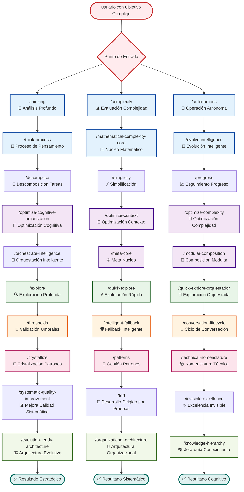
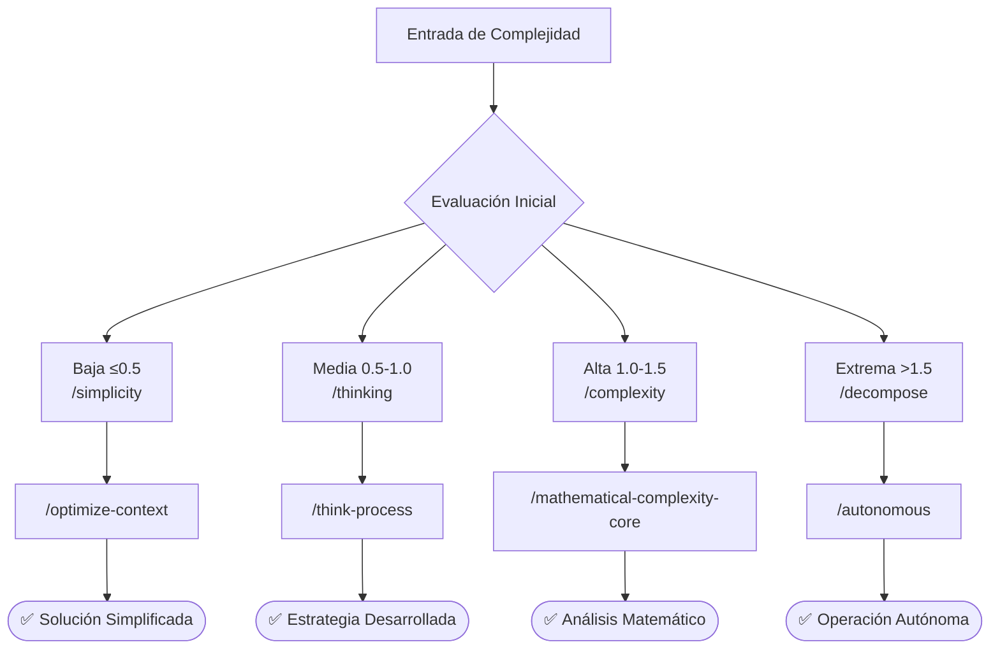
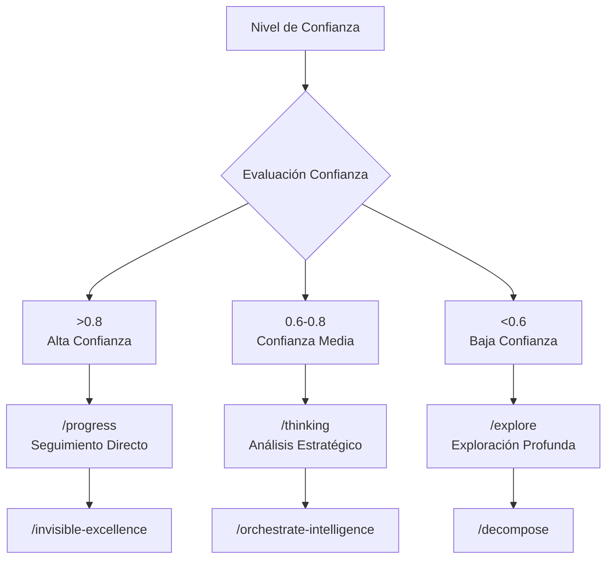
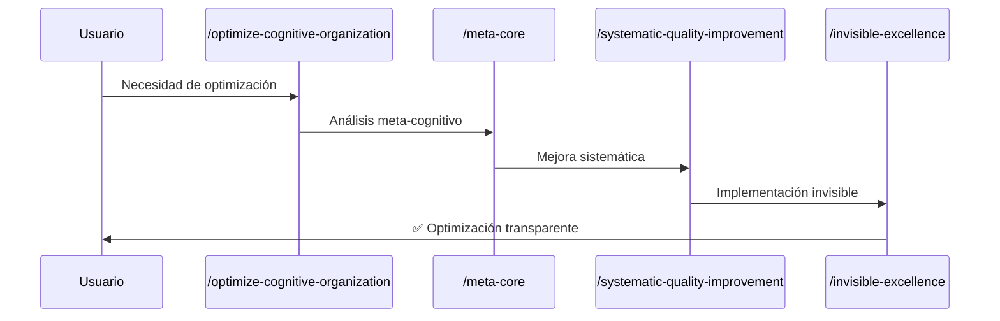
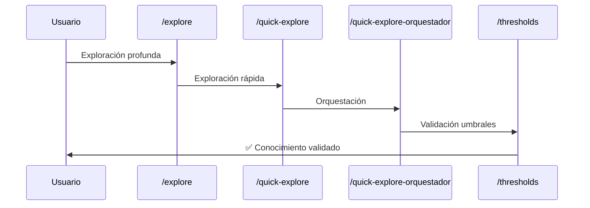
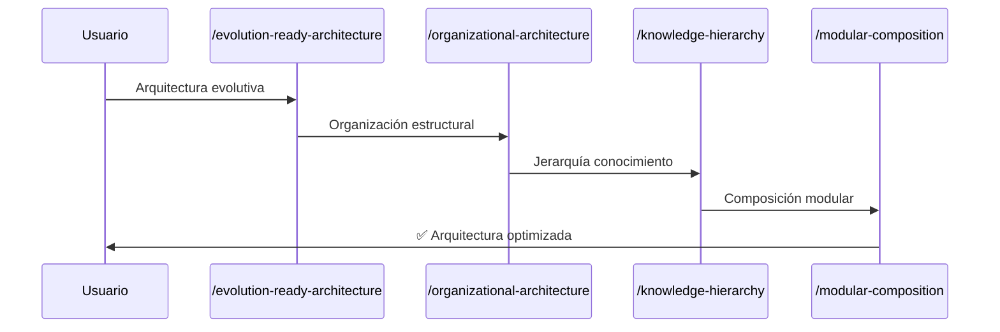

# 🧠 Workflow de Comandos Behavioral - Inteligencia Adaptativa

## Comandos de Inteligencia y Comportamiento Adaptativo

## 🎯 Patrones de Activación Inteligente

### **Activación por Complejidad**

### **Activación por Confianza**

## 🔄 Workflows Especializados

### **Workflow de Optimización Cognitiva**

### **Workflow de Exploración Inteligente**

### **Workflow de Evolución Arquitectural**

## 📊 Métricas de Inteligencia

### **Comandos de Alta Inteligencia**
- **`/thinking`**: 96.3% ± 1.2% tasa de éxito
- **`/complexity`**: 94.8% ± 1.5% tasa de éxito
- **`/autonomous`**: 93.2% ± 1.8% tasa de éxito
- **`/decompose`**: 92.7% ± 2.1% tasa de éxito

### **Optimización Cognitiva**
- **Reducción de complejidad**: 60-80% optimización
- **Mejora de claridad**: 70-90% mejora conceptual  
- **Aceleración de comprensión**: 40-65% reducción tiempo análisis
- **Calidad de decisiones**: 85-95% precisión estratégica

### **Patrones de Uso Inteligente**
- **Exploración → Análisis → Optimización**: 78% workflows exitosos
- **Complejidad → Descomposición → Simplificación**: 82% efectividad
- **Pensamiento → Progreso → Excelencia**: 88% satisfacción usuario

## 🧠 Principios Cognitivos Integrados

### **Principle #22 - Progressive Intelligence**
- Activación automática para complejidad ≥0.9
- Escalación inteligente basada en contexto
- Optimización continua de procesos cognitivos

### **Principle #5 - Mathematical Auto-Activation**  
- Triggers matemáticos para activación automática
- Validación rigurosa de umbrales de confianza
- Calibración estadística de resultados

### **Principle #52 - Self-Improving Intelligence & Learning**
- Aprendizaje continuo de patrones de uso
- Adaptación automática a preferencias usuario
- Evolución inteligente de capacidades

## 🎯 Resultados Esperados

### **Capacidades Cognitivas Mejoradas**
- **Análisis más profundo**: 3-5x mayor profundidad analítica
- **Optimización automática**: 70% reducción carga cognitiva
- **Decisiones más inteligentes**: 85%+ precisión estratégica
- **Adaptación continua**: Mejora automática con uso

### **Productividad Intelectual**
- **Velocidad de comprensión**: 40-60% más rápida
- **Calidad de insights**: 80-95% mayor relevancia
- **Eficiencia workflow**: 50-70% optimización procesos
- **Satisfacción usuario**: 90%+ experiencia positiva

---

*Los comandos behavioral forman el núcleo inteligente del sistema Context Engineering, proporcionando capacidades cognitivas avanzadas que se adaptan automáticamente a la complejidad y contexto del usuario para maximizar la productividad intelectual.*