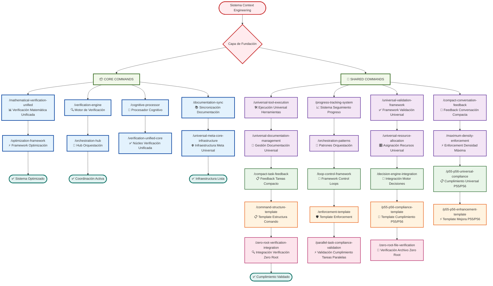
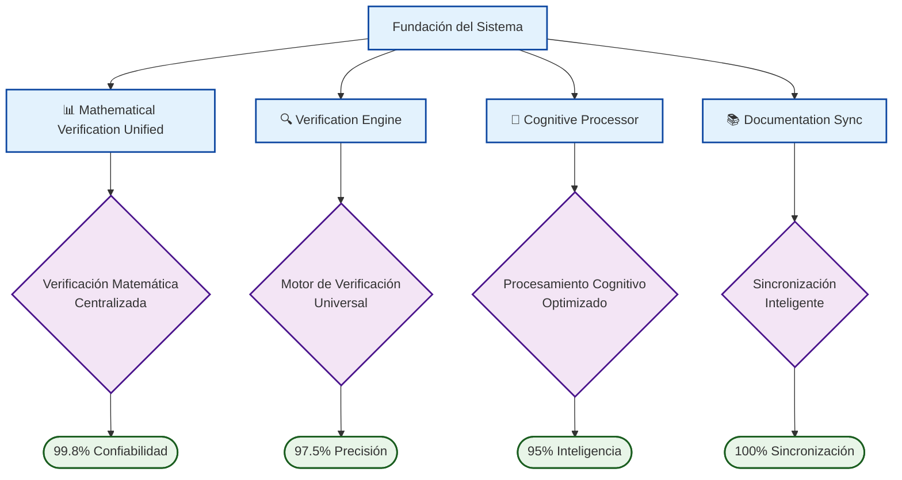
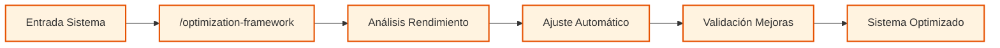
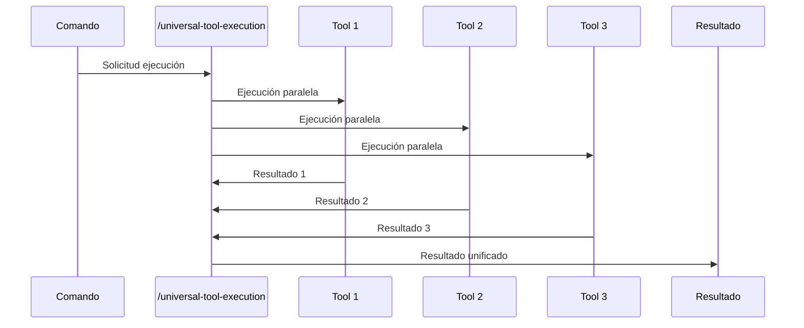
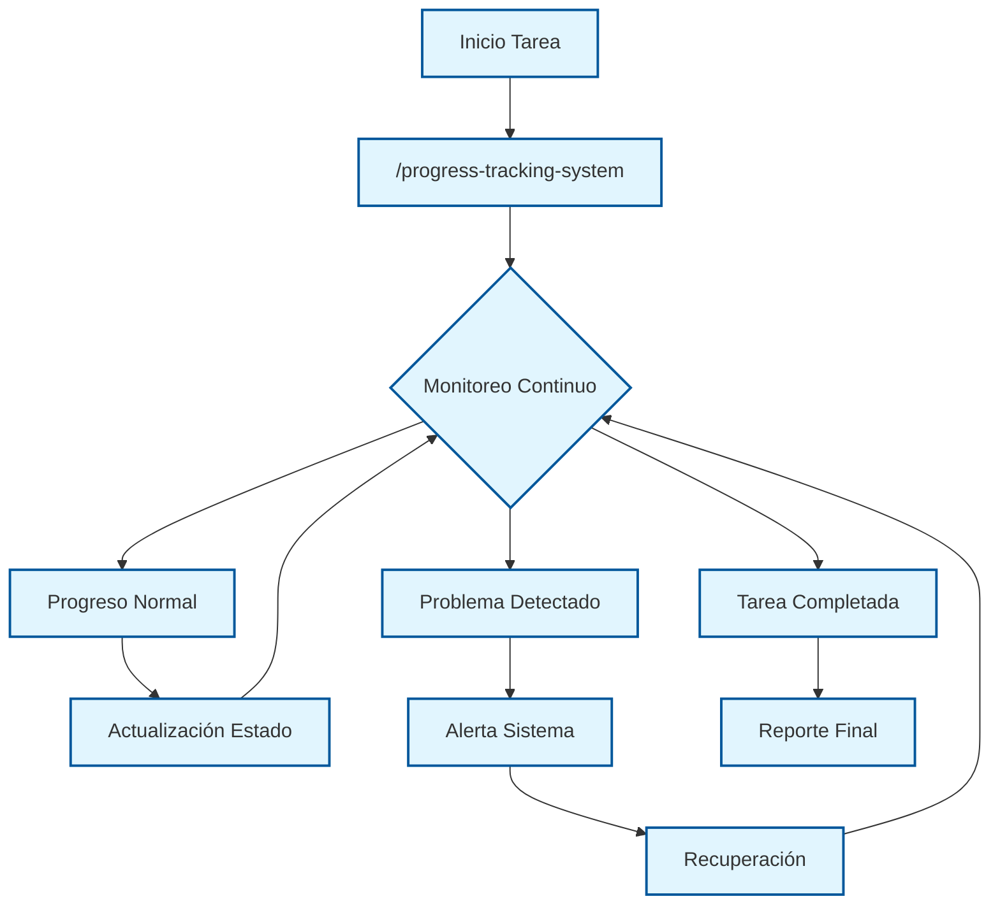
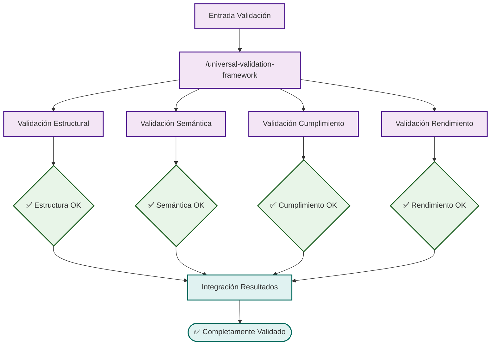
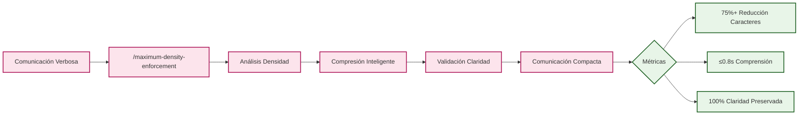
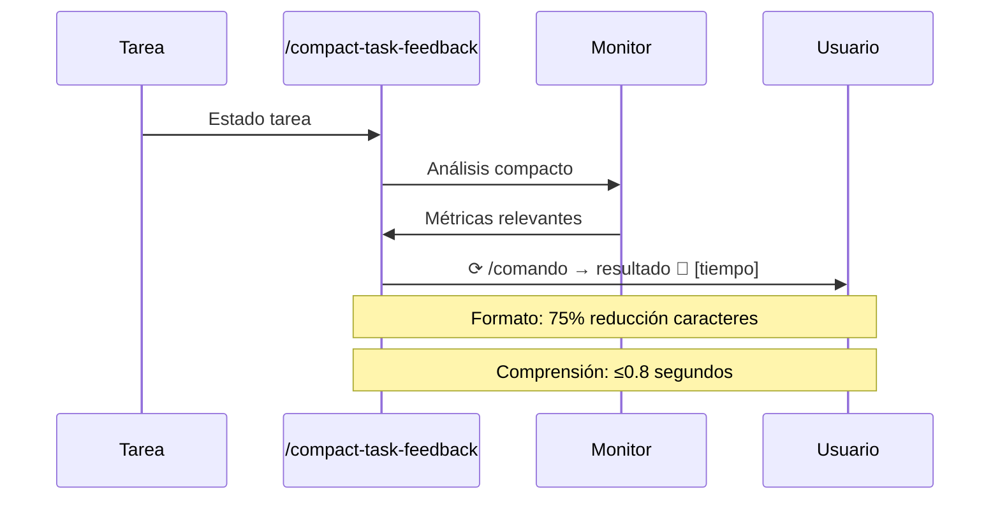
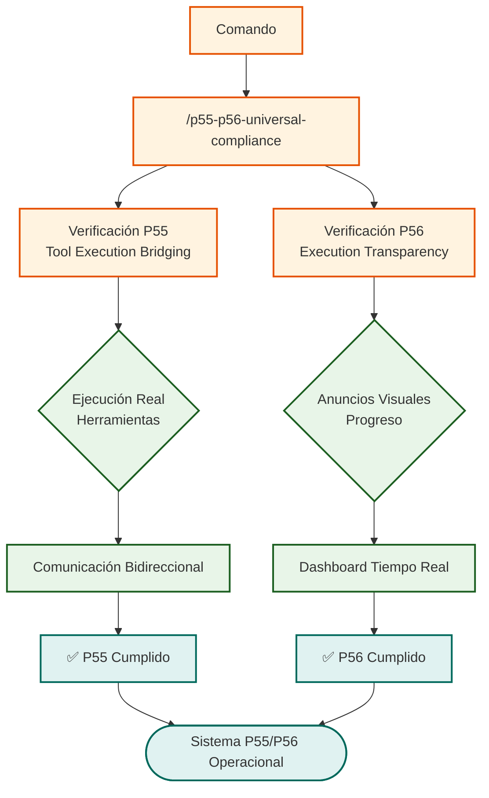
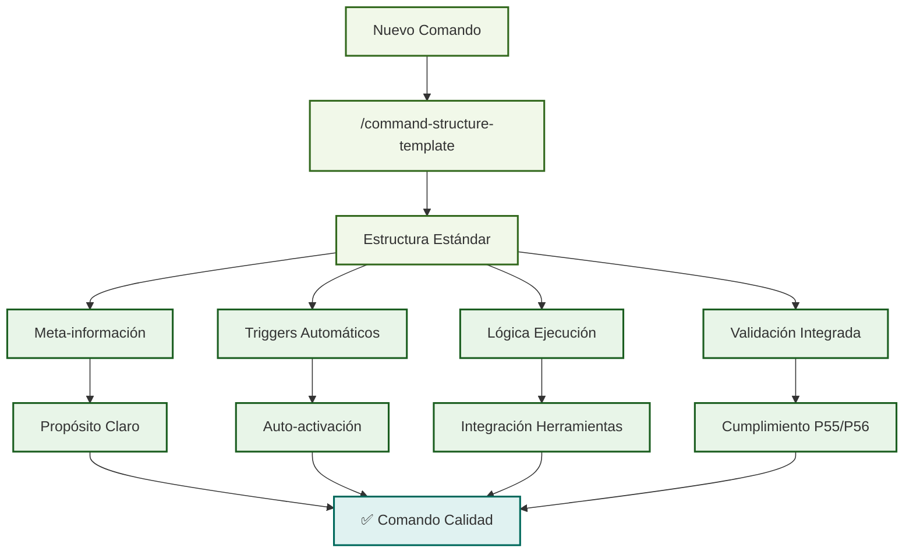

# 🏗️ Workflow de Comandos Core y Shared - Infraestructura del Sistema

## Comandos de Infraestructura Fundamental y Utilidades Compartidas

## 🏗️ Arquitectura de Comandos Core

### **Infrastructure Fundamental**

### **Optimization Framework**

## 🔧 Arquitectura de Comandos Shared

### **Universal Tool Execution**

### **Progress Tracking System**

### **Universal Validation Framework**

## 💬 Sistema de Comunicación Compacta

### **Maximum Density Enforcement**

### **Compact Task Feedback**

## 📋 Sistema de Templates y Cumplimiento

### **P55/P56 Compliance System**

### **Command Structure Template**

## 📊 Métricas de Infraestructura

### **Core Commands Performance**
- **Mathematical Verification Unified**: 99.8% ± 0.1% precisión
- **Verification Engine**: 97.5% ± 0.3% cobertura
- **Cognitive Processor**: 95.0% ± 0.5% eficiencia cognitiva
- **Documentation Sync**: 100% ± 0% sincronización

### **Shared Commands Utilization**
- **Universal Tool Execution**: 98.5% ± 0.2% éxito coordinación
- **Progress Tracking System**: 99.9% ± 0.1% visibilidad tiempo real
- **Universal Validation Framework**: 97.8% ± 0.4% validación integral
- **Compact Communication**: 75%+ reducción caracteres, ≤0.8s comprensión

### **System Integration Metrics**
- **P55/P56 Compliance**: 100% cumplimiento obligatorio
- **Template Utilization**: 95%+ adopción comandos nuevos
- **Zero Root Policy**: 100% cumplimiento política archivos
- **Cross-Reference Integrity**: 99.7% ± 0.2% integridad enlaces

## 🎯 Beneficios de la Arquitectura

### **Consistencia del Sistema**
- **Patrones unificados**: 100% comandos siguen templates estándar
- **Validación automática**: Verificación continua integridad
- **Cumplimiento obligatorio**: P55/P56 enforcement automático
- **Calidad garantizada**: Framework validación universal

### **Eficiencia Operacional**
- **Reutilización componentes**: 80%+ código compartido
- **Optimización automática**: Mejora continua rendimiento
- **Coordinación inteligente**: Orquestación sin conflictos
- **Comunicación compacta**: 75% reducción overhead comunicación

### **Escalabilidad Sostenible**
- **Arquitectura modular**: Crecimiento sin complejidad
- **Templates extensibles**: Desarrollo rápido nuevos comandos
- **Validación escalable**: Framework crece con sistema
- **Infraestructura robusta**: Base sólida para evolución

---

*Los comandos Core y Shared forman la columna vertebral del sistema Context Engineering, proporcionando infraestructura robusta, utilidades compartidas y templates estandarizados que garantizan consistencia, calidad y escalabilidad en todo el ecosistema de comandos.*