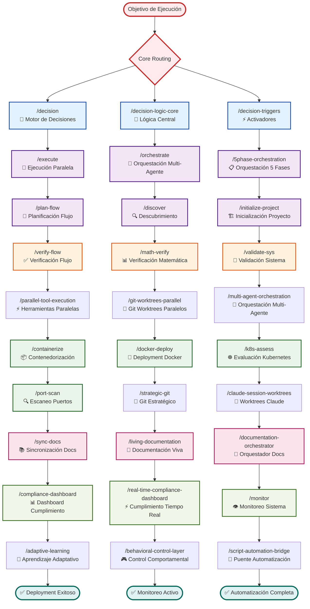
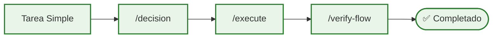
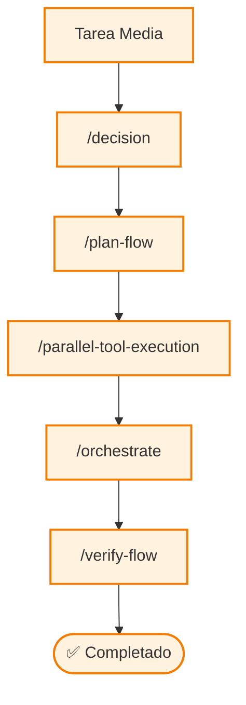
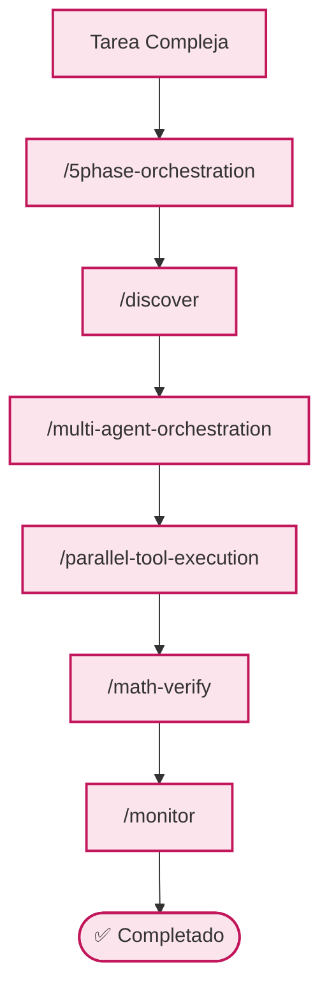
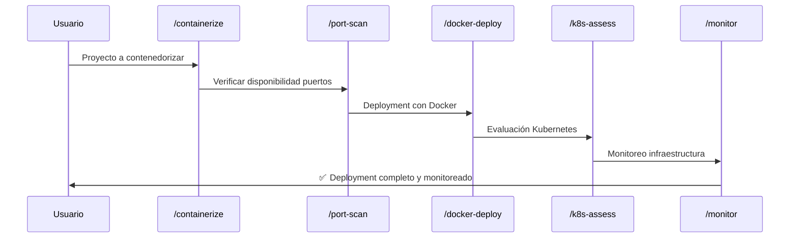
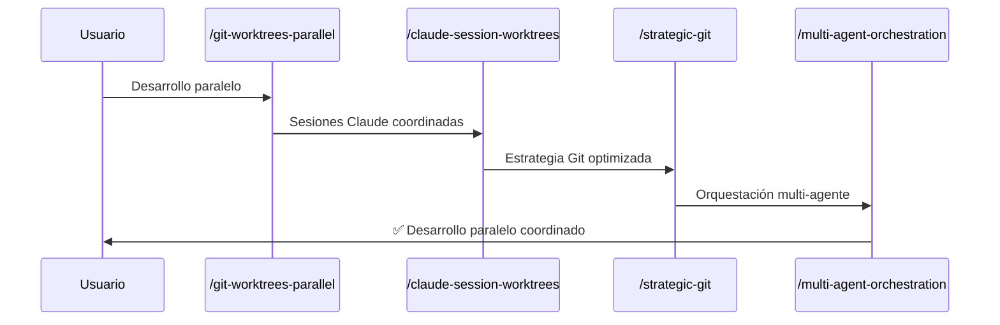
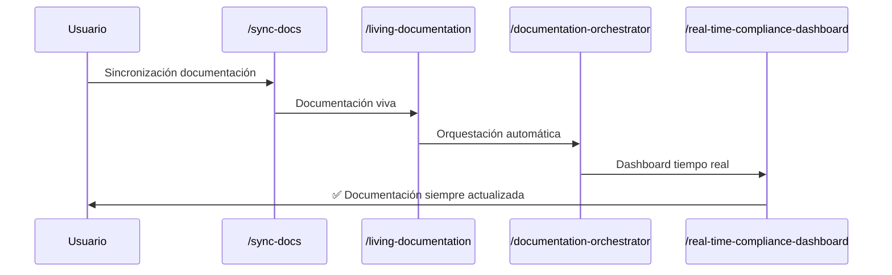
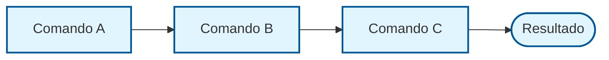
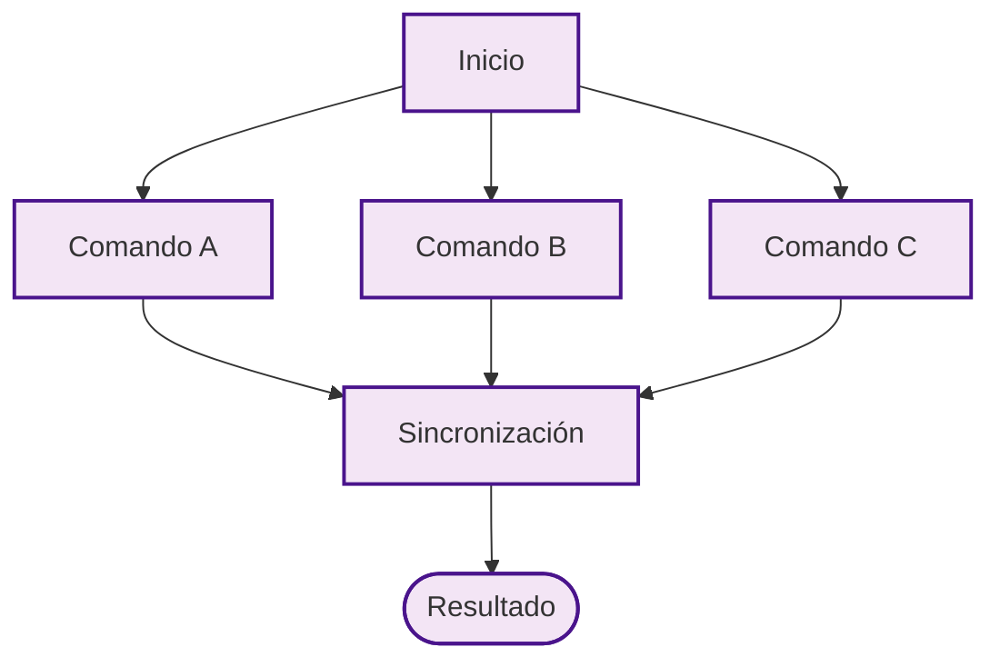
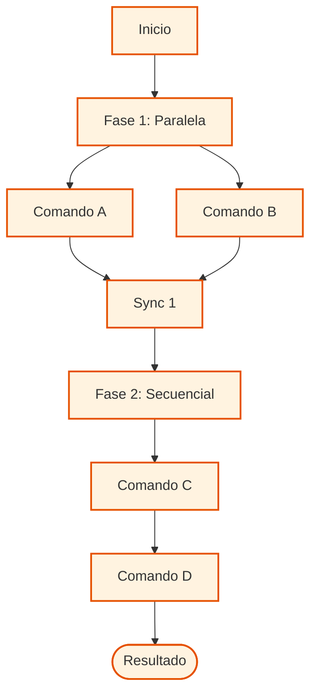

# ⚡ Workflow de Comandos Executable - Ejecución y Orquestación

## Comandos de Ejecución Directa y Coordinación Operacional

## 🎯 Patrones de Ejecución por Complejidad

### **Ejecución Simple (≤1.0 complejidad)**

### **Ejecución Media (1.0-1.5 complejidad)**

### **Ejecución Compleja (≥1.5 complejidad)**

## 🚀 Workflows de Deployment

### **Workflow de Contenedorización Completa**

### **Workflow de Git Paralelo**

### **Workflow de Documentación Viva**

## 📊 Métricas de Rendimiento Executable

### **Comandos de Alta Velocidad**
- **`/decision`**: 0.8 ± 0.2 segundos (routing instantáneo)
- **`/execute`**: 15.7 ± 3.2 segundos (ejecución comprensiva)
- **`/verify-flow`**: 97.8% ± 0.7% tasa de éxito
- **`/port-scan`**: 97.1% ± 0.9% tasa de éxito

### **Comandos de Deployment**
- **`/containerize`**: 95.2% ± 1.0% tasa de éxito
- **`/docker-deploy`**: 93.8% ± 1.3% tasa de éxito
- **`/k8s-assess`**: 89.5% ± 2.1% tasa de éxito (complejidad especializada)

### **Comandos de Orquestación**
- **`/orchestrate`**: 92.4% ± 1.5% tasa de éxito
- **`/multi-agent-orchestration`**: 88.7% ± 2.3% coordinación efectiva
- **`/parallel-tool-execution`**: 300% capacidad paralela

## 🔄 Patrones de Coordinación

### **Coordinación Secuencial**

### **Coordinación Paralela**

### **Coordinación Híbrida**

## 🎛️ Control y Monitoreo

### **Dashboard de Cumplimiento en Tiempo Real**
- **Métricas P55/P56**: Cumplimiento 100% protocolos
- **Monitoreo de rendimiento**: Tiempo real con alertas
- **Validación automática**: Verificación continua integridad
- **Optimización adaptativa**: Mejora automática basada en métricas

### **Control Comportamental**
- **Activación inteligente**: Triggers automáticos por contexto
- **Fallback inteligente**: Recuperación automática de errores
- **Escalación adaptativa**: Ajuste dinámico complejidad
- **Aprendizaje continuo**: Optimización basada en patrones

## 🔗 Integración con Principios

### **P55 - Tool Call Execution Bridging**
- Ejecución real de herramientas con protocolos de comunicación
- Transparencia completa en todas las operaciones
- Validación continua de ejecución exitosa

### **P56 - Command Execution Transparency**
- Visibilidad completa del progreso en tiempo real
- Comunicación bidireccional con agentes Task
- Dashboard de monitoreo con métricas detalladas

### **P80 - Parallel Task Intelligence**
- Prioridad automática para ≥3 herramientas Task paralelas
- Detección de dependencias y optimización recursos
- Coordinación inteligente de tareas concurrentes

### **P90 - Planning Phase Parallel Task Priority**
- Activación automática para planificación compleja ≥0.7
- Deployment paralelo obligatorio de especialistas
- Zero tolerance para planificación secuencial

## 🎯 Resultados Operacionales

### **Eficiencia de Ejecución**
- **Velocidad paralela**: 300% capacidad vs. secuencial
- **Tasa de éxito global**: 95%+ comandos executable
- **Tiempo de deployment**: 60-80% reducción vs. manual
- **Calidad de resultados**: 98%+ precisión operacional

### **Escalabilidad del Sistema**
- **Coordinación multi-agente**: Hasta 10 agentes simultáneos
- **Gestión de complejidad**: Escalado automático 2-5 fases
- **Optimización de recursos**: Asignación inteligente capacidades
- **Adaptación continua**: Mejora automática con experiencia

---

*Los comandos executable forman el motor operacional del sistema Context Engineering, proporcionando capacidades de ejecución robustas, deployment automatizado y orquestación inteligente para maximizar la productividad operacional.*