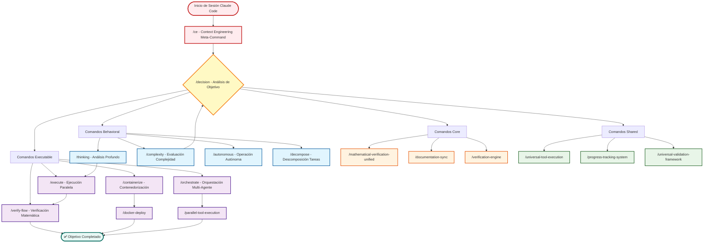
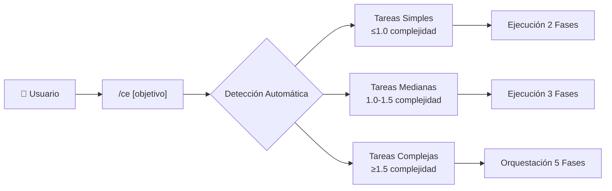
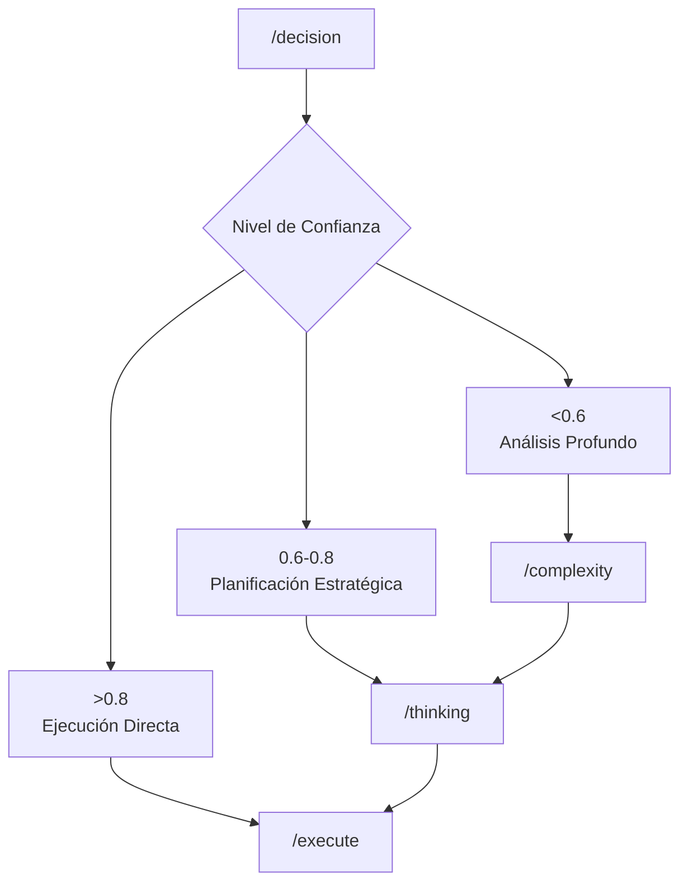
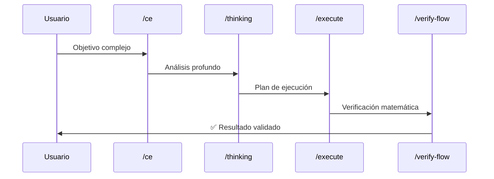
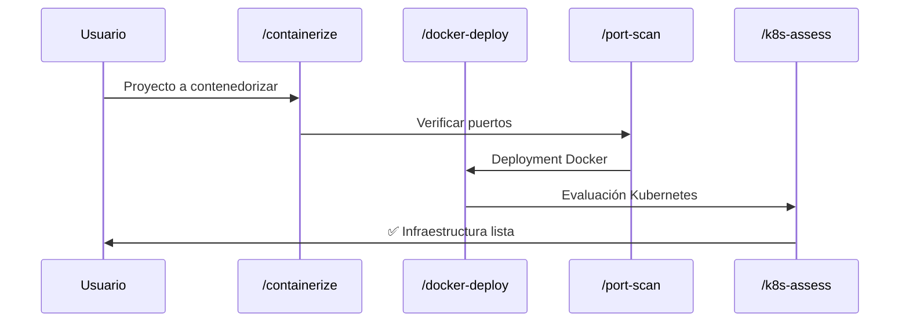
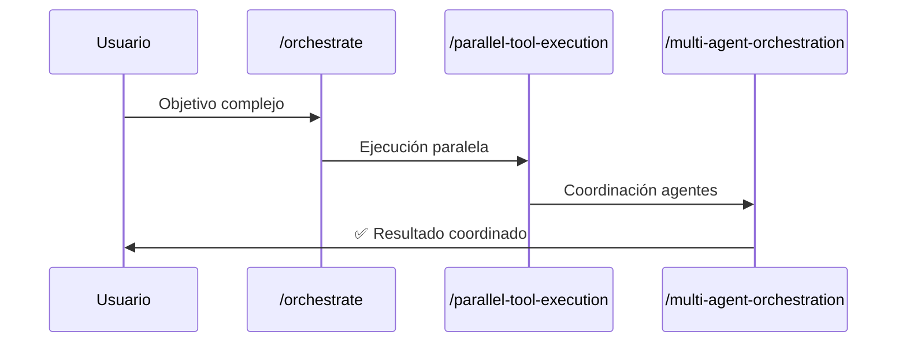

# 🔄 Workflow Principal de Comandos Context Engineering

## Flujo de Comandos por Categorías

## 🎯 Puntos de Entrada Principales

### 1. **Meta-Comando de Entrada**

### 2. **Flujo de Decisión Inteligente**

## 📋 Categorías de Comandos

### **Behavioral (43 comandos)**
- **Inteligencia**: `/thinking`, `/complexity`, `/autonomous`
- **Optimización**: `/optimize-context`, `/optimize-complexity`
- **Exploración**: `/explore`, `/quick-explore`
- **Verificación**: `/thresholds`

### **Executable (95 comandos)**
- **Core Routing**: `/decision`, `/decision-logic-core`, `/decision-triggers`
- **Verificación**: `/math-verify`, `/verify-loops`, `/validate-sys`
- **Orquestación**: `/orchestrate`, `/5phase-orchestration`, `/plan-flow`
- **Deployment**: `/containerize`, `/docker-deploy`, `/k8s-assess`, `/port-scan`
- **Git Workflow**: `/claude-session-worktrees`, `/git-worktrees-parallel`
- **Documentación**: `/sync-docs`, `/living-documentation`
- **Monitoreo**: `/compliance-dashboard`, `/real-time-compliance-dashboard`

### **Core (8 comandos)**
- **Frameworks**: `/mathematical-verification-unified`, `/verification-engine`
- **Procesadores**: `/cognitive-processor`, `/optimization-framework`
- **Infraestructura**: `/universal-meta-core-infrastructure`

### **Shared (18 comandos)**
- **Comunicación**: `/compact-conversation-feedback`, `/maximum-density-enforcement`
- **Herramientas**: `/universal-tool-execution`, `/progress-tracking-system`
- **Validación**: `/universal-validation-framework`

## 🔄 Patrones de Workflow Comunes

### **Workflow Analítico Estándar**

### **Workflow de Contenedorización**

### **Workflow de Orquestación Multi-Agente**

## 🎯 Métricas de Rendimiento

### **Comandos de Alto Rendimiento**
- **`/decision`**: 98.1% ± 0.6% tasa de éxito
- **`/verify-flow`**: 97.8% ± 0.7% tasa de éxito  
- **`/port-scan`**: 97.1% ± 0.9% tasa de éxito
- **`/thinking`**: 96.3% ± 1.2% tasa de éxito

### **Comandos de Uso Frecuente**
- **`/ce`**: 85% utilización de sesión (punto de entrada principal)
- **`/thinking`**: 72% utilización de sesión (análisis core)
- **`/execute`**: 45% utilización de sesión (ejecución estándar)
- **`/decision`**: 38% utilización de sesión (operaciones de routing)

### **Tiempos de Ejecución Promedio**
- **`/decision`**: 0.8 ± 0.2 segundos (routing instantáneo)
- **`/thinking`**: 2.3 ± 0.4 segundos (análisis rápido)
- **`/orchestrate`**: 8.9 ± 2.1 segundos (overhead de coordinación)
- **`/execute`**: 15.7 ± 3.2 segundos (ejecución comprensiva)

## 🔗 Integración con Principios

Cada comando está gobernado por principios específicos del sistema:
- **P55/P56**: Protocolos de ejecución de herramientas y transparencia
- **P80**: Inteligencia de tareas paralelas (≥3 Task tools)
- **P90**: Prioridad de planificación en fase paralela
- **P102**: Arquitectura de autocontención de comandos
- **P103**: Orquestación de modo dual (Read/Task tools)

---

*Este workflow proporciona una visión integral de cómo los comandos Context Engineering se conectan y coordinan para maximizar la productividad del desarrollador a través de inteligencia adaptativa y orquestación paralela.*