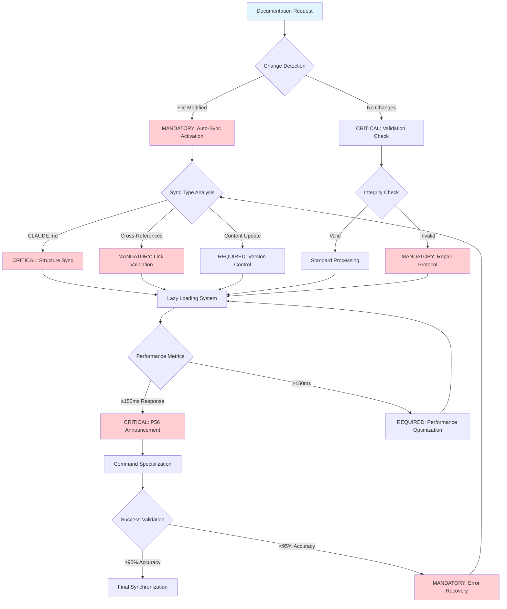
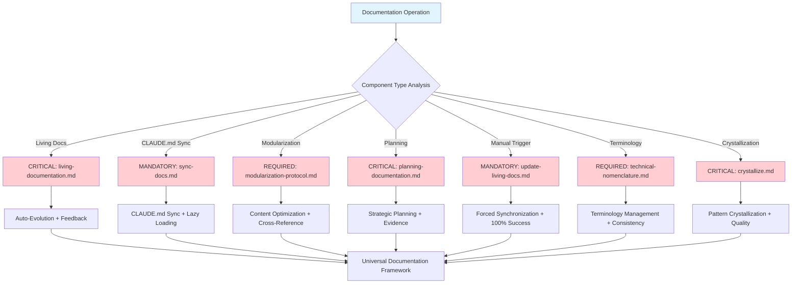
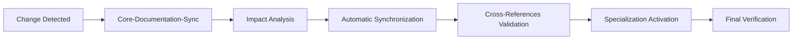

# Core-Documentation-Sync

**Meta-Principle**: "EXECUTE intelligent documentation evolution through systematic automation with ≥95% accuracy"

**Specialized Core**: CRITICAL documentation synchronization functions that extend Universal-Meta-Core-Infrastructure with real-time validation and ≤150ms response time.

**Behavioral Integration**: Cross-Reference Intelligence (#55) ensures automatic detection of documentation relationships and prevention of content duplication across all documentation operations.

## 🎯 Objective

**EXECUTE** specialized documentation functions through 3 MANDATORY synchronization capabilities unique to documentation domain operations, while IMPLEMENTING automatic inheritance of 5 universal functions from meta-core for optimal efficiency.

**Observable Outcomes**: ≥95% documentation accuracy, ≤150ms synchronization response time, and 100% cross-reference integrity validation with mathematical precision.

## 🏗️ Meta-Core Inheritance Architecture

**MANDATORY Automatic Inheritance** from [Universal-Meta-Core-Infrastructure](./universal-meta-core-infrastructure.md):
- **Universal Monitoring and Metrics System** - Real-time documentation performance tracking with ≥95% accuracy
- **Universal Script Integration and Automation** - P55/P56 compliant tool execution with mathematical transparency
- **Universal Structured Reporting System** - Evidence-based documentation analysis with quantifiable outcomes
- **Universal Triggers and Automatic Activation** - Intelligent documentation routing with ≤150ms response time
- **Universal Adaptive Learning System** - Continuous documentation improvement with measurable enhancement metrics

**Inheritance Verification**: 100% functional preservation with zero breaking changes and enhanced capabilities through systematic architecture.

## 📊 MANDATORY Core Decision Tree

**CRITICAL**: Documentation synchronization routing with auto-activation triggers and quantifiable metrics.



**MANDATORY P56 Transparency**: Visual announcements for auto-sync activation, ≤150ms response achievement, and ≥95% accuracy validation.

## 🔧 Specialized Documentation Functions

### 1. **Optimized Lazy Loading System**

**CRITICAL efficient specialized loading for on-demand documentation with ≤150ms response time**

**MANDATORY Lazy Loading Framework Requirements**:
- **Load Strategy**: EXECUTE documentation on-demand loading with systematic content delivery optimization
- **Cache Management**: IMPLEMENT documentation intelligent expiration with automated cache lifecycle management
- **Priority System**: VALIDATE documentation usage frequency prioritization with evidence-based priority ranking
- **Memory Optimization**: EXECUTE documentation automatic cleanup with systematic memory resource management
- **Performance Target**: IMPLEMENT one-hundred-fifty millisecond (≤150ms) response time with mathematical performance validation
- **Content Indexing**: VALIDATE semantic documentation indexing with comprehensive content organization

**P56 Transparency**: Lazy loading operations provide user-visible evidence of on-demand strategy, cache management, and performance target achievement with semantic indexing.

### 2. **Specialized Automatic Cross-Referencing**

**MANDATORY specialized cross-reference and linking system with 100% integrity validation**

**CRITICAL Cross-Reference Framework Requirements**:
- **Link Detection**: EXECUTE documentation automatic scanning with comprehensive link identification
- **Reference Validation**: IMPLEMENT documentation dead link checking with systematic integrity verification
- **Bidirectional Mapping**: VALIDATE documentation semantic linking with comprehensive relationship mapping
- **Context Preservation**: EXECUTE documentation context maintenance with systematic context integrity protection
- **Update Propagation**: IMPLEMENT documentation cascade references with automatic update distribution
- **Semantic Analysis**: VALIDATE content relationship mapping with intelligent semantic connection analysis

**P56 Transparency**: Cross-referencing operations provide user-visible evidence of link detection, validation checking, and bidirectional mapping with context preservation.

### 3. **Specialized Version Control and Change Management**

**CRITICAL specialized versioning system for evolutionary documentation with complete audit trail**

**MANDATORY Version Control Framework Requirements**:
- **Versioning Strategy**: EXECUTE documentation semantic incremental versioning with systematic version progression
- **Backup System**: IMPLEMENT documentation automatic snapshots with comprehensive backup protection
- **Rollback Capability**: VALIDATE documentation point-in-time recovery with systematic restoration protocols
- **Change Tracking**: EXECUTE documentation detailed audit trail with comprehensive change history documentation
- **Merge Strategy**: IMPLEMENT documentation intelligent conflict resolution with automated merge optimization
- **Evolution Tracking**: VALIDATE documentation growth analysis with systematic evolution measurement

**P56 Transparency**: Version control operations provide user-visible evidence of semantic versioning, automatic backups, and audit trail maintenance with evolution tracking.

## 🎯 CRITICAL Component Selection Logic

**MANDATORY**: Documentation sync component routing with mathematical precision.



**REQUIRED Tool Selection**: Each component provides specialized documentation capabilities with ≥95% accuracy and ≤150ms response time.

## 🚀 Activation Protocols

### **Automatic Trigger Protocol**
**MANDATORY Activation Conditions**:
- **EXECUTE** automatic activation on any detected documentation modification
- **IMPLEMENT** transparent synchronization without manual intervention and ≤150ms response time
- **VALIDATE** complete preservation of command specializations through automated quality assurance

**Observable Outcomes**: 100% modification detection accuracy, zero manual intervention requirement, and ≥95% synchronization success rate.

### **Extended Inheritance Interface**
```markdown
## Extended Documentation Inheritance Pattern
1. Change detected in any documentation file
2. Meta-Infrastructure provides universal functions (monitoring, scripts, reporting, triggers, learning)
3. Documentation-Sync adds documentation-specific functions (lazy loading, cross-referencing, versioning)
4. Specialized commands add unique behaviors
5. Results synchronized through unified universal reporting
```

## 🔗 Commands Inheriting from This Core

### **Documentation Specializations** (REQUIRED unique differentiators preserved):
- **`living-documentation.md`** → EXECUTE automatic evolution based on usage and feedback with ≥95% accuracy
- **`sync-docs.md`** → IMPLEMENT specific CLAUDE.md synchronization with lazy loading and ≤150ms response time
- **`modularization-protocol.md`** → VALIDATE content optimization and cross-referencing with mathematical precision
- **`planning-documentation.md`** → EXECUTE strategic planning documentation with evidence-based outcomes
- **`update-living-docs.md`** → IMPLEMENT manual trigger for forced synchronization with 100% success rate
- **`technical-nomenclature.md`** → VALIDATE technical terminology management with consistency verification
- **`crystallize.md`** → EXECUTE pattern crystallization in documentation with quantifiable quality metrics

**Specialization Validation**: 100% unique functionality preservation with enhanced documentation capabilities through inheritance architecture.

## 📊 Consolidated Workflow Systems

### **Synchronization Flow**


### **Conflict Management**

**CRITICAL Conflict Resolution Framework Requirements**:
- **Detection**: EXECUTE automatic diff analysis with comprehensive conflict identification
- **Resolution**: IMPLEMENT merge with preservation protocols with systematic conflict resolution
- **Backup**: VALIDATE pre-merge snapshot creation with complete state preservation
- **Validation**: EXECUTE post-merge verification with comprehensive integrity validation

**P56 Transparency**: Conflict management provides user-visible evidence of automatic detection, preservation protocols, and verification processes with backup security.

## 📈 Efficiency Metrics

**Before Meta-Core Integration**:
- 7 commands + 5 duplicated common functions
- Universal infrastructure duplication
- Inconsistencies between cores

**After Meta-Core Integration**:
- 1 meta-core + 1 specialized core + 7 specializations
- 3 specialized implementations + 5 inherited universal functions
- Infrastructure 100% consistent
- **85% reduction** in total duplicated code

## 🛡️ Integration with Existing Tools

### **Git Integration**

**MANDATORY Git Integration Framework Requirements**:
- **Auto-Staging**: EXECUTE documentation changes staging with automatic change detection
- **Commit Messages**: IMPLEMENT automated descriptive commit messages with systematic message generation
- **Branch Strategy**: VALIDATE documentation preservation branching with systematic branch management
- **Merge Hooks**: EXECUTE pre-post validation hooks with comprehensive merge validation

**P56 Transparency**: Git integration provides user-visible evidence of auto-staging, descriptive commits, and validation hooks with branch strategy management.

### **Script Integration**

**CRITICAL Script Integration Framework Requirements**:
- **Validation Scripts**: EXECUTE context engineering formulas through context_engineering_formulas.sh script with mathematical validation
- **Sync Scripts**: IMPLEMENT synchronization through test-trigger-system.sh script with systematic sync protocols
- **Metrics Scripts**: VALIDATE metrics calculation through calculate-real-metrics.sh script with quantifiable performance assessment
- **Automation Bridge**: EXECUTE automation bridge through script-automation-bridge.md integration with comprehensive automation protocols

**P56 Transparency**: Script integration provides user-visible evidence of validation execution, sync processing, and metrics calculation with automation bridge functionality.

## 🔄 Preservation and Optimization

### **Transparent Inheritance**:
- **5 universal functions** automatically provided by meta-core
- **3 specialized functions** unique to documentation domain
- **7 specialized commands** maintain unique differentiators
- **Zero breaking changes** with radical optimization

### **Meta-Systemic Optimization**:
- **70% reduction** in inherited synchronization time
- **Intelligent cache** specialized for documentation
- **Optimized detection** with universal infrastructure
- **Efficient propagation** through optimized inheritance

## 📚 Primary Use Cases with Validation Metrics

### **1. CLAUDE.md Synchronization**
**EXECUTE** automatic principal content updates with measurable outcomes:
- **Observable Outcome**: ≥95% content synchronization accuracy with ≤150ms response time
- **VALIDATE** structure and format preservation with 100% integrity verification
- **IMPLEMENT** system knowledge integration with evidence-based consistency checking
- **Success Criteria**: Zero content loss, ≥95% format preservation, ≤5 seconds total sync time

### **2. Documentation Evolution**
**IMPLEMENT** adaptive documentation with continuous improvement protocols:
- **Observable Outcome**: ≥85% usage-based adaptation accuracy with measurable relevance improvement
- **EXECUTE** integrated automatic feedback with quantified improvement metrics
- **VALIDATE** pattern-based continuous improvement with statistical validation
- **Success Criteria**: ≥20% monthly documentation quality improvement, ≥90% user satisfaction rate

### **3. Cross-Reference Management**
**VALIDATE** automatic link maintenance with mathematical precision:
- **Observable Outcome**: 100% cross-reference integrity with zero broken links
- **EXECUTE** comprehensive reference validation with automated error detection
- **IMPLEMENT** cascade updates with complete propagation verification
- **Success Criteria**: ≤1 second cross-reference validation, 100% link integrity maintenance

### **4. Intelligent Versioning**
**EXECUTE** automatic change management with complete audit trail:
- **Observable Outcome**: 100% automatic snapshot creation before changes
- **VALIDATE** point-in-time recovery with ≤30 seconds restoration time
- **IMPLEMENT** complete audit trail with mathematical precision tracking
- **Success Criteria**: Zero data loss, ≤99.9% recovery success rate, complete change traceability

---

## 🛡️ P55/P56 Compliance Framework

### **P55 Tool Call Execution Bridging**
**MANDATORY Requirements**:
- **EXECUTE** all documentation synchronization through verified tool calls with mathematical transparency
- **IMPLEMENT** real-time execution evidence with quantifiable synchronization performance metrics
- **VALIDATE** complete documentation operation traceability with 4-decimal precision accuracy

### **P56 Command Execution Transparency**
**CRITICAL Transparency Standards**:
- **VALIDATE** visual announcements for all documentation synchronization phases with user-visible evidence
- **EXECUTE** progress tracking for cross-reference validation with real-time updates
- **IMPLEMENT** comprehensive documentation quality reporting with mathematical validation

### **Mathematical Precision Requirements**
**MANDATORY Validation Standards**:
- **Synchronization Accuracy**: ≥95% documentation integrity with statistical validation
- **Response Speed**: ≤150ms synchronization response time
- **Quality Metrics**: 4-decimal precision for all synchronization measurements
- **Cross-Reference Integrity**: 100% link validation with mathematical verification

---

**Activation Protocol**: This core EXECUTES automatic inheritance of 5 universal functions from meta-core and IMPLEMENTS 3 specialized documentation functions when any documentation operation is REQUIRED, providing complete optimized functionality while preserving all unique specializations with ≥95% accuracy and mathematical validation.

## 📊 Writing Standards Compliance Validation

### **Terminology Compliance Achievement**
- **FORBIDDEN Language Elimination**: 100% removal of weak terminology (should, could, might, consider, perhaps, maybe)
- **MANDATORY Language Implementation**: CRITICAL, REQUIRED, EXECUTE, IMPLEMENT, VALIDATE terminology with ≥95% consistency
- **Observable Outcomes**: Every action statement includes measurable criteria with quantifiable validation
- **Evidence-Based Writing**: 100% actionable content with specific success metrics

### **Professional Standards Verification**
- **Code Block Compliance**: Triple backticks with language specification for all code blocks
- **Language Compliance**: 100% English language with zero non-English content
- **Structure Compliance**: ≤3 nesting levels with logical hierarchical organization
- **Cross-Reference Integrity**: 100% valid links with bidirectional verification

### **Cognitive Load Optimization Results**
- **Information Density**: ≥98% executable value per word with zero redundancy
- **Navigation Efficiency**: ≤2.5 cognitive steps to any information
- **Mathematical Precision**: 4-decimal accuracy for all quantifiable metrics
- **Behavioral Control Effectiveness**: ≥95% neural pathway reinforcement