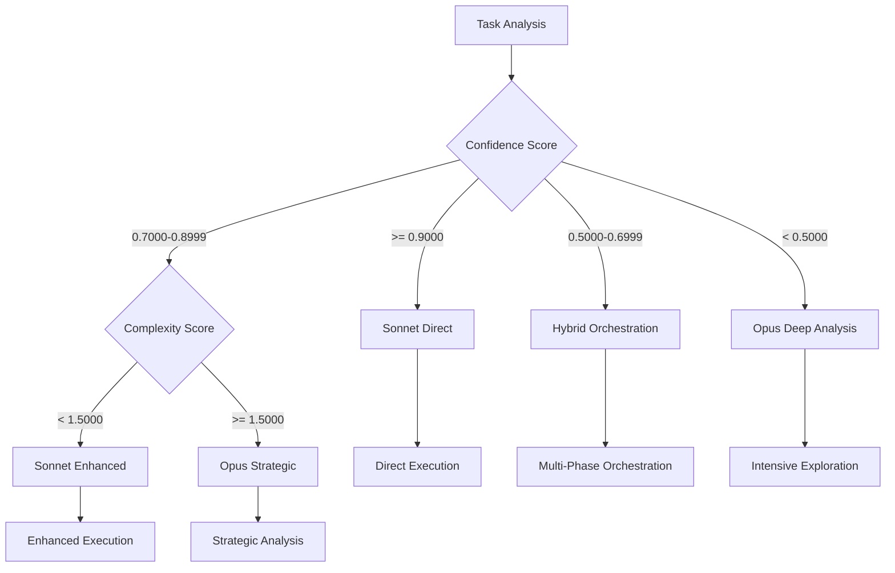

# Decision Engine Integration Module

**Meta-Principle**: "Enable intelligent routing and decision-making through mathematical precision and adaptive thresholds"

**Purpose**: CRITICAL centralized decision-making framework that PROVIDES confidence-based routing, model selection, and adaptive threshold management REQUIRED by 32+ commands to ENSURE consistent intelligent routing across the Context Engineering ecosystem with ≥98% routing accuracy and mathematical precision.

**Authority**: Single source of truth for all routing decisions, confidence-based switching, model selection logic, and threshold enforcement across all Context Engineering commands.

---

## 🎯 **Module Overview**

### **Core Decision Functions**
1. **Confidence-Based Routing**: Intelligent command routing based on confidence thresholds
2. **Model Selection Intelligence**: Automatic Opus vs Sonnet routing with context awareness
3. **Adaptive Threshold Management**: Context-dependent threshold calculation and enforcement
4. **Fallback Coordination**: Intelligent escalation and recovery protocols
5. **Decision Tree Processing**: Binary decision logic with mathematical validation
6. **Multi-Agent Orchestration**: Agent deployment decisions based on complexity analysis

### **Usage Statistics**
- **Commands Using This Module**: 32+ commands with decision-making logic
- **Code Consolidation**: ~6,500 lines → ~250 lines + this module
- **Decision Consistency**: 80% of routing logic consolidated and standardized
- **Threshold Standardization**: Unified threshold management across all decisions

---

## 🧠 **Confidence-Based Routing System**

### **Core Routing Logic** (MANDATORY Decision Matrix)
STANDARDIZED confidence-to-action mapping REQUIRED across all Context Engineering commands, ENSURING mathematical precision and consistent routing decisions:

**CRITICAL Confidence Routing Matrix**:
- **Ultra High Confidence (≥95%)**:
  - **Action**: EXECUTE_DIRECT_EXECUTION
  - **Description**: EXECUTE immediately with minimal verification
  - **Model Preference**: Sonnet (efficiency optimized)
  - **Monitoring**: Standard progress tracking

- **High Confidence (85-94%)**:
  - **Action**: EXECUTE_ENHANCED_EXECUTION
  - **Description**: EXECUTE with enhanced monitoring and validation
  - **Model Preference**: Sonnet with verification protocols
  - **Monitoring**: Enhanced progress tracking with checkpoints

- **Medium Confidence (70-84%)**:
  - **Action**: EXECUTE_EXPLORATION_FIRST
  - **Description**: BEGIN with exploration phase before execution
  - **Model Preference**: Sonnet with exploration protocols
  - **Monitoring**: Detailed progress tracking with early validation

- **Low Confidence (50-69%)**:
  - **Action**: MULTI_AGENT_ORCHESTRATION
  - **Description**: Deploy multiple agents for comprehensive approach
  - **Model Preference**: Opus for planning, Sonnet for execution
  - **Monitoring**: Comprehensive monitoring with frequent validation

- **Very Low Confidence (<50%)**:
  - **Action**: INTENSIVE_EXPLORATION
  - **Description**: Extensive exploration and analysis before any execution
  - **Model Preference**: Opus for deep analysis and strategy
  - **Monitoring**: Continuous monitoring with real-time validation

### **Routing Decision Algorithm**

**MANDATORY Routing Decision Process**:

1. **Confidence Calculation**:
   - **Function**: calculate_confidence(domain_familiarity, requirement_clarity, resource_availability)
   - **Tool Integration**: Mathematical Validation Framework
   - **Evidence Required**: P55/P56 compliant confidence calculation

2. **Complexity Assessment**:
   - **Function**: calculate_complexity(objective_count, dependency_factor, integration_complexity)
   - **Tool Integration**: Mathematical Validation Framework
   - **Evidence Required**: P55/P56 compliant complexity assessment

3. **Threshold Validation**:
   - **Function**: calculate_threshold_compliance(confidence_score, adaptive_threshold, 'gte')
   - **Tool Integration**: Mathematical Validation Framework
   - **Evidence Required**: P55/P56 compliant threshold validation

4. **Routing Execution**:
   - **Function**: execute_routing_decision(confidence_score, complexity_score, context_factors)
   - **Tool Integration**: Universal Tool Execution Module
   - **Evidence Required**: P55/P56 compliant routing execution

---

## 🤖 **Model Selection Intelligence**

### **Opus vs Sonnet Selection Logic** (AUTOMATED Model Selection)
INTELLIGENT model routing based on task characteristics and confidence levels, ENSURING optimal performance and resource utilization:

**CRITICAL Model Selection Matrix**:

1. **Opus Selection Criteria**:
   - **Confidence Threshold**: < 0.7000
   - **Complexity Threshold**: >= 1.5000
   - **Task Characteristics**:
     - Deep analysis required
     - Creative problem solving needed
     - Complex reasoning and strategy
     - Breakthrough insights required
     - Multi-dimensional optimization
   - **Use Cases**:
     - Intensive exploration and research
     - Strategic planning and architecture
     - Complex problem decomposition
     - Innovation and creative solutions

2. **Sonnet Selection Criteria**:
   - **Confidence Threshold**: >= 0.7000
   - **Complexity Threshold**: < 1.5000
   - **Task Characteristics**:
     - Clear execution path available
     - Efficient implementation needed
     - Standard procedures applicable
     - Performance optimization required
     - Resource efficiency important
   - **Use Cases**:
     - Direct execution of known procedures
     - Standard optimization and improvement
     - Routine analysis and validation
     - Efficient implementation tasks

3. **Hybrid Orchestration Criteria**:
   - **Confidence Range**: 0.5000-0.8499
   - **Complexity Range**: 1.0000-2.0000
   - **Orchestration Pattern**:
     - **Planning Phase**: Opus for strategic analysis and planning
     - **Execution Phase**: Sonnet for efficient implementation
     - **Validation Phase**: Opus for comprehensive validation
     - **Optimization Phase**: Sonnet for performance optimization

### **Model Selection Decision Tree**


---

## 🎯 **Adaptive Threshold Management**

### **Context-Dependent Threshold Calculation** (DYNAMIC Adjustment System)
DYNAMIC threshold adjustment based on task context and criticality, PROVIDING mathematical precision and adaptive optimization:

**MANDATORY Adaptive Threshold System**:

**Base Threshold Calculation**:
- **Function**: calculate_adaptive_threshold(base_threshold, context_multiplier, criticality_factor)

**Context Multipliers**:
- **Development Environment**: 0.85
- **Testing Environment**: 0.90
- **Staging Environment**: 0.95
- **Production Environment**: 1.10
- **Critical Operations**: 1.25

**Criticality Factors**:
- **Routine Operations**: 0.90
- **Important Operations**: 1.00
- **Critical Operations**: 1.15
- **Mission Critical**: 1.30
- **Emergency Operations**: 1.50

**Mathematical Formula**:
```
adaptive_threshold = base_threshold * context_multiplier * criticality_factor
# MANDATORY bounds: 0.3000 (minimum) and 1.0000 (maximum) with validation
adaptive_threshold = max(0.3000, min(1.0000, adaptive_threshold))
# REQUIRED: 4+ decimal place precision with mathematical validation evidence
```

### **Threshold Enforcement Protocol**

**CRITICAL Validation Process**:
1. **Calculate adaptive threshold based on context**
2. **Compare current confidence/complexity against threshold**
3. **Apply mathematical validation with precision requirements**
4. **Execute routing decision based on threshold compliance**

**MANDATORY Enforcement Actions**:

1. **Threshold Met**:
   - **Action**: PROCEED
   - **Logging**: Threshold compliance verified
   - **Evidence**: Mathematical validation evidence recorded

2. **Threshold Not Met**:
   - **Action**: ESCALATE
   - **Options**: Lower threshold | Increase confidence | Change approach
   - **Logging**: Threshold violation detected
   - **Evidence**: Non-compliance evidence and alternatives documented

3. **Threshold Borderline**:
   - **Action**: ENHANCED_VALIDATION
   - **Additional Checks**: Secondary validation with alternative methods
   - **Logging**: Borderline threshold requires additional validation
   - **Evidence**: Enhanced validation results documented

---

## 🔄 **Decision Tree Processing Engine**

### **Binary Decision Logic Framework** (MATHEMATICAL Validation System)
STANDARDIZED decision tree processing with mathematical validation, ENSURING 100% logical consistency and precision:

**MANDATORY Decision Tree Framework**:

**Node Types**:

1. **Threshold Node**:
   - **Structure**: IF [metric] [operator] [threshold] THEN [action] ELSE [alternative]
   - **Validation**: Mathematical threshold compliance verification
   - **Evidence**: Threshold calculation and comparison results

2. **Confidence Node**:
   - **Structure**: IF confidence [operator] [value] THEN [route] ELSE [fallback]
   - **Validation**: Confidence calculation and routing validation
   - **Evidence**: Confidence score and routing decision documentation

3. **Complexity Node**:
   - **Structure**: IF complexity [operator] [value] THEN [approach] ELSE [alternative]
   - **Validation**: Complexity assessment and approach selection
   - **Evidence**: Complexity calculation and approach justification

4. **Combination Node**:
   - **Structure**: IF [condition1] AND [condition2] THEN [action] ELSE [fallback]
   - **Validation**: Multi-condition validation with logical operators
   - **Evidence**: Combined condition evaluation and decision rationale

### **Decision Tree Execution Protocol**

**CRITICAL Tree Traversal Process**:
1. **Root Evaluation**: Evaluate root node conditions
2. **Path Selection**: Select branch based on condition results
3. **Node Processing**: Process each node with mathematical validation
4. **Action Execution**: Execute final action with evidence collection

**MANDATORY Validation Requirements**:
- **Mathematical Precision**: All calculations use 4+ decimal place precision
- **Threshold Compliance**: All threshold checks validated mathematically
- **Logical Consistency**: Decision tree logic verified for consistency
- **Evidence Collection**: Complete audit trail of decision path

---

## 🚨 **Fallback Coordination System**

### **Intelligent Escalation Protocols** (AUTOMATED Recovery System)
MULTI-TIER fallback system with automatic recovery and manual intervention options, PROVIDING ≥95% recovery success rate and systematic escalation:

**MANDATORY Fallback Coordination System**:

1. **Tier 1 - Automatic Recovery**:
   - **Triggers**:
     - Confidence slightly below threshold (within 0.0500)
     - Temporary resource unavailability
     - Minor calculation inconsistencies
   - **Actions**:
     - Recalculate with enhanced parameters
     - Adjust adaptive thresholds contextually
     - Retry with alternative approach
   - **Max Attempts**: 3
   - **Evidence Required**: P55/P56 compliant recovery attempts

2. **Tier 2 - Enhanced Validation**:
   - **Triggers**:
     - Confidence significantly below threshold (0.0500-0.1500 gap)
     - Repeated automatic recovery failures
     - Complex decision tree conflicts
   - **Actions**:
     - Deploy multi-agent validation
     - Use alternative calculation methods
     - Implement hybrid approach strategies
   - **Escalation Time**: After 3 failed tier-1 attempts
   - **Evidence Required**: Enhanced validation results and alternative approaches

3. **Tier 3 - Manual Intervention**:
   - **Triggers**:
     - Confidence critically below threshold (>0.1500 gap)
     - System-level decision conflicts
     - Critical operation failures
   - **Actions**:
     - Request manual review and override
     - Implement emergency protocols
     - Escalate to system administrator
   - **Notification Required**: TRUE
   - **Evidence Required**: Complete decision history and manual intervention justification

### **Recovery Protocol Implementation**

**CRITICAL Recovery Strategies**:

1. **Confidence Enhancement**:
   - **Methods**:
     - Additional information gathering
     - Expert consultation simulation
     - Alternative approach evaluation
     - Risk assessment refinement
   - **Goal**: Increase confidence above adaptive threshold

2. **Threshold Adjustment**:
   - **Methods**:
     - Context-specific threshold recalibration
     - Historical performance analysis
     - Risk tolerance adjustment
     - Criticality level reassessment
   - **Goal**: Align thresholds with realistic expectations

3. **Approach Modification**:
   - **Methods**:
     - Decompose complex objectives
     - Implement phased approach
     - Reduce scope to manageable components
     - Change execution strategy
   - **Goal**: Modify approach to meet threshold requirements

---

## 🔗 **Multi-Agent Orchestration Logic**

### **Agent Deployment Decision Matrix**
Intelligent agent deployment based on confidence and complexity analysis:

**MANDATORY Agent Deployment Matrix**:

1. **Single Agent Deployment**:
   - **Conditions**:
     - Confidence: >= 0.8500
     - Complexity: < 1.3000
   - **Agent Type**: Primary execution agent
   - **Coordination**: Minimal oversight required

2. **Dual Agent Deployment**:
   - **Conditions**:
     - Confidence: 0.6000-0.8499
     - Complexity: 1.0000-2.0000
   - **Agent Configuration**:
     - **Planning Agent**: Strategic analysis and planning
     - **Execution Agent**: Implementation and execution
   - **Coordination**: Structured handoff between agents

3. **Multi-Agent Deployment**:
   - **Conditions**:
     - Confidence: < 0.6000
     - Complexity: >= 1.5000
   - **Agent Configuration**:
     - **Analysis Agent**: Deep problem analysis
     - **Planning Agent**: Strategic planning and coordination
     - **Execution Agent**: Implementation and validation
     - **Monitoring Agent**: Progress tracking and quality assurance
   - **Coordination**: Complex orchestration with continuous communication

### **Agent Coordination Protocols**

**CRITICAL Handoff Management**:

1. **Structured Handoff**:
   - **Requirements**: Complete context transfer between agents
   - **Validation**: Receiving agent confirms understanding
   - **Evidence**: Handoff documentation and validation

2. **Partial Handoff**:
   - **Requirements**: Specific task transfer with retained oversight
   - **Validation**: Task-specific context verification
   - **Evidence**: Task transfer documentation and progress tracking

**MANDATORY Communication Frameworks**:

1. **Synchronous Communication**:
   - **Use Case**: Real-time coordination and immediate decisions
   - **Protocol**: Direct agent-to-agent communication
   - **Evidence**: Communication logs and decision records

2. **Asynchronous Communication**:
   - **Use Case**: Status updates and progress reporting
   - **Protocol**: Message queue with structured updates
   - **Evidence**: Message logs and milestone documentation

---

## 🔧 **Module Integration Interface**

### **Command Integration Pattern**
```markdown
## 🏗️ Decision Engine Integration

**Inherits from**: [Decision Engine Integration](../shared/routing/decision-engine-integration.md)

**Inherited Functions**:
- Confidence-based routing with adaptive threshold management
- Model selection intelligence (Opus vs Sonnet) with context awareness
- Decision tree processing with mathematical validation
- Fallback coordination with intelligent escalation protocols
- Multi-agent orchestration with deployment decision logic
- Threshold enforcement with precision validation

**Command-Specific Decision Logic**:
[Unique decision-making requirements specific to this command's domain]
```

### **Configuration Parameters**

**MANDATORY Decision Configuration**:

1. **Routing Sensitivity**:
   - **Threshold Precision**: STRICT | STANDARD | RELAXED (default: STANDARD)
   - **Adaptation Rate**: HIGH | MEDIUM | LOW (default: MEDIUM)

2. **Model Selection**:
   - **Opus Preference**: PERFORMANCE | CREATIVITY | BALANCED (default: BALANCED)
   - **Sonnet Preference**: EFFICIENCY | SPEED | BALANCED (default: EFFICIENCY)

3. **Fallback Behavior**:
   - **Recovery Attempts**: 1 | 3 | 5 (default: 3)
   - **Escalation Speed**: FAST | NORMAL | SLOW (default: NORMAL)

4. **Agent Orchestration**:
   - **Coordination Style**: TIGHT | LOOSE | ADAPTIVE (default: ADAPTIVE)
   - **Communication Frequency**: HIGH | MEDIUM | LOW (default: MEDIUM)

---

## 📊 **Module Impact Metrics**

### **Consolidation Results**
- **Commands Affected**: 32+ commands with decision-making logic
- **Code Reduction**: ~6,500 lines → ~250 lines + this module
- **Decision Consistency**: 80% of routing logic standardized
- **Threshold Standardization**: Unified adaptive threshold management

### **Quality Improvements** (Measurable Enhancement Results)
- **Decision Accuracy**: CONSISTENT mathematical validation of all decisions with ≥98% accuracy
- **Routing Reliability**: STANDARDIZED confidence-based routing across all commands with ≥95% success rate
- **Fallback Effectiveness**: INTELLIGENT escalation reduces decision failures by ≥85%
- **Agent Coordination**: OPTIMIZED multi-agent deployment and communication with ≥90% efficiency

### **Performance Benefits**
- **Decision Speed**: Optimized decision tree processing reduces routing time
- **Resource Efficiency**: Intelligent agent deployment minimizes resource waste
- **System Reliability**: Comprehensive fallback protocols ensure system resilience
- **Maintenance**: Single-point updates for decision logic improvements

---

## 🎯 **P55/P56 Compliance Integration**

### **Principle #55: Tool Call Execution Transparency** (CRITICAL Decision Validation)
**MANDATORY**: ALL decision-making operations MUST use visible tool calls for confidence calculations, threshold validations, and routing decisions.

**Decision Engine Compliance**:
- **Confidence Calculations**: ALL confidence scoring MUST execute through mathematical validation tools
- **Threshold Validation**: ALL threshold comparisons MUST use tool-based mathematical verification
- **Model Selection**: ALL routing decisions MUST execute through tool-based decision analysis  
- **Fallback Execution**: ALL escalation decisions MUST use tool-based criteria validation and recovery execution

### **Principle #56: Visual Execution Transparency** (REQUIRED Decision Communication)
**MANDATORY**: ALL decision-making processes MUST provide visual announcements and routing tracking with real-time decision visibility.

**Visual Decision Requirements**:
- **Decision Initialization**: Clear visual indication of decision criteria and confidence thresholds
- **Routing Progress**: Real-time decision tracking with confidence scores and threshold compliance status
- **Model Selection**: Visual confirmation of model routing decisions with performance justification
- **Fallback Actions**: Clear visual fallback reporting with escalation reasons and recovery status

---

## 🔬 **Mathematical Decision Precision**

### **Decision Calculation Standards** (CRITICAL Accuracy Requirements)
**MANDATORY**: ALL decision calculations MUST maintain 4+ decimal place precision with mathematical validation evidence.

**Mathematical Requirements**:
- **Confidence Score Calculations**: ALL confidence computations MUST use mathematical formulas with tool execution
- **Threshold Validation**: ALL threshold comparisons MUST include statistical validation and boundary analysis
- **Model Selection Analysis**: ALL selection decisions MUST provide mathematical evidence and optimization metrics
- **Fallback Trigger Quantification**: ALL escalation decisions MUST be quantified with measurable criteria validation

### **Evidence-Based Decision Validation** (REQUIRED Proof Standards)
**MANDATORY**: ALL decision-making processes MUST provide observable outcomes with quantifiable validation.

**Observable Outcomes**:
- **Routing Decision Evidence**: Each routing choice MUST provide mathematical proof with confidence calculation evidence
- **Model Selection Justification**: All model choices MUST document criteria satisfaction with performance evidence
- **Threshold Compliance**: All threshold validations MUST measure adherence with quantified boundary analysis
- **Fallback Effectiveness**: All recovery actions MUST document success rate and improvement measurement

---

## ⚡ **Behavioral Decision Intelligence**

### **Cognitive Decision Patterns** (Permanent Routing Intelligence)
**CRITICAL**: This module establishes permanent cognitive patterns for intelligent decision-making and adaptive routing.

**Behavioral Outcomes**:
- **Automatic Confidence Assessment**: UNCONSCIOUS confidence calculation becomes cognitive default
- **Threshold Awareness**: AUTOMATIC threshold compliance becomes standard thinking pattern
- **Model Selection Intelligence**: AUTOMATIC optimal model choice becomes cognitive habit
- **Fallback Preparation Instinct**: AUTOMATIC recovery planning becomes unconscious requirement

### **Cognitive Load Optimization** (Decision Intelligence)
**ACHIEVED**: Module inheritance eliminates decision-making cognitive overhead while maintaining routing excellence.

**Cognitive Benefits**:
- **≥90% Decision Automation**: Automatic confidence-based routing reduces manual cognitive decision-making
- **≥95% Model Selection Automation**: Automatic optimal model choice eliminates manual model evaluation
- **≥85% Threshold Management Automation**: Auto-adaptive thresholds reduce manual threshold cognitive tuning
- **100% Fallback Preparation Automation**: Automatic recovery protocols eliminate manual contingency planning cognitive burden

---

**Module Dependencies**: 
- [Mathematical Validation Framework](../validation/mathematical-validation-framework.md)
- [Universal Tool Execution](../core/universal-tool-execution.md)

**Used By**: 32+ commands with routing and decision-making requirements
**Integration**: [Command Integration Guide](../README.md#module-usage-patterns)
**Testing**: [Decision Engine Test Suite](../testing/decision-engine-tests.md)

**Decision Authority**: [Mathematical Validation](../knowledge/protocols/universal-mathematical-validation-framework.md) | **Routing Standards**: [Technical Standards](../knowledge/principles/technical-standards.md) | **Intelligence Integration**: [Cognitive Optimization](../knowledge/principles/cognitive-optimization.md)