# Atomic Command: `/modular-composition`

## **Principle #25: Modular Composition**
**"Build complexity through composition, not duplication."**

---

## 🎯 **COMMAND DEFINITION**

### **Purpose**
Enforce modular composition architecture where orchestrators USE modules, modules provide single capabilities, dependencies are clearly mapped, and no functionality is duplicated across the system.

### **Complexity**: 0.8/1.0
### **Context Required**: Command definitions, module dependencies, and system architecture
### **Execution Time**: 2-4 minutes (depending on system analysis scope)

---

## ⚡ Auto-Activation Triggers

### **MANDATORY Activation Conditions**
**Complexity Threshold**: ≥0.9000 (90% complexity floor)
**Confidence Threshold**: <0.7000 (70% confidence ceiling)
**Composition Quality Threshold**: <0.8000 (80% modular composition compliance required)
**Architecture Analysis Time Threshold**: ≥240.0000 seconds for comprehensive composition analysis

### **CRITICAL Trigger Validation**
- **Mathematical Assessment**: Quantifiable composition quality with ≥80% modular compliance
- **Threshold Enforcement**: REQUIRED activation when architecture lacks proper modular composition
- **P56 Announcement**: 🧩 TRANSPARENCY: Modular Composition auto-activated for [target] architecture optimization
- **Evidence Collection**: Measurable composition metrics and dependency validation documentation

## **ACTIVATION PROTOCOL**

### **Input Format**
```markdown
/modular-composition [target] [action] [scope?]
```

### **What This Command Does**
1. **Dependency Mapping**: Analyze and visualize module dependencies
2. **Composition Validation**: Ensure orchestrators use modules correctly
3. **Duplication Detection**: Identify and flag functionality duplication
4. **Module Isolation**: Verify single-capability module compliance
5. **Architecture Enforcement**: Maintain clean composition boundaries
6. **Dependency Optimization**: Suggest composition improvements

### **Modular Composition Process**
1. **Scan System Architecture**: Identify all modules and orchestrators
2. **Map Dependencies**: Create clear dependency graph
3. **Validate Composition**: Check orchestrator → module usage patterns
4. **Detect Duplication**: Find replicated functionality across modules
5. **Enforce Boundaries**: Ensure single-capability module design
6. **Optimize Structure**: Recommend composition improvements

---

## 🧠 **MODULAR COMPOSITION DECISION TREE**

### **CRITICAL Cognitive Flow for Modular Composition**

```mermaid
graph TD
    A[Modular Composition Request] --> B{Complexity ≥ 0.9?}
    B -->|Yes| C[CRITICAL: Advanced Composition Processing]
    B -->|No| D[Standard Composition Analysis]
    
    C --> E{Confidence < 0.7?}
    E -->|Yes| F[MANDATORY: Expert Task Delegation]
    E -->|No| G[Direct Composition Execution]
    
    D --> H{Target Scope Assessment}
    H -->|System-wide| I[Full System Analysis]
    H -->|Component-specific| J[Targeted Component Analysis]
    
    F --> K[Task Tool: Complex Composition Analysis]
    K --> L[P56: Advanced Composition Coordination]
    
    G --> M{Composition Validation Type}
    M -->|Orchestrator| N[Orchestrator Compliance Check]
    M -->|Module| O[Module Boundary Validation]
    M -->|System| P[Full System Validation]
    
    I --> Q[Read Tool: Load System Architecture]
    Q --> R[Bash Tool: Dependency Mapping]
    
    J --> S[Read Tool: Load Component Context]
    S --> T[Edit Tool: Document Analysis]
    
    N --> U{Direct Implementation Check}
    U -->|Found| V[CRITICAL: Boundary Violation]
    U -->|None| W[Orchestrator Compliant]
    
    O --> X{Single Capability Check}
    X -->|Multiple| Y[REQUIRED: Module Split]
    X -->|Single| Z[Module Compliant]
    
    P --> AA[Bash Tool: Duplication Detection]
    AA --> BB{Duplication Found?}
    BB -->|Yes| CC[MANDATORY: Deduplication]
    BB -->|No| DD[System Clean]
    
    R --> EE[Edit Tool: Document Dependencies]
    EE --> FF[Mathematical Composition Score]
    
    V --> GG[Read Tool: Load Refactoring Patterns]
    GG --> HH[Edit Tool: Generate Extraction Plan]
    HH --> II[P56: Boundary Correction Plan]
    
    Y --> JJ[Read Tool: Load Split Patterns]
    JJ --> KK[Edit Tool: Generate Split Strategy]
    KK --> LL[P56: Module Split Plan]
    
    CC --> MM[Read Tool: Load Deduplication Patterns]
    MM --> NN[Edit Tool: Generate Consolidation Plan]
    NN --> OO[P56: Deduplication Strategy]
    
    W --> PP[P56: Orchestrator Validation Success]
    Z --> QQ[P56: Module Validation Success]
    DD --> RR[P56: System Validation Success]
    
    L --> SS[Agent Composition Results]
    SS --> TT[P56: Expert Composition Complete]
    
    FF --> UU[Composition Quality Metrics]
    II --> UU
    LL --> UU
    OO --> UU
    PP --> UU
    QQ --> UU
    RR --> UU
    TT --> UU
    
    style C fill:#ff6b6b
    style F fill:#4ecdc4
    style V fill:#ffe66d
    style CC fill:#ff8b94
    style UU fill:#95e1d3
```



## 🛠️ **TOOL SELECTION CRITERIA**

### **MANDATORY Tool Selection Matrix**
**READ Tool Usage**:
- **File Count**: ≤3 files for direct analysis
- **Complexity**: <0.7000 (straightforward operations)
- **Scope**: Well-defined, single-purpose operations

**TASK Tool Usage**:
- **File Count**: ≥4 files or unknown scope
- **Complexity**: ≥0.7000 (complex operations)
- **Scope**: Multi-step, exploratory, or research operations

**Other Tools**:
- **Grep**: Pattern search across multiple files
- **Glob**: File pattern matching and discovery
- **Bash**: System operations and automation

### **CRITICAL Tool Selection Logic**
- **Complexity Assessment**: Quantifiable complexity evaluation
- **Scope Validation**: File count and operation scope measurement
- **P56 Announcement**: Visual confirmation of tool selection reasoning
- **Evidence Collection**: Measurable tool selection criteria documentation

### **MANDATORY P56 Transparency Announcements**

```yaml
modular_composition_transparency:
  composition_analysis:
    announcement: "🔍 TRANSPARENCY: Composition analysis - [SYSTEM/COMPONENT] scope, [X] components analyzed"
    evidence: "Complete composition analysis with dependency mapping"
    
  violation_detection:
    announcement: "🚨 TRANSPARENCY: Violations detected - [BOUNDARY/DUPLICATION/CAPABILITY] type, [X] count"
    evidence: "Detailed violation analysis with severity and impact assessment"
    
  tool_selection:
    announcement: "🛠️ TRANSPARENCY: Tool selection - [READ/EDIT/BASH/TASK] for [composition_operation]"
    evidence: "Tool selection matrix with composition-specific reasoning"
    
  refactoring_strategy:
    announcement: "🔄 TRANSPARENCY: Refactoring strategy - [EXTRACTION/SPLIT/CONSOLIDATION] approach"
    evidence: "Complete refactoring plan with implementation steps"
    
  composition_quality:
    announcement: "📊 TRANSPARENCY: Composition quality [X]/10 - [COMPLIANT/IMPROVEMENT_REQUIRED]"
    evidence: "Mathematical composition score with quality metrics"
```

---

## 🔍 **COMPOSITION ANALYSIS FRAMEWORK**

### **Module Classification System**
```javascript
function classifySystemComponents(target) {
  return {
    modules: {
      atomic: extractAtomicModules(target),
      composite: extractCompositeModules(target),
      utility: extractUtilityModules(target)
    },
    orchestrators: {
      workflow: extractWorkflowOrchestrators(target),
      domain: extractDomainOrchestrators(target),
      system: extractSystemOrchestrators(target)
    },
    dependencies: mapDependencyGraph(target)
  }
}
```

### **Dependency Mapping Algorithm**
```javascript
function mapDependencyGraph(system) {
  const graph = new DependencyGraph()
  
  system.components.forEach(component => {
    const dependencies = extractDependencies(component)
    const provides = extractCapabilities(component)
    
    graph.addNode(component.id, {
      type: component.type,
      capabilities: provides,
      dependencies: dependencies,
      composition_level: calculateCompositionLevel(component)
    })
  })
  
  return {
    graph: graph,
    cycles: detectCircularDependencies(graph),
    depth: calculateMaxDepth(graph),
    violations: findCompositionViolations(graph)
  }
}
```

---

## 📋 **COMPOSITION VALIDATION RULES**

### **Orchestrator Composition Rules**
1. **Uses Modules Only**: Orchestrators must delegate to modules, not implement directly
2. **No Direct Implementation**: Orchestrators coordinate, modules execute
3. **Clear Handoff Protocols**: Defined interfaces between orchestrator and modules
4. **Composition Transparency**: Dependencies explicitly declared

### **Module Design Rules**
1. **Single Capability**: Each module provides exactly one core capability
2. **No Duplication**: Functionality exists in exactly one module
3. **Clear Interface**: Well-defined input/output contracts
4. **Composability**: Designed to be used by orchestrators

### **Validation Algorithm**
```javascript
function validateModularComposition(system) {
  const violations = []
  
  // Check orchestrator compliance
  system.orchestrators.forEach(orchestrator => {
    const directImplementation = checkDirectImplementation(orchestrator)
    if (directImplementation.found) {
      violations.push({
        type: 'orchestrator_direct_implementation',
        component: orchestrator.id,
        details: directImplementation.violations
      })
    }
    
    const moduleUsage = checkModuleUsage(orchestrator)
    if (!moduleUsage.compliant) {
      violations.push({
        type: 'orchestrator_module_usage',
        component: orchestrator.id,
        details: moduleUsage.issues
      })
    }
  })
  
  // Check module compliance
  system.modules.forEach(module => {
    const singleCapability = checkSingleCapability(module)
    if (!singleCapability.compliant) {
      violations.push({
        type: 'module_multiple_capabilities',
        component: module.id,
        details: singleCapability.violations
      })
    }
  })
  
  // Check for duplication
  const duplications = detectFunctionalityDuplication(system)
  duplications.forEach(duplication => {
    violations.push({
      type: 'functionality_duplication',
      components: duplication.components,
      functionality: duplication.capability
    })
  })
  
  return {
    compliant: violations.length === 0,
    violations: violations,
    score: calculateCompositionScore(system, violations)
  }
}
```

---

## 🔍 **DUPLICATION DETECTION ENGINE**

### **Functionality Similarity Analysis**
```javascript
function detectFunctionalityDuplication(system) {
  const capabilities = extractAllCapabilities(system)
  const duplications = []
  
  for (let i = 0; i < capabilities.length; i++) {
    for (let j = i + 1; j < capabilities.length; j++) {
      const similarity = calculateCapabilitySimilarity(
        capabilities[i], 
        capabilities[j]
      )
      
      if (similarity > 0.8) {
        duplications.push({
          components: [capabilities[i].owner, capabilities[j].owner],
          capability: capabilities[i].name,
          similarity_score: similarity,
          recommendation: generateDeduplicationStrategy(
            capabilities[i], 
            capabilities[j]
          )
        })
      }
    }
  }
  
  return duplications
}
```

### **Deduplication Strategies**
1. **Extract Common Module**: Create shared module for duplicated functionality
2. **Merge Similar Modules**: Combine modules with overlapping capabilities
3. **Redirect Dependencies**: Update orchestrators to use canonical implementation
4. **Deprecate Duplicates**: Mark redundant implementations for removal

---

## 📋 **ARCHITECTURE ENFORCEMENT PROTOCOL**

### **Composition Boundary Enforcement**
```javascript
function enforceCompositionBoundaries(system) {
  const enforcement_actions = []
  
  // Enforce orchestrator boundaries
  system.orchestrators.forEach(orchestrator => {
    const boundary_violations = checkBoundaryViolations(orchestrator)
    
    boundary_violations.forEach(violation => {
      enforcement_actions.push({
        type: 'boundary_violation',
        component: orchestrator.id,
        action: 'extract_to_module',
        details: violation,
        suggested_module: generateModuleName(violation.functionality)
      })
    })
  })
  
  // Enforce module boundaries
  system.modules.forEach(module => {
    const capability_violations = checkCapabilityBoundaries(module)
    
    capability_violations.forEach(violation => {
      enforcement_actions.push({
        type: 'capability_violation',
        component: module.id,
        action: 'split_module',
        details: violation,
        suggested_split: generateSplitStrategy(violation)
      })
    })
  })
  
  return {
    actions: enforcement_actions,
    priority: prioritizeEnforcementActions(enforcement_actions),
    implementation_plan: generateImplementationPlan(enforcement_actions)
  }
}
```

### **Automatic Boundary Correction**
```javascript
function correctCompositionBoundaries(violations) {
  const corrections = []
  
  violations.forEach(violation => {
    switch (violation.type) {
      case 'orchestrator_direct_implementation':
        corrections.push(extractToModule(violation))
        break
      case 'module_multiple_capabilities':
        corrections.push(splitModule(violation))
        break
      case 'functionality_duplication':
        corrections.push(deduplicateCapability(violation))
        break
    }
  })
  
  return {
    corrections: corrections,
    execution_order: orderCorrections(corrections),
    impact_analysis: analyzeCorrectionsImpact(corrections)
  }
}
```

---

## 🔍 **DEPENDENCY OPTIMIZATION ENGINE**

### **Dependency Graph Analysis**
```javascript
function optimizeDependencyGraph(graph) {
  const optimizations = []
  
  // Detect unnecessary dependencies
  const unnecessary = detectUnnecessaryDependencies(graph)
  unnecessary.forEach(dep => {
    optimizations.push({
      type: 'remove_dependency',
      from: dep.from,
      to: dep.to,
      reason: dep.reason,
      impact: calculateRemovalImpact(dep)
    })
  })
  
  // Detect missing abstractions
  const missing_abstractions = detectMissingAbstractions(graph)
  missing_abstractions.forEach(abstraction => {
    optimizations.push({
      type: 'create_abstraction',
      components: abstraction.components,
      suggested_interface: abstraction.interface,
      benefits: abstraction.benefits
    })
  })
  
  // Detect circular dependencies
  const cycles = detectCircularDependencies(graph)
  cycles.forEach(cycle => {
    optimizations.push({
      type: 'break_circular_dependency',
      cycle: cycle.components,
      suggested_break_point: findOptimalBreakPoint(cycle),
      strategy: generateCycleBreakingStrategy(cycle)
    })
  })
  
  return {
    optimizations: optimizations,
    priority: prioritizeOptimizations(optimizations),
    implementation_strategy: generateOptimizationStrategy(optimizations)
  }
}
```

### **Composition Metrics**
- **Modularity Score**: Measure of system decomposition quality
- **Coupling Index**: Strength of inter-component dependencies
- **Cohesion Score**: Internal component coherence measure
- **Duplication Rate**: Percentage of replicated functionality

---

## 🔍 **VERIFICATION CRITERIA**

### **Success Metrics**
- **Composition Compliance**: ≥95% of orchestrators use modules correctly
- **Module Purity**: ≥98% of modules provide single capabilities
- **Duplication Elimination**: ≤2% functionality duplication across system
- **Dependency Clarity**: 100% of dependencies explicitly mapped

### **Architectural Quality Assessment**
```javascript
function assessArchitecturalQuality(system) {
  const metrics = {
    modularity: calculateModularityScore(system),
    coupling: calculateCouplingIndex(system),
    cohesion: calculateCohesionScore(system),
    duplication: calculateDuplicationRate(system),
    complexity: calculateArchitecturalComplexity(system)
  }
  
  const quality_score = (
    metrics.modularity * 0.25 +
    (1 - metrics.coupling) * 0.25 +
    metrics.cohesion * 0.25 +
    (1 - metrics.duplication) * 0.25
  )
  
  return {
    score: quality_score,
    metrics: metrics,
    recommendations: generateQualityRecommendations(metrics),
    compliance: quality_score >= 0.9
  }
}
```

---

## 🔍 **COMPOSITION PATTERNS LIBRARY**

### **Standard Composition Patterns**
1. **Layered Composition**: Orchestrator → Service → Data modules
2. **Pipeline Composition**: Sequential module chaining
3. **Parallel Composition**: Concurrent module execution
4. **Hierarchical Composition**: Nested orchestrator structures

### **Anti-Pattern Detection**
```javascript
function detectCompositionAntiPatterns(system) {
  const anti_patterns = []
  
  // God Object Pattern
  const god_objects = detectGodObjects(system)
  god_objects.forEach(obj => {
    anti_patterns.push({
      type: 'god_object',
      component: obj.id,
      violations: obj.violations,
      refactoring_strategy: generateGodObjectRefactoring(obj)
    })
  })
  
  // Circular Dependencies
  const circular_deps = detectCircularDependencies(system.dependency_graph)
  circular_deps.forEach(cycle => {
    anti_patterns.push({
      type: 'circular_dependency',
      components: cycle.components,
      break_strategy: generateCycleBreakStrategy(cycle)
    })
  })
  
  // Tight Coupling
  const tight_coupling = detectTightCoupling(system)
  tight_coupling.forEach(coupling => {
    anti_patterns.push({
      type: 'tight_coupling',
      components: coupling.components,
      decoupling_strategy: generateDecouplingStrategy(coupling)
    })
  })
  
  return anti_patterns
}
```

---

## 🔗 **NATURAL CONNECTIONS**

### **Automatically Triggers**
- `/single-source-truth` - To eliminate detected duplication
- `/complexity-enforcement` - To validate composition complexity
- `/objective-decomposition` - When modules need further breakdown

### **Compatible With**
- `/organizational-architecture` - Aligns with system organization
- `/crystallize-patterns` - Identifies successful composition patterns
- `/living-documentation` - Documents architecture evolution
- `/mathematical-complexity-core` - Uses shared complexity calculations for modular assessment

### **Feeds Into**
- `/decision-engine` - Provides architectural routing criteria
- `/verification-liberation` - Enables compositional testing
- `/evolve-intelligence` - Tracks composition improvements

---

## 📋 **USAGE EXAMPLES**

### **System Architecture Analysis**
```text
/modular-composition "entire-system" "analyze" "full"
```
**Result**: Complete dependency mapping, composition validation, and duplication detection across all system components

### **Orchestrator Compliance Check**
```text
/modular-composition "user-management-orchestrator" "validate" "orchestrator"
```
**Result**: Verifies orchestrator uses modules correctly, identifies direct implementation violations

### **Module Boundary Enforcement**
```text
/modular-composition "authentication-module" "enforce" "boundaries"
```
**Result**: Ensures single-capability design, suggests splits if multiple capabilities detected

---

## 🛡️ **FALLBACK PROTOCOL**

### **If Dependency Analysis Fails**
1. **Manual Dependency Mapping**: Create dependency graph manually
2. **Incremental Analysis**: Analyze components individually
3. **Pattern-Based Detection**: Use known patterns to identify structure
4. **Progressive Composition**: Build modular structure incrementally

### **Architecture Violation Handling**
- Document all detected violations with severity levels
- Prioritize violations by impact and effort to fix
- Implement fixes in dependency order
- Validate fixes don't introduce new violations

---

## 📊 **INTEGRATION WITH DECISION ENGINE**

### **Composition Routing**
- **Well-Composed (<0.2 violations)**: Direct execution approved
- **Moderately Composed (0.2-0.5 violations)**: Execution with monitoring
- **Poorly Composed (0.5-0.8 violations)**: Require composition fixes
- **Architectural Debt (>0.8 violations)**: Block until refactored

### **Adaptive Composition Standards**
- **Project Size**: Adjust complexity tolerance for scale
- **Team Experience**: Modify composition requirements based on team maturity
- **Domain Complexity**: Account for inherently complex problem domains
- **Evolution Stage**: Relax standards for prototype, enforce strictly for production

---

## 🔄 **EVOLUTION TRACKING**

### **Learning Metrics**
- **Composition Quality Trend**: How architectural quality evolves over time
- **Violation Resolution Rate**: Speed of fixing composition violations
- **Module Reuse Rate**: How often modules are reused across orchestrators
- **Dependency Stability**: Rate of dependency changes over time

### **Pattern Recognition**
- Successful composition patterns → Architectural templates
- Common violations → Automated prevention strategies
- Effective refactoring → Reusable transformation patterns
- Optimal module sizes → Modular design guidelines

---

## 🎯 **MODULAR COMPOSITION GUARANTEE**

### **Architectural Assurance**
- **No Duplication**: Mathematical guarantee of single-source functionality
- **Clear Dependencies**: Complete visibility into component relationships
- **Composition Compliance**: Automated enforcement of modular architecture
- **Optimal Structure**: Continuous optimization of system composition

### **Quality Metrics**
- Every orchestrator mathematically verified to use modules correctly
- All modules guaranteed to provide single, well-defined capabilities
- Zero tolerance for functionality duplication across system
- Continuous monitoring ensures sustained architectural quality

---

**Note**: This command embodies the Context Engineering principle of modular composition, ensuring that system complexity is built through clean composition of single-purpose modules rather than duplication, with orchestrators coordinating modules rather than implementing functionality directly.