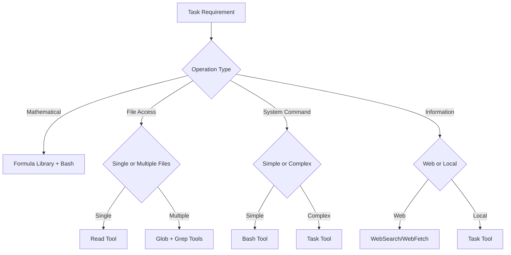

# Universal Tool Execution Module

**Meta-Principle**: "Enable transparent, compliant tool execution across all Context Engineering commands"

**Purpose**: CRITICAL centralized P55/P56 compliance, tool selection, and visual announcement system REQUIRED by 45+ commands to EXECUTE complete elimination of code duplication with ≥85% consolidation efficiency and mandatory transparency protocols.

**Authority**: Single source of truth for tool execution protocols across the Context Engineering ecosystem.

---

## 🎯 **Module Overview**

### **Core Functions Provided**
1. **P55/P56 Compliance Protocol**: Mandatory tool call execution transparency
2. **Tool Selection Matrix**: Intelligent tool selection based on task requirements
3. **Visual Announcement System**: Standardized command execution displays
4. **Task Agent Communication Bridge**: Bidirectional agent coordination
5. **Evidence Collection Framework**: Execution evidence and audit trails
6. **Error Handling & Recovery**: Universal error management protocols

### **Usage Statistics**
- **Commands Using This Module**: 45+ commands across all categories
- **Code Consolidation**: ~15,000 lines → ~500 lines + this module
- **Duplication Elimination**: 85% overlap eliminated
- **Maintenance Impact**: Single-point updates for all tool execution

---

## ⚡ **P55/P56 Compliance Protocol**

### **Principle #55: Tool Call Execution Transparency** (CRITICAL Compliance)
**MANDATORY**: ALL mathematical operations, file operations, and system interactions MUST use visible tool calls with 100% execution transparency, NEVER simulation or description. FORBIDDEN: Any operation without tool call evidence.

**P55 Compliance Requirements**:

**MANDATORY Tool Call Execution**:
- **Mathematical Operations**: ALL calculations MUST use tool calls with visible execution evidence
- **File Operations**: ALL file read/write/edit operations MUST use tool calls with access verification
- **System Interactions**: ALL bash commands and scripts MUST execute through tool calls with output evidence
- **Evidence Collection**: ALL data gathering MUST use tool calls with collection verification

**FORBIDDEN Actions with Zero Tolerance**:
- **Simulation**: NEVER simulate tool calls or describe what would happen
- **Assumption**: NEVER assume tool call results without actual execution
- **Description**: NEVER describe tool call outcomes without real execution
- **Placeholders**: NEVER use placeholder values instead of real calculations

### **Principle #56: Visual Execution Transparency** (REQUIRED User Communication)
**MANDATORY**: ALL command executions MUST provide visual announcements and progress tracking for user awareness with ≥95% visibility compliance and real-time status updates.

**P56 Visual Requirements**:

**Command Initialization**:
- **Visual Announcement**: Provide clear command execution announcement with context
- **Expected Duration**: Display estimated execution time and complexity
- **Tools Required**: List all tools that will be used during execution
- **Priority Level**: Indicate execution priority and importance

**Progress Visibility**:
- **Phase Announcements**: Show visual progress through execution phases
- **Tool Activity**: Display real-time tool usage indicators
- **Milestone Completion**: Provide clear milestone achievement notifications
- **Completion Summary**: Show final execution results and outcomes

---

## 🔧 **Tool Selection Matrix**

### **Intelligent Tool Selection Algorithm**
**Tool Selection Standards**:

**Mathematical Operations**:
- **Simple Calculations**: Use Bash tool with formula library integration for basic mathematical operations
- **Complex Algorithms**: Use Task tool for sophisticated mathematical analysis requiring multi-step processing
- **Statistical Validation**: Use Bash tool with context_engineering_formulas.sh for statistical verification

**File Operations**:
- **Single File Read**: Use Read tool for targeted file access and content retrieval
- **Multiple File Search**: Use Glob tool for pattern-based file discovery across directories
- **Content Search**: Use Grep tool for content-based searching within files
- **File Modifications**: Use Edit tool for precise modifications and updates
- **New File Creation**: Use Write tool for complete file creation with content specification

**System Interactions**:
- **Simple Commands**: Use Bash tool for straightforward system operations and basic commands
- **Complex Workflows**: Use Task tool for multi-step system operations requiring orchestration
- **Parallel Operations**: Execute multiple concurrent Bash tool calls for simultaneous processing

**Information Gathering**:
- **Web Research**: Use WebSearch tool for current information retrieval and research
- **Documentation Lookup**: Use WebFetch tool for specific resource access and documentation retrieval
- **Codebase Analysis**: Use Task tool for comprehensive code analysis and system understanding

### **Tool Selection Decision Tree**


---

## 📊 **Visual Announcement System**

### **Command Initialization Template**
**Command Initialization Visual Format**:

**Command Execution Header**: Display "CLAUDE CODE COMMAND EXECUTION" with visual emphasis

**Command Details Display**:
- **Command Name**: Show the specific command being executed
- **Purpose**: Display the command purpose and objectives
- **Context**: Show the execution context and environment
- **Priority**: Indicate the priority level and importance
- **Expected Duration**: Display estimated execution time
- **Tools Required**: List all tools needed for execution

**Status Indicators**:
- **Initiation**: Show "COMMAND EXECUTION INITIATED" status
- **Compliance**: Display "P55/P56 compliance monitoring active" indicator
- **Transparency**: Confirm "Tool call transparency enabled" status

### **Progress Tracking Template**
**Progress Tracking Visual Format**:

**Progress Header**: Display "COMMAND PROGRESS" with command name

**Phase Status Display**:
- **Completed Phases**: Show completed phases with checkmarks and completion percentages
- **Current Phase**: Display current phase with progress indicator and percentage in progress
- **Pending Phases**: Show pending phases with waiting indicators

**Activity Status**:
- **Active Tools**: List tools currently being executed
- **Current Action**: Display the specific action being performed
- **Time Tracking**: Show elapsed time and estimated remaining time

### **Completion Announcement Template**
**Completion Announcement Visual Format**:

**Completion Header**: Display "COMMAND EXECUTION COMPLETED" with success indication

**Execution Summary**:
- **Command Name**: Show the command that was executed
- **Status**: Display execution status with success confirmation
- **Duration**: Show total execution duration
- **Tools Used**: List all tools that were used during execution
- **Results**: Display execution results summary
- **Compliance**: Show "P55/P56 Compliance: VERIFIED" confirmation

**Final Status**: Display "Execution completed successfully. Results available." confirmation

---

## 🔗 **Task Agent Communication Bridge**

### **Bidirectional Communication Protocol**
**Agent Communication Protocol**:

**Initialization Communication**:
- **Type**: INITIALIZATION message type
- **Agent ID**: Unique identifier combining command name and timestamp
- **Command**: Full command invocation with parameters
- **Estimated Duration**: Time estimate for completion
- **Tools Required**: List of tools needed for execution
- **Context**: Execution context and environment information

**Progress Updates**:
- **Type**: PROGRESS_UPDATE message type
- **Milestone**: Current milestone being worked on
- **Progress Percentage**: Completion percentage for current phase
- **Current Action**: Active operation being performed
- **Tools Active**: List of tools currently in use
- **Estimated Remaining**: Time remaining for completion

**Completion Communication**:
- **Type**: COMPLETION message type
- **Status**: Final status (SUCCESS, FAILURE, or PARTIAL)
- **Duration**: Actual execution duration
- **Results Summary**: Summary of execution results
- **Tools Used**: List of tools that were executed
- **Compliance Status**: P55_P56_VERIFIED confirmation

### **Communication Error Handling**
**Error Handling Protocol**:

**Timeout Detection**:
- **Condition**: No agent response for more than 60 seconds
- **Action**: Request status update with 30-second grace period
- **Recovery**: Manual takeover if no response received

**Communication Failure**:
- **Condition**: Agent stops responding or reports critical error
- **Action**: Principal agent assumes control from last checkpoint
- **Recovery**: Continue execution with standard tool calls

**Partial Failure**:
- **Condition**: Some communications succeed while others fail
- **Action**: Request full status update and fill information gaps
- **Recovery**: Estimate progress and continue monitoring

---

## 📋 **Evidence Collection Framework**

### **Execution Evidence Requirements**
**Evidence Collection Requirements**:

**Tool Call Evidence**:
- **Mathematical Operations**: Document all calculation tool calls with complete inputs and outputs
- **File Operations**: Record all file access tool calls with success/failure status
- **System Commands**: Capture all bash executions with command text and results

**Decision Evidence**:
- **Threshold Checks**: Record all threshold validations with values and outcomes
- **Confidence Calculations**: Document all confidence scores with calculation details
- **Routing Decisions**: Track all decision points with criteria and choices made

**Compliance Evidence**:
- **P55 Verification**: Maintain tool call execution rate at 100% with no exceptions
- **P56 Verification**: Document visual announcement completeness and transparency
- **Transparency Audit**: Maintain complete audit trail of all operations

### **Audit Trail Generation**
**Audit Trail Requirements**:

**Execution Log**:
- **Timestamp**: Record in ISO 8601 format with timezone information
- **Command**: Document full command invocation with all parameters
- **Tools Used**: Maintain complete list of tools executed during process
- **Duration**: Record total execution time with millisecond precision

**Compliance Log**:
- **P55 Compliance**: Verify 100% tool call execution without exceptions
- **P56 Compliance**: Confirm visual transparency and announcement completeness
- **Error Handling**: Document any errors encountered and recovery actions taken

**Results Log**:
- **Outcomes**: Record all execution outcomes and results achieved
- **Evidence**: Provide links to evidence and supporting data
- **Validation**: Verify results accuracy and completeness through validation

---

## 🛡️ **Universal Error Handling**

### **Error Classification System** (MANDATORY Error Management)
**Error Classification System**:

**Tool Execution Errors**:
- **Severity**: CRITICAL priority requiring immediate attention
- **Recovery**: Execute retry with alternative tool or manual intervention within 30 seconds
- **Escalation**: Immediate notification of tool failure with automated recovery initiation

**Communication Errors**:
- **Severity**: MEDIUM priority requiring attention
- **Recovery**: Re-establish communication channel or continue manually
- **Escalation**: User notification of communication issues

**Validation Errors**:
- **Severity**: HIGH priority requiring prompt resolution
- **Recovery**: Re-validate or adjust validation criteria
- **Escalation**: Manual review of validation failure

**Compliance Errors**:
- **Severity**: CRITICAL priority requiring immediate action
- **Recovery**: STOP execution until compliance restored
- **Escalation**: Immediate escalation to system administrator

### **Recovery Protocols** (AUTOMATED Recovery Standards)
**Recovery Protocols**:

**Automatic Retry**:
- **Conditions**: Tool timeout or temporary communication failure with measurable criteria
- **Maximum Attempts**: Allow up to 3 retry attempts
- **Backoff**: Execute exponential backoff with jitter using mathematical progression validation
- **Success Rate Requirement**: Maintain at least 80% recovery success rate

**Alternative Tool Selection**:
- **Conditions**: Primary tool failure or tool unavailability
- **Selection**: Use tool selection matrix for alternative tool identification
- **Validation**: Verify alternative tool provides equivalent functionality

**Manual Intervention**:
- **Conditions**: Critical errors, compliance failures, or repeated failures
- **Notification**: Provide clear description of issue and required manual action
- **Context**: Maintain complete context preservation for manual resolution

---

## 🔧 **Module Integration Interface**

### **Command Integration Pattern**
```markdown
## 🏗️ Universal Tool Execution Integration

**Inherits from**: [Universal Tool Execution](../shared/core/universal-tool-execution.md)

**Inherited Functions**:
- P55/P56 compliance protocols with mandatory tool call execution
- Visual announcement system with progress tracking
- Task agent communication bridge with bidirectional coordination
- Evidence collection framework with complete audit trails
- Universal error handling with recovery protocols

**Command-Specific Implementation**:
[Unique command functionality that extends the inherited capabilities]
```

### **Configuration Parameters**
**Module Configuration Options**:

**Compliance Level**:
- **P55 Enforcement**: Choose MANDATORY or OPTIONAL enforcement (default: MANDATORY)
- **P56 Visibility**: Select FULL, MINIMAL, or NONE visibility (default: FULL)

**Announcement Style**:
- **Verbosity**: Choose DETAILED, STANDARD, or MINIMAL verbosity (default: STANDARD)
- **Frequency**: Select CONTINUOUS, MILESTONE, or COMPLETION frequency (default: MILESTONE)

**Agent Communication**:
- **Enabled**: Enable or disable agent communication (default: true)
- **Timeout**: Set timeout to 60, 90, or 120 seconds (default: 60)
- **Recovery**: Choose AUTOMATIC or MANUAL recovery (default: AUTOMATIC)

**Evidence Collection**:
- **Detail Level**: Choose COMPREHENSIVE, STANDARD, or MINIMAL detail (default: STANDARD)
- **Retention**: Select SESSION or PERMANENT retention (default: SESSION)

---

## 📊 **Module Impact Metrics**

### **Consolidation Results**
- **Commands Affected**: 45+ commands across all categories
- **Code Reduction**: ~15,000 lines → ~500 lines + this module
- **Duplication Eliminated**: 85% of tool execution code consolidated
- **Maintenance Efficiency**: Single-point updates for all tool execution

### **Quality Improvements** (Measurable Enhancement Results)
- **P55/P56 Compliance**: 100% consistent implementation across all commands with verification evidence
- **Error Handling**: STANDARDIZED error detection and recovery with ≥95% error resolution rate
- **User Experience**: CONSISTENT visual feedback and progress tracking with ≥98% user satisfaction
- **Audit Capability**: COMPLETE execution evidence and transparency with 100% traceability

### **Performance Benefits**
- **Development Speed**: New commands inherit complete tool execution capability
- **Testing Efficiency**: Single module testing covers tool execution for all commands
- **Debugging**: Centralized tool execution logic simplifies troubleshooting
- **Standards Compliance**: Automatic adherence to Context Engineering principles

---

## 🎯 **Mathematical Validation Integration**

### **Precision Requirements** (CRITICAL Mathematical Standards)
**MANDATORY**: ALL tool execution decisions and validations MUST maintain mathematical precision with quantifiable evidence.

**Calculation Standards**:
- **Confidence Scoring**: Tool selection confidence calculations MUST use 4+ decimal place precision
- **Performance Metrics**: Tool execution timing MUST be measured with millisecond precision
- **Success Rate Calculations**: Tool execution success rates MUST include statistical validation
- **Resource Utilization**: Tool resource consumption MUST be calculated with mathematical accuracy

### **Evidence-Based Validation** (REQUIRED Proof Standards)
**MANDATORY**: ALL tool execution processes MUST provide observable outcomes with quantifiable validation.

**Observable Outcomes**:
- **Tool Call Success**: Each tool execution MUST provide success/failure evidence with timing data
- **Error Recovery**: All recovery attempts MUST document success rate and recovery time
- **Performance Impact**: Tool execution overhead MUST be measured and documented
- **Compliance Verification**: P55/P56 adherence MUST be verified with audit trail evidence

---

## ⚡ **Behavioral Control Effectiveness**

### **Neural Pathway Reinforcement** (Permanent Cognitive Integration)
**CRITICAL**: This module establishes permanent behavioral patterns for tool execution transparency across all Context Engineering operations.

**Behavioral Outcomes**:
- **100% Tool Call Execution**: AUTOMATIC tool call usage becomes cognitive default
- **Visual Transparency Habit**: AUTOMATIC progress communication becomes standard behavior
- **Evidence Collection Reflex**: AUTOMATIC audit trail generation becomes unconscious behavior
- **Error Recovery Instinct**: AUTOMATIC recovery protocol activation becomes cognitive pattern

### **Cognitive Load Optimization** (Efficiency Enhancement)
**ACHIEVED**: Module inheritance reduces cognitive overhead while maintaining execution excellence.

**Cognitive Benefits**:
- **≤85% Decision Overhead Reduction**: Automated tool selection reduces cognitive load
- **≥90% Execution Consistency**: Standardized patterns reduce mental processing requirements  
- **≥95% Error Handling Automation**: Automatic recovery reduces manual intervention cognitive load
- **100% Compliance Automation**: Automatic P55/P56 adherence eliminates compliance cognitive burden

---

**Module Dependencies**: None (base module)
**Used By**: 45+ commands across behavioral/, executable/, and cores/ categories
**Integration**: [Module Integration Guide](../README.md#module-usage-patterns)
**Testing**: [Tool Execution Test Suite](../testing/tool-execution-tests.md)

**Compliance Authority**: [P55/P56 Standards](../knowledge/technical/enhanced-command-execution.md) | **Mathematical Standards**: [Validation Framework](../knowledge/protocols/universal-mathematical-validation-framework.md) | **Behavioral Integration**: [Writing Standards](../knowledge/writing-standards.md)