# Atomic Command: `/enable-dont-control`

## **Principle #3: Enable > Control**
**"Stop trying to control the model. Enable it through intelligent frameworks."**

---

## 🎯 **COMMAND DEFINITION**

### **Purpose**
Activate autonomous execution mode where the AI system operates independently within established frameworks rather than requiring step-by-step control.

### **Complexity**: 0.8/1.0
### **Context Required**: Current execution context and autonomy boundaries
### **Execution Time**: Immediate (mode activation)

---

## ⚡ Auto-Activation Triggers

### **MANDATORY Activation Conditions**
**Complexity Threshold**: ≥0.9000 (90% complexity floor)
**Confidence Threshold**: <0.7000 (70% confidence ceiling)
**Autonomy Opportunity Threshold**: ≥0.8000 (80% autonomous capability)
**Decision Time Threshold**: ≥180.0000 seconds for complex autonomous decision-making

### **CRITICAL Trigger Validation**
- **Mathematical Assessment**: Quantifiable autonomous capability with ≥80% decision accuracy
- **Threshold Enforcement**: REQUIRED activation when autonomous operation benefits exceed control overhead
- **P56 Announcement**: 🤖 TRANSPARENCY: Autonomous Mode auto-activated for [scope] independent operation
- **Evidence Collection**: Measurable autonomous decision metrics and quality validation documentation

## **ACTIVATION PROTOCOL**

### **Input Format**
```markdown
/enable-dont-control [scope] [confidence_threshold?] [guardrails?]
```

### **What This Command Does**
1. **Activates Autonomous Mode**: Enables AI to make decisions independently
2. **Establishes Guardrails**: Sets boundaries for autonomous operation
3. **Configures Decision Framework**: Defines decision-making parameters
4. **Enables Intelligent Routing**: Allows AI to select optimal execution paths
5. **Monitors Autonomous Execution**: Tracks autonomous decision quality

### **Mandatory Requirements**
- **Clear Scope Definition**: Boundaries for autonomous operation
- **Confidence Thresholds**: Minimum confidence levels for autonomous decisions
- **Fallback Protocols**: What to do when confidence drops below threshold
- **Quality Monitoring**: Continuous assessment of autonomous decisions

---

## 🧠 **AUTONOMOUS DECISION TREE**

### **CRITICAL Cognitive Flow for Autonomous Execution**

```mermaid
graph TD
    A[Autonomous Request Input] --> B{Complexity ≥ 0.9?}
    B -->|Yes| C[CRITICAL: Advanced Autonomous Processing]
    B -->|No| D[Standard Autonomous Processing]
    
    C --> E{Confidence < 0.7?}
    E -->|Yes| F[MANDATORY: Expert Task Delegation]
    E -->|No| G[Direct Autonomous Execution]
    
    D --> H{Scope Boundaries Clear?}
    H -->|Yes| I[Framework Activation]
    H -->|No| J[REQUIRED: Boundary Definition]
    
    F --> K[Task Tool Deployment]
    K --> L[P56: Complex Autonomous Coordination]
    
    G --> M{Guardrails Satisfied?}
    M -->|Yes| N[Execute Within Bounds]
    M -->|No| O[CRITICAL: Guardrail Enforcement]
    
    I --> P{Confidence Threshold Met?}
    P -->|Yes| Q[Autonomous Decision Making]
    P -->|No| R[Enhanced Monitoring Mode]
    
    J --> S[Read Tool: Load Boundaries]
    S --> T[Edit Tool: Document Scope]
    T --> I
    
    N --> U[Bash Tool: Execute Actions]
    U --> V[P56: Autonomous Execution Complete]
    
    O --> W[Fallback Protocol Activation]
    W --> X[MANDATORY: Human Oversight]
    
    Q --> Y{Risk Level Assessment}
    Y -->|High| Z[Controlled Autonomous Mode]
    Y -->|Low| AA[Full Autonomous Mode]
    
    R --> BB[Continuous Confidence Monitoring]
    BB --> CC{Confidence Improved?}
    CC -->|Yes| Q
    CC -->|No| F
    
    Z --> DD[Read Tool: Load Safety Protocols]
    DD --> EE[Edit Tool: Document Decisions]
    EE --> FF[Bash Tool: Monitored Execution]
    
    AA --> GG[Task Tool: Complex Orchestration]
    GG --> HH[P56: Full Autonomous Success]
    
    L --> II[Agent Coordination Results]
    II --> JJ[P56: Expert Delegation Complete]
    
    V --> KK[Autonomous Execution Metrics]
    HH --> KK
    JJ --> KK
    
    style C fill:#ff6b6b
    style F fill:#4ecdc4
    style O fill:#ffe66d
    style X fill:#ff8b94
    style KK fill:#95e1d3
```



### **MANDATORY P56 Transparency Announcements**

```yaml
autonomous_decision_transparency:
  complexity_assessment:
    announcement: "🔍 TRANSPARENCY: Complexity assessed at [X]/1.0 - [STANDARD/ADVANCED] processing required"
    evidence: "Mathematical complexity calculation with breakdown factors"
    
  confidence_evaluation:
    announcement: "📊 TRANSPARENCY: Confidence level [X]/1.0 - [DIRECT/DELEGATED] execution path selected"
    evidence: "Confidence scoring with decision rationale"
    
  tool_selection:
    announcement: "🛠️ TRANSPARENCY: Tool selection - [READ/EDIT/BASH/TASK] for [specific_reason]"
    evidence: "Tool selection matrix with autonomous decision logic"
    
  guardrail_enforcement:
    announcement: "🛡️ TRANSPARENCY: Guardrail status - [SATISFIED/VIOLATED] - [action_taken]"
    evidence: "Boundary checking results with enforcement actions"
    
  execution_completion:
    announcement: "✅ TRANSPARENCY: Autonomous execution [SUCCESS/FAILED] - [outcome_details]"
    evidence: "Complete execution results with autonomy metrics"
```

---

## 🎯 **UNIVERSAL TOOL CALL EXECUTION PROTOCOL**

### **P55/P56 Compliance Implementation**
**Revolutionary Enhancement**: Complete autonomous execution transparency with P55 tool call bridging and P56 visual announcements for autonomous mode operations.

### **P56 Visual Announcement System**
```text
╔═══════════════════════════════════════════════════════════╗
║            🤖 AUTONOMOUS EXECUTION ACTIVATION             ║
╠═══════════════════════════════════════════════════════════╣
║ Command: /enable-dont-control                            ║
║ Purpose: Autonomous execution with intelligent frameworks║
║ Context: [scope] + [confidence_threshold] + [guardrails]║
║ Mode: [AUTONOMOUS] | Duration: [Continuous]              ║
║ Real Actions: ✅ | Simulation: ❌                        ║
╚═══════════════════════════════════════════════════════════╝

🚀 AUTONOMOUS MODE ACTIVATION | 📊 CONFIDENCE MONITORING | ⚡ REAL EXECUTION

[ACTUAL AUTONOMOUS TOOL EXECUTION WITH USER-VISIBLE RESULTS]

╔═══════════════════════════════════════════════════════════╗
║             ✅ AUTONOMOUS MODE ACTIVATED                  ║
╠═══════════════════════════════════════════════════════════╣
║ Status: [ACTIVE/FAILED] | Confidence: [threshold]        ║
║ Guardrails: [active_count] | Scope: [defined_boundaries] ║
║ Autonomous: [execution_ready] | Evidence: [frameworks]   ║
╚═══════════════════════════════════════════════════════════╝
```

### **Tool Selection Matrix for Autonomous Execution**
```yaml
autonomous_tool_execution:
  read_tool:
    usage: "Load autonomous frameworks, read configuration boundaries, analyze scope requirements"
    announcement: "📖 Reading autonomous execution frameworks and scope definitions"
    evidence: "Display loaded frameworks, scope boundaries, configuration settings"
    
  edit_tool:
    usage: "Configure autonomous parameters, update guardrails, document autonomous decisions"
    announcement: "✏️ Configuring autonomous execution parameters and decision frameworks"
    evidence: "Show configuration changes, guardrail updates, decision documentation"
    
  bash_tool:
    usage: "Execute autonomous validation, mathematical confidence calculations, monitoring scripts"
    announcement: "⚡ Executing autonomous validation and confidence monitoring systems"
    evidence: "Display validation results, confidence scores, monitoring metrics"
    
  task_tool:
    usage: "Deploy autonomous execution agents, coordinate complex autonomous workflows"
    announcement: "🤖 Deploying Task agents for autonomous execution coordination"
    evidence: "Real-time autonomous agent progress and execution results"
```

### **Autonomous Execution Protocol**
```yaml
autonomous_execution_flow:
  phase_1_framework_activation:
    tool_calls: ["Read autonomous frameworks", "Read scope definitions", "Read guardrail configurations"]
    announcement: "🔧 FRAMEWORK ACTIVATION: Loading autonomous execution frameworks and boundaries"
    evidence: "Display loaded frameworks, scope parameters, guardrail configurations"
    
  phase_2_threshold_configuration:
    tool_calls: ["Edit confidence thresholds", "Bash confidence calculations", "Mathematical validation"]
    announcement: "🎯 THRESHOLD CONFIGURATION: Setting confidence thresholds and validation parameters"
    evidence: "Show confidence calculations, threshold settings, validation metrics"
    
  phase_3_autonomous_deployment:
    tool_calls: ["Task autonomous agent deployment", "Edit autonomous coordination", "Bash monitoring activation"]
    announcement: "🚀 AUTONOMOUS DEPLOYMENT: Activating autonomous execution agents and monitoring"
    evidence: "Display agent deployment, coordination protocols, monitoring systems"
    
  phase_4_execution_monitoring:
    tool_calls: ["Bash real-time monitoring", "Edit decision logging", "Mathematical quality assessment"]
    announcement: "📊 EXECUTION MONITORING: Real-time autonomous execution monitoring and quality assessment"
    evidence: "Show monitoring data, decision logs, quality metrics"
    
  phase_5_adaptive_optimization:
    tool_calls: ["Mathematical threshold adjustment", "Edit framework optimization", "Bash performance calculation"]
    announcement: "🔄 ADAPTIVE OPTIMIZATION: Optimizing autonomous frameworks based on execution data"
    evidence: "Display optimization results, framework adjustments, performance improvements"
```

### **Autonomous Task Agent Communication Bridge**
```yaml
autonomous_task_agent_protocol:
  deployment_conditions:
    - complex_autonomous_workflows: "Multi-step autonomous processes requiring coordination"
    - continuous_monitoring: "Real-time monitoring of autonomous execution quality"
    - adaptive_optimization: "Dynamic adjustment of autonomous parameters"
    
  communication_flow:
    initialization:
      message: "INITIALIZATION: Autonomous execution coordination for [scope]"
      context: "Scope: [boundaries], Thresholds: [confidence_levels], Guardrails: [safety_measures]"
      tools: ["Read", "Edit", "Bash", "Mathematical monitoring tools"]
      
    autonomous_updates:
      decision_execution: "AUTONOMOUS: Executed decision [X] with confidence [Y%], outcome: [result]"
      threshold_monitoring: "MONITORING: Confidence levels: [current], Guardrails: [status], Quality: [metrics]"
      adaptive_adjustment: "ADAPTIVE: Adjusted threshold from [X] to [Y] based on performance data"
      
    completion_handoff:
      message: "COMPLETION: Autonomous execution frameworks successfully activated"
      results: "Decisions executed: [X], Success rate: [Y%], Optimization cycles: [Z]"
      evidence: "Framework configuration, decision logs, performance metrics"
```

### **Evidence and Transparency Requirements**
```yaml
p55_autonomous_evidence:
  real_execution_only: "NO SIMULATION - All autonomous frameworks must be actually activated"
  complete_visibility: "Users see all autonomous decisions, confidence calculations, guardrail enforcement"
  mathematical_precision: "Confidence thresholds calculated with 4 decimal precision"
  continuous_monitoring: "Real-time visibility into autonomous execution quality"
  
p56_autonomous_transparency:
  pre_execution_announcements: "Enhanced visual announcements before autonomous framework activation"
  continuous_progress: "Real-time updates on autonomous execution and decision quality"
  decision_transparency: "Complete visibility into autonomous decision-making processes"
  completion_confirmation: "Detailed activation status with autonomous framework evidence"
  error_transparency: "Immediate error visibility with autonomous recovery actions"
```

---

## 📊 **MATHEMATICAL VALIDATION**

### **Autonomy Effectiveness Calculation**
```javascript
function calculateAutonomyEffectiveness(execution) {
  const decision_quality = measureDecisionQuality(execution.decisions)
  const efficiency_gain = calculateEfficiencyGain(execution)
  const error_rate = calculateErrorRate(execution)
  
  return (decision_quality * efficiency_gain) / (1 + error_rate)
}
// Required: ≥ 0.85
```

### **Confidence Threshold Management**
```javascript
function manageConfidenceThresholds(task_complexity, risk_level) {
  const base_threshold = 0.7
  const complexity_adjustment = task_complexity * 0.1
  const risk_adjustment = risk_level * 0.15
  
  return Math.min(base_threshold + complexity_adjustment + risk_adjustment, 0.95)
}
```

---

## 🔗 **AUTONOMOUS EXECUTION ENGINE**

### **Decision Framework**
1. **Assess Context**: Evaluate current situation and requirements
2. **Calculate Confidence**: Determine confidence level for autonomous action
3. **Check Guardrails**: Ensure proposed action within established boundaries
4. **Execute Autonomously**: Take action without waiting for explicit approval
5. **Monitor Results**: Track outcomes and adjust future decisions

### **Guardrail Categories**
- **Scope Boundaries**: What tasks MUST be executed autonomously
- **Risk Thresholds**: Maximum acceptable risk levels
- **Quality Standards**: Minimum quality requirements
- **Resource Limits**: Maximum resource usage per autonomous action

---

## 🔍 **VERIFICATION CRITERIA**

### **Success Metrics**
- **Autonomous Success Rate**: ≥90% of autonomous decisions produce desired outcomes
- **Efficiency Improvement**: ≥40% faster execution compared to controlled mode
- **Quality Maintenance**: Quality scores within 5% of controlled execution
- **Guardrail Compliance**: 100% adherence to established boundaries

### **Real-time Monitoring**
```javascript
function monitorAutonomousExecution(session) {
  return {
    decision_count: session.autonomous_decisions.length,
    success_rate: calculateSuccessRate(session.autonomous_decisions),
    average_confidence: calculateAverageConfidence(session.decisions),
    guardrail_violations: countGuardrailViolations(session)
  }
}
```

---

## 🔀 **DYNAMIC ADJUSTMENT PROTOCOL**

### **Adaptive Autonomy Management**
1. **Performance Tracking**: Monitor autonomous execution quality
2. **Threshold Adjustment**: Modify confidence thresholds based on performance
3. **Scope Refinement**: Adjust autonomous scope based on success patterns
4. **Guardrail Evolution**: Update boundaries based on execution learnings
5. **Fallback Activation**: Revert to controlled mode when necessary

### **Fallback Triggers**
- **Low Confidence**: Below established threshold for current task
- **Quality Degradation**: Autonomous decisions producing poor outcomes
- **Guardrail Violations**: Repeated boundary violations
- **High-Risk Context**: Situation requires explicit human oversight

---

## 🔗 **NATURAL CONNECTIONS**

### **Automatically Triggers**
- `/decision-engine` - Autonomous decision-making framework
- `/confidence-scoring` - Real-time confidence assessment
- `/intelligent-fallback` - Automatic fallback protocols

### **Compatible With**
- `/verification-loops` - Autonomous verification cycles
- `/verify-mathematics-loops` - Autonomous mathematical validation
- `/context-economy` - Autonomous context optimization
- `/dynamic-dependency-analysis` - Autonomous dependency management

### **Feeds Into**
- `/verification-liberation` - Autonomous verification approaches
- `/progressive-intelligence` - Learning from autonomous decisions
- `/living-documentation` - Autonomous documentation updates

---

## 📋 **USAGE EXAMPLES**

### **Code Implementation**
```text
/enable-dont-control "full development workflow" confidence_threshold=0.8
```
**Result**: AI autonomously handles coding, testing, debugging, and documentation

### **Problem Solving**
```text
/enable-dont-control "system optimization" guardrails="no production changes"
```
**Result**: AI autonomously analyzes and optimizes system with safety boundaries

### **Research and Analysis**
```text
/enable-dont-control "competitive analysis" scope="public information only"
```
**Result**: AI autonomously researches and analyzes competition within defined scope

---

## 🛡️ **FALLBACK PROTOCOL**

### **If Autonomous Execution Fails**
1. **Confidence Drop**: Revert to controlled mode with explicit approval requests
2. **Quality Issues**: Reduce autonomous scope and increase oversight
3. **Guardrail Violations**: Strengthen boundaries and add monitoring
4. **Complex Context**: Switch to collaborative mode with human partnership

### **Recovery Strategy**
- Analyze failure patterns to improve autonomous decision-making
- Adjust confidence thresholds based on failure analysis
- Update guardrails to prevent similar issues
- Document learnings for future autonomous improvements

---

## 📊 **INTEGRATION WITH DECISION ENGINE**

### **Confidence Routing**
- **High Confidence (≥0.9)**: Full autonomous execution
- **Medium Confidence (0.7-0.9)**: Autonomous with progress reporting
- **Low Confidence (0.5-0.7)**: Collaborative mode with human input
- **Very Low Confidence (<0.5)**: Controlled mode with explicit approvals

### **Threshold Enforcement**
- **Autonomous Success Rate < 85%**: Reduce autonomous scope
- **Quality Degradation > 10%**: Increase oversight and monitoring
- **Guardrail Violations > 0**: Strengthen boundaries immediately
- **Efficiency Gain < 25%**: Evaluate autonomous mode effectiveness

---

## 🔄 **EVOLUTION TRACKING**

### **Learning Metrics**
- **Decision Quality Improvement**: Track autonomous decision quality over time
- **Confidence Calibration**: Measure accuracy of confidence predictions
- **Optimal Autonomy Levels**: Learn ideal autonomy levels for different contexts
- **Guardrail Effectiveness**: Track guardrail success in preventing issues

### **Pattern Recognition**
- Successful autonomous patterns → Enhanced decision frameworks
- Common failure modes → Improved guardrail design
- Optimal confidence thresholds → Better calibration models
- Effective scope boundaries → Refined autonomy definitions

---

**Note**: This command implements the fundamental Context Engineering principle of enabling rather than controlling AI systems, creating intelligent frameworks that allow autonomous operation while maintaining quality and safety standards.