# Atomic Command: `/single-source-truth`

## **Principle #26: Single Source of Truth**
**"Each functionality has exactly one primary implementation to eliminate duplication and ensure consistency."**

---

## 🎯 **COMMAND DEFINITION**

### **Purpose**
Establish and maintain a single authoritative source for each piece of functionality, eliminating duplication and ensuring system-wide consistency.

### **Complexity**: 0.6/1.0
### **Context Required**: System functionality mapping and duplication analysis
### **Execution Time**: Medium (depends on deduplication scope)

---

## MANDATORY Single Source Truth Decision Framework

**CRITICAL**: Single source truth optimization requires systematic decision-making with quantifiable metrics and auto-activation triggers.

```mermaid
graph TD
    A[Single Source Truth Request] --> B{Current Duplication Level?}
    B -->|>20%| C[CRITICAL: Emergency Deduplication]
    B -->|5-20%| D[MANDATORY: Targeted Consolidation]
    B -->|<5%| E[REQUIRED: Truth Maintenance]
    
    C --> F{Consolidation Complexity ≥ 0.9?}
    F -->|Yes| G[MANDATORY: Task Tool Deployment]
    F -->|No| H[Direct Consolidation]
    
    D --> I{Consolidation Strategy?}
    I -->|Comprehensive| J[Full System Consolidation]
    I -->|Atomic| K[Targeted Function Consolidation]
    I -->|Incremental| L[Gradual Deduplication]
    
    E --> M[Truth Integrity Monitoring]
    
    G --> N[Truth Establishment]
    H --> N
    J --> N
    K --> N
    L --> N
    M --> N
    
    N --> O{Duplication Reduction ≥95%?}
    O -->|Yes| P[P56: Single Source Truth SUCCESS]
    O -->|No| Q[MANDATORY: Escalate Consolidation]
    
    P --> R[Truth Monitoring]
    Q --> C
```



**Auto-Activation Triggers** (MANDATORY):
- Duplication level >20% → CRITICAL emergency deduplication
- Reference inconsistency >2% → MANDATORY consolidation
- Authority clarity <90% → REQUIRED truth establishment
- System consistency violations detected → CRITICAL intervention

**P56 Transparency Announcements** (REQUIRED):
- Duplication reduction percentage achieved
- Authority establishment verification
- Reference consistency improvement metrics
- System consistency enhancement results

---

## 🛡️ P55/P56 Compliance Integration

### **P55 Tool Execution Bridging**
**MANDATORY**: Real tool execution vs simulation prohibition
- **Task Agent Deployment**: REQUIRED for complexity ≥0.9
- **Success Rate Target**: ≥98% completion guarantee
- **Execution Evidence**: Actual tool results with quantitative validation

### **P56 Transparency Protocol**
**CRITICAL**: Visual execution confirmation system
- **P56 Announcement**: Single Source Truth execution initiated
- **Tool Evidence**: Observable outcomes with specific metrics
- **Completion Verification**: Quantifiable success criteria

## ⚡ **ACTIVATION PROTOCOL**

### **Input Format**
```markdown
/single-source-truth [domain] [consolidation_scope?] [validation_level?]
```

### **What This Command Does**
1. **Analyzes Duplication**: Identifies duplicate functionality across the system
2. **Establishes Authority**: Designates single authoritative source for each function
3. **Consolidates Implementations**: Merges duplicate implementations into single source
4. **Updates References**: Redirects all references to authoritative source
5. **Validates Consistency**: Ensures system-wide consistency post-consolidation

### **Mandatory Requirements**
- **Duplication Detection**: Identify all instances of duplicate functionality
- **Authority Designation**: Clear ownership assignment for each function
- **Consolidation Protocol**: Systematic merging of duplicate implementations
- **Reference Updates**: Complete redirection of all references

---

## 📊 **MATHEMATICAL VALIDATION**

### **Duplication Reduction Score**
```javascript
function calculateDuplicationReduction(domain) {
  const initial_duplicates = countInitialDuplicates(domain)
  const remaining_duplicates = countRemainingDuplicates(domain)
  const consolidation_quality = assessConsolidationQuality(domain)
  const reference_consistency = assessReferenceConsistency(domain)
  
  return {
    reduction_percentage: ((initial_duplicates - remaining_duplicates) / initial_duplicates) * 100,
    consolidation_effectiveness: (consolidation_quality * 0.6 + reference_consistency * 0.4),
    single_source_achieved: remaining_duplicates === 0 && consolidation_quality >= 0.95
  }
}
// Required: reduction_percentage ≥ 95% AND single_source_achieved = true
```

### **Authority Consistency Assessment**
```javascript
function assessAuthorityConsistency(domain) {
  const authority_clarity = assessAuthorityClarityScore(domain)
  const reference_accuracy = assessReferenceAccuracy(domain)
  const update_propagation = assessUpdatePropagation(domain)
  const ownership_clarity = assessOwnershipClarity(domain)
  
  return {
    consistency_score: (authority_clarity * 0.3 + reference_accuracy * 0.3 + 
                       update_propagation * 0.2 + ownership_clarity * 0.2),
    authority_established: consistency_score >= 0.9
  }
}
```

---

## 🔗 **SINGLE SOURCE ENGINE**

### **Truth Consolidation Protocol**
1. **Functionality Mapping**: Identify all functions and their implementations
2. **Duplication Analysis**: Detect duplicate or overlapping implementations
3. **Authority Selection**: Choose best implementation as authoritative source
4. **Consolidation Planning**: Plan systematic consolidation approach
5. **Implementation Merging**: Combine duplicate implementations into single source
6. **Reference Redirection**: Update all references to point to authoritative source
7. **Validation**: Verify single source establishment and consistency

### **Authority Establishment Process**
- **Quality Assessment**: Evaluate implementation quality and completeness
- **Usage Analysis**: Assess current usage patterns and dependencies
- **Performance Comparison**: Compare performance characteristics
- **Maintainability**: Evaluate ease of maintenance and extension
- **Authority Selection**: Choose best implementation as authoritative source
- **Migration Planning**: Plan migration from duplicates to authoritative source

---

## 🔍 **VERIFICATION CRITERIA**

### **Success Metrics**
- **Duplication Elimination**: 100% elimination of duplicate functionality
- **Reference Consistency**: 100% of references point to authoritative sources
- **Authority Clarity**: Clear ownership designation for all functionality
- **System Consistency**: Consistent behavior across all system components

### **Single Source Monitoring**
```javascript
function monitorSingleSource(domain) {
  return {
    duplication_status: analyzeDuplicationStatus(domain),
    authority_mapping: mapAuthorityOwnership(domain),
    reference_consistency: assessReferenceConsistency(domain),
    update_propagation: monitorUpdatePropagation(domain),
    consistency_violations: detectConsistencyViolations(domain)
  }
}
```

---

## 🔀 **DYNAMIC TRUTH MANAGEMENT**

### **Adaptive Authority Management**
1. **Authority Monitoring**: Continuously monitor authoritative source health
2. **Quality Maintenance**: Ensure authoritative sources maintain high quality
3. **Update Coordination**: Coordinate updates to authoritative sources
4. **Conflict Resolution**: Resolve conflicts between potential authorities
5. **Evolution Management**: Manage evolution of authoritative sources

### **Truth Maintenance Protocol**
- **Authority Validation**: Regular validation of authoritative source quality
- **Reference Auditing**: Periodic auditing of reference accuracy
- **Update Propagation**: Ensure updates propagate to all references
- **Conflict Prevention**: Prevent new duplicate implementations
- **Quality Assurance**: Maintain high quality of authoritative sources

---

## 🔗 **NATURAL CONNECTIONS**

### **Automatically Triggers**
- `/living-documentation` - Document authoritative sources
- `/organizational-architecture` - Organize authoritative sources
- `/verification-loops` - Validate single source establishment

### **Compatible With**
- `/modular-composition` - Compose functionality from authoritative sources
- `/context-economy` - Optimize context through single sources
- `/crystallize-patterns` - Crystallize patterns into authoritative sources
- `/complexity-enforcement` - Enforce complexity limits on authoritative sources

### **Feeds Into**
- `/knowledge-hierarchy` - Provide authoritative knowledge sources
- `/orchestrate-intelligence` - Coordinate authoritative sources
- `/progressive-intelligence` - Learn from authoritative source usage

---

## 📋 **USAGE EXAMPLES**

### **Code Functionality Consolidation**
```text
/single-source-truth "authentication-logic" consolidation_scope=comprehensive validation_level=strict
```
**Result**: Consolidate all authentication logic into single authoritative implementation

### **Documentation Consolidation**
```text
/single-source-truth "command-documentation" consolidation_scope=atomic_commands validation_level=high
```
**Result**: Establish single authoritative source for all command documentation

### **Configuration Consolidation**
```yaml
/single-source-truth "system-configuration" consolidation_scope=all_configs validation_level=strict
```
**Result**: Consolidate all system configurations into single authoritative source

---

## 🛡️ **FALLBACK PROTOCOL**

### **If Single Source Establishment Fails**
1. **Complex Consolidation**: Break down into smaller consolidation units
2. **Authority Conflicts**: Use expert evaluation to resolve conflicts
3. **Reference Complexity**: Implement gradual reference migration
4. **Quality Concerns**: Improve authoritative source quality before consolidation

### **Recovery Strategy**
- Implement incremental consolidation approach
- Use expert review for complex authority decisions
- Implement automated reference migration tools
- Enhance quality assurance for authoritative sources

---

## 📊 **INTEGRATION WITH DECISION ENGINE**

### **Confidence Routing**
- **High Consolidation Confidence (≥0.9)**: Automatic consolidation execution
- **Medium Confidence (0.7-0.9)**: Consolidation with validation checkpoints
- **Low Confidence (0.5-0.7)**: Expert review before consolidation
- **Very Low Confidence (<0.5)**: Manual consolidation approach

### **Threshold Enforcement**
- **Duplication > 5%**: Mandatory consolidation required
- **Reference Inconsistency > 2%**: Fix references before proceeding
- **Authority Clarity < 90%**: Improve authority designation
- **Quality Score < 85%**: Enhance authoritative source quality

---

## 🔄 **EVOLUTION TRACKING**

### **Learning Metrics**
- **Consolidation Success Rate**: Track success of consolidation efforts
- **Authority Stability**: Monitor stability of authoritative sources
- **Reference Accuracy**: Track accuracy of reference redirections
- **System Consistency**: Monitor overall system consistency

### **Pattern Recognition**
- Successful consolidation patterns → Enhanced consolidation strategies
- Effective authority selection → Improved authority designation
- Efficient reference migration → Better migration protocols
- Quality maintenance patterns → Enhanced quality assurance

---

**Note**: This command implements the Context Engineering principle of single source of truth, establishing and maintaining authoritative sources for all functionality to eliminate duplication, ensure consistency, and create a clean, maintainable system architecture.